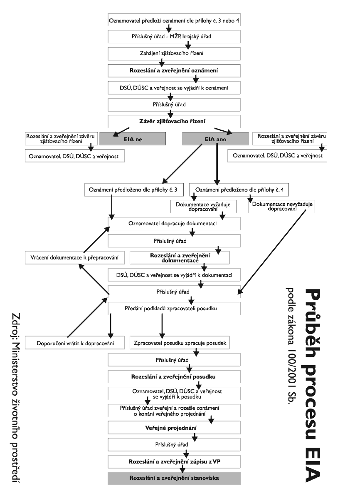
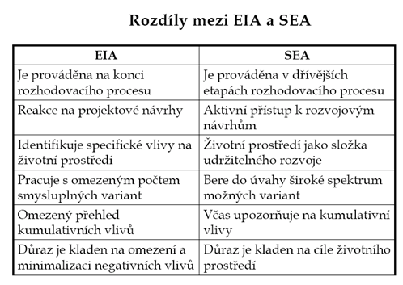
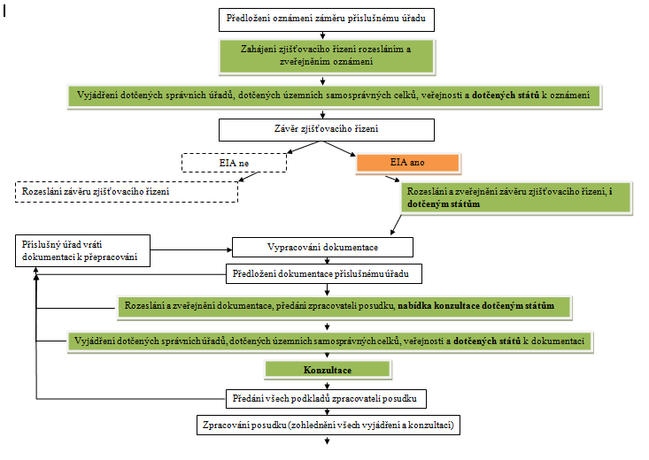

### 1.Historie posuzování vlivu na životní prostředí (z mezinárodního pohledu, v prostředí České republiky). 

*Z mezinárodního pohledu*

*Období roků 1970 -1975*

charakterizováno hledáním postupů a metod pro efektivní hodnocení. Bylo
zveřejněno množství případových studií a začali se vyvíjet analýzy pro hodnocení
impaktu.

klíčové přijetí zákona *NEPA (National Environmental Policy Act)* v USA v roce
1969

přínos spočíval ve způsobu zavedení mezioborové ochrany ŽP

dosud byla pro každou složku ŽP speciální právní norma (zákon o ochraně ovzduší,
půd, atd.)

v zákoně se prosadil interdisciplinární přístup a integroval poznatky ze
sociálních a přírodních věd k ovlivnění rozhodování a území

další přínos byla možnost vstupu veřejnosti do rozhodování

NEPA se rychle rozšířila do ostatních krajin

většina zemí řešila problémy znečistěného ovzduší nebo eroze půdy

rychlé zavedení environmentálního posuzování do legislativy měla konference OSN

první konference - *Konference o životním prostředí v Stockholmu* v roce 1972

výsledek - agenda zaměřená na management lidských sídel

identifikaci a kontrolu polutantů

výchovné aspekty ochrany životního prostředí

vznikl Program OSN pro životní prostředí *UNEP* - úkolem financování výzkumu
největších environmentálních problémů

některé státy začínají zakládat agentury pro životní prostředí

napodobování zákona NEPA (Kanada (1973), Austrálie (1974), Malajsie (1974) a
Francie (1976))

**Období roků 1975 – 1985**

rozvíjení procesu EIA na projektové úrovni

aplikace na větší rozvojové projekty (např. výstavba dálnic, letišť, vodních
elektráren, báňských objektů)

doporučuje vhodné varianty k návrhu vhodných zmírňujících opatření

doporučuje další monitoring

vznik první technické a metodické příručky za účelem formalizace celého procesu

vytvořen program na vypracování písemného dokumentu o posouzení vlivu na ŽP
(EIS)

analyzují se reakce ekosystémů na impakty

vymezují se hranice vlivu

experiment pro začlenění procesu EIA do územního plánování

rozrůstá se počet projektů i tematický záběr EIA a případových studií

začíná se objevovat hodnocení sociálního impaktu nebo riziková analýza

posouvá se z lokální úrovně na regionální úroveň

zdroj diskusí je *kumulativní impakt*, který se projevuje v urbanizovaných
oblastech s prudkým rozvojem obytných čtvrtí a satelitů

začíná se uvažovat o posuzování v strategické a koncepční rovině.

*Období roků 1986 – 1990*

dochází k přijetí EIA i nadnárodními organizacemi

Evropské společenství zavádí posuzování veřejných a soukromých projektů a jejich
vlivu na životní prostředí pro všechny členské země (*85/337/EEC – Směrnice o
hodnocení vlivu různých veřejných a soukromých projektů na životní prostředí*)

Světová banka zavádí směrnici, podmínka k poskytnutí úvěru - souhlasné
stanovisko z procesu EIA

v metodice procesu dochází k zdokonalování post-mechanismů (monitoring, auditing
a zmírňování vlivů)

uplatnění *kvalitativní metody* (metody, kde nelze exaktně vyjádřit dopad
činnosti, a rozhodující je kvalifikovaný odhad experta nebo skupiny expertů)

*Období roků 1990 - 2000*

přijetí legislativy EIA pro velký počet rozvojových zemí

prosazování *strategického posuzování vlivů na životní prostředí* (*SEA*)

*Konvence Espoo* r. 1991 první multilaterální dohoda o posuzování vlivu
přesahující hranice státu - dohoda iniciována Ekonomickou komisí pro Evropu OSN

následná *konference v Rio de Janeiro* r. 1992 - snaha o posuzování vlivu
ve státním měřítku a proces EIA je považován za jednu z cest k TUR (*Agenda 21*)

harmonizace posuzování vlivů v rámci Evropské unie prostřednictvím *směrnice
Rady 97/11/EC*.

Směrnice pojednává: o povinném posuzování činností, které zasahují do hnízdišť
volně,žijících ptáků a biotopů volně žijící flóry a fauny, o posouzení vlivů na
kulturní dědictví

*Aarhuská úmluva* r. 1998 - snaha o zapojení veřejnosti do rozhodovacích
procesů. Úmluva se promítla i ve vedení procesu a do dalších směrnic
upravujících EIA. Transpozice do české legislativy proběhla v roce 2004. 

Hlavní téma: - získávání srozumitelných informací, účasti veřejnosti na
rozhodování, zajištění právní ochrany veřejnosti.

po technologické stránce se rozvíjí použití GIS

principy krajinné ekologie

hodnocení pomocí multikriteriální analýzy

*Období po roce 2000*

schválena *směrnice 2001/42/EC o hodnocení účinků určitých plánů a programů na
životní prostředí* – v rámci EU

do posuzovaných koncepcí spadají plány a programy na národní, regionální nebo
místní úrovni, pro oblasti zemědělství, lesnictví, rybolovu, energetiky,
průmyslu, dopravy, hospodaření s odpady, vodního hospodářství, telekomunikací,
turistiky, územního plánování

r. 2003 35 vlád podepisuje v Kyjevě protokol OSN o schválení SEA jako nástroje
k posuzování rozvojových koncepcí a programů na životní prostředí, včetně vlivů
na zdraví a sociálního dopadu (*Protokol SEA*)

určeny kroky k přípravě koncepcí a zapojení veřejnosti prostřednictvím veřejného
projednávání. Ratifikováno všemi členskými státy EU v roce 2010.

objevují se kritické úvahy o smyslu posuzování vlivů na životní prostředí,
zejména v souvislosti s průběhem zjišťovacího řízení uplatňování variantního
přístupu

*V prostředí České republiky*

Původní myšlenka vzniku legislativní ochrany životního prostředí z hlediska
mezioborového posuzování vlivů činností člověka na ŽP vznikla dřív, než byla
zakotvena v legislativě České republiky.

klíčovým bylo přijetí zákonu *NEPA* (National Environmental Policy Act) v USA v
roce 1969

Československá republika - zákon o ochraně přírody (č. 40/1956 Sb.) se vztahoval
spíše jen na ochranu zvláště chráněných území

ČR v legislativě zakotvila proces posuzování vlivů záměrů na životní prostředí
v *90. letech*

roli v této sféře sehrál počínající mezinárodní vliv, který urychlil vývoj této
problematiky na našem území

proces posuzování vlivů na životní prostředí byl zakotven v roce 1992 *zákonem
č. 17/1992 Sb. o životním prostředí*

česká legislativa vydala *zákon č. 244/1992 Sb.*, o posuzování vlivů na životní
prostředí, který obsahoval tyto okruhy:

*projektové posuzování EIA -* popsán velmi konkrétně, s podrobnou specifikací
záměrů podléhajících posouzení,

*přeshraniční posuzování -* v podstatě měl být průběh shodný s postupem
uplatňovaným při projektové EIA s drobnými odchylkami týkajícími se obsahu a
rozsahu dokumentace, veřejného projednání a návrhu stanoviska,

*posuzování koncepcí -* týkalo se pouze koncepcí celostátních, schvalovaných na
úrovni ústředních orgánů, a územních plánů velkých územních celků,

*posuzování výrobků -* týkalo se stanoveného okruhu výrobků

neprobíhal *screening* (formalizovaný postup, ve kterém se zjišťuje, zda
proběhne podrobné posouzení procesu EIA, první fází celého procesu a účelem
tohoto šetření je zamezit nadměrnému počtu podrobných šetření)

*scoping* (posouzení záměru, kdy hlavním cílem je identifikovat už počátečním
stadiu (kdy je ještě možno projekt modifikovat)).

do zákona **č. 100/2001 Sb.** je zahrnuta *Úmluva o posuzování vlivů na životní
prostředí přesahujících hranice států*

v zákoně implementovaná fáze zjišťovacího řízení

screeningový postup - zjišťovací řízení je rozděleno na činnosti podléhající
posuzování na 2 kategorie, ty které jsou posuzovány povinně a na ty, o jejichž
posuzování se rozhoduje v zjišťovacím řízení

snížení počtů posuzovaných záměrů

zrychlený proces

Novely zákona č.100/2001 Sb.:

**zákon č. 93/2004 Sb. -** začleňuje směrnici 2001/42/ES *(směrnice SEA)* do
české legislativy

**zákon č. 163/2006 Sb. -** transponoval směrnici Evropského parlamentu a Rady
2003/35/ES o účasti veřejnosti na vypracovávání některých plánů a programů
týkajících se životního prostředí

**zákon č. 186/2006 Sb. -** mezi koncepce byla zařazena i územně plánovací
dokumentace

**zákon č. 216/2007 Sb. –** nařízení - zavedení oznamovací povinnost pro malé
záměry, které do této doby nevstupovali ani do zjišťovacího řízení. Investor
v tomto případě je povinen předložit oznámení o podlimitním záměru příslušný
úřad je poté povinen rozhodnout, zda záměr postoupí do zjišťovacího řízení.

**zákon č. 436/2009 Sb.** - umožňuje občanským sdružením, která se zabývají
životním prostředím nebo ochranou kulturních hodnot, podat žalobu proti
rozhodnutí příslušného orgánu v procesu EIA nebo SEA. Prodloužení platnost
stanoviska z původních 2 na 5 let.

V současné době má na tvorbu práva životního prostředí stěžejní vliv dynamika
normativního procesu Evropské unie.

### 2.Proces EIA: dílčí kroky procesu EIA dle zákona č. 100/2001 Sb., o posuzování vlivů na životní prostředí a veřejné zdraví v platném znění, vzájemná návaznost dílčích kroků procesu EIA. 

**EIA** *(Enviromental impact assessment)* - posuzování vlivů na ŽP

Účelem posuzování je:

získat objektivní a odborný podklad pro vydání rozhodnutí, popřípadě opatření

přispět k udržitelnému rozvoji společnosti

je podkladem pro řízení podle zvláštních právních předpisů

zmírnit nepříznivé vlivy realizace záměru na ŽP

**posuzují se vlivy na**:

veřejné zdraví

ŽP

živočichy a rostliny

ekosystémy

půdu

horninové prostředí

vodu, ovzduší, klima

krajinu a přírodní zdroje

hmotný majetek a kulturní památky

\- proces posuzování EIA trvá cca 4 - 5 měsíců, nezapočítává se čas pro
zpracování dokumentace, který je individuální dle náročnosti projektu

**Záměry podléhající režimu EIA:** příloha č. 1

**Kategorie I** – záměry u nichž se vždy posuzuje vliv na ŽP

**Kategorie II** – záměry, u kterých se o zahájení či nezahájení procesu EIA
rozhoduje tzv. zjišťovacím řízením

*Omezení a nevýhody procesu EIA:*

posouzení vlivů je časově i ekonomicky náročné – zdržuje a zdražuje realizaci
projektů,

každý posuzovaný záměr je specifický, požadavky na posouzení nejsou jednoznačně
dané,

jednotlivá hodnocení a výsledky nejsou vždy srovnatelné *(co je OK pro Zlínský
kraj, v Plze*ň*ském neprojde!),*

nástroj bývá často zneužíván environmentalisty k průtahům,

vzhledem k předchozímu – místo pro korupci.

*Proces EIA - v úředním postupu*

Není správním řízením

Samostatný proces - není součástí povolovacích řízení.

Výsledky - konečné stanovisko příslušného úřadu, nemá platnost správního
rozhodnutí → není závazné a není možno se proti němu odvolat!

Stanovisko jako objektivní a odborný podklad při vydávání rozhodnutí ve všech
návazných povolovacích řízeních nebo opatření.

*Požadavek minima dle EHK*

identifikace cílů a zdůvodnění variant,

identifikace podstatných impaktů na ŽP včetně referenční varianty,

hodnocení nebo popis identifikovaných ompaktů a posouzení jejich významu,

specifikace rozsahu, obsahu a typu dokumentace,

způsob komunikace investora,

popis konečného rozhodnutí.

*Významné části procesu EIA podle EHK*

*screening* – rozhodnutí, zda je EIA pro konkrétní případ nezbytná,

*scoping* – stanovení rozsahu posuzování, vymezení důležitých bodů,

vnější posouzení,

účast veřejnosti,

překonání (řešení) problému rizika a nejistoty,

monitoring a analýza po realizaci projektu.

*Významné části procesu v ČR:*

předběžné projednání

oznámení

zjišťovací řízení

dokumentace

posudek

veřejné projednání

stanovisko

*Účastnící procesu*

příslušný úřad (MŽP nebo KÚ)

oznamovatel (investor)

dotčený správní úřad (např. ČIŽP)

dotčený územní samosprávný celek (např. kraj, obec)

držitel autorizace-zpracovatel dokumentace (dle § 19 Zákona)

veřejnost (obyvatelé, sdružení, nevládní organizace)

povolující orgán (stavební úřad…)

*Průběh procesu EIA:*

**Předběžné projednání**

příslušný úřad a dotčené správní úřady jsou povinny, pokud oznamovatel požádá
ještě před oznámením, projednat uvažovaný záměr, včetně případných variant
řešení

doporučit mu předběžné projednání s dalšími dotčenými správními úřady a územními
samosprávnými celky, popřípadě s dalšími subjekty

povinny mu na žádost oznamovatele poskytnout informace o ŽP

**Oznámení**

**oznamovatel** (kdo hodlá provést záměr) - povinen předložit oznámení záměru
příslušnému úřadu (*Ministerstvo ŽP, krajský úřad*)

záměr navrhován na území více krajů - zasílá se oznámení MŽP- rozhodne, který
krajský úřad

předložit oznámení písemně na technickém nosiči dat, popř. zaslat elektronickou
poštou, a to v počtu vyhotovení stanovené dohodou s příslušným úřadem

MŽP oznámit záměry uvedené v příloze č. 1 k zákonu ve *sloupci A*

KÚ oznámit záměry uvedené ve *sloupci B*

pokud oznámení splňuje náležitosti - příslušný úřad do **7 pracovních dnů** ode
dne jeho obdržení zveřejnění informace na internetu (alespoň textovou část)

do 7 dnů příslušný úřad také zašle kopii oznámení s žádostí o vyjádření dotčeným
správním úřadům a dotčeným územním samosprávním celkům

KÚ zašle kopii oznámení *ministerstvu životního prostředí*

každý může zaslat své písemné vyjádření do **20 dnů ode dne zveřejnění** (pak se
nepřihlíží)

**PODLIMITNÍ ZÁMĚR:**

činnost, která nedosahuje limitních hodnot, uvedených v příloze 1., rozhoduje
se, zda vůbec budou podléhat zjišťovacímu řízení, vyžadovány jiné nároky na
dokument, kterým se oznamuje plánovaná činnost.

příslušný úřad má 15 dní na prozkoumání záměru a rozhodnutí zda se projekt
postoupí do zjišťovacího řízení

pokud ano, investor je povinen připravit plné oznámení o záměru.

**Zjišťovací řízení**

podléhají všechny záměry uvedené v zákoně č.100/2001 Sb.

*Cílem* - upřesnění informací, které je vhodné uvést do dokumentace a to se
zřetelem na:

povahu konkrétního záměru nebo druhu záměru,

faktory ŽP, které mohou být provedením záměru ovlivněny,

současný stav poznatků a metody posuzování.

**zahajuje se na podkladě oznámení** a provádí se podle zásad (příloha č. 2)
které charakterizují vlastní záměr a příslušné zájmové území, a z toho
vyplývající významné potenciální vlivy na obyvatelstvo a ŽP

pokud má záměr nebo změna záměru významný vlivy na ŽP, přihlíží vždy k:

povaze a rozsahu záměru a jeho umístění,

okolnosti, zda záměr nebo změna záměru svou kapacitou dosahuje limitních hodnot
uvedených u záměrů v příloze č. 1 kategorie II,

obdrženým vyjádřením veřejnosti, dotčených správních úřadů a dotčených územních
samosprávních celků.

**ukončí** se nejdéle do **30 dnů ode dne zveřejnění** informace o oznámení

příslušný úřad poté neprodleně zašle odůvodněný písemný závěr oznamovateli a
zveřejní jej. (*Na úřední desce dotčených územních samosprávních celků, na
internetu, nejméně ještě jedním v dotčeném území obvyklým způsobem - místní
tisk, rozhlas)*

pokud oznámení s náležitostmi dokumentace (příloha č. 4) a nejsou žádná
odůvodněná nesouhlasná vyjádření - oznámení se považuje za dokumentaci

v opačném případě úřad ve vyjádření napíše - oznámení dopracovat tak, aby mohlo
nahradit dokumentaci

záměry podle přílohy č. 1 kategorie I (záměry vždy podléhající posouzení) –
příslušný úřad pouze upřesní informace, které je vhodné uvést do dokumentace,
popř. navrhne zpracování variant (provede *scoping proces – stanovení rozsahu*)

záměry podle přílohy zákona č. 1 kategorie II (záměry vyžadující zjišťovací
řízení) - příslušný úřad ve zjišťovacím řízení stanoví, zda záměr nebo změna
bude standardně posuzována nebo zda již nebude dále postupováno podle tohoto
zákona (*provede se sreening proces – vytřídění záměrů*).

**Zpracování dokumentace**

• zveřejnění dokumentace a její zaslání k připomínkám do 10 pracovních dnů

• v téže lhůtě jí lze vrátit zpracovateli

• připomínkovat dokumentaci lze ve 30 denní lhůtě

• na základě obdržených vyjádření nebo na základě doporučení zpracovatele
posudku lze

…dokumentaci vrátit nejdéle do 40 dnů

**Zpracování posudku**

příslušný úřad smluvně zajistí zpracování posudku osobou k tomu oprávněnou

ten zpracuje posudek na základě dokumentace, popř. oznámení a podaných vyjádření

zpracovatel nesmí dokumentaci přepracovávat ani doplňovat

náležitosti posudku - příloha č. 5

doba pro zpracování posudku nesmí být delší než 60 dní, lze ji o 30 dní
prodloužit

zpracovatel zašle posudek příslušnému úřadu v dohodnutém počtu, termínu a formě

příslušný úřad do 10 pracovních dnů zašle oznamovateli, dotčeným správním úřadům
a územním samosprávným celkům

do 10 pracovních dnů zveřejní posudek *(na internetu a na úřední desce dotčených
územních samosprávních celků, na internetu, nejméně ještě jedním v dotčeném
území obvyklým způsobem - místní tisk, rozhlas)*

v téže lhůtě jej lze vrátit zpracovateli

lhůta pro vyjádření k posudku 30 dní ode dne zveřejnění informace o posudku

zpracovatel posudku vypořádá obdržená písemná vyjádření k posudku a vyjádření z
veřejného projednání a na jejich základě popřípadě upraví návrh stanoviska

předá příslušnému úřadu do 10 dnů po uplynutí lhůty

**Veřejné projednání**

příslušný úřad povinen zveřejnit informaci o veřejném projednání nejméně **5
dnů** před jeho konáním

příslušný úřad povinen zajistit, konání nejpozději **5 dnů** po uplynutí lhůty
pro vyjádření k posudku

příslušný úřad může ukončit veřejné projednání v případě neúčasti oznamovatele
nebo zpracovatele dokumentace nebo posudku

příslušný úřad pořizuje zápis (účast a závěry) + těsnopisný nebo zvukový záznam
- povinen zaslat oznamovateli, dotčeným správním úřadům a dotčeným územním
samosprávním celkům a zveřejnit jej na internetu.

**Vydání stanoviska**

příslušný úřad vydá stanovisko do **30 dnů** od vyjádření k posudku *(na základě
dokumentace, popř. oznámení, posudku a veřejného projednání)*

náležitosti stanoviska příloha č. 6

úřad zašle stanovisko do **7 pracovních dnů** od jeho vydání oznamovateli,
dotčeným správním úřadům a dotčeným územním samosprávným celkům

v téže lhůtě zveřejní stanovisko na internetu, na vývěskách, v tisku, v rozhlase

odborným podkladem pro vydání rozhodnutí, popř. opatření

stanovisko předkládá oznamovatel jako jeden z podkladů pro navazující řízení
nebo postup

p**latnost stanoviska je 5 let ode dne jeho vydání** – na žádost oznamovatele
prodloužena o 5 let, a to i opakovaně

bez stanoviska nelze vydat rozhodnutí nebo opatření nutná k provedení záměru
v žádném správním ani jiném řízení nebo v jiném postupu podle zvláštních
právních předpisů

Posuzování vlivů na lokality soustavy Natura 2000

Od roku 2004 je zákonem č. 144/1992 Sb., o ochraně přírody a krajiny, ve znění
zákona 2018/2004 Sb. (§ 45i) stanovena povinnost posuzovat záměry také
z hlediska hodnocení dopadů na lokality soustavy Natura 2000 (tj. na evropsky
významné lokality a ptačí oblasti). Na rozdíl od stanoviska z procesu EIA je
závěrečné stanovisko z tohoto procesu závazné.

Při hodnocení vlivů záměru na lokality Natura 2000 se postupuje dle zákona o
EIA, pokud § 45i zákona č. 114/1992 o ochraně přírody a krajiny nestanoví jinak.

**Příloha 1**:

**KATEGORIE I (záměry vždy podléhající posouzení)**

*Sloupec A - MŽP*

Přehrady, nádrže a jiná zařízení určená k zadržování nebo k akumulaci vody a v
ní rozptýlených látek, jestliže objem zadržované nebo akumulované vody přesahuje
10 mil. m3

Těžba černého uhlí - nový dobývací prostor.

Nadzemní vedení elektrické energie o napětí od 110 kV a délce nad 15 km.

*Sloupec B - Kraj*

Trvalé odlesnění nebo zalesnění nelesního pozemku o ploše od 25 ha

Čistírny odpadních vod s kapacitou nad 100 tis. ekvivalentních obyvatel a
kanalizace pro více než 50 000 napojených obyvatel.

Průmyslová výroba farmaceutických produktů chemickou nebo biochemickou cestou.

**KATEGORIE II (záměry vyžadující zjišťovací řízení)**

*Sloupec A - MŽP*

Hloubkové vrty pro ukládání radioaktivního nebo nebezpečného odpadu, hloubkové
vrty geotermální, hloubkové vrty pro zásobování vodou u vodovodů, s výjimkou
vrtů pro výzkum stability půdy.

Vodní cesty včetně jezů a ostatních vzdouvacích zařízení a mol pro nakládání a
vykládání na břeh nebo přístavy pro vnitrozemskou vodní dopravu.

Rekreační a sportovní areály, hotelové komplexy a související zařízení v územích
chráněných podle zvláštních právních předpisů

*Sloupec B – Kraj*

restrukturalizace pozemků v krajině, využívání neobdělávaných pozemků nebo
polopřirozených oblastí k intenzivnímu zemědělskému využívání, uvedení
zemědělské půdy do klidu na ploše od 10 ha.

Úpravy toků a opatření proti povodním významně měnící charakter toku a ráz
krajiny.

Čistírny odpadních vod s kapacitou od 10 000 do 100 000 ekvivalentních obyvatel,
kanalizace od 5 000 do 50 000 napojených obyvatel nebo průmyslové kanalizace o
průměru větším než 500 mm.

Výkon státní správy v oblasti posuzování vlivů na životní prostředí

**Ministerstvo:**

ústřední správní úřad,

vykonává vrchní státní dozor,

zajišťuje posuzování záměrů uvedených v příloze č. 1 ve sloupcích A, jejichž
oznamovatelem je Ministerstvo obrany, i ve sloupcích B a jejich změn,

zajišťuje posuzování koncepcí v případech, kdy dotčené území tvoří celé území
kraje nebo zasahuje na území více krajů, na území národního parku, chráněné
krajinné oblasti nebo pokud dotčené území tvoří území celého státu,

poskytuje informace Evropské komisi v oblasti posuzování vlivů na životní
prostředí,

zajišťuje mezistátní posuzování záměrů i koncepcí,

zajišťuje posuzování dalších záměrů, kde je příslušný orgán kraj, pokud si tuto
působnost v jednotlivém případě vyhradilo,

vede souhrnnou evidenci,

uděluje a odjímá autorizaci,

vede a jedenkrát ročně zveřejňuje ve svém věstníku seznam držitelů autorizace,

do konce února každého roku zveřejňuje seznam posudků a jejich zpracovatelů a
dále seznam koncepcí a jejich posuzovatelů za předchozí kalendářní rok,

vydává stanovisko k posouzení vlivů provádění *politiky územního rozvoje* na
životní prostředí, stanovisko k posouzení vlivů provádění *zásad územního
rozvoje* na životní prostředí a je dotčeným orgánem při jejich pořizování.

**Orgány kraje:**

zajišťují posuzování záměrů uvedených v příloze č. 1 ve sloupcích B a jejich
změn,

zajišťují posuzování koncepcí v případech, kdy dotčené území zasahuje výlučně do
územního obvodu kraje, není-li příslušné ministerstvo,

vedou evidenci jimi vydaných stanovisek a zasílají jedno vyhotovení každého jimi
vydaného závěru zjišťovacího řízení ministerstvu k souhrnné evidenci,

do konce února každého roku zveřejňují seznam posudků a jejich zpracovatelů a
dále seznam koncepcí a jejich posuzovatelů za předchozí kalendářní rok,

vydávají stanovisko k posouzení vlivů provádění *územního plánu* na životní
prostředí a jsou dotčenými orgány při jeho pořizování.

### 3.Proces SEA: dílčí kroky procesu SEA, dle zákona č. 100/2001 Sb., o posuzování vlivů na životní prostředí a veřejné zdraví v platném znění, vzájemná návaznost dílčích kroků procesu SEA. 

cílem SEA je zajištění environmentální integrity koncepce

proces posuzování u SEA trvá cca 3-4 měsíce (do tohoto času se nezapočítává čas
potřebný pro zpracování dokumentace).

**Předmětem SEA je posuzování vlivů koncepce na životní prostředí JSOU:**

koncepce, které stanoví rámec pro budoucí povolení záměrů uvedených v příloze č.
1 zpracovávané v oblasti zemědělství, lesního hospodářství, myslivosti,
rybářství, nakládání s povrchovými nebo podzemními vodami, energetiky, průmyslu,
dopravy, odpadového hospodářství, telekomunikací, cestovního ruchu, územního
plánování, regionálního rozvoje, životního prostředí včetně ochrany přírody

koncepce, u nichž nutnost jejich posouzení, s ohledem na možný vliv na životní
prostředí, vyplývá ze zvláštního právního předpisu,

koncepce spolufinancované z prostředků fondů Evropských společenství

*- tyto 3 koncepce se posuzují vždy, pokud je dotčené území tvořeno územním
obvodem více než jedné obce*

koncepce viz výše, u nichž je dotčené území tvořeno územním obvodem pouze jedné
obce, pokud se tak stanoví ve zjišťovacím řízení

změny koncepcí, pokud se tak stanoví ve zjišťovacím řízení

**Předmětem posuzování podle zákona č. 100/2001 Sb. NEJSOU:**

koncepce zpracovávané pouze pro účely obrany státu,

koncepce zpracovávané pro případ mimořádných událostí, při kterých dochází
k závažnému a bezprostřednímu ohrožení životního prostředí, zdraví, bezpečnosti
nebo majetku osob,

finanční a rozpočtové koncepce.

**Proces SEA provádí posuzování koncepcí na úrovni:**

celostátní (rozvojové koncepce a programy)

regionální (územní plány velkých územních celků)

místní (územní plány obcí)

**Hlavním rysem dobré SEA praxe:**

včasnost (preventivní přístup),

integrace výsledků hodnocení do návrhu koncepce,

zapojení veřejnosti,

zapojení dotčených správních úřadů a dotčených územních samosprávních celků.

**Předpoklady provedení kvalitního SEA posouzení:**

výběr vhodného zpracovatele SEA hodnocení,

účast zpracovatele SEA hodnocení při přípravě koncepce,

zajištění výměny informací mezi zpracovatelem koncepce a zpracovatelem
vyhodnocení.

*Základní souběžné postupy*

**Příprava koncepce**

Popis současného stavu, identifikace klíčových problémů.

Analytická část (analýza stavu a vývoje v řešeném území, příčin, vývojových
trendů, SWOT analýza apod.).

Stanoveni vize, priorit, cilů, opatřeni.

Implementace.

Monitoring.

Finanční plán.

**Posuzování vlivů koncepce na životní prostředí.**

**Zapojení veřejnosti**

*Očekávané výstupy SEA*

Posouzení kvality popisu a hodnocení trendů ve vývoji ŽP.

Posouzení, zda byly zpracovány cíle ochrany ŽP do cílů koncepce.

Posouzení souladu navrhovaných řešení problémů dané koncepce s cíli ochrany ŽP.

Posouzení souladu s limity využití území definovanými v platné ÚPD.

Posouzení vlivu specifických aktivit a projektů na ŽP.

Posouzení systémů sledování reálných vlivů dokumentu a návrh zajištění jeho
environmentálně šetrné realizace.

REFERENČNÍ CÍLE OCHRANY ŽP

**- navržené pro SEA Národního rozvojového plánu ČR 2000-2006**

Snížit emise způsobující změnu klimatu.

Snížit emise způsobující znečistění ovzduší.

Omezit bodové znečistění vod a půdy.

Omezit plošné znečistění vod a půdy.

Snížit čerpání neobnovitelných zdrojů energií a energetických surovin.

Snížit čerpání neobnovitelných zdrojů surovin a minimalizovat produkci
a nebezpečnost odpadů.

Zachovat přirozenou rozmanitost fauny, flóry a stanovišť.

Chránit a zlepšit stav a funkce ekosystémů.

Chránit a zlepšit stav a funkce kulturní krajiny.

Chránit a zlepšit stav sídel.

Zlepšit environmentálně odpovědné jednání obyvatele.

**Způsob posuzování vlivů koncepce na životní prostředí**

posuzování koncepce:

zahrnuje zjištění, popis a zhodnocení předpokládaných přímých a nepřímých vlivů
provedení i neprovedení koncepce a jejich cílů, a to pro celé období jejího
předpokládaného provádění

vychází ze stavu ŽP v dotčeném území v době podání oznámení o zpracování
koncepce

navrhují se a posuzují opatření k předcházení nepříznivých vlivů na životní
prostředí a veřejné zdraví, k vyloučení, snížení, zmírnění nebo kompenzaci
těchto vlivů, popřípadě ke zvýšení příznivých vlivů na životní prostředí a
veřejné zdraví provedením koncepce, včetně vyhodnocení předpokládané účinnosti
navrhovaných opatření

**PROCES SEA**

**Předběžné projednání**

příslušný úřad a dotčené správní úřady jsou povinny, pokud předkladatel požádá
ještě před oznámením, projednat koncepci

doporučit mu předběžné projednání s dalšími dotčenými správními úřady a územními
samosprávnými celky, popřípadě s dalšími subjekty

povinny mu na žádost předkladatele poskytnout informace o ŽP

**Oznámení koncepce**

*předkladatel* (ten kdo předkládá podnět ke zpracování koncepce) je povinen
předložit oznámení koncepce příslušnému úřadu v listinné a elektronické podobě

náležitosti oznámení koncepce (příloha č. 7)

pokud splňuje potřebné náležitosti, zašle příslušný úřad do **10 dnů** ode dne
jeho obdržení kopii k vyjádření dotčeným správním úřadům a dotčeným územním
samosprávním celkům

v téže lhůtě zveřejní

orgán kraje v téže lhůtě zašle kopii oznámení *ministerstvu*

písemné vyjádření k oznámení do **20 dnů** příslušnému úřadu ode dne jeho
zveřejnění

**Zjišťovací řízení**

cílem je upřesnění obsahu a rozsahu vyhodnocení vlivů koncepce na ŽP a veřejné
zdraví

u koncepcí *(územní obvod 1 obce)* nebo změn koncepcí také zjištění, zda
koncepce bude posuzována

úřad provede ZŘ podle kritérií (příloha č. 8) na podkladě oznámení, obdržených
vyjádření

ukončí nejpozději do **35 dnů** ode dne zveřejnění oznámení koncepce písemným
závěrem

Pokud koncepce podléhá posuzování, úřad v závěru stanoví:

dosah a rozsah vyhodnocení, vč. požadavku na zpracování v úvahu přicházejících
variant

v jakém počtu vyhotovení má být příslušnému úřadu předán návrh koncepce

úřad zašle závěr neprodleně předkladateli, dotčeným správním úřadům a dotčeným
územním samosprávním celkům

závěr zveřejní

**Průběh posuzování vlivů koncepce na žp**

předkladatel povinen do **30 dnů** ode dne obdržení závěru zjišťovacího řízení
**zajistit osobu** oprávněnou **ke zpracování vyhodnocení (posuzovatel)**, který
je odpovědný za objektivní zpracování a vyhodnocení

předkladatel povinen informovat o tom příslušný úřad - informaci zveřejní na
internetu

předkladatel povinen spolupracovat s posuzovatelem při zpracování (předávat
vyjádření došlá v průběhu zpracování návrhu koncepce)

posuzovatel oprávněn požadovat informace pro zpracování vyhodnocení
u předkladatele, příslušného úřadu, dotčených správních úřadů a dotčených
územních samosprávních celků

ty jsou povinny mu informace poskytnout.

**Návrh koncepce**

předkladatel povinen předat úřadu návrh koncepce v listinné a elektronické
podobě - součástí návrhu koncepce je *vyhodnocení zpracované posuzovatelem*

pokud vyhodnocení má dané náležitosti zašle příslušný úřad návrh koncepce do
**10 dnů** ode dne, doručení, k vyjádření dotčeným správním úřadům a dotčeným
územním samosprávním celkům

v téže lhůtě zveřejní na internetu a zajistí zveřejnění informace o návrhu
koncepce dle § 16

pokud vyhodnocení nemá náležitosti, *vrátí* jej příslušný úřad k doplnění

předkladatel je povinen zveřejnit informaci o místě a času **konání veřejného
projednání** návrhu koncepce na své úřední desce, na internetu a nejméně ještě
jedním v dotčeném území obvyklým způsobem, a to nejméně **10 dnů** před jeho
konáním

povinen informovat o místě a času konání tohoto jednání příslušný úřad

veřejné projednání nemůže být dříve než po uplynutí **30 dnů** ode dne
předložení návrhu koncepce úřadu

předkladatel povinen nejpozději do **5 dnů** ode dne konání veřejného projednání
zaslat zápis příslušnému úřadu a současně jej zveřejnit na internetu

každý může zaslat písemné vyjádření k návrhu koncepce příslušnému úřadu
nejpozději do **5 dnů** ode dne konání veřejného projednání

**Stanovisko k návrhu koncepce**

příslušný úřad vydá na základě návrhu koncepce, vyjádření a veřejného projednání
stanovisko k posouzení vlivu provádění koncepce na ŽP a veřejné zdraví ve lhůtě
**do 30 dnů** ode dne obdržení zápisu z veřejného projednání návrhu koncepce

příslušný úřad může vyjádřit nesouhlas s návrhem koncepce z hlediska možných
negativních vlivů na ŽP a veřejné zdraví

navrhnout jeho doplnění nebo kompenzační opatření a opatření ke sledování vlivů
provádění koncepce na ŽP a veřejné zdraví

příslušný úřad stanovisko po jeho vydání zašle předkladateli, dotčeným správním
úřadům a dotřeným územním samosprávním celkům a zároveň jej zveřejní

bez stanoviska ke koncepci nemůže být koncepce schválena

schvalující orgán povinen zohlednit požadavky a podmínky ze stanoviska ke
koncepci, odůvodnění a opatření pro zajištění sledování a rozboru vlivů koncepce
na ŽP a veřejné zdraví

schvalující orgán povinen zveřejnit schválenou koncepci

o zveřejnění povinen do 7 pracovních dnů informovat příslušný úřad, dotčené
správní úřady a dotčení územní samosprávní celky

**Sledování a rozbor vlivů koncepce na žp a veřejné zdraví**

předkladatel povinen zajistit sledování a rozbor vlivů koncepce na ŽP a veřejné
zdraví

nepředvídané závažné negativní vlivy - povinen zajistit přijetí opatření
k odvrácení nebo zmírnění vlivů

informovat o tom příslušný úřad a dotčené správní úřady a rozhodnout o změně
koncepce

dotčené správní úřady sledují vlivy schválené koncepce na ŽP a veřejné zdraví

oprávněny podat podnět ke změně koncepce, nelze-li závažné negativní vlivy
odvrátit nebo zmírnit jinak.

### 4.Vztah procesů EIA a SEA - spoluaplikovatelnost s příbuznými nástroji krajinného managementu, vzájemné propojení EIA a SEA. 

Posuzování vlivů na životní prostředí – EIA, SEA

Posuzování vlivů na životní prostředí se v současné době provádí *procesem EIA*
(posuzování záměrů) a *procesem SEA* (posuzování koncepcí). Tyto procesy jsou
upraveny [zákonem č. 100/2001
Sb.](http://www.kr-stredocesky.cz/NR/rdonlyres/1AC779E8-6133-4079-A26A-AD22CC70C546/111810/ZC3A1konC48D1002001Sb2.rtf)
, o posuzování vlivů na životní prostředí a o změně některých souvisejících
zákonů (zákon o posuzování vlivů na životní prostředí).

Podle zákona se posuzují vlivy na veřejné zdraví a vlivy na životní prostředí,
zahrnující vlivy na živočichy, rostliny, ekosystémy, půdu, horninové prostředí,
vodu, ovzduší, klima, krajinu, přírodní zdroje, hmotný majetek a kulturní
památky, vymezené zvláštními právními předpisy, a jejich vzájemné působení.

Proces posuzování vlivů záměrů a koncepcí na životní prostředí je založen
na systematickém zkoumání a posuzování jejich možného působení na životní
prostředí. Smyslem je zjistit, popsat a komplexně vyhodnotit předpokládané vlivy
připravovaných záměrů a koncepcí na životní prostředí a veřejné zdraví ve všech
rozhodujících souvislostech. Cílem procesu je zmírnění nepříznivých vlivů
realizace na životní prostředí.

Proces EIA probíhá vždy dříve, než jsou záměry povoleny a než se započne
s jejich vlastní realizací. Bez závěru procesu **EIA** nesmí povolující úřad
(např. stavební úřad) rozhodnout o povolení záměru. V rámci procesu **SEA** jsou
posuzovány koncepce uvedené v § 3 písm. b) a § 10 odst. 1) zákona.

Čeho chceme procesem EIA a SEA dosáhnout?

Zjistit, popsat a vyhodnotit předpokládané vlivy připravovaných záměrů a
koncepcí na životní prostředí ve všech rozhodujících souvislostech,

zmírnit nepříznivé vlivy realizace hodnoceného záměru na životní prostředí,

pro dobře provedenou EIA a SEA je nezbytné zohlednit stanoviska a připomínky
od dalších účastníků (příslušných orgánů státní správy a samosprávy, odborných
institucí, expertů, nevládních organizací, veřejnosti) procesu posuzování vlivů
na životní prostředí,

na základě expertního přístupu vyjasnit otázky „slučitelnosti“ záměrů
s požadavky ochrany životního prostředí a jeho složek, požadavky ochrany
veřejného zdraví a konečně i s požadavky na racionální využití území.

**Mezinárodní smlouvy v oblasti EIA/SEA**

Aarhuská úmluva 1998 - pro ČR platná od 4. 10. 2004, dodatek (Almaty, 2005)

**3 pilíře**: Přístup k informacím o ŽP, Účast veřejnosti na rozhodování,
Přístup k právní (soudní) ochraně

**EIA (Environmental Impact Assessment)**

Jedná se o proces posuzování vlivů záměrů na životní prostředí.

Záměrem se podle § 3 písm. a) zákona č. 100/2001 Sb. rozumí stavby, činnosti
a technologie uvedené v příloze č. 1 cit. zákona. Ustanovení § 4 odst. 1, resp.
odst. 2 specifikují záměry podléhající, resp. nepodléhající posouzení také s
odkazem na přílohu č. 1 cit. zákona. V této příloze jsou uvedeny záměry
posuzované vždy (kategorie I) a záměry (včetně v zákoně definovaných změn těchto
záměrů) posuzované v případě, že se tak stanoví ve zjišťovacím řízení (kategorie
II).

Principem posuzovacího procesu je zhodnocení všech předpokládaných přímých
a nepřímých důsledků určitého záměru na všechny složky životního prostředí a
veřejné zdraví.

**SEA (Strategic Environmental Assessment)**

Je proces posuzování vlivů koncepcí a územně plánovacích dokumentací za životní
prostředí.

Koncepcí se podle § 3 písm. b) zákona č. 100/2001 Sb. rozumí strategie,
politiky, plány nebo programy zpracované nebo zadané orgánem veřejné správy a
následně orgánem veřejné správy schvalované nebo ke schválení předkládané. Ve
vztahu k posuzování vlivů se dále podle § 10a cit. zákona rozlišují koncepce
posuzované vždy a koncepce, o jejichž posouzení se rozhoduje ve zjišťovacím
řízení.

Pro posuzování územně plánovací dokumentace (ÚPD) platí dle § 10i cit. zákona
zvláštní ustanovení. Vzhledem k tomu, že na rozdíl od ostatních typů koncepcí je
zpracování a projednání ÚPD jasně stanoveno příslušnou legislativou, tj. zákonem
č. 183/2006 Sb., o územním plánování a stavebním řádu (stavební zákon), je i
proces posuzování vlivů ÚPD navržen tak, aby respektoval jednotlivé kroky a fáze
přípravy ÚPD.

**NATURA 2000 – ve vztahu k zákonu č. 100/2001 Sb.**

Natura 2000 je celistvá evropská soustava území se stanoveným stupněm ochrany,
která umožňuje zachovat přírodní stanoviště a stanoviště druhů v jejich
přirozeném areálu rozšíření ve stavu příznivém z hlediska ochrany nebo popřípadě
umožní tento stav obnovit. Na území České republiky je Natura 2000 tvořena
ptačími oblastmi (PO) a evropsky významnými lokalitami (EVL), které požívají
smluvní ochrany (§ 39 zákona č. 114/1992 Sb., o ochraně přírody a krajiny) nebo
jsou chráněny jako zvláště chráněná území (§ 14 zák. č. 114/1992 Sb.). Povinnost
posouzení podle § 45i zákona č. 114/1992 Sb. se však vztahuje na PO i EVL bez
ohledu na to, zda již jsou, nebo teprve budou vyhlášeny nařízením vlády.

Protože ustanoveními § 45h a § 45i zákona č. 114/1992 Sb. byl nepřímo
novelizován zákon č. 100/2001 Sb., stalo se posouzení vlivů na EVL a PO nedílnou
součástí postupu podle zákona č. 100/2001 Sb. a již na počátku procesu posouzení
musí být zřejmé, zda jsou předmětem posouzení také vlivy na tyto oblasti. Pokud
tedy příslušný úřad podle zákona č. 100/2001 Sb. obdrží oznámení záměru nebo
koncepce, jehož součástí nebude stanovisko orgánu ochrany přírody podle § 45i
zákona č. 114/1992 Sb., vyzve předkladatele podle tohoto zákona k jeho doplnění.

V případě, že orgán ochrany přírody svým stanoviskem nevyloučí významný vliv
koncepce či záměru na EVL nebo PO, musí být daná koncepce nebo záměr předmětem
posouzení podle § 45i zákona č. 114/1992 Sb. a zákona č. 100/2001 Sb.

Základní souběžné postupy

**Příprava koncepce**

Popis současného stavu, identifikace klíčových problémů.

Analytická část (analýza stavu a vývoje v řešeném území, příčin, vývojových
trendů, SWOT analýza apod.).

Stanoveni vize, priorit, cilů, opatřeni.

Implementace.

Monitoring.

Finanční plán.

**Posuzování vlivů koncepce na životní prostředí.**

**Zapojení veřejnosti**

EIA, SEA a nástroje krajinného plánování jako Územní plánování a pozemkové
úpravy, při kterých dochází k fragmentaci nebo změně fragmentace krajiny

Proces EIA ať už na úrovni posuzování koncepci nebo posuzování záměrů, má
klíčové postavení v ochraně krajiny a biotopů před fragmentací. Pokud nebude
toto hledisko zahrnuto jako automatická součást do všech rozhodovacích
materiálů, nebude možné dostatečnou ochranu krajiny zajistit.

V procesu posuzování vlivů na životní prostředí se problematika fragmentace
promítá především do těchto dvou následujících okruhů:

hodnocení územních plánů a koncepcí – SEA

hodnoceni záměrů dopravních staveb – projektová EIA

**Fragmentace krajiny v procesu SEA**

Fragmentaci krajiny a populaci způsobuji především dva typy barier:

zástavba sídly a průmyslovými areály, kde v současné době je hlavním rizikovým
trendem rozšiřování zástavby do volné krajiny mimo intravilány obci (tzv. urban
sprawl)

dopravní stavby, především dálnice, rychlostní silnice a vysokorychlostní
železnice. V současné době je tento faktor vysoce významný proto, že dálniční
síť České republiky se teprve dostavuje a nyní přijata řešeni budou ovlivňovat
situaci na další desítky let.

Na úrovni územních plánů je klíčovou otázkou:

zajištění průchodnosti území pro velké savce ochranou migračních koridorů

ochrana krajiny, která dosud není fragmentována.

**Fragmentace krajiny v procesu projektové EIA**

Problematika fragmentace krajiny se zde týká především nových dopravních staveb.

Další nástroje environmentálního managementu

Za nástroje označujeme takové aktivity podnikatelských a jiných subjektů, které
směřují ke snižování negativních dopadů jejich činnosti na životní prostředí.

Základní principy dobrovolných nástrojů jsou:

*dobrovolnost*

\- v legislativě není nikde stanovena povinnost jejich uplatňování,

*prevence*

\- soustředí se na odstraňování příčin environmentálních problémů, nikoliv
jejich důsledků (odstraňování škod),

*dohody*

*systematický přístup*

\- záměrné působení na ty oblasti a činnosti organizace, které mají negativní
vliv na životní prostředí.

Hlavní principy integrované prevence

**Posuzování průmyslových a zemědělských činností z hlediska ochrany ŽP jako
celku.** Provozní podmínky zřízení musí být takové, aby nedocházelo k přenosu
znečištění mezi jednotlivými složkami ŽP. Cílem je snížení celkového negativního
vlivu na ŽP.

**Podpora preventivního přístupu při snižování znečištění**. Vznik odpadu je
omezen přímo vhodnou volbou technologie. Vzniklé odpady jsou v maximální možné
míře zhodnocovány a recyklovány.

**Stanovování podmínek provozu zařízení na základě tzv. nejlepších dostupných
technik** tak, jak jsou specifikovány ve směrnici a v zákoně o integrované
prevenci.

**Pravidelné přezkoumávání vydaných integrovaných povolení** a jejich úprava
podle vývoje techniky a legislativy, což představuje trvalý tlak na technickou
inovaci zařízení.

**Informování veřejnosti** a její účast na povolovacím procesu.

**Integrace dílčích povolení do jednoho** a vydání tohoto povolení jedním
úřadem.

### 5.Posuzování vlivu na životní prostřední přesahující hranice státu - jeho ukotvení v českém a evropském právu, role MŽP při mezistátním posuzování. 

**ESPOO ÚMLUVA** - Úmluva o posuzování vlivů na ŽP přesahujících hranice států

Sjednána 25. 2. 1991 ve městě Espoo ve Finsku, v platnost vstoupila až v roce
1997.

Podepsána byla všemi členskými zeměmi EU, ne všechny jí však ratifikovaly.
Konkrétně to byly Německo, Francie, Portugalsko a Irsko.

Cílem - přijetí všech vhodných a účinných opatření k prevenci, snížení a omezení
vážných negativních vlivů činností přesahujících hranice států (především v
sektoru průmyslu, energetiky, dopravy) na stav životního prostředí a v konečném
důsledku tak i na zdraví obyvatelstva.

zakládá povinnost smluvních stran vyhodnotit dopad těchto činností v co
nejranějším stádiu jejich přípravy, a to především formou vzájemných oznámení a
konzultací navrhovaných činností.

byla doplněna o Kyjevský protokol - Protokol o strategickém posuzování životního
prostředí (SEA)

přijat a otevřen k podpisu na ministerské konferenci "Životní prostředí pro
Evropu" v Kyjevě na Ukrajině dne 21. května 2003 (Kyjevský protokol)

**Kyjevský protokol**

vyžaduje, aby jeho strany hodnotily environmentální dopady svých oficiálních
návrhů plánů a programů

ohled na typické vlivy plánů a programů na ŽP

klade zvláštní důraz na zohlednění lidského zdraví

**Právní zásady pro mezistátní EIA**

mezistátní EIA pro ČR se řídí stejnými pravidly jako jiná EIA v ČR

v zákoně 100/2001 je možno najít některá speciální pravidla

speciální pravidla založena v článku 7 *Směrnice EIA* a na nařízeních *Espoo
úmluvy*

na základě Espoo úmluvy a Směrnice EIA ČR sjednala dvoustranné smlouvy s
Německem, Polskem, Rakouskem a Slovenskem

V ČR - příslušným úřadem pro mezistátní EIA výhradně MŽP

ČR - státem původu i jako dotčený stát

MŽP musí postupovat ve spolupráci s Ministerstvem zahraničních věcí

Proces posuzování je modifikován v případě posuzování záměrů s vlivy přesahující
hranice.

vlivy záměru - uskutečněn na území jednoho státu *(stát původu)*

mohou projevit na území jiného státu *(dotčený stát).*

Právní úprava řeší problematiku v návaznosti na základní úmluvu z Espoo.
V případě, že je ČR státem původu, je upraven postup pro účast dotčeného státu.
Dotčenému státu musí být předem notifikováno oznámeno zahájení procesu
posuzování a na základě jeho vyjádření k účasti na procesu posuzování pak
poskytnuty všechny relevantní informace o povaze záměru a jeho vlivech.

**Zjišťovací řízení**

každý záměr, pro který je vypracováno EIA a může mít významný nepříznivý vliv na
ŽP jiného státu, musí být oznámen tomuto státu

Toto pravidlo (§ 12 odst. 1 zákona 100/2001) - v obecné formě

použitelné pro každý stát, nejenom pro členské státy EU

opatření mezistátního EIA nejsou omezena jen na posuzování vlivu na ŽP
přesahujícího hranice mezi sousedními státy, ale týkají se také dálkových
mezistátních vlivů

pochybnosti - záměr mohl nebo nemohl mít významný vliv na území možného
dotčeného státu 2 možnosti:

nejdříve konzultovat kontaktní místo možného dotčeného státu a projednat s nimi
případ neformálním způsobem

oznámit záměr okamžitě bez ohledu na to, že otázka možného nepříznivého vlivu
nebyla ještě rozhodnuta

**Oznámení a předání dokumentace**

Oznamovací dopis musí obsahovat:

základní informace o navrhovaném záměru, kdo je oznamovatelem, kde je záměr
umístěn, co je účelem záměru a jaké jsou možné mezistátní vlivy

informace o postupu EIA

informace o možných dalších postupech povolení k realizaci záměru a možných
rozhodnutích

stanovení rozumné doby pro odpověď dotčeného státu zda si přeje nebo nepřeje
zúčastnit se v procesu EIA (čtyři týdny jsou považovány za vyhovující)

napsán v jazyce dotčené strany nebo alespoň v angličtině

musí být přiloženo oznámení podle § 6 zákona 100/2001

V pozdějším stadiu procesu musí být zaslány dotčenému státu některé další
dokumenty, zvláště:

závěr zjišťovacího řízení

dokumentace

posudek

zápisy z veřejného projednávání

stanovisko k EIA

žádosti o povolení k realizaci záměru v dalších povolovacích řízeních

rozhodnutí o záměru v dalších povolovacích řízeních

doručeny v elektronické podobě nebo zapojením do EIA informačního systému

umožňuje to příslušnému správnímu úřadu dotčeného státu zpřístupnit dokumentaci
veřejnosti

objemné dokumenty (dokumentace) - písemně

**Použitelný zákon**

v případě pochybnosti, zda mezistátní posuzování je předmětem předpisů platných
na území dotčeného státu nebo předpisů platných na území státu původu, se
postupuje podle právních předpisů platných na území státu původu, pokud
mezinárodní smlouva, kterou je ČR vázána, nestanoví jinak.

český zákon musí být použit, jestliže ČR je státem původu

zákon sousedního státu musí být použit, jestliže ČR je dotčeným státem

pokud sousední stát má rozdílná pravidla a trvá na jejich použití (neexistuje
dvoustranná smlouva) a postupuje se podle právních předpisů platných na území
státu původu

**Překlad**

český zákon neřeší – důležité - všechny vybrané dokumenty přeloženy do jazyka
dotčeného státu

náklady spojené s překladem dokumentace a posudku nese oznamovatel

v zájmu oznamovatele je zajistit dobrý překlad širokého rozsahu dokumentů

překlad svých vlastních dokumentů zajistí oznamovatel

ostatní dokumenty a tlumočení na veřejném projednávání zajistí MŽP

**Přeložit**

oznamovací dopis poslat v jazyku dotčeného státu nebo alespoň v angličtině

dokumenty předané oznamovatelem (oznámení, dokumentace, žádosti o povolení k
realizaci záměru), pokud popisují záměr všeobecným způsobem a možné mezistátní
vlivy, by měly být přeloženy do jazyka dotčeného státu

posudky a zápisy z veřejného projednávání a z ostatních setkání by měly být
přeloženy, pokud se týkají možných mezistátních vlivů

dokumenty vydané příslušnými správními úřady (např. stanovisko EIA, rozhodnutí
schvalovacích řízení) by měly být přeloženy následovně:

důležitá ustanovení rozhodnutí,

odůvodnění jenom v těch částech, které se týkají konkrétních mezistátních vlivů

stát původu - umožnit veřejnosti dotčeného státu se zúčastnit veřejného
projednávání a zajistit tlumočnickou službu

**Účast veřejnosti a účast správních úřadů**

státy musí zajistit, aby veřejnost dotčeného státu byla informována o záměru

veřejnost možnost předložit vyjádření k navrhovanému záměru

vyjádření musí být předána příslušnému úřadu státu původu

dotčený stát musí zajistit, aby možnost poskytnutá veřejnosti dotčeného státu
byla stejná jako možnost poskytnutá veřejnosti státu původu

dotčený stát může použít svá vlastní pravidla pro informování své veřejnosti,
která jsou obyčejně dobře známá a běžná na jeho území – musí být rovnocenná těm,
které používá stát původu

veřejné projednávání - je vhodné dát veřejnosti dotčeného státu příležitost se
ho zúčastnit a vyjádřit se stejným způsobem jako veřejnost státu původu

správní úřad pro EIA by měl – ve spolupráci s dotčeným státem – zajistit
tlumočení

vhodné zorganizovat veřejné projednání na území dotčeného státu

obě strany budou muset úzce spolupracovat při organizování projednávání a úhradě
nákladů

oba státy musí udržovat dobrou informovanost o procedurálních požadavcích na
účast veřejnosti druhého státu

povinností státu původu spolupracovat v tomto směru s dotčeným státem

**Konzultace**

Stát původu zajišťuje konzultace s dotčeným státem po obdržení EIA dokumentace.

Konzultace by měly probíhat:

na každé administrativní a politické úrovni v souladu s charakterem a politickou
důležitostí záměru (nízká úroveň – mezi experty obou států, nebo vysoká úroveň –
mezi vyššími představiteli ústředních správních úřadů nebo také mezi politiky)

kdykoli jsou konzultace považovány jednou stranou za nutné

do doby vydání rozhodnutí o povolení k realizaci záměru a rovněž v poprojektovém
období

článek 6 odst. 3 Úmluvy Espoo požaduje navíc, aby konzultace byly prováděny
rovněž po konečném rozhodnutí v případě dodatečných informací o významných
mezistátních vlivech navrhované činnosti, které v době rozhodnutí nebyly k
dispozici a které by mohly podstatně ovlivnit rozhodnutí a aby byly tyto
zpřístupněny straně, které se to týká, než začne práce na činnosti

pokud nastanou komplikace, je důležité souhlasit s rozumným časovým rozvrhem pro
konzultace (kolik setkání bude potřeba a k jakému účelu, co by mělo být
výsledkem každého setkání atd.).

**Konečné rozhodnutí**

stanovisko EIA, rozhodnutí o povolení k realizaci záměru v dalších povolovacích
řízeních musí vzít v úvahu připomínky a námitky dotčeného státu, jeho veřejnosti
a správních úřadů a výsledky konzultací s dotčeným státem.

pokud tato rozhodnutí dovolí, aby záměr pokračoval, musí obsahovat velmi
konkrétní opatření pro zamezení nebo zmírnění nepříznivých mezistátních vlivů

vypořádání s připomínkami a námitkami

dát jasné informace jakým způsobem tyto ovlivnily rozhodnutí

stanovisko EIA, všechna konečná rozhodnutí (např. stavební zákon, zákon o
ochraně vod, horní zákon), rozhodnutí o odvoláních a soudních rozhodnutích, musí
být předány dotčenému státu okamžitě po jejich vydání

**Postprojektová analýza** - v případě, že stát původu či dotčený stát na ní
trvá (na žádost), bude zahrnovat především stálé pozorování *(monitoring)*
výsledků provedení záměru a určení jakéhokoliv nepříznivého vlivu přesahujícího
státní hranice.

Tato stálá pozorování mají za cíle:

monitorování dodržování podmínek stanovených v rozhodnutích a účinnosti
zmírňujících opatření,

přezkoumávání vlivů záměru a vypořádat se s nejasnostmi vzniklými v průběhu
poprojektové analýzy,

ověření předchozích prognóz s cílem využití získaných poznatků při provádění
obdobných záměrů v budoucnosti.

**A pokud jsou zjištěny na základě postprojektové analýzy negativní vlivy
přesahující hranice, oba státy na základě dohody stanoví nezbytná opatření nebo
vyloučení vlivu.**

**Společné záměry**

pokud je záměr plánován ve dvou nebo více sousedních státech - může mít vliv na
všechna území

státy jsou v roli státu původu a současně dotčeného státu (např. mezistátní
dálnice)

užitečná maximální koordinace národních EIA postupů (jedna část záměru nemůže
existovat bez druhé)

oznamovatelé (státní nebo státem ovlivňované společnosti) by měli připravit
společná zjišťovací řízení a souhrnné dokumenty, i obsáhlou dokumentaci o vlivu
na ŽP, včetně obecně platných norem pro hodnocení vlivu na ŽP, ochraně ŽP a o
opatřeních pro zmírnění negativních vlivů

materiály by mohly být otevřeny pro nahlédnutí veřejnosti ve stejné době a obou
jazycích,

\- není potřeba speciálních materiálů pro mezistátní EIA

posudky vypracované experty určenými správními úřady pro EIA by mohly být
připraveny společně experty obou stran (např. na pravidelných společných
setkáních)

správní rozhodnutí učiněná oběma stranami podle jejich legislativy **nemohou být
společnými rozhodnutími**, - měl by být zajištěn srovnatelný standard na obou
stranách hranice

Mezistátní posuzování záměru prováděného na území ČR

-   mimo území ČR

Mezistátní posuzování koncepce prováděné na území ČR

-   mimo území ČR

**Předmět posuzování vlivů na ŽP přesahujících hranice ČR**

*záměry (příloha č. 1)* a **koncepce**

pokud dotčené území může zasahovat i mimo území ČR

pokud o posuzování stát, jehož území může být zasaženo závažnými vlivy na ŽP,
požádá

mají být prováděné na území jiného státu a mohou mít závažný vliv na ŽP na území
ČR

**Náklady**

hradí oznamovatel a předkladatel

výjimkou nákladů spojených s veřejným projednáním a zveřejňováním

zvýšené náklady spojené s mezistátním posuzováním nese MŽP

náklady spojené s překlady dokumentace, posudku nebo návrhu koncepce a náklady
spojené s tlumočením hradí oznamovatel nebo předkladatel.

**Schéma mezistátního procesu posuzování vlivů na životní prostředí dle zákona
č. 100/2001 Sb.**

### 6.Možnosti zapojení veřejnosti v rámci procesu EIA/SEA, občanská sdružení, petice, místní referenda, referenda. 

**Ochrana životního prostředí = veřejný zájem**

**Aarhuská úmluva** - přístup k informacím, účasti veřejnosti na rozhodování a
přístupu k právní ochraně v záležitostech životního prostředí.

právo veřejnosti na přístup k informacím o ŽP,

podíl veřejnosti na rozhodování v záležitostech o ŽP,

zajištění práva občanů na právní nebo soudní ochranu v záležitostech ŽP.

[Evropská směrnice
2003/4/ES](../../STÁTNICE/EIA/Odkazy/Směrnice_c.2003_4_ES.doc) **o přístupu
veřejnosti k informacím o životním prostředí:**

zaručit právo přístupu k informacím o životním prostředí v držení orgánů veřejné
moci,

stanovit základní podmínky a praktická opatření pro výkon tohoto práva,

zajistit jako samozřejmost, že informace o životním prostředí budou progresivně
zpřístupňovány veřejnosti.

**Listina základních práv a svobod** - základní norma - článek 35 - každý má
právo na příznivé ŽP, jakož i včasné a úplné informace o stavu ŽP a přírodních
zdrojů.

**Zákon č. 106/1999 Sb., o svobodném přístupu k informacím**

upravuje podmínky práva svobodného přístupu k informacím a stanoví základní
podmínky, za nichž jsou informace poskytovány

**Zákon č. 123/1998 Sb., o právu na informace o životním prostředí**

upravuje podmínky práva na včasné a úplné informace o stavu životního prostředí
a přírodních zdrojů, jimiž disponují orgány státní správy, orgány územní
samosprávy a jimi zřízené, řízené nebo pověřené právnické osoby

**Zákon č. 100/2001 Sb.**

**Účast veřejnosti v procesu EIA**

Úřad je povinen průběžně zveřejňovat informace o výsledcích jednotlivých etap
procesu (dle § 16 zákona) - na úřední desce, na internetu – v informačním
systému EIA.

Občané se však nemusí omezit pouze na sledování těchto dokumentů, ale mohou
aktivně ovlivnit jejich přípravu – pomocí připomínek, prostřednictvím komunikace
se zpracovatelem dokumentace či posudku nebo konzultací s příslušným úřadem.

Oproti jiným řízením má proces EIA z hlediska zapojení občanů jednu velkou
přednost - procesu se totiž může účastnit každý, a to zasláním svého písemného
vyjádření nebo účastí na veřejném projednání. Jedinou podmínkou účasti je
dodržení zákonem stanovených lhůt.

Pokud úřad obdržel nesouhlasné vyjádření k dokumentaci nebo k posudku, je
povinen zajistit veřejné projednání dokumentace i posudku. Na tomto projednání
se může k posudku a dokumentaci opět každý vyjádřit. Z projednání se pořizuje
zápis, který se zveřejňuje na internetu. Není-li na veřejném projednání přítomen
ten, kdo podal oznámení, nebo zpracovatel dokumentace či posudku, může jej úřad
ukončit – stanovit náhradní termín.

**Navazující řízení**

Výsledek procesu EIA představuje odborný podklad pro další řízení, nejčastěji
územní řízení a stavební řízení. Navazujících řízení se však již nemůže účastnit
každý občan jednotlivě, ale za veřejnost pouze občanská sdružení, obecně
prospěšné společnosti, jejichž hlavní činností je podle stanov ochrana přírody a
krajiny a přihlásily se do řízení nebo se zúčastnily procesu EIA, a dotčené
obce.

**Účast veřejnosti v procesu SEA**

**Ze zákona se veřejnost může zapojit:**

při zjišťovacím řízení – můžete podávat vyjádření k oznámení koncepce při
zveřejnění koncepce a dokumentace vyhodnocení jejích vlivů na životní prostředí
– můžete podávat vyjádření k oběma dokumentům

v rámci veřejného projednání koncepce a dokumentace vyhodnocení jejích vlivů na
životní prostředí – můžete se vyjádřit přímo v průběhu veřejného projednání nebo
poslat své vyjádření příslušnému úřadu do 5 dnů od veřejného projednání

**Zpracovatel SEA však může (a je mu doporučeno) rozšířit tento minimální rámec
o další aktivity zapojující veřejnost**

– obecně může zveřejňovat relevantní podklady a informace a získávat názor
veřejnosti i v jednotlivých fázích procesu.

Jde především o **tyto fáze**:

posouzení a analýza stavu a vývoje daného území / odvětví;

posouzení návrhu strategických cílů a priorit (doporučen je i veřejný seminář);

posouzení navrhovaných opatření a aktivit koncepce (doporučen je i veřejný
seminář);

posouzení implementace a monitoringu koncepce.

Státní správu v oblasti posuzování vlivů na životní prostředí vykonává MŽP ČR a
orgány kraje.

**Petiční právo**

podpůrný charakter

jednotlivec, petiční výbor

musí být písemná

pouze určeným osobám

čas, energie, pečlivost

petici může sestavit jednotlivec (fyzická osoba) nebo petiční výbor

významným nástrojem pro zapojení veřejnosti

nedílnou součástí demokratického státního zřízení

zakotveno opět v Listině základních práv a svobod v článku 18

*každému* právo ve věcech veřejných nebo věcech obecného zájmu obracet se na
orgány státní správy a orgány územní správy s žádostmi, návrhy a stížnostmi a to
jak individuálně nebo s jinými

systematické oslovování veřejnosti (např. výstava, letáky, petice, dotazníkové
šetření)

**Občanská sdružení a obecně prospěšné společnosti**

Místně příslušná jednotka občanského sdružení nebo obecně prospěšné společnosti,
jejímž předmětem činnosti je ochrana veřejných zájmů chráněných podle zvláštních
právních předpisů (dále jen „občanské sdružení“) nebo obec dotčená záměrem se
stává účastníkem navazujících řízení podle zvláštních právních předpisů, pokud:

podala ve lhůtách stanovených tímto zákonem písemné vyjádření k oznámení,
dokumentaci nebo posudku,

příslušný úřad ve svém stanovisku podle § 10 odst. 1 uvedl, že toto vyjádření
zcela nebo zčásti do svého stanoviska zahrnul, a

správní úřad rozhodující v navazujícím řízení nerozhodl, že veřejné zájmy, které
občanské sdružení hájí, nejsou v navazujícím řízení dotčeny.

*Konkrétní doporučení pro občanská sdružení:*

Stanovit si cíl, jaký chcete v procesu EIA dosáhnout (úplné zastavení záměru či
úprava navrhovaného záměru apod.), a to i s ohledem na to, v jaké fázi procesu
jste se do něj zapojili.

Sestavte si podrobný plán, jak dosáhnout cíle - neboť proces EIA je jen částí
celého procesu přípravy a povolování záměru a k úplnému vyřešení problému často
nemusí stačit.

Seznamte se s klíčovými osobami, které mají na proces EIA zásadní vliv (většinou
odpovědný úředník příslušného úřadu, zpracovatel dokumentace EIA a zpracovatel
posudku.

Počítejte s konfliktními situacemi a diskusemi s investorem.

Pro lepší orientaci si sestavte a používejte „mapu komunity“, která graficky
znázorní vztahy v lokalitě (vztahy podniků a osob k danému záměru).

**Referendum**

obecné referendum není v našem právním řádu zakotveno

místním referendum - spadají do samostatné působnosti obce

zákon č. 22/2004 Sb., o místním referendu

Rozhodnutí v místním referendu je pro zastupitelstvo obce závazné

*Základní podmínky:*

znění otázky, příp. otázek,

otázky musí být uzavřené,

odůvodnění návrhu,

odhad nákladů,

jména, data narození, trvalé bydliště a podpisy členů přípravného výboru.

Pro uznání je nutná účast alespoň 35 % oprávněných osob.

Ano musí vyslovit nadpoloviční většina, která musí představovat min 25%
oprávněných osob.

**Místní referendum** *se koná, jestliže*:

usnese se zastupitelstvo obce nebo

přípravný výbor podá návrh na konání místního referenda

Zastupitelstvo obce rozhodne o jeho vyhlášení.

Návrh přípravného výboru může být podán, pokud jej podpořilo svým podpisem,
alespoň

do 3 000 obyvatel 30 % oprávněných osob,

do 20 000 obyvatel 20 % oprávněných osob,

do 200 000 obyvatel 10 % oprávněných osob,

nad 200 000 obyvatel 6 % oprávněných osob.

V zákoně 100/2001 Sb. není otázka referend či petic řešena.

### 7.Aarhuská úmluva – definice, postupný vývoj, základní principy (pilíře) Aarhuské úmluvy. 

Celým názvem *Úmluva o přístupu k informacím, účasti veřejnosti na rozhodování a
přístupu k právní ochraně v otázkách životního prostředí*. Usiluje o zlepšení
informovanosti veřejnosti o stavu ŽP a jeho dopadu na lidské zdraví.

Podepsána 25. června 1998 na 4. ministerské konferenci Evropské Hospodářské
komise OSN „Životní prostředí pro Evropu“ v dánském Aarhusu. Vstoupila
v platnost 30. října 2001, ČR ratifikovala v roce 2004 (vyhlášená pod č.
124/2004 Sb.).

Do současnosti Aarhuskou úmluvu podepsalo 45 zemí a Evropská společenství,
ratifikační proces již ukončilo 40 zemí a Evropská společenství.

Veřejnost je v duchu Aarhuské úmluvy postavena jako partner veřejné správy s
právem:

získávat srozumitelné informace o ŽP

účastnit se rozhodování a

mít zajištěnu právní ochranu.

*Postavení Aarhuské úmluvy v našem právním řádu*

Zákon č. 123/1998 Sb., o přístupu k informacím o ŽP ve znění pozdějších
předpisů.

Zákon č. 106/1999 Sb., o svobodném přístupu k informacím.

Zákon č. 78/2004 Sb., o nakládání s geneticky modifikovanými organizmy a
genetickými produkty, ve znění zákona č. 346/2005 Sb., a vyhlášky k tomuto
zákonu (vyhláška č. 209/2004 Sb., o bližších podmínkách nakládání s GMO a
genetickými produkty, vyhláška č. 86/2006 Sb., kterou se mění vyhláška č.
209/2004 Sb., o bližších podmínkách nakládání s GMO a genetickými produkty).

Principy Aarhuské úmluvy jsou obsaženy v konceptu Kodexu práva životního
prostředí.

Státní politika životního prostředí.

**Legislativní opora pro plnění na úrovni ES:**

Směrnice Evropského parlamentu (EP) a Rady č. 2003/4 o přístupu k informacím o
životním prostředí.

Směrnice EP a Rady č. 2003/35 o účasti veřejnosti na vypracování některých plánů
a programů týkajících se životního prostředí.

Nařízení EP a Rady (ES) č. 1829/2003 o geneticky modifikovaných potravinách a
krmivech.

Směrnice EP a Rady 2003/98/EC o opětovném a komerčním využívání veřejných
dokumentů

Nařízení EP a Rady 1049/2001 o přístupu k dokumentům Evropského parlamentu Rady,
Komise

Nařízení EP a Rady č. 1367/2006 o uplatňování ustanovení Aarhuské úmluvy při
činnosti institucí a orgánů EU

Nařízení EP a Rady č. 1367/2006 o použití ustanovení Aarhuské úmluvy o přístupu
k informacím, účasti veřejnosti na rozhodování a přístupu k právní ochraně v
záležitostech ŽP na orgány a subjekty Evropského Společenství (ES).

Směrnice 2001/18/ES o záměrném uvolňování geneticky modifikovaných organismů
(GMO) do životního prostředí **Orgány Aarhuské úmluvy**

Mezi hlavní orgány Aarhuské úmluvy patří:

byro

pracovní skupina

úkolové skupiny k jednotlivým oblastem úmluvy

výbor pro plnění úmluvy

Tyto orgány zajišťují fungování jednotlivých nástrojů Úmluvy a jsou její
neodmyslitelnou součástí.

*Pilíře Aarhuské úmluvy:*

**I. Právo na informace**

Aarhuská úmluva usiluje o zlepšení informovanosti veřejnosti o stavu životního
prostředí a jeho dopadu na lidské zdraví. Dle Aarhuské úmluvy má každý právo
takové informace získat. Důraz je přitom kladen na aktivní přístup veřejné
správy v poskytování informací, na uživatelsky srozumitelné a přístupné formy
poskytování informací s maximálním využitím internetu a elektronických médií.

**II. Právo na účast veřejnosti při rozhodování**

Aarhuská úmluva vychází z předpokladu, že informovaná veřejnost má zájem se
vyjádřit k otázkám dotýkajících se životního prostředí. Úmluva nestanovuje
jednotný vzorec pro zapojení veřejnosti, ale jako minimum požaduje účinné
oznamování, přiměřené poskytování potřebných informací a zavedení vhodných
postupů pro zapojení veřejnosti do rozhodování a pro zohlednění jejich
připomínek.

**III. Právo na soudní ochranu**

Aarhuská úmluva řeší i situaci, kdy dochází k odepření práva na informace a
práva na účast na rozhodování. Třetí pilíř úmluvy zajišťuje veřejnosti právo na
přístup k nezávislému přezkoumání postupu veřejné správy při poskytování
informací a zajištění účasti veřejnosti na rozhodování v otázkách životního
prostředí.

### 8.SIA a HIA - definice, ukotvení SIA a HIA v české legislativě, postavení SIA a HIA v procesu EIA. 

**HIA - Health Impact Assessment** - Hodnocení vlivů na zdraví

Zdraví není jen absence nemoci či poruchy, ale je to komplexní stav tělesné,
duševní i sociální pohody. Zdraví je fyzické (tělesné), psychické (duševní) a
sociální prospívání (blaho)

Základní sféry HIA:

Charakt. možných vlivů (velikost a významnost)

Rozsah vlivů vzhledem k území a populaci

Opatření k prevenci

Charakteristika nedostatků ve znalostech

**Cílem** - posouzení míry závažnosti situací, kdy jsou lidé vystaveni škodlivým
vlivům ŽP. Zejména u látek, pro které nejsou stanoveny hodnoty limitů (imisní
limity), je prakticky jediným způsobem, jak posoudit, zda se hladiny koncentrací
škodlivin pohybují na společensky přijatelné úrovni (tj. v akceptovatelné míře
zdravotního rizika).

**Podkladem** pro hodnocení zdravotních rizik v dané lokalitě mohou být výsledky
měření imisní situace (popř. hlukové zátěže), či v případě rozhodování o
vhodnosti umístění plánovaného záměru, modelové výpočty - rozptylové či hlukové
studie.

nedílnou součástí procesu [posuzování vlivů na životní
prostředí](http://www.amec.cz/sluzby/posuzovani-vlivu-na-zivotni-prostredi-eia/)
(proces EIA, SEA dle zákona č. 100/2001 Sb.) nebo projektů pro územní a stavební
řízení

základním vstupním podkladem pro zpracování posouzení vlivů na veřejné zdraví je
**hluková** či **rozptylová studie**

posuzování vlivů na veřejné zdraví zpracovává osoba, která je držitelem
*Osvědčení odborné způsobilosti pro oblast posuzování vlivů na veřejné zdraví*
(uděluje MZ ČR)

hodnocení dopadů nejrůznějších projektů či politik na lidské zdraví je nedílnou
součástí realizace myšlenky udržitelného rozvoje

doplňkovým nástrojem k ostatním běžně užívaným nástrojům hodnocení vlivů,
zejména hodnocení dopadů projektových záměrů či strategických plánů a politik na
životní prostředí (EIA, SEA)

zpracování HIA dokumentace spočívá v integraci poznatků z několika oborů

*zohledněny aspekty:* kvalita ubytování ve městech, hluk, znečištění, sociální
vazby, regionální/místní služby atd.

HIA přispívá k celkovému snížení sociálních nerovností, které mají vliv na
odlišnou úroveň zdraví

zjištěné poznatky a výstupy hodnocení je pak možno generalizovat a začlenit do
zákonů, ekonomických projektů a územního plánování

Zpracování **studií posouzení vlivů na veřejné zdraví** chemických látek a hluku
v prostředí (HIA) do oznámení, dokumentací, posudků (EIA) a koncepcí (SEA) v
rámci procesu posuzování vlivů na životní prostředí podle zákona č.100/2001 Sb.,
v platném znění.

Zpracování **studií hodnocení zdravotních rizik** chemických látek a hluku v
prostředí (HRA) do žádosti o integrované povolení (IPPC) z hlediska ochrany
veřejného zdraví podle zákona č.76/2002 o integrované prevenci, v platném znění.

Zpracování **hodnocení zdravotních rizik** chemických látek v pitné vodě (HRA)
podle § 83e zákona č. 258/2000 Sb. o ochraně veřejného zdraví, v platném znění.

*Hodnocení zdraví a mezinárodní smlouvy*

ESPOO -konvence o hodnocení příhraničních vlivů na zdraví

Aarhuská konvence

Protokol o strategickém hodnocení vlivů na životní prostředí a zdraví

Amsterodamská dohoda

*Hodnocení zdraví a Evropská legislativa*

Směrnice Rady 85/337/EES o hodnocení vlivu některých veřejných a privátních
projektů na životní prostředí

Směrnice Evropského parlamentu a Rady o hodnocení účinků určitých plánů
a programů na životní prostředí 2001/42/EC

Směrnice Evropského parlamentu a Rady 2003/35/ES z 26. května 2003 zajišťující
účast veřejnosti při zpracování některých plánů a programů vztažených k
životnímu prostředí a zohledňující účast a přístup k právu podle směrnice 8
ESPOO Konvence

*Hodnocení zdraví a Česká legislativa*

Zákon 100/2001 Sb., ze dne 20. února 2001, o posuzování vlivů na životní
prostředí a o změně některých souvisejících zákonů

Zákon 258/2000 Sb., o veřejném zdraví

Vyhláška MZ 353/2004 Sb., ze dne 26. května 2004

**HIA je založen na čtyřech hodnotách**

*Demokracie* – umožňuje lidem podílet se na rozvoji a provádění politik,
projektů, programů, které mohou mít vliv na jejich životy.

*Vlastní kapitál* – HIA hodnotí rozložení dopadů návrhu na celou populaci,
zejména s odkazem na to, jak návrh bude mít vliv na zranitelnost lidí (z
hlediska věku, pohlaví, etnického původu a na socio-ekonomické postavení).

*Udržitelný rozvoj*

*Etické využití důkazu* – nejlepší kvalitativní i kvantitativní důkazy jsou
nashromážděné na základě nejlepších dostupných metod.

**SIA - Social Impact Assessment**

Nedílnou součástí hodnocení je i posouzení sociálních dopadů SIA

Základní sféry SIA:

Demografické změny

Ekonomické důsledky

Změna v možnostech využívání přírodních zdrojů

Změny na úrovni trhu práce

Změny v nabídce rekreačních možností

Změny v možnostech využívání kulturních zdrojů a regionálních tradic

**SIA** - systematický a interaktivní proces pro hodnocení ekonomických,
sociálních a environmentálních vlivů politik, plánů, programů a strategických
projektů

\- proces probíhá už během přípravy těchto dokumentů, a to při aktivním zapojení
dotčených osob

**Hlavní cíl -** zvýšení efektivnosti vytvářené strategie tím, že vyzdvihneme
její pozitivní a minimalizujeme negativní efekty.

**Účel**: vyhnout se tomu, aby se negativní vlivy přenesly na budoucí generace

**Stručně:** Je to proces posuzování a vyhodnocování vlivů a následný dopad na
sociální jistoty obyvatel daného území, po realizaci zamýšleného projektu. Je to
proces předvídání, hodnocení a reflexe sociálních změn.

**-** SIA je unikátní disciplína v rámci EIA a byla ve velkém rozsahu přijata
zeměmi OECD i rozvojovými zeměmi. Postupně se stala jedním z důležitých
nástrojů.

\- někdy se také SIA nazývá integrované hodnocení vlivu, hodnocení
udržitelnosti.

EIA je vypracováváno jako sebe hodnocení. SIA je participativní proces
zapojující dotčenou veřejnost nebo veřejnost, která projevila zájem o přípravu
strategií. Proces nezahrnuje jen vědecké studie nebo zprávy.

SIA bere při procesu v úvahu tři pilíře udržitelného rozvoje (environmentální,
sociální, ekonomický) a aby byly vzhledem k záměru v rovnováze.

V české legislativě SIA *není obsažena* a neexistuje nařízení pro používání.
Používá se převážně pro politiky, plány a programy a pro široké spektrum
strategické povahy. Slabší argumenty v oblasti životního prostředí mohou být
nahrazeny silnějšími socio-ekonomickými pohledy, které se mohou stát v posudku
těmi hlavními.

**Struktura procesu SIA =\> 4 faktory, jak udělat vyváženou SIA?**

**Aktivní zapojení dotčených zájmových skupin** =\> diskuse, vyjednávání

*Transparentnost celého procesu=\>transparentní cíle* =\> odkud pocházejí a jak
jsou propojena politická rozhodnutí, mezinárodní dohody, vědecká doporučení i
rozpory, které mohou při procesu vzniknout=\>důvěra veřejnosti v SIA

*Ospravedlnění náhradních variant řešení* =\> SIA podrobně vysvětluje i náhradní
řešení. Adekvátně vzniklé varianty musí být ospravedlněny.

*Zdokonalení a rozšiřování monitoringu* =\> monitoring zaměřit nejen na výsledky
realizace opatření, ale i na způsob jejich uplatnění během procesu.

*Obsah posudku*

Určení cílů a záměrů.

Určení možných alternativ.

Určení metody pro vytvoření posudku.

*Prosazení SIA*

Povinnost provádět SIA v případech, kdy nelze použít jiného nástroje posuzování.

Povinnost zohlednit výsledky SIA při rozhodování, pokud nelze rozhodnout, podle
závěru SIA, mělo by být jiné rozhodnutí zdůvodněno.

Rozšířit povědomí o udržitelném rozvoji mezi veřejností a politiky.

Společné rysy SEA, a SIA, HIA

Jedná se o podpůrné nástroje pro rozhodování, které pomáhají rozhodujícím
subjektům činit udržitelnější rozhodnutí.

Jsou to participativní procesy zapojující dotčenou veřejnost nebo veřejnost,
která projevila zájem o přípravu strategií.

Jsou integrovány v procesu vytváření strategií tak, aby byl proces vytváření
optimálně interaktivní.

Procesy nezahrnují jen vědecké studie či zprávy.

Rozdílné rysy SEA, EIA, SIA

| SEA, EIA                                                                                                                                                                                               | SIA                                                                                                                                                                                    |
|--------------------------------------------------------------------------------------------------------------------------------------------------------------------------------------------------------|----------------------------------------------------------------------------------------------------------------------------------------------------------------------------------------|
| Snaží se zvýšit míru zvažování životního prostředí při rozhodování v procesu vytváření politik, plánů a programů, konceptů                                                                             | Snaží se, aby se v procesu rozhodování braly v úvahu všechny tři pilíře udržitelného rozvoje (environmentální, sociální a ekonomický) a byly vzhledem k záměru (projektu) v rovnováze. |
| V české legislativě je od 1. 5. 2004 zákon č. 100/2001 Sb., o posuzování vlivů na životní prostředí, ve znění zákona č. 93/2004 Sb.                                                                    | V české legislativě není obsaženo.                                                                                                                                                     |
| Existuje nařízení pro používání                                                                                                                                                                        | Neexistuje nařízení pro používání.                                                                                                                                                     |
| Rizikem je, že může být považována za neúplnou, když nejsou brány v úvahu sociální a ekonomické dopady. Je složitější vyvinout vyrovnané plány, pokud se berou v úvahu pouze environmentální hlediska. | Slabší argumenty v oblasti životního prostředí mohou být nahrazeny silnějšími socio-ekonomickými pohledy, které se mohou stát v posudku těmi hlavními.                                 |

### 9.Role veřejnosti v jednotlivých nástrojích krajinného managementu - charakteristika nástrojů krajinného managementu, aplikace v praxi. 

*Základní právní principy ochrany ŽP*

Princip nejvyšší hodnoty

Princip trvale udržitelného rozvoje

Princip odpovědnosti státu

Princip odpovědnosti původce

Princip komplexní a integrované ochrany

Princip prevence

Princip předběžné opatrnosti

Princip informovanosti a účasti veřejnosti

Princip ekonomické stimulace

*Účast veřejnosti:*

hlas lidu měl vždy v procesu politického rozhodování svůj význam

svoboda projevu je jedním ze základních prvků demokracie

právo na účast není omezováno zákony a normami

možnosti projevit svůj názor jsou ve skutečnosti neomezené

Demonstrace

Protestní mítinky

Protestní dopisy

Dopisy redakcím novin a časopisů

Dopisy politikům

Občanské organizace

Bulletiny, letáky brožury

**Argumentace proti účasti veřejnosti…..**

Participace veřejnosti a její spolupodílení se na rozhodování je příliš drahá.

Neúměrně zdržují a blokují rozhodovací proces a tudíž i vlastní realizaci.

Blokuje účinnou a rozhodnou politiku.

*Informace o ŽP*

Každý jedinec má právo žít v prostředí zajišťujícím jeho zdraví a životní pohodu
a má povinnost, jako jednotlivec i spolu s ostatními, chránit a zlepšovat
životní prostředí ve prospěch současných i budoucích generací.

**Možnosti získání informací o ŽP**

[portál informací o životním prostředí ](http://portal.cenia.cz/)

[integrovaný registr znečišťovatelů - IRZ a podle něj sestavené přehledy
největších znečišťovatelů ](http://www.irz.cz/)

[informační systém EIA/SEA ](http://tomcat.cenia.cz/eia/view.jsp?pageNumber=1)

[český informační portál k Úmluvě o biologické rozmanitosti
](http://www.chm.nature.cz/)

[Integrovaná prevence a omezování znečištění - IPPC ](http://www.ippc.cz/)

[Česká informační agentura životního prostředí - CENIA ](http://www.cenia.cz/)

[Agentura pro ochrana přírody a krajiny - AOPK ČR
](http://www.ochranaprirody.cz/)

[Geoportál](http://geoportal.cenia.cz/mapmaker/MapWin.aspx?M_Site=cenia&M_Lang=cs)

[GEOFOND](http://www.geofond.cz/)

[Český hydrometeorologický ústav - ČHMÚ ](http://www.chmi.cz/)

[Český statistický úřad - ČSÚ ](http://www.czso.cz/)

[Systém evidence kontaminovaných míst](http://sekm.cenia.cz/portal/)

[Informační systém kvality ovzduší -
ISKO](http://www.chmi.cz/uoco/oco_main.html)

[Informační systém o odpadech -
ISOH](http://ceho.vuv.cz/CeHO/CeHO/Informacni_systemy/CeHO_Informacni_systemy.html)

[další databáze a informační systémy provozované MŽP ](http://www.env.cz/)

*Aarhuská úmluva*

*- více viz. otázka č. 7*

Mezinárodní úmluva o přístupu k informacím, účasti veřejnosti na rozhodování
a přístupu k právní ochraně v otázkách životního prostředí.

Podepsaná 25. června 1998 v dánském městě Aarhus.

Přispět k ochraně práva každého příslušníka součastné i budoucí generace na
život v prostředí příznivém pro jeho zdraví a životní pohodu, každá smluvní
strana zaručí právo na přístup k environmentálním informacím, podíl veřejnosti
na rozhodování v otázkách životního prostředí a přístup k právní ochraně v
záležitostech ŽP.

Úmluva vstoupila v platnost 30. října 2001, ČR ratifikovala v roce 2004.

**Pilíře Aarhuské úmluv**

Právo na informace

Právo na účast veřejnosti při rozhodování

Právo na soudní ochranu

*Směrnice 2003/4/ES - Evropská směrnice o přístupu veřejnosti k informacím o
životním prostředí*

**Cíle směrnice:**

zaručit právo přístupu k informacím o životním prostředí v držení orgánů veřejné
moci,

stanovit základní podmínky a praktická opatření pro výkon tohoto práva,

zajistit jako samozřejmost, že informace o životním prostředí budou progresivně
zpřístupňovány veřejnosti.

Informace jsou v písemné, obrazové, zvukové, elektronické nebo jiné formě.

Informace o:

stavu prvků ŽP,

faktorech ŽP,

strategiích, politikách, koncepcích,

stavu lidského zdraví.

*Právo na informace v ČR*

**Zákon č. 106/1999 Sb. o svobodném přístupu k informacím**

zákon upravuje podmínky práva svobodného přístupu k informacím a

stanoví základní podmínky, za nichž jsou informace poskytovány

**Zákon č. 123/1998 Sb. o právu na informace o životním prostředí**

zákon upravuje podmínky práva na včasné a úplné informace o stavu ŽP a
přírodních zdrojů, jimiž disponují orgány státní správy, orgány územní
samosprávy a jimi zřízené, řízené nebo pověřené právnické osoby.

*Petice*

*- více viz. otázka č. 6*

Petiční právo je nedílnou součástí demokratického státního zřízení (listina
základních práv a svobod článek 18)

podpůrný charakter

jednotlivec, petiční výbor

musí být písemná

čas, energie, pečlivost

*Referendum, místní referendum*

*Základní podmínky:*

znění otázky, příp. otázek,

otázky musí být uzavřené,

odůvodnění návrhu,

odhad nákladů,

jména, data narození, trvalé bydliště a podpisy členů přípravného výboru.

*Pro uznání je nutná účast alespoň 35 % oprávněných osob.*

*Ano musí vyslovit nadpoloviční většina, která musí představovat min 25 %
oprávněných osob.*

**Místní referendum (vyvolání):**

do 3 000 obyvatel 30 % oprávněných osob,

do 20 000 obyvatel 20 % oprávněných osob,

do 200 000 obyvatel 10 % oprávněných osob,

nad 200 000 obyvatel 6 % oprávněných osob.

Občanská sdružení

*- více viz. otázka č. 6*

zákon č. 83/1990 Sb. o sdružování občanů

podpisy členů přípravného výboru

jména, příjmení, data narození a bydliště

označení zmocněnce pro jednání

text stanov ve dvou vyhotoveních

### 10.Informace o životním prostředí (IRZ, IS EIA/SEA, IPPC, CENIA, AOPK), jejich vymahatelnost. 

**IRZ – integrovaný registr znečišťovatelů** *(Integrated Pollution Register)*

ČR se vstupem do EU a podpisem významných mezinárodních dokumentů (Aarhuská
úmluva, Protokol o registrech úniků a přenosů znečišťujících látek) zavázala
plnit povinnosti v oblasti ŽP, které z těchto mezinárodních aktů vyplývají.
Jedná se zejména o shromažďování a šíření informací o ŽP, umožnění svobodného
přístupu veřejnosti k těmto informacím a tvorbu registru úniků a přenosů
znečišťujících látek.

Ke splnění závazků bylo nutné doplnit legislativu v ČR o nové právní nástroje,
které výše uvedené procesy umožnily. Zákon č. 76/2002 Sb. založil integrovaný
registr znečišťování životního prostředí (dále jen integrovaný registr
znečišťování – IRZ) jako veřejně přístupný informační systém emisí a přenosů
znečišťujících látek.

Veřejná přístupnost kvalitativně odlišila IRZ od ostatních již provozovaných
registrů v oblasti ŽP a klade daleko větší požadavky na správu a provoz
registru.

IRZ je:

informační systém veřejné správy

veřejná přístupná databáze provozoven - ohlašováno vyprodukované množství
znečištění, jež překročilo stanovenou mez

kompetentní orgány – MŽP, ČIŽP a CENIA

provozovatelem IRZ na základě pověření MŽP je CENIA

kontrolu plnění ohlašovací povinnosti do IRZ provádí ČIŽP

V IRZ je evidováno celkem 93 různých znečišťujících látek sledovaných ve všech
typech úniků a přenosů (do ovzduší, do vody, do půdy, v odpadních vodách,
v odpadech)

Do IRZ je ohlašovaná také produkce odpadu předávaného mimo provozovnu.

**Legislativa**

[Zákon č. 25/2008
Sb.](http://www.irz.cz/aplikace.mvcr.cz/archiv2008/sbirka/2008/sb011-08.pdf),
o integrovaném registru znečišťování a integrovaném systému plnění ohlašovacích
povinností v oblasti životního prostředí a o změně některých zákonů

[Nařízení vlády č. 145/2008
Sb.](http://www.irz.cz/aplikace.mvcr.cz/archiv2008/sbirka/2008/sb046-08.pdf),
kterým se stanoví seznam znečišťujících látek a prahových hodnot a údaje
požadované pro ohlašování do integrovaného registru znečišťování životního
prostředí.

[Nařízení Evropského parlamentu a Rady č.
166/2006](http://www.irz.cz/irz/repository/e-prtr_regulace.pdf) ze dne 18. ledna
2006, kterým se zřizuje evropský registr úniků a přenosů znečišťujících látek a
kterým se mění směrnice Rady 91/689/EHS a 96/61/ES.

**Informační systémy EIA a SEA**

Informační systémy EIA a SEA *přístupné ze stránek MŽP a CENIA*

součástí informačních systémů je *přehled držitelů autorizace* ke zpracování
dokumentací a posudků, *přehled legislativy* vztahující se k procesu posuzování
včetně výkladů a další sdělení

Informace o probíhajících procesech *zveřejňovány na úředních deskách* dotčených
územně samosprávných celků (krajské úřady, obecní úřady), *v místních
periodikách a na internetu*

Informační systémy EIA/SEA umožňují veřejnosti sledovat průběh procesu
posuzování záměrů a koncepcí.

Informační systém EIA (databáze záměrů) a Informační systém SEA (databáze
koncepcí) je *centrální pro celou ČR* a všechny příslušné úřady zde zveřejňují
povinně zveřejňované dokumenty ze zákona

poskytuje odbornou podporu státní a veřejné správě na úseku posuzování vlivů na
životní prostředí v následujících oblastech:

provozuje a vyvíjí Informační systém EIA o záměrech dle zákona č. 100/2001 Sb.

provozuje a vyvíjí Informační systém SEA o koncepcích posuzovaných dle zákona č.
100/2001 Sb.

provozuje Informační systém EIA o aktivitách posuzovaných dle zákona ČNR č.
244/1992 Sb.

připravuje časopis „EIA IPPC SEA“

připravuje, organizuje a realizuje zkoušky odborné způsobilosti k posuzování
vlivů na ŽP podle vyhlášky MŽP č. 457/2001 Sb.

**Informační systém EIA**

určen pro potřeby úřadů vykonávajících funkci příslušného úřadu dle zákona o
posuzování vlivů na životní prostředí.

slouží k vedení evidence posuzovaných záměrů a ke zveřejňování dokumentů
souvisejících s procesem posuzování vlivů na životní prostředí na internetu tak,
jak ukládá zákon o posuzování vlivů na životní prostředí.

*Informační systém o aktivitách posuzovaných dle zákona č. 244/1992 Sb*. slouží
k vedení evidence aktivit posuzovaných dle zákona ČNR č. 244/1992 Sb., jejichž
posuzování bylo zahájeno před účinností zákona č. 100/2001 Sb.

Provoz tohoto systému bude zajišťován i nadále, neboť posouzení zahájená před
účinností zákona č. 100/2001 Sb., o posuzování vlivů na životní prostředí a o
změně některých souvisejících zákonů, se dokončí podle zákona č. 244/1992 Sb.,
ve znění pozdějších předpisů.

**Informační systém SEA**

určen pro potřeby úřadů vykonávajících funkci příslušného úřadu dle zákona

slouží k vedení evidence posuzovaných koncepcí (úroveň celostátní), ÚPD VÚC
(úroveň regionální) a územně plánovacích dokumentací obcí (úroveň místní)

slouží ke zveřejňování dokumentů pořízených v průběhu procesu posuzování
koncepcí tak, jak ukládá zákon.

**IPPC – Integrovaná prevence a omezování znečištění (Integrated Pollution
Prevention and control)**

*cílem* - ochrana ŽP jako celku před průmyslovým a zemědělským znečištěním
regulací provozu vybraných zařízení uvedených v příloze č. 1 zákona o
integrované prevenci

*cílem* - předcházet znečištění a pokud to není možné, tak omezovat vznik emisí.
Nižší zátěže ŽP je dosaženo snižováním produkovaných emisí především aplikací
preventivních opatření, nikoli použitím koncových technologií, které odstraňují
již vzniklé znečištění.

*hlavní důraz* - kladen na preventivní přístup, kdy se zabraňuje znečištění již
před jeho vznikem volbou vhodných výrobních postupů, čímž dochází k úspoře
nákladů na koncové technologie, spotřebovávané suroviny a energii

celostátní informační systém veřejné správy - spravuje MŽP

součástí jednotného informačního systému ŽP

slouží k zajištění povinností vztahujících se ke zveřejňování informací a
přístupu veřejnosti k informacím

údaje zveřejňovány na internetových stránkách MŽP

údaje využívány k plnění povinností ČR vyplývajících z příslušných právních
předpisů EU v oblasti integrované prevence a omezování znečištění

Na evropské úrovni je IPPC regulováno **směrnicí 2010/75/EU** o průmyslových
emisích. Do českého právního řádu je směrnice transponována **zákonem č. 76/2002
Sb**., o integrované prevenci, ve znění pozdějších předpisů

Vyššího stupně ochrany ŽP je dosahováno použitím tzv. nejlepších dostupných
technik (BAT), které představují výrobní postupy nejvíce šetrné k ŽP, které jsou
aplikovatelné za standardních technických a ekonomických podmínek.

Souhrn evropských nejlepších dostupných technik je uveden v referenčních
dokumentech o BAT (BREF), které připravuje Evropská komise ve spolupráci s
průmyslem, nevládními organizacemi a členskými státy.

**Hlavní důvody zřízení:**

rozdílné přístupy k řízení emisí do ovzduší, vody a půd k zajištění snižování
znečištění životního prostředí,

provozovatel oznamuje všechny vlivy na ŽP,

zajištění plné koordinace mezi příslušnými úřady.

**Cíle a principy IPPC:**

zabránit zvyšování znečišťování ŽP používáním preventivních a nápravných
opatření,

zamezit přenosu znečištění z jedné složky ŽP do druhé,

efektivně využívat suroviny, materiály a energii,

předcházet vzniku odpadů a zabezpečit jejich opětovné využití,

přijímat opatření nezbytná k předcházení haváriím a omezovat jejich případné
následky,

snižovat administrativní náročnost pro podniky vydáním jednoho integrovaného
povolení,

vyjednávat individuální podmínky povolení pro jednotlivé provozovatele,

zabezpečovat transparentnost správního řízení při vydávání integrovaného
povolení vůči veřejnosti a možnost zapojení veřejnosti do rozhodovacího procesu.

*BAT = Nejlepší dostupné techniky (Best Available Techniques)*

*Nejdůležitější součást procesu IPPC.*

Nejpokročilejší stupeň vývoje použitých technologií a způsobu jejich
provozování.

**Nejlepší dostupná technika** – nejúčinnější a nejpokročilejší stadium vývoje
technologií a činností a způsobů jejich provozování, které ukazují praktickou
vhodnost určitých technik navržených k předcházení, a pokud to není možné, tak k
omezování emisí a jejich dopadů na životní prostředí, přičemž

1. **technikami** se rozumí jak použitá technologie, tak způsob, jakým je
zařízení navrženo, vybudováno, provozováno, udržováno a vyřazováno z provozu,

2. **dostupnými technikami** se rozumí techniky vyvinuté v měřítku umožňujícím
zavedení v příslušném průmyslovém odvětví za ekonomicky a technicky přijatelných
podmínek s ohledem na náklady a přínosy, pokud jsou provozovateli za rozumných
podmínek dostupné bez ohledu na to, zda jsou používány nebo vyráběny v ČR

3. **nejlepšími** se rozumí nejúčinnější technika z hlediska dosažení vysoké
úrovně ochrany ŽP

Dosažení nejlepších dostupných technik při provozu velkých průmyslových a
zemědělských zařízení představuje jeden z nejvýznamnějších nástrojů v ochraně ŽP
jako celku a je nejdůležitější součástí procesu integrované prevence a omezování
znečištění (IPPC).

Při hodnocení a stanovení nejlepších dostupných technik se vychází:

z technické úrovně zařízení

z pohledu dosahované úrovně emisí do ovzduší, vody a půdy

množství produkovaných odpadů

materiálové a energetické náročnosti

nástrojů environmentálního řízení

ekonomických možností provozovatele zařízení při dosažení regionálních standardů
ŽP

Důležitými podklady, které musí být v rozhodování zohledněny:

plány snižování emisí

plány odpadového hospodářství

podmínky provozu vycházející z dokumentace a stanoviska EIA, atd.

Získané údaje se následně porovnávají s definovanými nejlepšími dostupnými
technikami, začleněnými do evropských referenčních dokumentů o nejlepších
dostupných technikách (Reference Document on Best Available Techniques –
**BREF**). BREF neberou v úvahu místní podmínky a nemají povahu závazných
předpisů, jsou zpracovávané a vydávané odbornými institucemi Evropské komise se
zastoupením všech členských států na základě výměny informací mezi národními
technickými pracovními skupinami (TPS) jednotlivých členských zemí. Celá práce
je koordinovaná Evropskou kanceláří IPPC (EIPPCB) se sídlem ve španělské
Seville. Její hlavní náplní je příprava referenčních dokumentů pro zařízení
vyjmenovaná v Příloze I Směrnice EP a Rady 2008/1/ES. Anglické originály a české
překlady všech BREFů jsou dostupné na portálu IPPC.

**CENIA (Česká informační služba životního prostředí)**

příspěvková organizací MŽP

posláním je shromažďování, hodnocení, interpretace a distribuce informací o ŽP

všechny dostupné informační zdroje, elektronické verze publikací, včetně odkazů
a způsobů, jak využívat prostředků a služeb - k dispozici na
http://www.cenia.cz.

spravuje Integrovaný systém ohlašovacích povinností ISPOP, který zajišťuje
plnění legislativně povinných hlášení z oblasti ŽP a současně poskytuje data pro
průřezové environmentální informace.

datovým výstupem CENIA je Informační systém statistiky a reportingu životního
prostředí - ISSaR, který obsahuje přehledně zpracovaný soubor všech
statistických údajů a indikátorů stavu ŽP.

spravuje mapové služby Portálu veřejné správy, které představují praktickou
aplikaci dat o ŽP

spolupracuje se všemi poskytovateli datových zdrojů v resortu ŽP a s řadou
vědeckých institucí i universitních pracovišť.

kontaktní místo Evropské agentury pro životní prostředí (EEA) - a je zapojena do
Evropské informační a pozorovací sítě pro ŽP Eionet

projektové týmy CENIA spolupracují na mezinárodních i národních projektech,

*AOPK - Agentura ochrany přírody a krajiny České republiky*

organizační složka státu, zřízená MŽP

hlavním posláním je péče o přírodu a krajinu na území ČR

informace o ŽP podle z. č. 123/1998 Sb., o právu na informace o životním
prostředí a z. č. 106/1999 Sb., o svobodném přístupu k informacím

**Předmětem činnosti AOPK ČR je:**

sledování stavu, změn a vývojových trendů vybraných biotopů a populací
ohrožených druhů a krajiny,

vedení *Ústředního seznamu ochrany přírody (ÚSOP)* a centrální státní
dokumentace ochrany přírody a krajiny, vedení specializované knihovny a
správního archivu,

vytváření, správa a vedení *Informačního systému ochrany přírody* (Portál
ochrany přírody a Mapový server),

odborná podpora výkonu státní správy, metodická a znalecká činnost, a to zejména
prostřednictvím regionálních pracovišť, 6 krajských středisek,

výkon státní správy v ochraně přírody a krajiny na území 24 chráněných
krajinných oblastí a na ostatním území ČR v rozsahu daném zákonem č. 114/1992
Sb., o ochraně přírody a krajiny, a to zejména prostřednictvím 24 regionálních
pracovišť,

realizace praktických opatření na ochranu přírody a krajiny na území 24
chráněných krajinných oblastí a maloplošných zvláště chráněných území, tj.
národních přírodních rezervací a památek na území celé ČR, včetně vymezování
bezzásahových lokalit (budoucích pralesů),

administrace celostátních dotačních programů (zejména krajinotvorných programů)
i vybraných fondů Evropských společenství zaměřených na ochranu přírody a
krajiny

vyplácení finančních náhrad za ztížení zemědělského a lesnického hospodaření a
při hospodaření na rybnících,

správa státního majetku ve zvláště chráněných územích ČR,

osvěta a šíření informací v oblasti ochrany přírody a krajiny, poradenství a
vzdělávání (EVVO),

mezinárodní spolupráce v ochraně přírody a krajiny. AOPK ČR je mj. členem
konsorcia Evropského tematického střediska biologické rozmanitosti a vědeckým
orgánem Úmluvy o mezinárodním obchodu ohroženými druhy volně žijících živočichů
a rostlin (CITES) v ČR,

zajištění dále například strážní činnosti v chráněných územích.

V AOPK ČR provozuje internetové stránky:

[www.nature.cz](http://www.nature.cz/) - oficiální internetové stránky AOPK ČR

[www.natura2000.cz](http://www.natura2000.cz/) - o soustavě Natura 2000 v ČR

[www.chm.nature.cz](http://www.chm.nature.cz/) - Úmluva o biologické
rozmanitosti

[http://drusop.nature.cz](http://drusop.nature.cz/) - Ústřední seznam ochrany
přírody

<http://portal.nature.cz> - Portál ochrany přírody - centrální informační
rozhraní pro přístup k digitálním informacím o stavu přírodního prostředí
shromažďovaných AOPK ČR.

<http://mapy.nature.cz> - mapový server AOPK ČR

Princip trvale udržitelného rozvoje (TUR) - jeho základní principy a sféry,
ukotvení principu TUR v českých a mezinárodních dokumentech týkajících se
životního prostředí.

*Definice*

V ČR definován č. 17/1992 Sb., o životním prostředí:

*„Trvale udržitelný rozvoj společnosti je takový rozvoj, který současným i
budoucím generacím zachovává možnost uspokojovat jejich základní životní potřeby
a přitom nesnižuje rozmanitost přírody a zachovává přirozené*

*funkce ekosystémů.“*

\- je rozvoj lidské společnosti (civilizace), který dokáže naplnit potřeby
současné generace, aniž by ohrozil uspokojení potřeb generací následujících nebo
se uskutečňoval na úkor jiných národů, přičemž neohrožuje podstatu přirozené
funkce ekosystémů, nesnižuje biologickou rozmanitost přírody, neohrožuje
podstatu přirozených zdrojů přírody a nepřekračuje (asimilační) samočisticí
kapacitu přírodního prostředí.

*Primární význam pro TUR -* nepřetěžování ekologického potenciálu planety
(samočištění, recyklace, tvorba obnovitelných zdrojů).

*Cílem* - takový rozvoj, který zajistí rovnováhu mezi *třemi základními pilíři*:
sociálním, ekonomickým a environmentálním. Poslední dobou se mluví o
sjednocujícím čtvrtém pilíři a tím je bezpečnost.

r. 1987 - stanovena definice trvale udržitelného rozvoje v tzv. Brundtland
report (pojmenované po předsedkyni Světové komise pro ŽP a rozvoj)

Summit Země v Riu de Janeiru v roce 1992 přešel TUR do širokého povědomí.

je takový způsob rozvoje, který uspokojuje potřeby přítomnosti, aniž by
oslaboval možnosti budoucích generací naplňovat jejich vlastní potřeby.

Lisabonský summit (březen 2000) - formuloval sociální a ekonomické priority EU

Göteborgu (červen 2001) - přijal Strategii udržitelného rozvoje zaměřenou
převážně environmentálním směrem

Summit v Barceloně (březen 2002) - koncepce doplněna o závěry předchozího
summitu

Politika České republiky ve vztahu k trvale udržitelnému rozvoji je definována v
dokumentu *Strategie udržitelného rozvoje ČR*

vychází z mezinárodních závazků, kterými je ČR vázána tím, že přistoupila k řadě
programových dokumentů udržitelného rozvoje:

závěry konferencí OSN z Ria a Johannesburgu

Miléniovým rozvojovým cílům OSN

k závěrům jednání Komise OSN r. 2003 - obsahují Mezinárodní víceletý program
činnosti Komise s časovým horizontem do roku 2017.

Východiska pro Strategii představuje též prohlášení ministrů OECD k udržitelnému
rozvoji z roku 2001 a dlouhodobý program OECD v oblasti udržitelného rozvoje a
Strategie udržitelného rozvoje Evropských společenství z roku 2001.

### 11.Princip trvale udržitelného rozvoje (TUR) - jeho základní principy a sféry, ukotvení principu TUR v českých mezinárodních dokumentech týkajících se životního prostředí. 

*propojení základních oblastí života*

ekonomické, sociální a životního prostředí; řešení zohledňující pouze jednu nebo
dvě z nich není dlouhodobě efektivní,

*dlouhodobá perspektiva*

každé rozhodnutí je třeba zvažovat z hlediska dlouhodobých dopadů, je třeba
strategicky plánovat,

*kapacita životního prostředí je omezená*

nejenom jako zdroje surovin, látek a funkcí potřebných k životu, ale také jako
prostoru pro odpady a znečištění všeho druhu,

*předběžná opatrnost*

důsledky některých našich činností nejsou vždy známé, neboť naše poznání
zákonitostí fungujících v životním prostředí je stále ještě na nízkém stupni, a
proto je na místě být opatrní,

*prevence*

je mnohem efektivnější než následné řešení dopadů; na řešení problémů, které již
vzniknou, musí být vynakládáno mnohem větší množství zdrojů (časových,
finančních i lidských),

*kvalita života*

má rozměr nejen materiální, ale také společenský, etický, estetický, duchovní,
kulturní a další, lidé mají přirozené právo na kvalitní život,

*sociální spravedlnost*

příležitostí i zodpovědnosti by měly být děleny mezi země, regiony i mezi
rozdílné sociální skupiny. Chudoba je ohrožující faktor udržitelného rozvoje;
proto je až do jejího odstranění naše odpovědnost společná, ale diferencovaná.
Sociálnímu pilíři udržitelného rozvoje se přikládá stále větší význam a
udržitelný rozvoj je čím dál častěji chápán jako Trvalé zlepšování sociálních
podmínek v rámci ekologické únosnosti Země. Ekonomika v tomto výkladu hraje roli
nástroje k dosažení zlepšení sociálních podmínek.

*zohlednění vztahu lokální*

globální - činnosti na místní úrovni ovlivňují problémy na globální úrovni -
vytvářejí je nebo je mohou pomoci řešit (a naopak),

*vnitrogenerační a mezigenerační odpovědnost (či rovnosti práv)*

tj. zabezpečení národnostní, rasové i jiné rovnosti, respektování práv všech
současných i budoucích generací na zdravé životní prostředí a sociální
spravedlnost; mluvíme o morální povinnosti k budoucím generacím - zajišťujeme
jim možnost života ve zdravém prostředí? Nebudou muset spíše řešit problémy,
které dnes my vytváříme a nad kterými přivíráme oči?

*demokratické procesy*

zapojením veřejnosti již od počáteční fáze plánování vytváříme nejen
objektivnější plány, ale také obecnou podporu pro jejich realizaci.

Podnikatelská charta pro (trvale) udržitelný rozvoj

*(Business Charter for Sustainable Development)*

Je to soubor 16 zásad, které vypracovala Mezinárodní obchodní komora
(International Commerce Chambre, zkr. ICC) na svém 64. zasedání v roce 1990.
Zásady byly přijaty světovou podnikatelskou veřejností na druhé světové
průmyslové konferenci o environmentálním managementu (The World Industry
Conference on Environmental Management, zkr. WICEM) v dubnu 1991 a staly se
vzorem pro vytvoření požadavků, jež musí splňovat environmentální manažerské
systémy vytvářené dle ISO 14001 (viz) nebo dle EMAS (viz).

*Legislativa*

**ČR**

**první Strategie udržitelného rozvoje v ČR** byla schválena v r. 2004

**Strategický rámec udržitelného rozvoje České republiky** - 11. ledna 2010
schválila vláda ČR, který určuje dlouhodobé cíle pro tři základní oblasti
rozvoje moderní společnosti – ekonomickou, sociální a environmentální.

dokument tvoří dlouhodobý rámec pro politická rozhodování v kontextu
mezinárodních závazků, které ČR přijala v souvislosti s členstvím v EU, OECD a
OSN, respektující zároveň specifické podmínky ČR.

přijetím SRUR plní ČR závazky vyplývající:

ze závěrů jednání Světového summitu o udržitelném rozvoji v Johannesburgu (2002)

ze závěrů konference Země v Riu de Janeiro v r. 1992

z rozvojových cílů Deklarace tisíciletí OSN

ze závěrů jednání Komise OSN pro udržitelný rozvoj z r. 2003 (zejména
Mezinárodní víceletý program činnosti Komise do r. 2017)

Slouží jako východisko pro zpracování koncepčních materiálů (sektorových politik
či akčních programů) a pro strategické rozhodování v rámci státní správy a
územní veřejné správy a pro jejich spolupráci se zájmovými skupinami.

Na základě výše uvedeného usnesení vlády má být aktualizovaný materiál předložen
do konce r. 2015.

**Situační zprávy** – byly vypracovávány v návaznosti na SRUR ČR pod záštitou
Rady vlády pro udržitelný rozvoj, cílem zmapovat, zda se daří plnit cíle uvedené
ve Strategickém rámci, a informovat politiky a veřejnost o stavu a vývoji ČR v
oblasti udržitelného rozvoje.

**Zákon o životním prostředí** č. 17/1992 Sb. - právo člověka na příznivé
životní prostředí, definice TUR

**Dokumenty**

Národní zpráva o implementaci Strategie vzdělávání pro udržitelný rozvoj EHK
OSN.

Strategie vzdělávání pro udržitelný rozvoj České republiky (2008-2015)

Strategie EHK OSN ke vzdělávání pro udržitelný rozvoj

[Rámec programů udržitelné spotřeby a výroby
ČR](http://www.mzp.cz/cz/ramec_programu_spotreby)

**Mezinárodní**

Deklarace o životním prostředí a rozvoji (Charta Země) z Rio de Janeiro (1992)

základní dokument definující udržitelný rozvoj, který formuluje 27 principů
udržitelného rozvoje a podrobný návod k jeho dosažení.

Agenda 21 (Akční plán rozvoje pro 21. století z Rio de Janeiro (1992)

dokument navazuje na Deklaraci z Ria, slouží k prosazování udržitelného rozvoje
v praxi.

**Johannesburská deklarace o udržitelném rozvoji (2002)** - Johannesburg
"Světový summit o udržitelném rozvoji" (WSSD),

Udržitelná Evropa pro lepší svět: Strategie Evropské unie pro udržitelný rozvoj
(EU SDS).

1. strategii udržitelného rozvoje EU, kterou navrhla Evropská komise a byla 16.
června 2001 na summitu v Göteborgu projednána a přijata Evropskou radou.

Obnovená strategie udržitelného rozvoje EU 2006 (Renewed EU Sustainable
Development Strategy)

Evropská rada přijala v roce 2001 v Göteborgu první Strategii udržitelného
rozvoje EU. Ta byla doplněna v roce 2002 vzhledem ke Světovému summitu OSN
(Johannesburg, 2002) a v roce 2006 pak přijata jako Obnovená strategie
udržitelného rozvoje EU.

*Variantní řešení TUR*

Nulová varianta

Varianta velmi silně udržitelného rozvoje

Varianta silně udržitelného rozvoje

Varianta slabě udržitelného rozvoje

Varianta velmi slabě udržitelného rozvoje

Varianta maximálního ekonomického rozvoje

Nutnost variantního řešení na dvou základních úrovních

**Na úrovni koncepcí:**

dopravní (silnice, železnice, letecká a vodní doprava, cyklostezky),

sídelní (bydlení, občanská vybavenost, rekreace),

energetická (zásobování elektřinou, plynem a dálkovým teplem),

vodohospodářská (ochrana povodí, úpravy toků, vodní nádrže, zásobování vodou,
nakládání s odpadními vodami),

průmyslová (průmysl, těžba surovin, nakládání s odpady),

zemědělská a lesnická,

ochrany přírody (ÚSES, chráněná území),

samostatné varianty jednotlivých zvláště významných projektů (např. elektrárny,
vodní nádrže).

**Na úrovni ÚPD:** představuje tvorbu variant celého územního plánu.

### 12.Dobrovolné nástroje environmentálního managementu (ekoznačky, EMAS, CP, dobrovolné dohody) a jejich vzájemný vztah.

\- takové aktivity podnikatelských a jiných subjektů, které směřují ke snižování
negativních dopadů jejich činnosti na ŽP, přičemž jsou těmito subjekty zaváděny
a realizovány na základě jejich svobodného (dobrovolného) rozhodnutí a jdou nad
rámec požadavků platných legislativních norem.

Základními principy:

dobrovolnost - v legislativě není nikde stanovena povinnost jejich uplatňování;

prevence - soustředí se na odstraňování příčin environmentálních problémů,
nikoliv jejich důsledků (odstraňování škod);

systematický přístup - záměrné působení na ty oblasti a činnosti organizace,
které mají negativní vliv na ŽP

Využívání dobrovolných nástrojů (či dobrovolných environmentálních aktivit) na
podnikové úrovni má proto velký význam jak pro podnik samotný, tak pro
společnost jako celek. Preventivní zaměření dobrovolných nástrojů vede k
ozdravení ŽP a značně tak přispívá k realizaci udržitelné výroby i spotřeby,
resp. udržitelného rozvoje. Na úrovni podniku se pak projevují i další přínosy,
např. zvyšování konkurenceschopnosti, budování lepší image či úspory provozních
nákladů.

Uplatňování uvedených nástrojů v praxi je podporováno nejen Státní politikou ŽP,
ale také formou jednotlivých národních programů schválených na úrovni vlády ČR a
realizovaných MŽP.

*Ekoznačení (Global Ecolabelling Network)*

je celosvětově uplatňovaným konceptem založeným na mezinárodních normách (řady
ISO14020), jež patří mezi dobrovolné informační nástroje

základem je vyhodnocení vlastností produktů (výrobků nebo služeb) a jejich vliv
na životní prostředí

jedná se o označování produktů různými značkami v některých případech doplněnými
o stručnou informaci o vlastnostech produktu

cílem environmentálních značek a prohlášení je povzbudit poptávku a nabídku
takových produktů, které způsobují menší tlak na ŽP, a to prostřednictvím
sdělování ověřitelných, přesných a nezavádějících informací o environmentálních
aspektech produktů, a tím stimulovat potenciál pro neustálé, trhem řízené
environmentální zlepšování.

Existují tři standardizované (normované) typy environmentálního značení a
prohlášení:

**Ekoznačení (typ I):** eco-labeling

nástroj založený na označování výrobků (a služeb), které mají nižší negativní
dopady na životní prostředí než výrobky s nimi srovnatelné, tj. zaměnitelné ve
fázi užívání. Označeny mohou být výrobky, které splňují předem stanovená
environmentální kritéria v rámci definované výrobkové kategorie a které jsou
nezávisle ověřeny třetí stranou.

**Vlastní environmentální tvrzení (typ II)**

definováno jako „*prohlášení, značka nebo obrazec* poukazující na
environmentální aspekt výrobku, součástky nebo obalu.“ (např. biologicky
degradovatelný, recyklovatelný, apod.). Je vydáno výrobcem, bez ověření či
certifikace třetí stranou, avšak musí být veřejně ověřitelné (tzv. ověření
druhou stranou), a to na základě informací zpřístupněných vyhlašovatelem.

**Environmentální prohlášení o produktu (EPD -** Environmental Product
Declaration) **typ III):**

poskytuje kvantitativní informace o vlivu daného produktu na ŽP, a to v celém
jeho životním cyklu - tzn. od těžby surovin až po jeho odstranění či recyklaci.

Základem je tedy uplatnění metody hodnocení životního cyklu (LCA).

*GEN (Global Ecolabelling Network)*

nezisková, nevládní organizace 1994,

26 členů, 4 přidružené organizace.

*The Flower – květina – ekoznačení EU* = Národní program ekoznačení

**Zásady a přínosy ekoznačení:**

orientace na výrobky spotřebního charakteru,

pozitivnost a šetrnost výrobku vůči všem složkám ŽP,

dobrovolnost,

srozumitelnost,

věrohodnost,

aplikace metody LCA – hodnocení životního cyklu výrobku,

vyloučení výrobků, pro které platí jiné specifické předpisy (léčiva, potraviny,
nápoje…),

časové omezení,

finálnost výrobku,

otevřenost,

kontrola,

mezinárodní harmonizace.

**Přínosy Programu:**

*pro spotřebitele:*

spotřebiteli se dostane státní garance toho, že u daného výrobku, na základě
hodnocení jeho vlastností, byly minimalizovány nepříznivé vlivy na životní
prostředí a přírodní zdroje,

zajištění bezpečné orientace spotřebitele v široké škále rovnocenných výrobků.

*pro výrobce:*

zlepšení image výrobců,

náskok před konkurencí,

lepší podmínky při exportu,

možnost využití dlouhodobé a nízkoúrokové půjčky ze Státního fondu životního
prostředí,

preference státních zakázek a výběrových řízení ve smyslu usnesení vlády na
podporu,

prodeje a užívání ekologicky šetrných výrobků,

zvýšení odbytu označených výrobků.

*EMAS - Systém environmentálního managementu*

Program systému environmentálního řízení a auditu EMAS

dobrovolný nástroj ochrany ŽP

jeden ze způsobů, kterým může organizace přistoupit k zavedení EMS - systému
environmentálního řízení

*EMS* - součást celkového systému řízení organizace, jejímž cílem je zahrnutí
požadavků na ochranu životního prostředí do celkové strategie organizace a
jejích každodenních činností. (dotýká se organizační struktury, způsobů
rozdělení odpovědnosti, technologických postupů, procesů, zdrojů pro stanovení a
zavedení politiky životního prostředí apod.)

pozitivně motivuje organizace k odpovědnému přístupu

ke zlepšování environmentální výkonnosti nad rámec legislativních požadavků

zřízen EU - za účelem zjišťování a sledování vlivu činností organizací na ŽP

zveřejňování informací formou jednotlivých environmentálních prohlášení
(prohlášení k ŽP)

*Cílem* je především ochrana (snižování spotřeby) přírodních zdrojů, snižování
vypouštění znečišťujících látek do ovzduší, snižování rizika environmentálních
nehod (havárií) a v neposlední řadě je kladen důraz na ochranu zdraví pracovníků
a obyvatel.

*EMS* - znamená systematický přístup k ochraně ŽP ve všech aspektech podnikání,
jehož prostřednictvím podnik začleňuje péči o ŽP do své podnikatelské strategie
i běžného provozu *(zavedení systému se dotýká organizační struktury, způsobů
rozdělení odpovědnosti, technologických postupů, procesů, zdrojů pro stanovení a
zavedení environmentální politiky apod.).*

**EMS -** nedílnou součástí systému managementu celého podniku. Přispívá k
trvalému ekonomickému růstu a prosperitě podniku a současně se zaměřuje na
takové činnosti, výrobky či služby podniku, které měly, mají nebo

mohou mít vliv na ŽP.

Systémy EMS představují v současné době nejrozšířenější způsob, jak může
organizace deklarovat, že v rámci své činnosti dbá na ochranu životního
prostředí a že při produkci výrobků či poskytování služeb jsou zvažovány také
jejich dopady na životní prostředí.

K zavedení EMS může organizace využít buď některý ze standardizovaných přístupů
(mezinárodní norma ISO 14001, Program EMAS), nebo zavést EMS pouze neformálně,
tj. bez certifikace nezávislou třetí stranou.

*Čistší produkce (CP) (Cleaner Production)*

označujeme preventivní strategii v ochraně ŽP

zaměřuje se na odstraňování příčin vzniku environmentálních problémů na úrovni
podniků a organizací

nezabývá se tedy řešením důsledků vzniku environmentálních zátěží (emise, odpady
apod.), nýbrž hledá řešení, jak těmto problémům předcházet či je minimalizovat

podporuje v podnicích efektivnější využívání vstupních zdrojů

snižuje rizika vůči člověku i ŽP

hlavní význam - jedná se o ekonomicky výhodný způsob snižování negativních
dopadů výroby či poskytování služeb na ŽP (tzv. „win-win“ řešení)

nezabývá se tedy pouze environmentální, ale také ekonomickou stránkou výroby

zároveň jde o strategii, jejíž postupy mohou být aplikovány velmi univerzálně,
bez ohledu na velikost podniku či obor jeho působení.

**Dobrovolné dohody**

charakterizovány jako smluvní dohody či závazky uzavřené mezi veřejnou autoritou
(na různé správní úrovni) a soukromými subjekty (podniky, svazy, sdruženími),
které jsou nad rámec povinností vyplývajících z platných zákonů nebo je
nahrazují při jejich případné neexistenci.

Někdy se stávají i základem nové legislativy, resp. slouží ke zmírnění jejího
ekonomického dopadu. Mohou mít rozmanitý charakter (jednostranné závazky,
veřejné dobrovolné programy, dobrovolné environmentální dohody) a upravovat řadu
specifických případů a environmentálních problémů.

*Základním principem*, na kterém jsou dobrovolné dohody založeny, je
vyjednávání. To může v některých případech přinášet lepší výsledky než tradiční
přikazování či zakazování pomocí legislativy, což je navíc přístup spojený s
dlouhodobým administrativním procesem. Díky vyjednávání lze při oboustranné
ochotě nalézt efektivnější, rychlejší a mnohdy méně nákladné řešení daného
problému.

*Vzájemné propojení dobrovolných nástrojů*

Dobrovolné nástroje jsou vzájemně propojitelné. Systémy environmentálního řízení
(EMS) lze prakticky propojit s většinou dobrovolných nástrojů (např. možnosti
čistší produkce lze použít na místo úvodního přezkoumání, finálnímu výrobku je
možné udělit ekoznačku. Ekoznačka je určena výrobkům; doplňuje tak systémové
změny v podniku způsobené zavedením EMS.).

Obecně lze říci, že je velmi vhodné propojení s nástrojem hodnocení možností
čistší produkce. Metodika čistší produkce dovoluje určit příčiny negativních
vlivů subjektu na životní prostředí a zvýšit tak preventivní zaměření systémů
environmentálního řízení i jejich eko-efektivnost, kterou lze sledovat pomocí
environmentálního manažerského účetnictví (EMA).

CP a BAT – úsporná opatření realizovaná v rámci čistší produkce často využívají
BAT (nejlepší dostupné techniky) a opět mohou poté sloužit při řízení o IPPC.

Slovníček
=========

**Adaptabilita** – vlastnost systému reagovat na změny stavů systému a okolí
způsobem, který je pro další existenci systému výhodný

**Analýza nákladů a přínosů –** představuje vyhodnocení veškerých zisků a
nákladů, bez ohledu, kdo je jejich adresátem.

**Bioakumulace** – proces, kterým se polutanty nahromaďují v tkanivech živých
organizmů

**Biodiverzita** – rozmanitost živých forem, v globálním nebo regionálním
měřítku

**Bioindikátor** -  organismus který svojí přítomností/nepřítomností indikuje
stav/ vlastnost prostředí. např.: kopřiva dvoudomá: zvýšený obsah amoniakálního
dusíku v půdě(možné úniky splaškových vod).

**Biotop** - **Biotop** někdy taky habitat neboli stanoviště je biotické (živé)
i abiotické (neživé) prostředí, ovlivněné a pozměněné živou složkou přírody
- biotou. 

**Deštníkový druh** - druh vybraný k ochraně a k vytvoření opatření, s ochranou
souvisejících. Mnohdy se jedná o druh, či druhy v klíčové roli v daných
ekosystémech (např. ohrožený vrcholový predátor).

**Ekologická stabilita** – schopnost systému vyrovnávat změny způsobené vnějšími
činiteli a zachovávat své přirozené vlastnosti a funkce

**IALA –** mezinárodní asociace pro posuzování vlivů na životní prostředí, která
sdružuje odborníky této oblasti za účelem zlepšování procesu EIA.

**Indikátor** – pomocný nástroj pro kontrolu impaktů a hodnocení regionálních
rozvojových priorit a cílů

**Katalog kritérií** - soupis parametrů vybraných jako soubor ukazatelů kvality
životního prostředí

**Konkordance** – vyjadřuje míru shody získaných výpovědí pro celý kolektiv
expertů.

Kumulativní impakt – souhrnný efekt minulé, současné a navrhované činnosti
v území. Interakce mezi impakty se mohou jevit aditivně, synergicky nebo
inhibičně.

**Kvalitativní metody –** představují metod, které umožňují číselné vyjádření
změn pomocí totálního skóre mezi posuzovanými variantami nebo měřením číselně
vyjádřitelných jednotek (např. emisního spadu)

**Kvantitativní metody** – představují metody, které neumožňují uspokojivé
číselné vyjádření očekávané změny (impaktu). Představuje aplikaci modelů měkkého
neurčitého typu. Příkladem může být hodnocení impaktu na krajinnou scénu.

**Mediace –** způsob řešení konfliktních situací, při kterém se mediátor snaží
dosáhnout dohody mezi dvěma nebo více stranami.

**Metoda kontingentního hodnocení –** přímé zjišťování cen formou anket nebo
přímých dotazů.Jde o formu licitace, při které je respondent dotazován kolik je
ochoten platit za určitý požitek (např. park) s tím, že jsou předkládány
postupně zvyšované ceny, které dotazovaný může, ale nemusí přijmout. Poslední
přijatá nabídka je  kvantifikací ochoty příslušného jedince platit.

**Monitoring –** mechanizmus následné kontroly podmínek požadovaných a kladených
na projekt v souladu s environmentální politikou nebo doporučením vyplývajícím
ze závěrečného stanoviska z procesu EIA nebo SEA

**Nejistota –** možnost budoucích změn předpokládaných podmínek životního
prostředí v dané lokalitě.  

**Opční hodnota** – vyjadřuje ochotu platit za uchování přírodního zdroje pro
budoucnost.

**Predikce** – předpověď objektivně možného, dosud nepozorovaného stavu věcí

**Princip předběžné opatrnosti** – princip environmentálního práva evropské
unie, kterého úkolem je minimalizovat možné nepříznivé dopady aktivit na
biodiverzitu.

**Princip znečišťovatel platí** – princip základ systému pokut za průmyslové
znečistění s cílem eliminovat nebo omezit znečištění na přijatelnou úroveň.

**Referenční stav** – popis aktuální stavu hlavních zdrojů životního prostředí
v regionu.

**Rešení optimální –** řešení dosahující maximálních hodnot jak z ekonomického,
tak z ekologického hlediska současně.

**Review** – analýza, přezkoumání a schválení návrhu rozhodnutí příslušným
dohlížecím nezávislým orgánem. V české legislativě je review posudek a
vypracovává ho posuzovatel, nezávislá odborník s autorizací pro proces EIA

**Riziková analýza** – vyhodnocení environmentálních vlivů v případě výskytu
kontaminace. Cílem rizikové analýzy je odhadnout potřebu ochranných opatření.

**Scoping –** předběžná identifikace rozsahu a důsledků změn záměru, stanovení
hlavních parametrů, které mají být zahrnuty do EIA, vymezení důležitých variant
a klíčových impaktů, posouzení sporných otázek, určení časových a prostorových
hranic záměru, představení souboru kriterií a určení jejich váhy.

**Screening** – počáteční krok EIA, jehož výsledek směřuje k rozhodnutí o tom,
zda má být projekt podroben podrobnému posouzení nebo nikoliv.

Slovníček

**Stanovisko –** závěrečné stanovisko příslušného úřadu, které má odporučovací
charakter, ale nelze bez něj vydat rozhodnutí dle zvláštních předpisů.

**Stress** – nadměrná zátěž organizmů nebo složek životního prostředí

**Surdické hodnocení** – součet racionálního a iracionálního čísla, tj.
kvantitativních a kvalitativních ukazatelů

**Trvale udržitelný rozvoj** – je rozvoj, který současným i budoucím generacím
zachovává možnost uspokojovat jejich základní životní potřeby a přitom nesnižuje
rozmanitost přírody a zachovává přirozené

**Únosné zatížení území** – takové zatížení území lidskou činností, při kterém
nedochází k poškozování životního prostředí, jeho složek nebo funkcí ekosystému

**Územní plánování** – soustavná činnost, která komplexně řeší funkční využití
území, stanoví zásady jeho organizace a věcně i časově koordinuje výstavbu a
jiné činnosti ovlivňující rozvoj území

**Územní systém ekologické stability** - je vzájemně propojený soubor
přirozených i pozměněných, avšak přírodě blízkých ekosystémů, které udržují
přírodní rovnováhu. Hlavním smyslem ÚSES je posílit ekologickou stabilitu
krajiny zachováním nebo obnovením stabilních ekosystémů a jejich vzájemných
vazeb. Definice je dle zákona č. 114/1992 Sb., o ochraně přírody a krajiny.

**Váha kritéria – slouží k rozlišení relativní významnosti jednotlivých kritérií
v rámci souboru více kritérií.**

**Varianta** – zaměnitelné řešení zabezpečující stejný účel splní zadaného cíle
např. podle způsobu, umístění, řešení stavby, nebo postupu výstavby.

**Vlajkový druh** - populární a veřejností oblíbené rostliny nebo zvířata, která
jsou často spojována s důležitou kulturní hodnotou. Jejich ochranou zajišťujeme
i ochranu dalších druhů, které žijí ve stejném prostředí. 

**Významnost impaktu** – je určena společným uvážením charakteristiky impaktu
(mohutnosti, velikosti) a důležitosti či závažnosti impaktu (hodnoty, ceny,
významem).

**NIMOB**  syndrome  -  Not In My Own Business - „nezasahujte do mého podnikání“

**VBP**  syndrom  -  Včera Bylo Pozdě

**Nevhodné postoje státní správy:**

**NIMTO**  syndrome  -  Not In My Turn of Office - „není to v mé kompetenci“

**HUMI**  syndrom  -  Hodně Údajů Málo Informací

**ZBD**  syndrom  -  Závěry Bez Důkazů

**Nevhodné postoje veřejnosti:**

**NIMBY**  syndrome  -  Not In My BackYard - „jen ne v mém okolí“

**BANANA**  syndrome  -  Built Absolutely Nothing Anywhere Near Anyone -
„nestavět

vůbec nikde nic poblíž nikoho“

**NOPE**  syndrome -  Not On Planet Earth - „mimo planetu Zemi“

**3 x N**  syndrom  -  Nikomu Nic Nevěřím  
