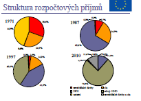
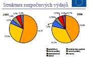

### Postavení veřejného sektoru v národním hospodářství. Zdůvodnění existence veřejného sektoru v tržní ekonomice z hlediska ekonomického uspokojování potřeb. Struktura a rozsah veřejného sektoru. Faktory ovlivňující strukturu a rozsah veřejného sektoru. 

>   **Postavení veřejného sektoru v NH**

**NH** - součástí společnosti jako systému. pro společnost má rozhodující
význam. uspokojuje její materiální potřeby. vytváří podmínky pro uspokojování
jejích nemateriálních potřeb. Tvořen soustavou prvků a vztahů vzájemně.

**Veřejný sektor** - část NH, financován z veřejných rozpočtů (zdrojem
přerozdělovací procesy). Pro veřejný sektor je důležitá zejména oblast
nemateriálních služeb – *veřejná správa, armáda, policie, justice, školství,
kultura, tělesná kultura, zdravotnictví, sociální služby, věda a výzkum, tvorba
a distribuce informací, doprava, spoje.*

-   zodpovídá - za vytváření legislativního rámce, za bezpečnost

-   zabezpečuje statky a služby

**Znaky veřejného sektoru**

1.  řízen a spravován veřejnou správou - výkon státní správy a samosprávy

2.  rozhoduje se veřejnou volbou - kolektivní rozhodování (všichni ne o volení
    zástupci

3.  podléhá veřejné kontrole - právo a povinnosti veřejnosti kontrolovat
    veřejnou volbu a důsledky

**Veřejný sektor řeší:**

>   Co se má *vyrábět*? Jak? Pro koho?

>   Jak se bude o „výrobě“ či „přidělování“ statků rozhodovat?

>   Jak zabezpečit příjmy? Jak řídit výdaje VS? Jak má být spravedlivý?

>   **ZDŮVODNĚNÍ EXISTENCE VEŘEJNĚHO SEKTORU V TRŽNÍ EKONOMICE Z HLEDISKA
>   EKONOMICKÉHO USPOKOJOVÁNÍ POTŘEB**

Rozsah veřejného sektoru závisí na politickém zřízení. Podstatou tržní ekonomiky
je, že největší část výroby a distribuce statků se uskutečňuje v rámci
soukromého sektoru. Statek se vyrábí, pokud splňuje požadavky na trhu a je –
ochoten za něj zaplatit víc než byly náklady na něj vynaložené.

Sektor soukromý a veřejný – doplňují a podporují se a vzájemně se potřebují ve
všech tržních ekonomikách. Veřejný nemůže realizovat vše. A soukromý na všem
nevydělá.

Podstata tržní ekonomiky

-   největší část v soukromém sektoru

-   Soukromý sektor fungující na bázi soukromého podnikání má své přednosti:

-   Samoregulace, neviditelná ruka trhu

    -   *statek se vyrábí, pokud splňuje požadavky trhu* (zaplatit více než jsou
        náklady) - existuje poptávka, trh zabezpečuje uspokojování potřeb

    -   *efektivnost výroby je zajištěna konkurencí* - pokud je firma
        neefektivní, konec firmy a výrobní faktory se přelévají jinam, trh
        zabezpečuje optimální alokaci a využití zdrojů

**Existence veřejného sektoru z hlediska uspokojování potřeb**

*Potřeba*

-   z ekonomického hlediska je definována jako pociťovaný nedostatek

-   je uspokojována spotřebou statků

*Výrobní* - výrobní potřeby pociťuje člověk jako výrobce statků.

*Finální* (konečné, spotřební)

-   finální nevýrobní potřeby pociťuje člověk jako spotřebitel statků, nutných
    k zachování svého života, resp. života rodiny

-   Množství a kvalita těchto statků je základem životní úrovně a životního
    stylu.

-   *společenské –* jsou důsledkem života ve společnosti ostatních (život ve
    společnosti je příčinou)

-   potřeba organizovaného uspořádání společnosti

-   potřeba ochrany osoby a majetku

-   potřeba zajištění spravedlnosti

-   potřeba ochrany území, na kterém žije

-   *individuální*

    -   jsou dány existencí člověka,

    -   jsou předpokladem jeho života (příčinou je úsilí o zachování a
        zkvalitňování života jedince)

    -   potřeba výživy, bydlení, odívání, ochrany zdraví, vzdělání, dopravy,
        poznání, informací, spojů, estetických zážitků.

*Spotřeba statků*

-   je jednou z fází reprodukčního cyklu (výroba, rozdělování, spotřeba)

-   je podmínkou reprodukce

-   je smyslem a předpokladem fungování NH, resp. společnosti jako celku.

**STRUKTURA A ROZSAH VEŘEJNÉHO SEKTORU**

**Je přestavován státem – institucemi státní správy, samosprávy a aktivitami
oblastí života**

1.  instituce státní správy

    -   kancelář prezidenta ČR

    -   parlament (sněmovna, senát) – zákonodárná moc

    -   vláda (ministerstva, úřady, rady, komise) – výkonná moc

    -   justice (oblast spravedlnosti)

    -   armáda (obrana)

    -   policie (ochrana)

2.  instituce samosprávy

    -   krajské, městské, obecní úřady a obce s přenesenou působností

-   sektor společenských potřeb

-   sektor rozvoje lidského faktoru

-   sektor technické infrastruktury

-   sektor soukromých statků

**ROZSAH**

-   závisí na politickém zřízení, resp. na důrazu, kladeném na ziskový nebo
    neziskový sektor NH

-   posuzuje se pomocí ukazatelů, které umožňují určitou srovnatelnost, a to jak
    v čase, tak v prostoru.

-   podíl veřejných výdajů na HDP v % ⇒ kolik % HDP je odvedeno v daních a je
    určeno k přerozdělování

-   pružnost veřejných výdajů – o kolik % se změní veřejné výdaje, změní-li se
    HDP o 1%

-   struktura veřejných výdajů

-   podíl počtu PS ve veřejném sektoru na celkovém počtu pracovníků v NH

-   podíl počtu pracovníků ve veřejném sektoru na počtu obyvatel

-   podíl příjmů pracovníků ve veřejném sektoru na celkových příjmech ze závislé
    činnosti pracovníků činných v NH

-   podíl základních fondů ve veřejném sektoru na celkových základních fondech
    v NH

>   **FAKTORY OVLIVŇUJÍCÍ STRUKTURU A ROZSAH VEŘEJNÉHO SEKTORU**

**Ekonomické Mimoekonomické**

*Stupeň ekonomického rozvoje faktory geopolitické*

*Bariéry ekonomického rozvoje historické*

1.  bariéra spotřeby *kulturně náboženské*

2.  bariéra výkonnosti*politické*

### 2. Ekonomické odůvodnění existence vlády a její dřívější názory. Pareto – efektivní ekonomika. Důvody zásahu státu do ekonomiky. 

**Ekonomické odůvodnění existence vlády**

Podstatou tržní ekonomiky je, že největší část výroby a distribuce statků se
uskutečňuje v rámci soukromého sektoru. Vývoj ukázal, že existují oblasti, kde
tržní mechanismy nefungují tak dokonale. Chceme-li zdůvodnit nutnost existence
veřejného sektoru v tržní ekonomice, je nutné vymezit podmínky, které jsou pro
efektivní využívání zdrojů nezbytné.

**Indiferenční křivky**

-   konvexní indiferenční křivky představují všechny možné kombinace spotřeby
    pomerančů a fíkových listů a jejich rozdělení mezi Robinsona a Pátka

-   **Pareto efektivní** –optimální využití zdrojů

-   **Pareto zlepšení -** snažíme nalézt stav, kdy je možno zlepšit užitek
    jednoho za situace, kdy užitek druhého zůstane nezměněn

**Kontraktační křivka (1)**

-   Kombinace všech možných Pareto efektivních seskupení

-   Křivka, která **spojuje optimální alokaci**, se nazývá kontraktační křivka

-   Představuje množinu všech potenciálních efektivních alokací

**Kontraktační křivka (2)**

-   Spojuje body, kde se indiferenční křivky dotýkají

-   *Matematicky se jedná o tangentu indiferenčních křivek, optimum nastává v
    okamžiku, kdy mají tečny k indiferenčním křivkám Robinsonova i Pátkova
    stejný sklon*

-   Absolutní hodnota sklonu indiferenčních křívek představuje poměr, v jakém je
    spotřebitel ochoten směnit jednu statku za určité množství ostatních statků

-   Tento poměr se nazývá **mezní míra substituce**

**Křivka produkčních možností**

-   Znázorňuje libovolné kombinace produkce dvou komodit

-   Skol křivky udává mezní míra transformace

-   Mezní míra transformace může být také vyjádřenqa pomocí *Mezních nákladů
    (MC)*

-   Vztah MMSpt a MMTpt je nezbytnou podmínkou pro dosažení Pareto efektivity.

**Pareto efektivní ekonomika (1)**

Dosažení Pareto efektivního stavu ekonomiky je závislé na dvou předpokladech

-   Vztahu mezi všemi spotřebiteli a všemi produkty jsou dokonale konkurenční,
    nikdo nemá monopolní sílu.

-   Pro všechny produkty existuje trh.

Pokud jsou splněny tyto dvě podmínky, tak:

-   Můžeme říct, že v rámci konkurenční ekonomiky automaticky dochází
    k efektivní alokaci zdrojů bez nutnosti zásahu státu do hospodářství

**Pareto efektivní ekonomika (2)**

Pareto efektivní stav nám tedy nic neříká o rovnosti v distribuci. V určitých
případech může nastat situace, kdy pro společenství je z určitých důvodů
vhodnější, aby bylo preferováno férovější rozdělení.

Pro společnost může být důležitější dosažení rovnoměrnější rozložení zdrojů než
pouhá Pareto efektivnost.

*První teorém ekonomie blahobytu říká, že dochází k Pareta efektivní alokaci
zdrojů, pokud si nikdo nemůže polepšit antž by si někdo jiný pohoršil.*

**Křivka užitkových možností**

-   Zobrazuje nám maximální výši užitku Robinsona při daném užitku Pátka. Křivka
    nám zobrazuje všechny možné kombinace Pareto efektivního rozdělení mezi
    Robinsona a Pátka.

-   Všechny body nacházející se na křivce či pod křivkou užitkových možností
    jsou pro danou společnost dosažitelné

-   Otázkou nyní zůstává, které rozdělení je pro společnost nejoptimálnější

**Sociální funkce blahobytu (1)**

-   Vyjadřuje určitý názor společnosti na rozdělení příjmů mezi jednotlivce
    v závislosti na jejich zásluhách.

-   Vycházíme z toho, že pokud se bude zvyšovat užitek Robinsona (UROBINSON), či
    Pátka (UPátek), bude se automaticky zvyšovat blahobyt společnosti jako celku
    (W).

-   **Sociální indinferenčí křivka**

**Sociální funkce blahobytu (2)**

-   Sociální indiferenční křivky proloženy křivkou užitkových možnost

-   Ačkoliv se jedná o efektivní alokaci, neznamená to automaticky také, že tato
    alokace maximalizuje společenský blahobyt

-   Společnost může dosáhnout jakékoliv Pareto efektivní alokace zdrojů pomocí
    vhodného rozdělení zdrojů a poté nechat působit tržní mechanismy

-   Druhý teorém ekonomie blahobytu dokazuje, že je možné dosáhnout určité míry
    rovnosti (či lépe řečeno snížit míru nerovnosti) bez omezení efektivnosti

**Druhý teorém ekonomie blahobytu říká, že v případě, že ekonomika dosahuje
Pareto efektivní alokace zdrojů, může se vláda rozhodnout intervenovat, aby
dosáhla spravedlivějšího rozdělení příjmů ve společnosti.**

**Dřívější názory na úlohu vlády**

**Merkantilismus a kamerální vědy**

-   16. – pol. 18. stol.

**prosazovali národní zájmy a zájmy absolutistického panovníka**

-   panovník se neobešel bez centralizované státní správy

-   snažili o hromadění peněz a drahých kovů v zemi.

-   \- chápali obchod za *„hru s nulovým součtem“*

-   **Thomas Mun** a **Jean BaptisteColbert**

-   kamerální vědy jsou určitou středo a severoevropskou obdobou merkantilismu

-   *jednalo o nauku o státní správě a financích včetně daňové problematiky“*

**Předchůdci klasické ekonomie**

-   Fyziokratismus – pol. 18. stol.

-   kladli důraz na půdu a zemědělství jako hlavní zdroj blahobytu

-   „čistý produkt“

-   chápali společenský a ekonomický systém jako přirozený řád

-   koncept tzv. **jediné daně**

-   **Francois Quesnay a Anne Robert Turgot**

**Klasická politická ekonomie**

-   od 70. let 18. století do 70. let 19. Století

-   snažili se formulovat pravidla pro volný trh

-   hospodářský pokrok byl dosahován pouze zvyšováním produktivity práce a
    dělbou práce,podporovali liberalismus, trh měl být založen na svobodné tržní
    konkurenci a na svobodě obchodu

-   neviditelná ruka trhu

-   **Adam Smith a David Ricardo**

**Socialistické ekonomické myšlení a marxistická politická ekonomie**

-   vzniklo jako reakce na vzrůstající problémy spojené s probíhající
    průmyslovou revolucí

-   všechny však spojuje myšlenka odmítání kapitalismu a vytvoření spravedlivé
    společnosti

-   předpokladem je společné vlastnictví, případně centrální řízení spojené se
    soukromým vlastnictvím

-   Utopický socialismus - **Robert Owen či Henry de Saint Simon**

-   Marxistická politická ekonomie - **Karel Marx** a *Bedřich Engels.*

**Neoklasická ekonomie**

-   zaměřena na ekonomickou rovnováhu a chování mikroekonomických subjektů

-   **Alfred Marshal**

-   **Vilfredo Pareto**

**Keynes a jeho následovníci**

-   **John Maynard Keynes**

-   nová makroekonomická teorie vnášela pochybnosti do možnosti samoregulace
    trhů v podmínkách nevyužitých zdrojů a snažila se nalézt řešení v podobě
    zásahů státu do ekonomiky.

-   **Neokeynesiánskáekonomie**

-   **Postkeynesiánství**

**Chicagská škola**

-   zakladatelé chicagské školy zásadně odmítali intervencionistický program
    vlády

-   **Milton Friedman**

-   představitel monetarismu, kritik Keynese

-   vyznával vyrovnaný státní rozpočet a neutrální monetární politiku

přisuzoval *velmi malou účinnost vlivu rozpočtové politiky na poptávku*

*zlaté pravidlo měnového růstu*

**George J. Stigler**

-   Teorie ovládnutého strážce

**Škola veřejné volby**

-   poukazuje na rozdíl mezi chováním jednotlivce a společnosti

-   Za každým rozhodnutím je nutno hledat konkrétní jednotlivce, kteří se tím
    snaží maximalizovat svůj blahobyt

-   **Kenneth Arrow a James Buchanan**

**Důvody zásahů státu do ekonomiky**

Tržní selhání

Přerozdělování příjmů

Obecně prospěšné statky

**Tržní selhání**

•K tržním selháním dochází, pokud není tržní výsledek ekonomicky optimální, tzn.
efektivní.

•**Efektivnost** = absence plýtvání, nebo-li co nejefektivnější užívání zdrojů
ekonomiky k uspokojování potřeb a přání lidí.

•Ekonomika se tedy považuje za efektivní, pokud žádná její změna nemůže způsobit
zlepšení jednoho subjektu, aniž by zároveň znamenala zhoršení subjektu jiného.

**Příčiny tržních selhání**

*Mikroekonomické*

-   Selhání konkurence

-   Existence veřejných statků

-   Existence externalit

-   Existence neúplných trhů deformace tržních cen

-   Nedostatek informaci

*Makroekonomické*

-   Nezaměstnanost, inflace a celková nerovnováha

**Selhání konkurence**

situace, ve které mohou ekonomické subjekty uplatnit monopolní sílu při
stanovování ceny. Cena produkce *P* není shodná s mezním příjmem firmy *MR*,
jako je tomu na dokonale konkurenčním trhu (P\>MR)

Definice relevantního trhu

Trh může být omezen geograficky

Rostoucí výnosy z rozsahu – přirozený monopol

Vládou záměrně vytvářené monopoly

**Řešení problému selhání konkurence**

Stát (VS) může překonávat selhání konkurence tzv. antimonopolní politikou, tj.
zavedením programů, které jsou určeny ke kontrole vzniku monopolů, k ochraně
hospodářské soutěže, na rozvoj drobného a středního podnikání, na regulaci cen
monopolu apod

**Existence veřejných statků**

-   Nemohou být zajišťovány trhem

-   Národní obrana, ochrana před vnitřním nepřítelem

-   Čistě veřejné statky

-   Náklady nezávisí na tom, kolik spotřebitelů tyto statky využívá → MN = 0

-   Nemožné vyloučit spotřebitele ze spotřeby

-   Argument nedostatečné nabídky VS poskytuje odůvodnění pro velký počet
    vládních aktivit.

**Existence externalit 1**

•Externality = nechtěné efekty výrobních a spotřebitelských aktivit, které se na
trzích neprojevují přímo

= dopad chování jednoho ekonomického subjektu na blahobyt jiného subjektu, který
není tržně vyjádřen, tedy situace, kdy trh nereaguje na vedlejší efekty výroby
či spotřeby

•Tržní ceny neodrážejí celkové společenské náklady (nebo přínosy).

**Existence externalit 2**

•Pro existenci externalit je nutno splnit dvě podmínky:

•Činnost jednoho subjektu působí ztrátu blahobytu druhému subjektu

•Tato ztráta blahobytu není kompenzována

**Externality**

-   Spotřebitelské x výrobní

-   Technologické x peněžní

-   Kladné x záporné

1)Pozitivní = situace, kdy činnost původce externalit přináší užitek druhému
subjektu, který za něj neplatí žádnou cenu;

2)Negativní = situace, kdy aktivita původce externalit vyvolává náklady u jiného
subjektu, které mu nejsou uhrazeny.

### 3. Funkce veřejného sektoru (alokační, distribuční, stabilizační, regulační, stimulační, kontrolní). 

>   **Funkce veřejného sektoru**

Odstraňují nebo zmírňují následky selhání trhu a předcházet mu poskytnutými
podmínkami.

**alokační funkce** *Je spojena s efektivní alokací zdrojů ve společnosti.
Souvisí se zabezpečení veřejných statků. Spočívá v rozdělování zdrojů mezi
výrobou soukromých a veřejných statků v závislosti na tom, který sektor je
schopen vyrobit efektivněji.*

-   Efektivní alokace zdrojů ze společnosti

-   *zabezpečování veřejných statků*

-   *rozdělování zdrojů mezi výrobu soukromých a veřejných statků*

    -   soukromé statky (nabídka-poptávka)- rozhoduje cena

    -   veřejné statky (politická rozhodnutí) – zdanění, stavba dálnic

**distribuční funkce**

Spočívá v zásazích do procesu rozdělování důchodů a bohatství za účelem zmírnění
sociálních nerovností.(sociální péče)

-   *rozdělování důchodů a* bohatství (účel zmírnění soc. nerovností) - převážně
    sociální péče

-   trhem zajištěná diferenciace může být neúnosná a nespravedlivá (př.výše
    platu)

*fiskální nástroje*

-   progresivní daň

-   2 kombinované daně

-   rozdělení důchodů

**stabilizační funkce** vyplývá z makro ekonomické působnosti veřejného sektoru.
Hlavním cílem je efektivní využití potenciálu země k zajištění ekonomického
růstu, zachování přiměřené stability cen, co nejnižší nezaměstnanost, maximální
využití lidského faktoru.

-   makroekonomická působnost VS

-   *využití potenciálu země k zajištění ekonomického růstu*

-   *zachování stability cen*

-   *nejmenší nezaměstnanost*

-   využití lidského faktoru

>   *K plnění této fce slouží nástroje stabilizační politiky státu zejména
>   fiskální nástroje* (daně, dotace, rozsah výdajů a povaha státního rozpočtu)

>   *měnové nástroje* (cena peněz. Povinné rezervy, operace na kap.trhu)

**regulační funkce**

*Spočívá v regulaci soukromého sektoru:*

-   *omezování nežádoucích vlivů na vývoj výroby, ceny, nezaměstnanost* (vše co
    ohrožuje nerovnováhu)

*k tomu stát využívá různé nástroje*

-   antimonopolní zákon

-   zákoník práce

-   zákon o cenách, léková vyhláška

-   zákony a sankční poplatky související s ŽP

**stimulační funkce**

-   Opak fce regulační, spočívá v podpoře a ovlivňování chování soukromého
    sektoru žádoucím směrem zejména k posilování ekonomické rovnováhy .K
    stimulačním účelům stát používá zejména nástrojů dotačních, a daňové
    politiky.

    -   opakem regulační

    -   podpora ovlivňování *soukromého sektoru* žádoucím směrem (posilování
        ekonomické rovnováhy)

*nástroje dotační a daňové politiky*

-   drobné podnikání, rekonstrukce bytového fondu, činnosti zájmových spolků,
    zemědělci

-   zvýhodňuje zaměstnávání tělesně postižených

-   penzijní a životní pojištění

-   daňové prázdniny, investiční pobídky

**kontrolní funkce**

*Vyplývá z celostátní působnosti veřejného sektoru. Podstatou je, aby finanční
prostředky vynaložené byly efektivně využity.*

-   vyplývá z celostátní působnosti VS

-   EFEKTIVITA - ekonomické vývoje musí odpovídat rozsahu faktorů vynaložení
    k jejich dosažení

-   dodržování zákonů a nařízení

V různých zemích mají určité funkce různý význam. V zemích s velkým sociálním
cítěním je větší význam funkce distribuční a kontrolní. Tam kde má větší podíl
soukromý sektor – liberální vlády a tržní mechanismus – má větší význam funkce
stabilizační a alokační.

### 4. Veřejná volba jako nástroj rozhodování ve veřejném sektoru – podstata, formy veřejné volby, základní postupy a problémy veřejné volby. 

>   **Podstata**

Veřejná volba je založena na rozhodovacích procesech voličských hlasů, tj. na
hlasování za předpokladu racionálnosti.

**Vstupující aktéři:**

-   na ekonomickém trhu jsou účastníky rozhodování *výrobce a spotřebitel*
    (vztahy jsou bezprostřednější),

-   na politickém trhu *voliči, politici, byrokracie, zájmové skupiny* -
    slaďování zájmů je složitější

O problémech, kde nelze rozhodovat s využitím trž. mechanismu, se rozhoduje
veřejnou volbou. Jde o to sladit zájmy individuální s **veřejným zájmem.**

**Ve ve**ř**ejném sektoru** je působení tržního mechanismu nahrazeno
**politickým rozhodnutím**, které je výsledkem kolektivního rozhodnutí, přičemž
vychází z určitých zákonitostí individuálního chování.

-   Používá se všude tam, kde k rozhodování nelze použít kritéria ekonomická

-   Založená na voličských hlasech – tj. na hlasování

**Základem ve**ř**ejné volby** je snaha o optimalizaci přijatých rozhodnutí.

**Úkolem ve**ř**ejné volby** je:

\- donutit voliče, a tedy spotřebitele veřejných statků, projevit preference;

\- sladit individuální preference tak, aby vyústily do 1 kolektivního
rozhodnutí.

**FORMY VEŘEJNÉ VOLBY**

1) **p**ř**ímá demokracie** (přímé hlasování)**.** Volebního procesu se účastní
každý volič např. formou referenda. Při velkém počtu voličů a řešených problémů
nevhodná.

2. **reprezentativní demokracie** (nepřímé hlas.)

\- Hlasují zvolení zástupci (reprezentanti) - nominováni politickými stranami

\- problémem je motivace stran, politiků, byrokracie

\- nemusí zcela nezbytně vést k zajištění veřejného zájmu, k optimálnímu
rozhodnutí.

**ZÁKLADNÍ POSTUPY**

**Pravidlo hlasování:**

1.  **pravidlo jednotlivce**

\+ výhody – nenákladné

\- nevýhody – nedemokratické (prosazování vůle jedince, např.vojedvůdce)

1.  **pravidlo jednomyslné shody (koncensu)**

\- všichni musí souhlasit

\+ výhody – nelze zhoršit situaci – nikdo nebude souhlasit s něčím co by jeho
situaci zhoršilo

\- nevýhody–časově a finančně nákladné – také možnost vydírání jedincem
(profituje z toho)

1.  **pravidlo většiny**

\- souhlasí nadpoloviční většina

\+ výhody – nemohou být schválena špatná rozhodnutí, nemožnost vydírání jedincem

\- nevýhody – schválení neefektivních či nespravedlivých návrhů, zneužívání
dominantního postavení

**Pravidlo většinového hlasování**

-   *prosté většiny –* jeden hlas/jedna varianta, preference nad 50 % vyhrává

-   *relativní většiny –* vítěz získal nejvíce hlasů. Může vyhrát i o 1 hlas
    (prav.většiny jediného hlasu)

-   *Condorcetovo –* porovnání všech variant, ta která získá většinu vyhrává

-   *Pluralitní hlasování* – volič má tolik bodů, kolik je variant. Vítězí ta
    s nejmenším počtem bodů.

-   *přidělování bodů –* voliči mají stejný počet bodů, přiděluje jak chce.
    Vítězí ta s největším počtem bodů.

-   *Bordův počet* – přiřazena váha hlasu, hlasy se sčítají, vítězí největší
    zisk vážených hlasů

**PROBLÉMY VEŘEJNÉ VOLBY**

a) *Hlasovací paradox* neboli (volební paradox, paradox cyklického hlasování,
Condorcetův paradox, neexistence rovnováhy)

-   Při principu prosté většiny při hlasování o více než 2 projektech, některý
    z voličů musí mít tzv. 2vrcholovou preferenci

-   Žádná varianta nemůže docílit převahy nad jinou

-   Příklad - velký rozpočet A, střední rozpočet B, malý rozpočet C, máme 3
    voliče X, Y, a Z a náklady jsou rozděleny rovnoměrně

Y volí C (nízký rozpočet a nízká míra zdanění)

>   v druhé volbě A (vysoká úroveň zdanění) – dává přednost extrémům

Z volí B (přiměřený rozpočet a přiměřené daně) v druhé volbě C

>   Výsledek nám bude záležet na pořadí, ve kterém dvojice jednotlivých možností
>   porovnáváme.

>   Začneme-li A versus B, zjistíme, že vyhrává A nad B a naopak C vyhrává nad
>   A, C je tedy naprostým vítězem. Když však začneme B versus C, potom vyhrává
>   A. Pokud začneme s A versus C, vítězí B. Tento hlasovací paradox byl šokem
>   pro víru v demokracii voleb.

**V**ě**tšinové pravidlo nefunguje tam, kde struktura preferencí jednotlivc**ů
**má více než jeden vrchol**.

b) *Arrowův zákon nemožnosti:*

Neexistuje žádná hlasovací metoda na principu většinového pravidla, která
nezávisí na pořadí jednání, zaručila efektivnost a respektovala individuální
preference

c) *Volič- medián* (střední volič)

Díky svému umístění ve volebním souboru může za určitých okolností zaručit
vítězství 2. návrhu, protože rozděluje soubor voličů (při lichém počtu) do 2
stejných podsouborů. Rovnovážná úroveň je ta, kterou upřednostňuje střední
volič. Tzn., počet jedinců preferujících vyšší výdaje = počtu jedinců
preferujících nižší úroveň výdajů.

### 5. Veřejné statky – charakteristika, klasifikace veřejných statků (čistě veřejné statky, částečně veřejné statky, veřejně poskytované soukromé statky), podmínky efektivní nabídky veřejných statků, nástroje přidělování veřejných statků, problém jednotné spotřeby. 

**charakteristika**

jsou statky nedělitelného zboží a služby, které poskytuje veřejný sektor, tj.
stát a obce. Buď je vyrábí sám ve svých podnicích, nebo je nakupuje u soukromého
sektoru. Zdrojem jejich financování je soustava neveřejných rozpočtů. Jde o
takové statky, jejichž produkci nemůže zabezpečit trh v důsledku tržního
selhání. Celkový užitek pro všechny je větší než náklady na ně vynaložené,
užitek pro jednotlivce by však byl nižší než náklady na jeho výrobu – proto
soukromá osoba nemá zájem o jeho výrobu.

>   Klasifikace veřejných statků

1.  **podle způsobů potřeby**

    -   *čistě veřejné statky - znaky při spotřebě*

jejich spotřeba je nedělitelná v kvantitě ani kvalitě, jednotlivce nelze ze
spotřeby vyloučit, nelze přesně stanovit podíl jednotlivce na spotřebě, nelze
jednotlivci předepsat úhradu. Spotřebu nelze nijak omezovat, formou zákonných
daní vymáhá stát zdroje na tyto statky. Spotřeba žádného subjektu nesnižuje
nabídku pro ostatní uživatele. Zvýšení užitku jednoho nevyvolává snížení užitku
druhého. Mezní užitek je roven nule. Náklady nezávisí na tom, kolik spotřebitelů
tyto statky využívá, mezní náklady jsou rovny nule. (státní správa, armáda
policie, soudy, veřejné komunikace, veřejné osvětlení, hromadná veřejná
doprava).

-   *částečně veřejné statky*

spotřeba je dělitelná v kvantitě, kvalita je nedělitelná. Růst kvantity spotřeby
vede pro všechny ke snížení kvality spotřeby. Jednotlivce lze vyloučit ze
spotřeby, ale ekonomicky bývá často neprospěšné. Mezní náklady na dodatečného
spotřebitele jsou větší než nula, ale jsou nízké (zdravotnictví, školství,
obrazárny, veřejné parky).

-   *veřejně poskytované soukromé statky*

jejich spotřeba je dělitelná, vyloučení je možné, ale nebylo by spravedlivé.
Mezní náklady na dodatečného spotřebitele jsou vysoké (VŠ, určité části
zdravotnictví, využití knihoven).

-   zajišťuje trh – u čistě tržních statků

-   zajišťuje stát (instituce) – jiné typy statků

Dle vlivu státu na rozhodování a alokaci zdrojů na produkci a na rozhodování
rozdělení mezi spotřebitele

-   *netržní statky (jejich funkce nepřináší zisk – obrana státu)*

-   *polotržní veřejné statky*

    -   produkovány soukromým sektorem

    -   ceny jízdného ve veřejné hromadné dopravě

    -   služby na poště, regulovaný nájem

-   *poručnické veřejné statky*

    -   stát rozhoduje za jedince podle vlastních preferencí

    -   stát je přesvědčen o prospěšnosti

    -   povinná školní docházka

    -   uložení povinného léčení

    -   periodické prohlídky dětí

1.  **podle ekonomických vlastností**

    -   *statek s vlastností nerivality*

        -   může spotřebovávat více osob, a nekonkurují si

        -   národní obrana, veřejné osvětlení

    -   *statek s vlastností nevylučitelnosti*

        -   spotřebitele není možné vyloučit ze spotřeby

    -   *statky s vlastností vylučitelnosti*

        -   spotřebitele lze ze spotřeby vyloučit

        -   dálniční známky, zákaz jízdy nákladních aut po dálnici v neděli

        -   poplatky za internet – rozlišení slabý a silný provoz

    -   *čistě veřejné statky*

        -   s vlastností nevylučitelnosti

        -   poskytuje je stát

    -   *částečně veřejné statky*

        -   spotřeba je dělitelná

        -   vyloučení možné, ale nákladné

    -   *veřejně poskytované soukromé statky*

        -   mezní náklady jsou vysoké

        -   vysoké transakční náklady (nárok na vzdělání)

**Nástroje přidělování veřejných statků**

\- používají se různé nástroje k omezení spotřeby – ekonomické a administrativní

ekonomické

**1. cenový mechanismus a čekání na poskytnutí statku nebo služby**

\- spočívá na vybírání poplatků, které snižují spotřebu, př. dálniční známky

administrativní

**2. administrativní omezení spotřeby**

\- jde o přidělování jednotných dávek všem spotřebitelům, tento způsob v sobě
nese určitou nespravedlnost, protože každý má jiné nároky**,** př. MHD – cena
stejná jako na 2 zastávky i na 10.

**PROBLÉM JEDNOTNÉ SPOTŘEBY**

Jednotnost nabídky je nedostatkem veřejných statků = neumožňuje přizpůsobení se
individuálním potřebám tak, jak to umožňuje tržní mechanismus.

-   Záleží na pružnosti poptávky po statku

Jednotnost nabídky pro všechny – největší nedostatek veřejných statků.
Neumožňuje přizpůsobit se individuálním potřebám.

### 6. Veřejné výdaje – financování dělitelných a nedělitelných veřejných projektů, hodnocení efektivnosti veřejných projektů a jejich problémy, příčiny růstu veřejných výdajů. 

JSOU:

-   výdaje na financování veřejných statků

-   zdrojem jsou veřejné rozpočty

>   **Dělitelné projekty**

-   jsou takové, kde výdaje lze snižovat či zvyšovat o malé částky, aniž by byla
    ohrožena realizace projektu (základní, střední školství)

-   výdaje

>   *fixní objem rozpočtu*

-   optimální rozdělení částky mezi dané projekty, principem je, aby s daným
    objemem peněz se získal maximální užitek, rovnováha tady nastane, kdy se
    rovná mezní užitek z vydání poslední koruny na jeden projekt meznímu užitku
    z vydání poslední koruny na druhý projekt

-   rozdělení tak aby byl získán maximální užitek (větší než náklady)

-   lze snížit výdaje jednoho projektu na úkor druhého

-   mezní užitek jednoho projektu nákladu druhého projektu

>   *měnící se objem rozpočtu*- jedná se o stanovení samotného objemu rozpočtu
>   tj, jak rozdělit celkové zdroje mezi soukromý a veřejný sektor, principem je
>   , že náklad příležitosti veřejného projektu , je roven ztrátě užitku ze
>   soukromých projektů, které se neuskuteční, úkolem je maximalizovat celkový
>   užitek z veř. a soukr. sektoru při daných celkových zdrojích

-   jak rozdělit částky mezi soukromý a veřejný sektor

-   maximalizovat užitek ze soukromého i veřejného sektoru

>   **Nedělitelné projekty u nich nelze částky snižovat,** při odejmutí částky
>   peněžních prostředků by nemohl být projekt dokončen (výstavba školy, oprava
>   komunikace)

-   výdaje – nutno volit mezi jednotlivými projekty, na které je nutno vynaložit
    určitou částku

>   *fixní objem rozpočtu jde o rozdělení určitého objemu peněz na několik akcí*

-   rozdělení objemu peněz na některé různé akce

-   přidělené zdroje by měly být vyčerpány

    1.  podle poměru užitku k nákladům - jde o to aby každá vynaložená koruna
        přinesla větší užitek než 1 Kč

    2.  podle velikosti čistého užitku – podle výše čistého užitku se vyberou
        varianty do vyčerpání zdrojů

    3.  minimalizace nespotřebovaných zdrojů – výběr projektů k realizaci se
        řídí snahou plně vyčerpat přidělené zdroje.

>   *měnící se objem rozpočtu*

jedná se o rozdělení zdrojů mezi soukromý a veřejný sektor**,** protože se jedná
o nedělitelný projekt, nelze využít k porovnání stejného mezního užitku**,**
veřejný projekt realizovat tehdy, je-li užitek větší než náklady, čili čistý
užitek větší než 0**,** vychází se z toho, že náklady na vydání x korun ve
veřejném sektoru jsou ztrátou x korun užitku v soukromém sektoru.

>   **HODNOCENÍ EFEKTIVNOSTI VEŘEJNÝCH PROJEKTŮ A JEJICH PROBLÉMY**

-   analýza výnosů a nákladů

-   projekt se realizuje, je-li jeho užitek pro společnost větší než jeho
    náklady

-   normy, kalkulace, komparace

>   **Možné užitky a náklady**

>   Reálné užitky (získávají koneční uživatelé veřejného projektu)

>   Reálné náklady (náklad na převedení zdrojů z jiného použití)

>   Peněžní užitky a náklady (zisk nebo ztráta je vyrovnána ziskem nebo ztrátou
>   jiných subjektů – nejde o přírůstek blahobytu)

>   **Reálné užitky a náklady**

-   přímé (prvotní) – vztahují se k hlavnímu cíli projektu

-   nepřímé (druhotné) – vedlejším produktem veřejného projektu

-   hmotné – lze ocenit na trhu

-   nehmotné – nelze ocenit

-   konečný – efekt přímo pro spotřebitele

-   meziprodukt – poskytnutí pro náklad užitku přímého

-   vnitřní – uvnitř příslušné oblasti

-   vnější – dopady vně příslušné oblasti

>   **Hodnoty užitků a nákladů**

>   *Nehmotné*

-   nelze použít tržní cena

-   politické rozhodování – čisté ŽP

-   realizace prevence kriminalistiky

-   úspora nákladů na soudní řízení, vězení

>   *Hmotné*

-   tržní cena

-   pořizovací cena + výrobní faktor + náklady

-   daně – spotřební, z přidané hodnoty – přirážka – náklad

>   *Víceúčelovost projektu*

-   dosažení více cílů (vzdělání – základní i střední)

>   *Problém efektivnosti a spravedlnosti*

-   projekt může být efektivní jen z jedné oblasti, z jiné méně efektivní

-   užitek pro někoho větší pro někoho menší (?spravedlnost?)

    -   např. rozdělování důchodů

>   *Vliv faktoru času*

-   okamžitý užitek (soc. dávky, mzdy státních zaměstnanců)

-   dlouhodobý účinek (v průběhu let)

>   \- efektivnost investic – budoucí užitek se oceňuje níže než okamžitý

>   **Diskontní sazba – úroková míra**

>   **Soukromá diskontní sazba**

-   volba spotřebitele mezi současnou či budoucí spotřebou

-   nedokonalé trhy

-   nejistota (ve vývoji úrokových sazeb)

-   riziko (zvýšení úrokové sazby na riskantnost investice – rizikovou prémii)

-   daň z kapitálového výnosu

-   inflace (zvyšuje úrokovou míru – působí proti efektivnosti investice)

-   stabilizační opatření vlády (fiskální a monetární nástroje – změna úrokové
    sazby)

>   **Společenská diskontní sazba**

-   obyvatelstvo dává přednost současné spotřebě před budoucí

-   nízké úspory, nedostatek peněžních zdrojů pro investice

-   úroková míra se zvyšuje

>   *Riziko*

-   snižuje současnou hodnotu budoucích užitků

>   **PŘÍČINY RŮSTU VEŘEJNÝCH VÝDAJŮ**

>   **Veřejné výdaje úzce souvisí s ekonomickými potřebami a preferencemi
>   spotřebitelů.**

>   **Hlavní faktory ovlivňující růst výdajů:**

1.  **stupeň rozvoje země** - je-li stát nucen podílet se na rozvoji
    infrastruktury

2.  **růst důchodů na 1 obyvatele** - signalizuje rozvoj země**,** rozvíjí-li se
    soukromý sektor, veřejný sektor se také rozvíjí a zkvalitňuje své služby

3.  **ochrana životního prostředí** - vyspělé země díky bohatší spotřebě více
    devastují životní prostředí**,** je potřeba jej více chránit – výdaje na
    životní prostředí se zvyšují

4.  **technologické změny** - urychlují zastarávání**,** je potřeba je
    obnovovat**,** aby veřejný sektor byl stejně vybaven jako sektor soukromý

5.  **změny populace** - změny růstu počtu obyvatel**,** roste obyvatelstvo –
    rostou nároky na služby veřejného sektoru (více škol, infrastruktura…)

6.  **mobilita obyvatelstva** - vede k růstu nových obytných lokalit**,** rostou
    požadavky na dodatečná zařízení místního charakteru

7.  **náklady na poskytování veřejných statků souvisejících s inflací** - pokud
    rostou ceny, rostou celkové výdaje

8.  **urbanizace** - přestavba sídlištní struktury na sídliště městského
    typu**,** obyvatelstvo na venkově chce stejné služby jako obyvatelé
    měst**,** rostou nároky na růst služeb

9.  **vývoj transferů** - starobní důchody a různé sociální dávky**,** závisí na
    rozvoji země a politických cílů

10. **možnost získávání daní** - daně jsou zdrojem výdajů**,** efektivní daňový
    systém a obyvatelé byly ochotni platit daně – daňový systém musí být únosný

11. **ohrožení státu v případě války** - nárůst veřejných výdajů (boj
    s terorismem, ohrožení státu…)

12. **subjektivní:**

>   \- snaha státní byrokracie zvětšovat své úřady - snaha zakládat nové státní
>   úřady

>   \- tlak zájmových skupin ze soukromého sektoru (lobování)

**Přístup jednotlivých obyvatel k veřejným výdajům je určen třemi faktory:**

-   **Individuální preference jednotlivců** – každý si cení veřejné programy
    jinak

-   **Rozdílné příjmy obyvatelstva** – mezní užitek soukromých statků je pro
    chudšího spotřebitele vyšší než pro zámožného. Chudší občané proto budou
    také méně ochotni vzdát se části svých příjmů na financování veřejných
    projektů. Ačkoliv je možné, že mezní užitek veřejných statků je pro chudší
    obyvatele vyšší než pro bohatší, je jejich mezní užitek ze soukromé spotřeby
    natolik vysoký, že zvýšení veřejné spotřeby by snížilo jejich celkový
    užitek. Mezní míra substituce – tj. množství soukromých statků, kterých je
    spotřebitel ochoten vzdát se výměnou za zvýšení veřejné spotřeby o jednotku
    – je pro každou úroveň veřejné spotřeby nižší pro chudší obyvatele než pro
    bohatší. Důsledkem je, že při paušálním zdanění bohatší lidé upřednostňují
    vyšší veřejnou spotřebu.

-   **Daňový systém** – určuje, jakou část nákladů veřejného projektu bude muset
    zaplatit každý občan. Pokud každý musí platit stejnou část výdajů, bude
    občan s nižšími příjmy dávat přednost nižším veřejným výdajům. Pokud ale
    chudší platí méně než bohatší, je možné že budou prosazovat vyšší úroveň
    veřejných výdajů. Krajním případem bude občan, který nemusí platit vůbec
    žádné daně. Každý veřejný projekt tedy pro něho bude prospěšný, a proto bude
    prosazovat maximálně možnou výši veřejných výdajů.

### 7. Státní rozpočet – vymezení pojmu, rozpočtové zásady a pravidla. Funkce státního rozpočtu. 

**rozhodující význam v soustavě veřejných rozpočtů**

v historii kvůli financování válek a potřeb panovnického dvora

-   příjmy – válečné kořisti, domény – z panovníkova majetku, poplatky za
    zapůjčení práv (právo lovu, těžby, vaření piva, lihu) později výběr daní
    (naturální až peněžní, nepravidelný až pravidelný); církevní a městské daně

podstata v rozdělování a zejména přerozdělování důchodů - spočívá v rozdělování
a přerozdělování důchodů**,** představuje souhrn peněžních stavů v oblasti
tvorby, rozdělování a užití centralizovaného peněžního fondu

**vymezení pojmu státní rozpočet nelze ho jednoznačně vymezit**

-   *centralizovaný peněžní fond*

    -   obhospodařován státem

    -   princip nenávratnosti a neekvivalentní způsob rozdělování

-   *bilance příjmů a výdajů*

    -   účetní hledisko – předpokládaná příjmy a výdaje státu

-   *finanční plán*

    -   na rozpočtové období - plánované příjmy a výdaje

    -   rozpočtová závěrka – bilance hospodaření za minulé rozpočtové období

    -   střednědobý výhled – 2letý

-   *ekonomický vztah*

    -   shromažďování a rozdělování prostředků (daně, poplatky, cla, státní
        půjčky, dotace, transfery aj.)

-   *finanční zákon*

    -   právní norma – usnesl parlament – opravňuje výkonnou moc k vybírání
        příjmů a realizaci výdajů k vedení národního hospodářství

-   *nástroj rozpočtové politiky státu*

    -   k plnění funkcí veřejného sektoru

>   **ROZPOČTOVÉ ZÁSADY**

Měl by se jimi řídit rozpočtový proces (fáze prací s rozpočtem).

1.  **Zásada úplnosti SR -** Všechny finanční operace vlády a centrálních
    institucí (všechny příjmy a výdaje v brutto /plných/ částkách)

2.  **Z. jednotnosti -** Příjmy a výdaje jsou zachyceny v jediném dokumentu a
    jednotným způsobem. Odklon – rozpočty mimořádné, dodatečné, doplňkové.
    Zásada rozpočtové plurality – několik dílčích rozpočtů

3.  **reálnosti a pravdivosti -** Zamezit rozpočtovým přesunům (převod výdajů na
    jiný účel – ztěžují to)

4.  **každoročního sestavování a schvalování rozpočtu -** Přehled příjmů a
    výdajů – rozpočtové období od 1.1. do 31.12.. Schválení před započetím
    nového rozpočtového období. Rozpočtové provizorium – pokud není schválen
    rozpočet včas (zpracování, neshoda v projednání; válečný stav)

5.  **(dlouhodobá) vyrovnanosti SR -** Zlaté pravidlo – výdaje jsou sestavovány,
    tak aby odpovídaly příjmům. Schodkový rozpočet v ČR přijat od roku 1999

6.  **Přehlednosti -** Rozpočtová skladba – seřazení příjmů a výdajů
    (srovnatelnost, kontroly) – členění na kapitoly, skupiny, oddíly, pododdíly,
    paragrafy, položky

7.  **Publicity0 -** Zveřejnění – projednává se veřejně v parlamentu – tisk,
    sbírka zákona

>   Zásada hospodárnosti a efektivnosti – zodpovědné hospodaření s veřejnými
>   zdroji (ne deficit)

>   **ROZPOČTOVÁ PRAVIDLA**

>   Řídí se jimi celý rozpočtový proces – vycházejí ze zásad. Jsou upravena
>   zákonem.

1.  **navrhovatel rozpočtu**

    -   Zákon vymezí instituci

        -   ministerstvo financí + správci kapitol + státní fondy + územní
            samosprávní orgány

        -   rozpočtová kancelář prezidenta (USA); premiér (VB)

2.  **způsobu vypracování výdajové stránky rozpočtu**

    -   Kdo a jakým způsobem?

        -   Ministerstvo financí na základě částky střednědobého výdajového
            rámce schváleného Poslaneckou sněmovnou při schvalování rozpočtu na
            předchozí období

3.  **přednost výdajů před příjmy**

    -   Příjmy jsou ke stabilizaci ekonomiky (daňové stabilizátory,
        multiplikátory)

    -   Výdaje jsou k podpoře ekonomického růstu (expanze)

        -   Problém nadhodnocení (přebytkový) či podhodnocení výdajů

4.  **schvalování rozpočtu**

    -   V ústavě je vymezena zákonná moc v daném státě

    -   ČR – dolní komora parlamentu tj. Poslanecká sněmovna

5.  **omezení přesunů v rozpočtu**

    -   Možnost přesunu stanovena zákonem (omezeny, či zakázány)

    -   ČR – ministr financí může provést přesun mezi ukazateli maximálně ve
        výši 10 % celkového objemu ukazatele. (vyšší přesuny může povolit
        Rozpočtový výbor Poslanecké sněmovny)

6.  **alokace výdajů**

    -   Ve federativních zemích – kde nad státním rozpočtem je rozpočet
        nadnárodní

    -   Část výdajů k zabezpečení potřeb federace (unie) a část je rozdělena
        mezi jednotlivé) územní celky

7.  **vymezení příjmů, výdajů a rezerv**

    -   Vymezeno zákonem (daně, cla, dotace, půjčky)

    -   Rozpočtová rezerva – ke krytí nezbytných a nepředvídaných výdajů

        -   Velikost navrhuje vláda – schvaluje parlament – o použití rozhoduje
            vláda

        -   ČR – 0,3 celkových výdajů na daný rozpočtový rok

8.  **rozpočtové provizoria**

    -   Pokud státní rozpočet není schválen jako zákon k 1.1.

    -   Vláda vybírá příjmy a realizuje výdaje státního rozpočtu do schválení
        rozpočtového zákona

    -   V ČR 1999 a 2000 a v ČR se vláda řídí zákonem schváleným na minulé
        rozpočtové období – jednu dvanáctinu výdajů

9.  **časového užití a účelnosti výdajů**

    -   Uvolňování peněžních prostředků (celé období, čtvrtletně, měsíce)
        absolutní či % část

    -   K jakým účelům lze výdaje použít

10. **úhrady rozpočtově nezajištěných potřeb**

    -   Možnost úhrady neplánovaných potřeb

        -   Hospodárnější provedení jiných úkolů

        -   Odsunutí či omezení méně důležitého úkolu

        -   Zvýšení výnosů (příspěvkové organizace)

        -   Vládní rezerva

11. **sestavení a schvalovací procedury státního závěrečného účtu**

    -   Zpráva o plnění státního rozpočtu

    -   ČR – ministerstvo financí + správci kapitol státního rozpočtu + územní
        samosprávní celky + státní fondy

    -   Návrh závěrečného účtu předkládá k projednání vládě, ta předá Poslanecké
        sněmovně

>   **FUNKCE STÁTNÍHO ROZPOČTU**

Jsou projevem podstaty státního rozpočtu a vyplývají z funkce veřejného sektoru.

1.  **Alokační -** Nejstarší; stát – produkční subjekt – příjemce obyvatelstvo

2.  **Redistribuční -** Přerozdělování HDP (národní důchod) – snaha zmírnit
    negativní dopad do sociální oblasti

3.  **Stabilizační -** Eliminace tržních selhání, minimalizace společenských
    ztrát (inflace, zaměstnanost, platební bilance)

4.  **Regulační -** Přímé zásahy státu do soukromého sektoru (regulace cen,
    mezd, podpory NZ)

5.  **Kontrolní -** Kontrola příjmů a výdajů státního rozpočtu

### 8. Příjmy a výdaje státního rozpočtu a jejich členění, faktory ovlivňující příjmy SR. 

Jsou evidovány na souhrnném účtu běžného hospodaření státní pokladny (ČNB)

>   **PŘÍJMY**

-   daňové (daně, poplatky, pojistné a sociální zabezpečení – důchodové,
    nemocenské)

-   nedaňové (cla, odvody od státních podniků, úroky a výnosy ze státního
    majetku, plátky, emisní výnosy)

**DAŇOVÉ**

>   *Daně*

-   povinná zákonem určená částka, nenávratná, povinná platba do st.rozpočtu

-   oprávnění státu požadovat a vybírat od poplatníka určitou částku

-   vybírá FÚ od fyzických a právnických osob

-   zdroj k přerozdělování důchodů

**přímé**

-   dělí se na důchodové a majetkové

-   vyměřeny poplatníkovi na základě důchodu nebo majetku

-   daň z příjmu FO, PO, daň z nemovitosti, dědická, darovací, silniční, z
    převodu nemovitosti

>   **nepřímé**

-   placeny a vybírány v cenách služeb, převodů, pronájmů

-   připočítávají se k cenám statků a služeb

-   do státního rozpočtu je odvádí prodávající

-   členěny na univerzální (přirážka k ceně -DPH), a selektivní (stát omezuje
    spotřebu - spotřební daň)

>   *Poplatky*

-   platí FO, PO

-   vybírány za protihodnotu, tím se liší od daní

-   povolená činnost - **služby státní správy** (výpis z tr. rejstříku,
    vystavení ŽL, OP)

-   nepovolená činnost - **sankční poplatky** – pokuty (znečišťování ŽP,
    skládkování) – za činnost nepovolenou

-   výběr v hotovosti, kolkované známky, exekuce

-   státní/místní, správní/soudní

>   *Pojistné a sociální zabezpečení*

-   **důchodové pojištění**

-   **nemocenské pojištění**

-   **příspěvek na státní politiku zaměstnanosti**

-   tvoří 39% příjmů, ve vyspělých zemích je odváděno do účelových fondů

**NEDAŇOVÉ**

>   *Cla*

-   je součástí ceny výrobku – při přechodu přes hranice – vzniká břemeno

-   **dovozní, průvoz a vývozní**

-   zdražením dovezeného zboží je splněna funkce ochrany vnitřního trhu

-   realizace celní politiky – Celní správa ČR – vrcholný orgán Generální
    ředitelství cel (celní ředitelství, celní úřady)

>   *Odvody*

-   povinné, stanovené zákonem, nenávratné

-   od: **části výnosů státních podniků**

-   **organizačních složek státu**

-   **příspěvkových organizací**

-   liší se od daně: sazba není pevně stanovena a forma vlastnictví se nemění

>   *Přijaté úroky a výnosy ze státního majetku*

>   *Splátky*

-   **vládních úvěrů domácnostem, zahraniční**

-   **návratných finančních výpomocí**

-   návratné *plné dluhové služby* (jistina ­+ úrok) – obce, kraje

-   návratné *částečné dluhové služby* (bez úroků)

>   *Emisní výnosy*

-   státních dluhopisů

-   státních pokladničních poukázek

>   **ČLENĚNÍ**

>   *Návratné* zapůjčené, po uplynutí doby se musejí vrátit (Krátkodobé bankovní
>   úvěry)

>   Nenávratnédaně, poplatky, odvody, příjmy plynoucí z vlastnictví, či
>   z prodeje státního majetku

>   *Běžné* každoročně se opakují

>   Kapitálovéjednorázové (bytový fond, pozemky, podíly v a.s. přijaté úvěry,
>   emise cenných papírů)

>   *Pravidelné*stálý a trvalý příjem (DPH, pojistné na sociální zabezpečení)

>   Nepravidelné jednorázové, mimořádné, dočasné (výnosy z dluhopisů, výnosy
>   z prodeje majetku, státní půjčky – jsou neplánované)

>   *Mandatorní* vynucené – závazné – platba je dána zákonem (daně, správní
>   poplatky)

>   Fakultativní dobrovolné (dary, státní půjčky, výnosy z emise dluhopisů)

>   *Ze soukromého sektoru*

>   Ze státního vlastnictví majetku

>   **VÝDAJE**

>   Nenávratnost, přerozdělování, zabezpečují fungování státu

-   **výdaje na nákup zboží a služeb** (tvz. Vládní výdaje) - pro běžné
    fungování státních orgánů (inventář, výpočetní technika, dopravní
    prostředky, uniformy, mzdy státních zaměstnanců, spotřeba E)

-   **transférové platby** – stát nezískává žádnou protihodnotu (výplata
    důchodů, dávek sociální pomoci obyvatelstvu)

>   **ČLENĚNÍ**

>   Dle funkcí státu:

>   *ekonomického charakteru (*budování infrastruktury, podpora vývozu, podpora
>   podnikání,

>   financování vědy, výzkumu) *na státní správu, armádu, policii a justici, na
>   sociální, zdravotní, školské a kul. Účely,splácení státního dluhu*

>   *podle závaznosti*:

>   *Mandatorní* výdaje dané zákonem (nelze změnit) – dávky sociálního
>   zabezpečení, podpora v nezaměstnanosti, příspěvek na penzijní připojištění
>   54 %

>   dané jinými právními normami (státní záruky, podpora úroků z hypotéčních
>   úvěrů)

>   kvazimandatorní výdaje (mzdy státních zaměstnanců

>   *Fakultativní* vláda a parlament je může měnit (dotace)

>   Podle ekonomického určení:

>   *Kapitálové* (investiční) k financování investic

>   *Běžné* (neinvestiční) – osobní (mzdy, soc. dávky) a věcné

>   Příspěvky na činnost příspěvkových organizací, dotace podnikům, politickým
>   stranám platby obyvatelstvu…

>   *Vládní úvěry* domácím subjektům i do zahraničí

>   Podle cíle financování:

>   *Transfery domácnostem*(důchody, soc. dávky, podpora v nezaměstnanosti)

>   *Veřejná spotřeba obyvatel* (školství, zdravotnictví, kultura)

>   *Bytová politika*(příspěvek na stavební spoření, podpora hypoték)

>   *Dotace podnikům* (doprava, zemědělství, dotace místním rozpočtům)

>   *Veřejná spotřeba státu*(státní správa, armáda, policie)

>   *Kapitálové výdaje* (investice do infrastruktury, ekologie)

>   *Vládní úvěry*(poskytování půjček)

>   *Dluhová služba*(platba úroků)

>   *Transfery do zahraničí*(plynoucí z členství v mezinárodních organizacích)

>   Podle druhů:dotace, úroky, návratné finanční výpomoci, subvence

>   Podle cílů rozpočtové politiky: alokační (zjišťování veřejných statků)

>   Stabilizační (ovlivňování ekonomického vývoje)

>   Nedistribuční(zmírňování rozdílů v důchodech, majetku)

>   Plánované výdaje běžné, mandatorní

>   Neplánované výdaje mimořádné situace – živelné pohromy, teroristické útoky

>   Řízení rozpočtových operací nejefektivněji – časově rozhodovat a plánovat o
>   výdajích

>   Řízení pokladních operací včasné a plynulé zabezpečení peněžních prostředky

>   **FAKTORY OVLIVŇUJÍCÍ VÝŠI PŘÍJMŮ STÁTNÍHO ROZPOČTU**

1.  **inflace** - úroveň a vývoj cen (výrobků, služeb a majetku), ceny zvyšují
    základ daně

2.  **úroveň vlastních nákladů podnikatelské sféry** (velikost nákladů ovlivňuje
    základ daně z příjmů)

    -   čím vyšší daňově uznatelné náklady – tím nižší základ daně a nakopak

    -   některé nákladové položky se nesmějí zahrnovat

3.  **uplatňovaná mzdová politika** s růstem mzdy rostou i daně ze závislé
    činnosti, problém platby na ruku

4.  **zdaňování bezpracných příjmů -** příjmy z kapitálového majetku (úroky
    z vkladů, dluhopisů, dividendy)

5.  **uplatňování dotační politiky -** poskytnuté dotace vedou ke zlepšení
    hospodářských výsledků

6.  **rozsah daňové soustavy a výše daňových sazeb -** příliš vysoké zdanění –
    minimalizace placení daní

7.  **rozsah majetku spravovaného státem** - od správců odvod části jejich
    příjmů ve prospěch státu

### 9. Vztah příjmů a výdajů státního rozpočtu, přístupy k otázce vyrovnanosti státního rozpočtu, možnosti řešení deficitu státního rozpočtu. Státní dluh – příčiny, posuzování velikosti, dopady státního dluhu na ekonomiku země. Řízení státního dluhu. 

>   Vztah příjmů a výdajů SR

>   \- rozdíl mezi příjmy a výdaji

>   \- vyrovnaný státní rozpočetpříjmy = výdaje

>   \- nevyrovnaný státní rozpočet příjmy ¥ výdaje

>   Aktivní - Příjmy \> výdaje = rozpočet přebytkový

>   Pasivní - Příjmy \< výdaje = rozpočet schodkový (deficitní)

>   **PŘÍSTUPY K OTÁZCE VYROVNANOSTI STÁTNÍHO ROZPOČTU**

problematika fiskální nerovnováhy, dva základní přístupy k realizaci fiskální
politiky, oba odmítají velké státní dluhy

1.  **Keynesiánský přístup**

-   fiskální politika může být nástroj ovlivňování agregátní poptávky

-   pokud je ekonomika ve stavu nedostatečného využití výrobních faktorů lze
    zvýšit veřejné výdaj a snížit daně – podpoří se agrární poptávka – rychlejší
    dosažení produkce.

-   přepokládá, že rozpočtové deficity budou kompenzovány ve fázi rozmachu NH,
    deficit se časem srovná

-   upozorňuje na růst úrokových sazeb – pokles investic

1.  **Fiskální monetarismus**

-   odmítá úlohu státu při stabilizaci poptávky (Chicagská škola)

-   veřejné statky jsou efektivněji poskytovány veřejným sektorem nežli
    soukromým

-   schodek se vyvíjí úměrně růstu peněžní zásoby, varuje před růstem inflace

Obě metody odmítají dlouhodobý nevyrovnaný rozpočet a připouštějí, že krátkodobý
může podpořit ekonomiku (ale ovšem pouze v případě startu ekonomiky dané země).
snaha o udržení vyrovnaného státní rozpočtu.

Pozitiva - omezení růstu výdajových programů

Negativa – znemožnění dokončení rozsáhlejších investičních akcí

Funkcionální přístup = otázka vyrovnanosti SR je podřízena účelu, kterému mají
výdaje sloužit. – nepřetržité narůstání státního dluhu

**Možnosti řešení deficitu SR**

Domácí dluh he bezpečnější, není nad cizí nadvládou.

1.  **Emise nových peněz -** jednorázové zvýšení peněžní zásoby – do oběhu se
    dostává více peněz, jde o emisní financování deficitu státního rozpočtu,
    vede k inflaci

2.  **Úvěr v ČNB -** krytí deficitu úvěrovou emisí, zvýšením peněz v oběhu, vede
    k inflaci a růstu cen

3.  **Emise státních dluhopisů –** ve vyspělých zemích

4.  **Výnosy z prodeje státního majetku, státních aktiv, zvýšení daní**

>   **STÁTNÍ DLUH**

Vzniká úhradou schodku/deficitu SR

přechodný – výkyvy hospodaření státu v běžném rozpočtovém období. Kryje nesoulad
příjmů a výdajů

dlouhodobý – trvající deficitní hospodaření (nahromaděné schodky SR)

**Příčiny**

Nedostatečné rozpočtové příjmy

1.  *výdaje i příjmy*

2.  *malé příjmy*

    -   nedostatečná daňová základna, co se daní a velikost sazeb

    -   neadekvátní sazby daně (nízké nebo příliš vysoké)

    -   výběr daní (úroveň daňové služby) na kolik je daňová základna schopna
        zajistit výběr daní

3.  *příliš velké rozpočtové výdaje*

    -   **nejčastější příčina schodku SR**

    -   nárůst mandatorních výdajů (budování „blahobytu státu“). Snížení je pak
        politicky neproveditelné.

**Vznik vzniká úhradou schodku SR, zdrojem úhrady může být**

-   *vnější, externí dluh* – půjčka ze zahraničí - splácí se jistina i úrok +
    jiné ekonomické a politické požadavky věřitele

-   *vnitřní, interní dluh* – půjčka od domácích subjektů - hradí se jistina i
    úrok – státní obligace a státních pokladní poukázky

Státní obligace – cenné papíry - střednědobá (do 5 let) nebo dlouhodobá (10 a
více let) splatnost. Jsou hlavním nástrojem řízení dlouhodobého státního dluhu.
Vyšší úrok.

Státní pokladní poukázka - krátkodobé cenné papíry - pokud lze uhradit do 1
roku, doba splatnosti 3, 6, 9 nebo 12 měsíců, hlavním nástrojem řešení
přechodového státního dluhu

**Posuzování velikosti**

-   podíl dluhu na HDP v % - lze posoudit likviditu ekonomiky a držeb investorů

-   podíl placených úroků z dluhu na HDP – velikost úroků, dluhu

-   podíl dluhu v rukou veřejnosti na HDP

pokud dluh roste, ale podíl na HDP klesá – způsobuje to inflace (projevuje se
jako forma snižování dluhů). Reálné hodnota dluhu na HDP klesá.

**Dopady na ekonomiku země**

míra inflace, přenášení břemene na budoucí generace, vytěsňování soukromých
investic

*Splacení*

-   veřejný dluh není nutné splatit, otázkou je placení úroků

-   splatné dluhopisy – splaceny novými dluhopisy – dluh je refundován (nové
    dlužné závazky)

*Velikost úroků*

-   dlužíme sami sobě - úroky se platí z daní daňových poplatníků – peníze se
    jím částečně vracejí zpět

-   daně, z nichž se platí úroky, jsou břemeno

-   ztížené manévrování - podílem daní k financování státního dluhu jsou omezeny
    oblasti státu – měnová a fiskální politika – má vliv na ekonomický růst

*Břemeno pro budoucí generace*

-   daně - omezení blahobytu současné generace, budoucí nezatěžuje. Přesah
    generace

-   domácí půjčka - stažení zdrojů z úspor – současná generace se nezatěžuje.
    Budoucí generace bude mít nižší důchod. Přesah generace.

-   zahraniční půjčka - břemeno ponese následná generace, problém mezigenerační
    spravedlnosti

*Vytěsňování investic*

-   z úspor financovat – investice? nebo dluh?

-   zvyšuje-li se deficit pak roste poptávka vlády po půjčkách, roste tak
    úroková míra, ale ta odrazuje od investic

*Světový kapitálový trh*

-   zvýšená celosvětová úroková míra

-   příliv zahraničního kapitálu

*Mobilizace úspor*

-   kladný vliv – slouží-li získané prostředky k financování investic, nikoli
    úhradě běžných výdajů

**Řízení státního dluhu**

-   rozsáhlé roční operace refundace

1.  **Rozhoduje doba splatnosti.** Čím je kratší, tím je roční objem refundace
    vyšší. Restriktivní trend-prodlužování splatnosti, expanzivní – zkracování.

2.  **Minimální úroky** (očekávaný vývoj). Záleží na:

    -   velikosti dluhu

    -   velikosti úrokové sazby

    -   inflaci

3.  **Snížení nákladů na obsluhu dluhu** (tedy vše mimo úroky-je
    nejpodstatnější)

-   regulace úrokové sazby - vlivem na emise peněz

-   emise peněz, půjčka ČNB, monetizace by však vedla k poptávce/inflace

### 10. Rozpočtová soustava. Rozpočtový proces, rozpočtová skladba. Modely soustav rozpočtů – zásady fiskálního federalismu. Rozpočty měst a obcí – struktura jejich příjmů a výdajů. 

Zákon č. 218/2000 Sb. o rozpočtových pravidlech

Zákon č. 250/2000 Sb. o rozpočtových pravidlech územních rozpočtů

>   **Rozpočtová soustava**

>   Je součástí finančního systému celého nár. hospodářství.

Soustava veřejných rozpočtů a institucí. Místní (kraje a regiony), Centrální
vlády (SR, nár.fond, státní, privat., nár. majetku, zdrav., pojišt fondy)

Je součástí finančního systému celého NH.

Soustava rozpočtových vztahů, Peněžních fondů, Orgánů a institucí

**soustava rozpočtových orgánů**

-   právo na účasti rozpočtového procesu (vláda, parlament, ministerstvo
    financí, rezortní ministerstva, ústřední orgány, krajské úřady,
    zastupitelstva krajů, obecní úřady a obecní zastupitelstva)

-   právo kontrolovat hospodaření s prostředky (nejvyšší kontrolní úřad,
    finanční ředitelství a finanční úřady

**ROZPOČTOVÝ PROCES**

Každoroční sestavování

zásada publicity.

1.  **sestavení návrhu rozpočtu (MF)**

2.  v čas – v polovině předcházejícího období

3.  projedná vláda, buď vrátí MF nebo projedná PS MF musí předložit vládě do
    31.8.

4.  **projednání a schválení rozpočtu v zákonodárném sboru**

>   Zk č. 90/95 Sb., o jednacím řádu Poslanecké sněmovny – vláda je povinna
>   předložit návrh Poslanecké sněmovně nejpozději 3 měsíce před začátkem nového
>   období.

1.  čtení - schválení základních údajů

2.  čtení – podrobná rozprava – pozměňovací návrhy Možnost vrátit do 2. čtení

3.  čtení – nejdříve 48 h.po druhém čtení; pouze změny formátování (gramatické,
    tiskové chyby) – na konci hlasování o schválení státního rozpočtu – v praxi
    třetí čtení málokdy

4.  **Možnost změny rozpočtu** Je nutno řešit případy, kdy se musí realizovat
    určité zásady do rozpočtu v průběhu rozpočtového období, zpravidla z důvodu
    získání zdrojů na rozpočtové nezajištěné potřeby. Změna rozpočtu se provádí
    rozpočtovým opatřením. Pravomoc ke změnám uděluje PS ČR vládě a MF,
    Zastupitelstvo kraje, Obecní zastupitelstvo

5.  **Realizace veřejného rozpočtu**

6.  pokladní plnění rozpočtu (inkaso příjmů a čerpání výdajů)

7.  příjmové a výdajové účty státního rozpočtu vede ČNB

8.  účty krajů a obcí – banky které si samosprávné orgány zvolí

9.  **Kontrola během v průběhu rozpočtového obdob**í

10. pokladní plnění – zajišťuje banka, ministerstvo financí, správci kapitol,
    krajské úřady

11. zabránit zneužití

12. **Postrozpočtová kontrola plnění rozpočtu**

13. sestaví se státní závěrečný účet – MF - PS

14. návrh rozpuštění přebytku či řešení deficitu státního rozpočtu

15. státní závěrečný účet+hospodař.úz.samospr.+mimorozpočtové výdaje

16. **Problematika změny rozpočtů**

>   rozpočtové opatření

-   přesun prostředků v rámci státního rozpočtu nebo jeho kapitol

-   povolené překročení výdajů – nedochází ke změně schváleného objemu výdajů

-   vázání prostředků státního rozpočtu v rámci rozpočtu, kterým nedochází ke
    změně závazného ukazatele (v případě nezajištěných příjmů

**pravomoc =** Poslanecká sněmovna uděluje vládě a ministru financí

Zastupitelstvo kraje, rada kraje – uděluje hejtmanovi

Obecní zastupitelstvo, obecní rada - starostovi

>   **ROZPOČTOVÁ SKLADBA**

Různorodost příjmů a výdajů SR vyvolala v praxi potřebu jejich jednotného,
přehledného a závazného třídění podle různých hledisek. Rozp. skladba
zabezpečuje srovnatelnost a souměřitelnost jednotlivých rozpočtových položek.
Rozpočtová skladba

>   V platné rozp. soustavě se používají **hlediska třídění příjmů a výdajů**

>   *odpovědnostní (kapitoly)*

-   kdo odpovídá za danou oblast příjmů a výdajů – správce kapitoly

-   Kapitoly

>   *Hl. odvětvové*

-   určuje druh činnosti a subjekt

-   Skupiny, oddíly, pododdíly a paragrafy

-   Zemědělství a lesní hospodářství,

-   Průmyslová a ostatní odvětví hospodářství,

-   Služby pro obyvatelstvo,

-   Sociální věci a politika zaměstnanosti,

-   Bezpečnost státu a právní ochrana,

-   Všeobecná veřejná správa a služby.

>   *Hl. druhové*

-   podle ekonomických druhů

    -   výdajový druh – nákup věcí, služeb, prací, práv

    -   příjmový druh – příjmy za poskytnuté věci, služby,

-   třídy, seskupení položek, podseskupení položek a položek

>   *Hl. konsolidační*

-   pohyb peněz uvnitř rozpočtové soustavy

-   výdaj z jednoho rozpočtu je příjmem druhého rozpočtu

-   Záznamové jednotky

**Charakteristika rozpočtové soustavy**

**Funkce veřejných rozpočtů**

**funkce alokační**

**funkce stabilizační**

**funkce redistribuční**

**funkce autorizační**

**funkce kontrolní a řídící**

**funkce informační**

**Rozpočtová skladba**

-   **jednotnost pro všechny peněžní operace veřejných rozpočtů,**

-   **peněžní (cash) princip zaznamenávání operací,**

-   **možnost konsolidace, tj. kumulace jednotlivých veřejných rozpočtů bez
    dvojího načítání,**

**čtyři hlediska třídění: odpovědnostní, druhové, odvětvové a konsolidační**

**MODELY SOUSTAV ROZPOČTŮ**

Modely fiskálního federalismu

1.  **Model jediného rozpočtu** - Plně centralizovaný model

>   Příjmy a výdaje vlastního rozpočtu + celkový souhrn rozpočtů nižších stupňů

>   V ČR by to znamenalo – státní rozpočet ČR + souhrn rozpočtů krajských a
>   místních úřadů

>   Státní rozpočet = soustava veřejných rozpočtů

1.  **Model relativní samostatnosti rozpočtů** – Kombinovaný model

>   Rozpočet vyššího stupně zahrnuje jen některé příjmy a výdaje rozpočtů
>   nižších stupňů.

>   Peněžní prostředky poskytují rozpočtům nižšího stupně formou přídělů dotací
>   nebo subvencí.

>   Rozpočet vyšší – výdaje, rozpočet nižší – příjmy.

1.  **Model autonomie rozpočtu** – plně decentralizovaný model

Státní rozpočet je oddělen od ostatních veřejných rozpočtů.

**Zásady fiskálního federalismu**

1.  zásada jednotnosti představuje důsledné dodržování jednotné položkové
    skladby příjmů a výdajů a jednotný číselník odvětvové skladby příjmů a
    výdajů

2.  zásada závaznosti – celé třídění rozpočtu, obsah každého dílčího údaje a
    propojení odvětvového, druhovéh. Je pro všechny zúčastněné závazné

3.  zásada odvětvové shody příjmů a výdajů – v organizačním i odvětvovém třídění
    je do jednoho místa v paragrafu zařazena stejná činnost, bez ohledu na to,
    zda přináší příjmy nebo vyvolává výdaje.

4.  **Ke skupině zásad uplatňovaných při hospodaření s rozpočtovými prostředky
    je možné zařadit ještě další zásady, jako:**

5.  **Zásadu efektivnosti a hospodárnosti,**

6.  **Zásada přednosti výdajů před příjmy vyjadřuje skutečnost, že výdaje by se
    měly využívat k ekonomickému růstu, pro který je třeba zajistit příslušné
    prostředky. Rozpočtové příjmy by proto měly stabilizovat ekonomiku, aby byl
    umožněn její růst**.

>   **ROZPOČTY MĚST A OBCÍ - STRUKTURA JEJICH PŘÍJMŮ A VÝDAJŮ**

**Rozpočet obce a kraje obsahuje**

1.  Příjmy a výdaje, které mají vztah k činnosti samosprávy a územní správy

2.  Finanční vztahy k veřejnému sektoru

3.  Finanční vztahy k podnikatelským subjektům

4.  Finanční vztahy ke státnímu rozpočtu a ke státním fondům

5.  Finanční vztahy mezi rozpočtem obce a rozpočtem kraje

6.  Finanční vztahy k ostatním obcím

7.  Finanční vztahy návratného charakteru

8.  Finanční vztahy k ostatním subjektům

**Územní samospráva –** územní celek, společenství občanů, samospráva veřejných
věcí

**Místní finance –** fiskální decentralizace (přesun pravomocí na místní úroveň)

**Příjmy z rozpočtu** – velikost a struktura je daná jejich samostatností

-   Vyrovnaný rozpočet

-   Přebytek je investován

-   Deficit uhrazen (úvěrem, prodejem emisí)

*Běžný kapitálový*

Běžné financování za 1 roksplatnost delší než 1 rok (investice)

>   **Běžný rozpočet**

| **Příjmy**            | **Výdaje**                                                   |                 |                                                                                 |
|-----------------------|--------------------------------------------------------------|-----------------|---------------------------------------------------------------------------------|
| Daňové                | \- sdílené daně, svěřené daně, místní daně                   | Veřejný pořádek | \- policie, hasiči                                                              |
| Nedaňové              | \- Poplatky služeb, místní správní, ostatní (dary, pronájmy) | Veřejné služby  | \- místní správa, zdravotnictví, vzdělávání, sociální péče, byty, obecní služby |
|                       |                                                              |                 |                                                                                 |
| Dotace                |                                                              |                 |                                                                                 |
| Zisk obecních podniků | Ztráty obecních podniků                                      |                 |                                                                                 |
| ostatní               | Ostatní                                                      |                 |                                                                                 |

>   **Kapitálový rozpočet**

| **Příjmy**             | **Výdaje**                                                                       |           |                                                                   |
|------------------------|----------------------------------------------------------------------------------|-----------|-------------------------------------------------------------------|
| Prodej majetku         | \- movitý (osobní, mobilní) - nemovitý (stavba) - kapitálový (podíly zisku, aj.) | Investice | \- hmotný a nehmotný majetek - nemovitosti - kapitálové investice |
| Dotace                 | Dotace                                                                           |           |                                                                   |
| Splátky dluhů a půjček | Splátky dluhů, půjčky                                                            |           |                                                                   |
| ostatní                | Ostatní                                                                          |           |                                                                   |

**Mimorozpočtové** – fond rezerv a rozvoje (na schodek a neplánované potřeby)

**Struktura příjmů rozpočtu**

*Běžné*

*Dle charakteru* – daňové/nedaňové

*Dle původu* – vlastní/z přerozdělování (nenávratné transfery, návratné)

*Kapitálové*

Vlastní

Přerozdělovací (nenávratné transfery, návratné)

**Struktura výdajů rozpočtu**

*Dle plánování* – plánované/neplánované

*Dle ekonomiky* – běžné/kapitálové

*Dle návratnosti* – návratné/nenávratné

*Funkce* – alokační/redistribuční/stabilizační

*Infrastruktury* – ekonomickou/sociální infrastruktur

### 11. Daňové příjmy územních rozpočtů (zásady zdaňování, kategorie příjmů, daně a poplatky plynoucí do municipálních rozpočtů). 

Rozpočet obce lze chápat jako nástroj realizace (fiskální decentralizace)
veřejné politiky, koncepce ekonomického a sociálního rozvoje daného území,
prosazování poslání územní samosprávy, volebních programů.

OBEC =PO, jednající svým jménem, na vlastní účet, podle rozpočtu, hospodařící s
vlastním majetkem, poskytuje veřejné statky a veřejné služby.

MUNICIPÁLNÍ ROZPOČET= součást veřejných rozpočtů FISKÁLNÍHO FEDERALISMU
Municipální rozpočet je důležitým nástrojem komunální a regionální politiky dané
samosprávné jednotky (obce, města, mikroregionu). Slouží zejména k:

\-         prosazování zájmů místního obyvatelstva

\-         financování veřejných statků a služeb na municipální úrovni

\-         realizaci rozvojové koncepce územní samosprávy

**ZÁSADY ZDAŇOVÁNÍ**

-   zvyšování počtu svěřených daní

-   zvyšování podílu místních rozpočtů na sdílených daních

-   posilování daňové výtěžnosti místních daní

-   snižování poměru velikosti dotací

-   zvyšování odpovědnosti místní vlády za alokované prostředky

Daňová základna by neměla být proměnlivá, jinak by se daňoví poplatníci
stěhovali z území s vyššími daněmi do území s nižšími daněmi a docházelo by
k deformování v rozmístění ekonomických aktivit. Proto je nejvhodnějším typem
daň z majetku, daň z půdy…

Daň (sazba i daňová základna) by měla být viditelná, jasná daňovému poplatníku,
aby místí vlády měly větší odpovědnost za jejich užití.

-   **dostatečný příjem** na pokrytí potřeb místních správních stupňů.

-   **neexistence možnosti převádění** daňového výnosu na jiné území, protože by
    to oslabovalo vazbu mezi místními daněmi a veřejnými výdaji na místní služby
    (daň neplatí, kdo na daném území nebydlí).

-   **Jednoduchá správa** daní (informační, administrativní, technické
    požadavky).

-   **ekonomicky efektivní** (neutrální z hlediska dopadu na rozhodování
    poplatníka).

-   **Proporciální růst příjmů** s ekonomickým růstem lokální ekonomiky.

**KATEGORIE PŘIJMŮ**

*Běžné*

-   Daňové

    -   Svěřené (výlučné) -daň z nemovitostí – celonárodní, nedělitelné

    -   Sdílené daně (DPH) – celonárodní, dělené mezi centrální vládu a místní
        rozpočty

    -   Místní daně – kompetence místní vlády

-   Nedaňové

    -   Poplatky za služby

    -   Místní správní poplatky

    -   Ostatní (Příjmy z pronájmu majetku, O.S.P.O., zisk obecních podniků,
        Dividendy z akcií, přijaté úroky)

-   Dotace (míra závislosti na centrální vládě)

    -   Transfery – Neúčelové, účelové

| *Kapitálové* | **Základní problémy municipálních rozpočtů – časté chyby samospráv**  *Přílišná orientace na výdajovou stranu rozpočtu* – mýtus, že příjmová strana rozpočtu je „daná“ a že jediné, co lze s ohledem na potřeby obce je cesta úspor či přerozdělování na straně výdajů. *Neexistence finanční strategie, plánu* – chybí obce, jako by byla firma *Neefektivní zacházení s různými typy rozpočtových příjmů* –nízké běžné rozpočtové příjmy a značně běžné (provozní) finanční nároky, (ii) nekoncepčnost v rozhodování představitelů obcí. *Honba za dotacemi* – způsobuje nesamostatnost **Poplatky**  *MÍSTNÍ* povaha místní daně – (psů, lázeňský a rekreační pobyt, užívání veř.prostranství, vstupné, ubytovací kapacity, vjezd vozidel do vybraných částí měst, užívání veřejných prostranství, odpady, automaty *SPRÁVNÍ POPLATKY SPOJENÍ S ŽP* |
|--------------|--------------------------------------------------------------------------------------------------------------------------------------------------------------------------------------------------------------------------------------------------------------------------------------------------------------------------------------------------------------------------------------------------------------------------------------------------------------------------------------------------------------------------------------------------------------------------------------------------------------------------------------------------------------------------------------------------------------------------------------------------------------------------------------------------------------------------------------------------------|

-   z prodeje majetku

-   z prodeje akcií

-   kapitálové dotace

-   přijaté úvěry

-   příjmy z emise obecních obligací

-   přijaté splátky půjček

**Daně (cca 55-60 % rozpočt.příjmů)**

-   z příjmu fyzických osob (SVČ, ZČ)

-   z příjmů právnických osob

-   **z přidané hodnoty**

-   z nemovitostí (4 %)

-   silniční

-   spotřební

-   dědická, darovací, převod

-   cla, mýtné, dálniční poplatek

**DANĚ A POPLATKY PLYNOUCÍ Z MUNICIPÁLNÍCH ROZPOČTŮ**

1.  **MUNICIPÁLNÍ HOSPODÁŘSTVÍ**

-   prostorové uspořádání ekonomických subjektů (lokalizace)

-   prostorové uspořádání ekonomiky

-   ekonomická úroveň

-   zaměstnanost / nezaměstnanost / nezaměstnatelnost

-   socio-demografická problémovost

-   municipální podpora ekonomických aktivit

-   spolupráce veřejného a soukromého sektoru

-   regionální politika

-   hospodářské cykly

-   regionální vývoj hospodářství v době ekonomické krize

**HOSPODAŘENÍ MUNICIPALITY**

OBEC = právnická osoba, jednající svým jménem, na vlastní účet, podle rozpočtu,
hospodařící s vlastním majetkem

**MUNICIPÁLNÍ ROZPOČET**

součást veřejných rozpočtů

soustava veřejných rozpočtů vzniká na základě, tzv.

**FISKÁLNÍHO FEDERALISMU**

**→** část veřejných financí, která se zaměřuje na problematiku uspořádání
rozpočtových soustav

**→** státoprávní uspořádání státu → rozdělení politických pravomocí a
odpovědnosti → rozdělení pravomocí v oblasti hospodaření s veřejnými prostředky

**Fiskální federalismus:**

-   uspořádání rozpočtových soustav (vertikální, horizontální) – více úrovní →
    federální veřejné statky vs. místní veřejné statky → **fiskální
    decentralizace**

-   rozdělení fiskálních funkcí (**alokační**, redistribuční, stabilizační)

-   přiřazení zdrojů k jednotlivým rozpočtovým úrovním

ZÁKLAD EXISTENCE NIŽŠÍCH ÚROVNÍVEŘEJNÝCH ROZPOČTŮ

**ROZPOČET**

= bilance příjmů a výdajů obce v daném roce → rozpočtový rok = kalendářní

**Zásady rozpočtového procesu**

-   každoroční sestavování a schvalování

-   reálnost a pravdivost rozpočtu

-   úplnost a jednotnost rozpočtu

-   dlouhodobá vyrovnanost rozpočtu

-   publicita rozpočtu

**Rozpočtový proces**

-   návrh rozpočtu

-   schválení rozpočtuVAZBA NA KONCEPČNÍ DOKUMENTY OBCE

-   plnění rozpočtu

-   kontrola rozpočtu

**KDO? JAK? KDY**

**PŘÍJMY**

Daňové

svěřené, sdílené, daně a poplatky

**Daně (cca 55-60 % rozpočt. příjmů)**

-   z příjmu fyzických osob (SVČ, ZČ)

-   z příjmů právnických osob

-   **z přidané hodnoty**

-   z nemovitostí (4 %)

-   silniční

-   spotřební

-   dědická, darovací, převod

-   cla, mýtné, dálniční poplatek

**Poplatky**

*MÍSTNÍ* (povaha místní daně)

(ze psů, lázeňský a rekreační pobyt, užívání veřejného prostranství, vstupné,
ubytovací kapacity, vjezd vozidel do vybraných částí měst, užívání veřejných
prostranství, odpady, automaty

*SPRÁVNÍ*

*POPLATKY SPOJENÍ S ŽP*

**Možnosti financování regionálního rozvoje z municipálních a regionálních
rozpočtů**

Municipální rozpočet je důležitým nástrojem komunální a regionální politiky dané
samosprávné jednotky (obce, města, mikroregionu).

Slouží zejména k:

\-         prosazování zájmů místního obyvatelstva

\-         financování veřejných statků a služeb na municipální úrovni

\-         realizaci rozvojové koncepce územní samosprávy

 

**Charakteristické rysy municipálních rozpočtů ČR**

\-         omezené zdroje na příjmové straně rozpočtu (nepříznivé rozpočtové
určení daní, neexistence nástrojů daňové konkurence, neexistence motivačních
nástrojů)

\-         nízká úroveň soběstačnosti municipálních rozpočtů (neexistence
nástrojů na posílení fiskální autonomie municipalit či mikroregionů)

\-         minimální (nevýznamná) daňová pravomoc obcí (pouze u vybraných
poplatků)

\-         vysoký podíl mandatorních výdajů rozpočtu (značná společenská
objednávka po veřejných statcích a službách v nerovnováze s možnostmi naplňování
příjmové stránky rozpočtu)

\-         nízký podíl rozvojově-investičních výdajů rozpočtu (v důsledku
značného podílu výdajů mandatorních) – tato „patová“ situace v důsledku vede
minimálnímu rozvoji municipalit, stagnaci či dokonce úpadku na jedné straně,
nebo k zadlužení municipality na straně druhé

 

**Základní problémy municipálních rozpočtů – časté chyby samospráv**

1)      *Přílišná orientace na výdajovou stranu rozpočtu* – velmi často se
vyskytuje mýtus, že příjmová strana rozpočtu je „daná“ a že jediné, co lze
s ohledem na potřeby obce je cesta úspor či přerozdělování na straně výdajů.
Proto se také nepoměrně více pozornosti věnuje právě výdajům.

2)      *Ad hoc finanční řízení a rozhodování* – v mnoha obcích a regionech
doposud nejsou k dispozici žádné rozvojové koncepce či plány, municipalita nemá
stanoveny své cíle, kroky, jak těchto cílů dosáhnout – neexistují žádné
promyšlené rozvojové priority.

3)      *Neefektivní zacházení s různými typy rozpočtových příjmů* – na rozpočet
obce lze nahlížet ve dvojím průřezu – běžný rozpočet a kapitálový rozpočet.
Základním pravidlem, ne vždy dodržovaným, by mělo být: *Běžné, opakující se
příjmy slouží k financování běžných, mandatorních výdajů! Kapitálové, většinou
majetkové příjmy slouží k financování kapitálových výdajů, tj. takových výdajů,
které obci zajišťují budoucí pozitivní přínos (finanční, socioekonomický,
společenský)!*

4)      *Honba za dotačními tituly* – tento problém se stal fenoménem do jisté
míry proto, že dotační programy slouží částečně jako nástroj řešení finanční
nesoběstačnosti municipalit (toto je velmi nezodpovědný přístup státu
prohlubující regionální disparity a podporující zcela neadekvátní a nedůstojnou
konkurenční soutěž obcí). Jako velmi nedobrý lze hodnotit stav, kdy se podle
úspěšnosti čerpání dotačních titulů posuzuje úspěšnost obce.

**ZADLUŽENOST OBCÍ / DLUHOVÁ SLUŽBA**

dluhová služba

= podíl splátek úroků a jistin k celkovým příjmům obecního rozpočtu

(únosná velikost dluhové služby – do 30%)

-   přímý dluh

-   nepřímý dluh

### 12. Nenávratné příjmy územních rozpočtů (dotace – kapitálové, běžné, vlastní nedaňové příjmy, uživatelské poplatky, příjmy z mimorozpočtových fondů, sdružování finančních prostředků). Návratné příjmy územních rozpočtů (úvěr, komunální dluhopis, směnka – charakteristika, použití). 

Nenávratné příjmy územních rozpočtů jsou nejdůležitějším zdrojem financování
potřeb lokálního a regionálního veřejného sektoru.

-   představují finanční vztahy tvorby územních rozpočtů na principu
    nenávratnosti, neekvivalentnosti a nedobrovolnosti

-   tvoří největší část příjmů územních rozpočtů

Hospodaření jednotlivých stupňů územní samosprávy není většinou finančně
soběstačné.

Vlastní příjmy nestačí na financování potřebných výdajů.

V praxi je velkým problémem najít optimální vymezení vlastních příjmů rozpočtů
obcí a krajů.

příjmy územních rozpočtů podle charakteru

-   Daňové nenávratné příjmy (v ČR i správní poplatky)

-   Nedaňové příjmy – všechny ostatní

*Nedaňové příjmy*

*Příjmy z vlastní činnosti / aktivity obce*:

-   podnikání obce

-   pronájem (bytů, nebytových prostor)

-   částečná úhrada služeb

Pozn.: veřejné statky / služby (→ čisté vs. smíšené)

*Příjmy od organizací obce*

*Dary a příspěvky*

Kapitálové

\- prodej majetku

Příjmy z prodeje dlouhodobého majetku

\- nemovitosti (pozemky, budovy)

\- cenné papíry (akcie)

**DOTACE**

v [ekonomii](http://cs.wikipedia.org/wiki/Ekonomie) rozumí peněžitý
[dar](http://cs.wikipedia.org/wiki/Dar) nebo daru podobná peněžitá úhrada ze
strany státu subjektu v zájmu snížení ceny určitého statku, jehož poskytování je
ve [veřejném zájmu](http://cs.wikipedia.org/wiki/Ve%C5%99ejn%C3%BD_z%C3%A1jem).
Potřeba dotací se většinou zdůvodňuje potřebou obecné podpory obcí a regionů i
podporou specifických činností, na kterých má zájem stát.

*Dotační zdroje (jiné veřejné rozpočty):*

-   dotace ze státního rozpočetu

-   dotace ze státních fondů (SFRB, SFDI, SFŽP)

-   dotace od krajů,dotace z fondů EU

*Skupiny dotací:*

-   **nárokové**

-   příspěvek na školství

-   dotace na vybraná zdravotnická zařízení

-   dotace na výkon státní správy

-   dotace na výkon zřizovatelských funkcí

Nenávratné dotace mohou být poskytnuty jako

-   účelové

-   neúčelové

>   **běžné** (provozní, náklady na opravu, mzdové náklady)

>   **kapitálové** (dlouhodobé, investiční, splácení půjček)

-   příjmy z prodeje investičního majetku a ostatní investiční příjmy

    -   z prodeje pozemků, hmotného i nehmotného majetku

-   příjmy z prodeje akcií a majetkových podílů

Hospodaření obce nebo kraje se může dostat do situace, kdy nemá ve svém rozpočtu
dostatečné množství peněžních prostředků na krytí potřeb. Chybějící nenávratné
finanční prostředky lze za určitých podmínek nahradit návratnými zdroji, které
však obec musí vrátit svým věřitelům.

**VLASTNÍ NEDAŇOVÉ PŘIJMY**

-   **z poskytování služeb a výrobků**

-   **z prodeje zboží (již nakoupeného za účelem prodeje)**

-   **příjmy ze školného (mateřské školy, lidové školy, družiny – platí se)**

**UŽIVATELSKÉ POPLATKY**

-   **poplatky za spotřebu látek poškozujících ozonovou vrstvu**

Jedná se o poplatek za výrobu a dovoz regulovaných látek, který napomáhá chránit
ozonovou vrstvu Země. Poplatky jsou vybírány za látky, které poškozují ozonovou
vrstvu a produkty, které je zahrnují.

-   **poplatky za užívání vybraných umělých hnojiv a pesticidů**

-   **poplatky za používání tašek z umělých hmot, apod.**

**PŘIJMY Z MIMOROZPOČOVÝCH fondů**

Státní fond ŽP

-   poplatky za znečištění vody, ovzduší,

-   poplatky za skládky odpadu, poplatky za odnětí půdy ze ZPF

Státní fond pro zúrodnění půdy

-   splátky starých pohledávek

Státní fond kultury

-   příjmy z pronájmů, úroků

Státní zemědělský intervenční fond

-   ze státního rozpočtu, tržby z obchodních činností

Pozemkový fond ČR

-   zisky z prodeje a nájmů pozemků

Státní fond dopravní infrastruktury

-   příjmy ze silničních daní a dálničních poplatků

**NÁVRATNÉ PŘÍJMY ÚZEMNÍCH ROZPOČTŮ**

1.  **úvěry**

forma dočasného postoupení zboží nebo peněžních prostředků (půjčka)
[věřitelem](http://cs.wikipedia.org/wiki/V%C4%9B%C5%99itel), na principu
návratnosti, [dlužníkovi](http://cs.wikipedia.org/wiki/Dlu%C5%BEn%C3%ADk), který
je ochoten za tuto půjčku po uplynutí nebo v průběhu [doby
splatnosti](http://cs.wikipedia.org/w/index.php?title=Doba_splatnosti&action=edit&redlink=1)
zaplatit určitý [úrok](http://cs.wikipedia.org/wiki/%C3%9Arok) ve formě peněžité
prémie, kontokorentní úvěr (účet)

-   **Zbožové úvěry** – poskytnuté a splácené ve zboží

-   **Obchodní úvěry** – poskytnuté ve zboží a splácené v penězích

-   **Revolvingové úvěry** – úvěry, kde postupné splácení ovlivňuje možnost
    opětov.čerp.

-   **Pronájem placený dopředu nebo předplatné** – poskytnut v penězích a
    splácen ve zboží nebo službách

-   [Peněžní
    úvěry](http://cs.wikipedia.org/w/index.php?title=Pen%C4%9B%C5%BEn%C3%AD_%C3%BAv%C4%9Br&action=edit&redlink=1)
    – skutečné poskytnutí [peněz](http://cs.wikipedia.org/wiki/Pen%C3%ADze), i
    když nejčastěji v bezhotovostní podobě.

    -   [Kontokorentní
        úvěr](http://cs.wikipedia.org/wiki/Kontokorentn%C3%AD_%C3%BAv%C4%9Br)

    -   [Provozní
        úvěr](http://cs.wikipedia.org/w/index.php?title=Provozn%C3%AD_%C3%BAv%C4%9Br&action=edit&redlink=1)

    -   [Investiční
        úvěr](http://cs.wikipedia.org/wiki/Investi%C4%8Dn%C3%AD_%C3%BAv%C4%9Br)

    -   [Eskontní
        úvěr](http://cs.wikipedia.org/wiki/Eskontn%C3%AD_%C3%BAv%C4%9Br)

    -   [Hypotéční
        úvěr](http://cs.wikipedia.org/wiki/Hypot%C3%A9%C4%8Dn%C3%AD_%C3%BAv%C4%9Br)

    -   [Spotřební
        úvěr](http://cs.wikipedia.org/w/index.php?title=Spot%C5%99ebn%C3%AD_%C3%BAv%C4%9Br&action=edit&redlink=1)

-   **Závazkové úvěry a závazky** – ručení banky za svého klienta a případné
    zaplacení jeho závazku.

    -   [Akceptační
        úvěr](http://cs.wikipedia.org/wiki/Akcepta%C4%8Dn%C3%AD_%C3%BAv%C4%9Br)

    -   [Avalový úvěr](http://cs.wikipedia.org/wiki/Avalov%C3%BD_%C3%BAv%C4%9Br)

    -   [Bankovní
        záruka](http://cs.wikipedia.org/w/index.php?title=Bankovn%C3%AD_z%C3%A1ruka&action=edit&redlink=1)

-   **Alternativní formy financování** – klient získává finanční prostředky za
    určitých specifických podmínek

    -   [Faktoring](http://cs.wikipedia.org/wiki/Faktoring)

    -   [Forfaiting](http://cs.wikipedia.org/wiki/Forfaiting)

    -   [Leasing](http://cs.wikipedia.org/wiki/Leasing)

1.  **Hypotéka**

je [úvěr](http://cs.wikipedia.org/wiki/%C3%9Av%C4%9Br) zajištěný [zástavním
právem](http://cs.wikipedia.org/w/index.php?title=Z%C3%A1stavn%C3%AD_pr%C3%A1vo&action=edit&redlink=1)
k [nemovitosti](http://cs.wikipedia.org/wiki/Nemovitost). Nejčastěji je využit k
nákupu nemovitosti za účelem bydlení či pronájmu. Méně běžné je poskytnutí
nemovitosti jako záruky za půjčku neúčelovou, často označovanou jako [americká
hypotéka](http://cs.wikipedia.org/wiki/Americk%C3%A1_hypot%C3%A9ka).

1.  **Leasing (finanční, operativní)**

je označován [finanční
produkt](http://cs.wikipedia.org/w/index.php?title=Finan%C4%8Dn%C3%AD_produkt&action=edit&redlink=1),
kterým je možné financovat pořízení většinou movité věci. Je charakterizován
především vazbou na financovaný předmět.

**Finanční** - financovaný předmět je po celou dobu majetkem financující
(leasingové) společnosti a teprve na konci leasingu přechází vlastnictví na
zákazníka.

**Operativní** - předmět nájmu (nejčastěji vozidlo) zůstává ve vlastnictví
leasingové společnosti i po skončení smlouvy. To umožňuje leasingovým
společnostem započítat do splátek pouze rozdíl mezi pořizovací a zůstatkovou
hodnotou předmětu nájmu

1.  **Komunální obligace - dluhopis**

*Komunální dluhopisy* (*municipální*) emitentem je územní [samosprávný
celek](http://cs.wikipedia.org/w/index.php?title=Samospr%C3%A1vn%C3%BD_celek&action=edit&redlink=1).
V České republice je podmínkou emitování tohoto typu dluhopisu souhlas
Ministerstva financí ČR. Takovéto dluhopisy jsou zajištěny buď
[daněmi](http://cs.wikipedia.org/wiki/Dan%C4%9B) což znamená, že úrok je splácen
z vybraných daní, anebo konkrétním projektem
([mýtné](http://cs.wikipedia.org/wiki/M%C3%BDtn%C3%A9) na
[dálnici](http://cs.wikipedia.org/wiki/D%C3%A1lnice) či poplatky ze sportovních
akcí).

1.  **Směnka**

je úvěrový [cenný papír](http://cs.wikipedia.org/wiki/Cenn%C3%BD_pap%C3%ADr),
sepsaný přesně stanovenými údaji, ze kterého vyplývá dlužnický závazek, který
dává majiteli směnky nesporné právo požadovat ve stanovenou dobu stanovenou
částku. Konkrétní forma naopak stanovena není.

### 13. Výdaje územního rozpočtu. 

zákonem č. 465/2011 Sb. byla v roce 2011 provedena novela zákona o rozpočtových
pravidlech územních rozpočtů (zákona č. 250/2000 Sb.).

Tento zákon upravuje:

-   tvorbu,

-   postavení,

-   obsah a funkce rozpočtů územních samosprávných celků, jimiž jsou obce a
    kraje, a stanoví pravidla hospodaření s finančními prostředky územních
    samosprávných celků.

Upravuje také zřizování nebo zakládání právnických osob územních samosprávných
celků.

Ustanoveními tohoto zákona se řídí také hospodaření dobrovolných svazků obcí,
pokud tento zákon nestanoví jinak, a zřizování příspěvkových organizací v
oblasti školství svazkem obcí.

**Výdaje rozpočtu kraje**

>   (1)Z rozpočtu kraje se hradí zejména

-   závazky vyplývající pro kraj z plnění povinností uložených zvláštními
    právními předpisy,

-   výdaje na činnost orgánů kraje v jeho samostatné působnosti, zejména výdaje
    spojené s péčí o vlastní majetek a jeho rozvoj,

-   výdaje spojené s výkonem státní správy, ke které je kraj pověřen zvláštními
    právními předpisy,

-   závazky vyplývající pro kraj z uzavřených smluvních vztahů v jeho
    hospodaření a ze smluvních vztahů vlastních organizací, jestliže k nim
    přistoupil,

-   dotace do rozpočtů obcí v kraji,

-   závazky přijaté v rámci spolupráce s jinými územními celky nebo s dalšími
    subjekty, včetně příspěvků na společnou činnost,

-   úhrada úroků z přijatých půjček a úvěrů,

-   výdaje na emise vlastních dluhopisů

(2) Vedle výdajů podle odstavce 1 hradí kraj ze svého rozpočtu i splátky
přijatých půjček, úvěrů a návratných finančních výpomocí a splátky jistiny
vlastních dluhopisů jejich vlastníkům.

**Tahounem celkových příjmů územní samosprávy se staly dotace.**

**Výdaje rozpočtu obce**

>   (1) Z rozpočtu obce se hradí zejména

-   závazky vyplývající pro obec z plnění povinností uložených jí zákony,

-   výdaje na vlastní činnost obce v její samostatné působnosti, zejména výdaje
    spojené s péčí o vlastní majetek a jeho rozvoj,

-   výdaje spojené s výkonem státní správy, ke které je obec pověřena zákonem,

-   závazky vyplývající pro obec z uzavřených smluvních vztahů v jejím
    hospodaření a ze smluvních vztahů vlastních organizací, jestliže k nim
    přistoupila,

-   závazky přijaté v rámci spolupráce s jinými obcemi nebo s dalšími subjekty,
    včetně příspěvků na společnou činnost,

-   úhrada úroků z přijatých půjček a úvěrů,

-   výdaje na podporu subjektů provádějících veřejně prospěšné činnosti a na
    podporu soukromého podnikání prospěšného pro obec,

>   (2) Vedle výdajů podle odstavce 1 hradí obec ze svého rozpočtu i splátky
>   přijatých půjček, úvěrů a návratných výpomocí a splátky jistiny vlastních
>   dluhopisů jejich vlastníkům

### 14. Základy daňové teorie. Daňové principy. Princip spravedlnosti ve zdanění. Efektivnost zdanění. Daňové břemeno a mrtvá váha. Daňová distorze. 

Praktické využívání daň. nástrojů k ovlivňování **ekonomických a sociálních
procesů** ve společnosti. Nástroji jsou Vestavěné stabilizátory (autonomní
působení) a diskrétní opatření (operativní zásah vlády)

**Daň** – zákonem daná, povinná, nenávratná, pravidelná, neekvivalentní (bez
nároku na protihodnotu), neúčelové,

**Daň. Základ –** ekonomická veličina**,** základ pro výpočet daně

**Daň. Sazba –** % z daňového základu pro výpočet daně

**Poplatník** – ten, jehož příjmy, majetek nebo úkony jsou přímo podrobeni dani

**Plátce** – osoba odvádějící správci daně daň, vybranou od poplatníků nebo
sraženou poplatníkům.

**Plátce x Poplatník** – setřený rozdíl u *přímých daní*

**Klasifikace daní – Přímé:** viz. ot.

**DAŇOVÉ PRINCIPY**

Všechny principy lze kombinovat a prolínat, ale některé se vylučují.

1.  Smith (Smithovy daňové kánony) – dílo Bohatství národů

Všechny principy lze kombinovat a prolínat, některé se vylučují

1.  dříve dobrovolné dnes povinné, od naturální formy k peněžní, od
    nepravidelného výběru k pravidelnému, od účelového určení k neúčelovému

2.  povinná, zákonem stanovená, pravidelná, neekvivalentní (není zaručena
    protihodnota), nenávratná a neúčelová platba ekonomického subjektu státu

3.  k realizaci fiskální politiky vlády

4.  legislativní normy – zákony, vyhlášky MF ČR a nařízení vlády, snaha
    harmonizovat s EU

5.  Daňová politika – praktické využívání daní k ovlivňování ekonomických a
    sociálních procesů ve společnosti

6.  Daňový subjekt – ten kdo platí

7.  Daňový objekt – předmět, na který je daň uvalena (spotřeba, majetek)

8.  Daňová sazba – způsob propočtu (%, vzorec)

9.  Daňová částka – platby jednotlivých subjektů

10. **P spravedlnosti -** spravedlivý k různým jednotlivcům

>   *prospěch* – platba by měla odpovídat užitku. V praxi se neuplatňuje,
>   používá se u veřejných příjmů (poplatky – např. ekologické daně)

>   *platební schopnost úhrady daně*

-   horizontální spravedlnost - stejný příjem – stejné zdanění! Někdo, ale
    pracuje pořád a někdo občas a příjem je stejný – proto odečitatelné položky)

-   vertikální spravedlnost – kdo je na tom lépe platí vyšší daň)

1.  **Efektivnost** – daň.výnosy získávány *nejnižšími admin.náklady.
    Nedemotivující* vliv daní na ekonomické chování subjektů.

2.  vliv daní na chování daňových subjektů

3.  užší pojetí (daňové výnosy s co nejnižšími admin. náklady státu a
    poplatníků)

4.  širší pojetí (ztráty z uvalení daní /nadměrné břemeno/ byly co nejnižší)

    1.  daňové břemeno soukromých subjektů je tvořeno

        1.  daňovým výnosem

        2.  administrativními náklady

            1.  přímé (cca 1% daní, jsou to náklady státní správy – organizace,
                evidence, výběr, kontrola, vymáhání nedoplatků, informace ČSÚ,
                soudní výdaje apod.)

            2.  nepřímé (nese je soukromý sektor – vedení speciálního
                účetnictví, archivace, čas strávený s daňovým přiznáním – jsou
                těžko vyčíslitelné)

**Daňové břemeno tvoří:**

>   *Daňový výnos –* součet daní všech ekonomických subjektů

>   *Administrativními náklady*

-   přímé (cca 1% daní, jsou to náklady státní správy – organizace, evidence,
    výběr, kontrola, vymáhání nedoplatků, informace ČSÚ) nepřímé (nese je
    soukromý sektor – vedení speciálního účetnictví, archivace, čas strávený
    s daňovým přiznáním – jsou těžko vyčíslitelné)

>   *Ztráta z mrtvé váhy (*nadměrné daňové břemeno). Je škodou privátního
>   sektoru, co by kdyby. Joe uklízí za 100,-, náklady 80,-. Jana dává 100,-,
>   ale může 120,-. Oba mají 20,-, tj. 40 a to je **ztráta mrtvé váhy.** Stát
>   uvalí daň 50%, Joe by dostal 70,-, Jana platila 130,-, zruší to a o co
>   přijdou je ZMV.

>   Velikost je daná daní, elasticitou poptávky a nabídky. MV roste rychleji než
>   daň.

**DAŃOVÁ Distorze (pokřivení)** - vliv daně na chování ekonomických subjektů.
Prodávajícímu daň snižuje užitek a kupujícího nutí platit vyšší cenu. Kupující
často hledá substituty – méně kvalitní.

Vysoká daň z příjmů ([Daň z příjmů fyzických
osob](http://www.sagit.cz/pages/lexikonheslatxt.asp?cd=74&typ=r&refresh=yes&levelid=da_047.htm),
[Daň z příjmů právnických
osob](http://www.sagit.cz/pages/lexikonheslatxt.asp?cd=74&typ=r&refresh=yes&levelid=da_048.htm))
vede k přesunu sídla nebo bydliště do zemí s nižším zdaněním, vysoká mezní sazba
daně z příjmů ([Sazba
DPFO](http://www.sagit.cz/pages/lexikonheslatxt.asp?cd=74&typ=r&refresh=yes&levelid=da_427.htm),
[Sazba
DPPO](http://www.sagit.cz/pages/lexikonheslatxt.asp?cd=74&typ=r&refresh=yes&levelid=da_429.htm))
snižuje pracovní či podnikatelskou aktivitu a naopak, vysoké zdanění některých
výrobků [daní ze
spotřeby](http://www.sagit.cz/pages/lexikonheslatxt.asp?cd=74&typ=r&refresh=yes&levelid=da_052.htm)
povede ke snížení poptávky po takovém výrobku, resp. k přesunu poptávky na jiné
výrobky apod.

Nedistorzní účinek má tzv.paušální daň(na hlavu).U ní neexistuje možnost vyhnout
se placení.

**Daňová incidence** - daň. dopad, studuje, jakým způsobem se rozloží
daň.břemeno mezi poplatníky. Nesou ji jednotlivci a liší se od zákonné
povinnosti. *Progresivní* (daň příjem) *Regresivní* (daň. příjem)
*Proporcionální* (daň příjem)

Efekty daní:

-   Důchodový – snížení disponibilního důchodu, přímo (důchodové, majetkové
    daně) nebo nutí platit dražší zboží (DPH, spotřební daň)

-   Substituční – poplatník mění preference podle mezních užitků

-   Ztráta – ZMV + admin. Náklady

1.  **Administrativní jednoduchost–** jednoduchý s min. finančními nároky na
    správu daní

2.  **Flexibilita -** snadno přizpůsobit změně ekonomických podmínek;

3.  **Správné působení na makroekonomické agregáty -** daňová politika je
    součástí národohospodářské politiky uplatňování. V zájmu ekonomického růstu;
    některé daně mohou fungovat jako tzv. vestavěné stabilizátory;

4.  **Politická průhlednost a právní dokonalost -** každý má vědět co vlastně
    platí, aby bylo možno zjistit preference jednotlivců při určování nabídky
    veřejných statků.

### 15. Sociální politika a sociální zabezpečení. 

Soustavná snaha o změnu nebo o udržení a fungování sociálního systému. Zlepšení
základních životních podmínek obyvatelstva, zabezpečení sociální suverenity
(nezávislost) a sociálního bezpečí (sociálně přijatelný život).

Aktivní sociální politika - prevence

Pasivní sociální politika - řešení následků

**Funkce**

Vzájemně spolu souvisí a působí komplexně

1.  **ochranná**

>   pracovní právo (nezaměstnanost, škodlivé pracovní prostředí, stáří, nemoc,
>   osiření, vícedětné rodiny

>   humanitární pomoc

1.  **redistribuční -** nejsložitější a nejvýznamnější; redistribuční pomocí
    daní a transferů - SR

>   komu, za co a podle čeho rozdělovat? (příjmy,mzdy,důchody ale i životní
>   šance)

>   snaha o zajištění

-   důstojné životní podmínky všem (i nemocným, starým, handicapovaným)

-   všem rovné šance (ne rozdílné sociální původy)

-   fungování společenského systému – spotřeba V statků (správa, školství,
    zdrav.)

-   odstranění nedokonalosti konkurence, monopolní postavení

1.  **homogenizační**

>   všem stejné šance vzdělávat se, pracovat, pečovat o své zdraví

>   zmírňování sociálních rozdílů, odstraňování neodůvodněných nerovností (pomoc
>   nízkopříjmovým rodinám)

1.  **stimulační**

>   vzdělávací politika; politika zaměstnanosti; zdravotní politika jako
>   podporování, podněcování a vyvolávání žádoucího sociálního jednání
>   jednotlivců

1.  **preventivní**

>   poradenství, existenční - předcházet škodám na životě a zdraví, nepříznivým
>   sociálním situacím (chudoba, nezaměstnanost, alkoholismus, kriminalita),

>   **SOCIÁLNÍ ZABEZPEČENÍ**

Soubor institucí, zařízení či opatření – pro předcházení, zmírňování a
odstraňování následků sociálních událostí

1.  Péče o zdraví

2.  Dočasná pracovní neschopnost

3.  Těhotenství a mateřství

4.  Při výchově v rodině

5.  Invaliditě

6.  Ve stáří

7.  Nezaměstnanosti

8.  Pozůstalých rodinných příslušníků

Poskytnutí dávek (peněžité či věcné) či služeb náhradou za příjmy z ekonomické
činnosti nebo k úhradě mimořádných nákladů

-   nárokové (po splnění určité podmínky)

-   nenárokové (podpora, pomoc) – po uvážení

**Modely sociálního zabezpečení**

Zahrnují sociální pomoc, převažuje model sociálního pojištění

1.  **liberální model**

>   individuální uspokojování soc.potřeb

>   stát ušetří, je větší chudoba

1.  **model sociálního pojištění**

>   dávky jsou závislé na výdělku (zásluhové dávky) + univerzální dávka
>   (přídavek na dítě)

>   důraz na placení pojistného – povinné sociální pojištění

>   nárok na dávky je spjat s placením pojistného, které se stanovuje sazbou
>   výdělku – omezení určitým stropem. Sazba je jednotná.

>   Sociální zabezpečení je financováno z vybraného pojistného – není nutná
>   tvorba rezerv

1.  **sociální stát-skandinávský model (**kombinace univerzálních dávek a soc.
    pojištění)

**Financování sociálního zabezpečení**

-   ze SR nebo na základě pojištění

-   průběžné financování (dávky z příspěvků vybraných v daném období)

-   fondové financování (kapitálový systém – z příspěvků se vytváří fond)

-   tzv. trojpilířový sytém financování soc. zabezpečení

    -   podílí se – zaměstnavatelé (starobní důchod), pojištěnci (spoření,
        životní pojištění) a stát (garantovaná penze)

-   různá forma státních dotací soc.zabezpečení

    -   ze SR

    -   příspěvek ve formě pevné roční částky nebo podílu

    -   úhrada schodku hospodaření soc. pojišťovny

    -   dotování ve státních nemocnicích

-   systém soc. pojištění (z příspěvků na soc. zabezpečení)

-   systém státního zaopatření (z veřejných prostředků)

**SOCIÁLNÍ POLITICKÁ OPATŘENÍ**

Zabývají se soc. a ekonomickými problémy

**Důchodové zabezpečení -** dlouhodobé ohrožení (působení se projeví až
v nejbližších desetiletích)

1.  **Starobní důchod**–60% nejvýznamnější dávka, počet starých se zvyšuje, není
    důch.reforma,

Záleží na:

-   počtu odprac.let, prům.výdělku platby soc.poj.

-   dvousložkový (odprac.roky + plat + 1570,-)

    -   koncepce výsluhová - podmínka věku, odpracovaných let

    -   koncepce invalidní - stanoven důchodový věk – stáři

1.  **Invalidní důchod -** z důvodu snížené pracovní schopnosti – náhrada ztráty
    z příjmů. Invalidita se musí měřit

    -   fyzická – vnější znaky (ztráta nohou, zraku, sluchu)

    -   odhad výdělečné činnosti (schopnost uživit se)

    -   koncepce starobní - invalidita – předčasné zestárnutí

    -   koncepce nemocenská - invalidita – pokračující pracovní neschopnost –
        vyjadřuje se v % z předchozího výdělku

    -   modifikovaná starobní - posouzení komise stupeň invalidity, zohledňuje
        neodpracované roky

2.  **Pozůstalostní důchody**

    -   Vdovské/vdovecké – odvozený od starobního nebo invalidního důchodu
        zemřelého

        -   Podmíněný – po roce, po slnění podmínek

        -   Bezpodmíněný – 1 rok nároku

    -   Sirotčí

        -   Jednostranný – doplatek k vodveckému z originálního důchodu 40% +
            univerzální dávka 1570,-

        -   Oboustranný – sirotčí

**Zabezpečení zdravotní péče**

-   dostupnost zdravotní péče

-   sociální nemocenské pojištění (peněžité a věcné dávky)

    -   ve světě převažuje

    -   soukromé (soukromé pojištění) – zdraví je soukromou věcí každého

    -   veřejné – každý má právo na život – hrazena z veřejných zdrojů

    -   hybridní (systém sociální pojištění) – každý má právo na určité minimum
        zdravotní péče

-   státní zdravotní správa (z veřejného rozpočtu bez využití systému pojištění)

**Zabezpečení v nemoci**

-   nemocenské dávky (pouze výdělečně činné osoby)

-   v liberálním modelu – podnikové zaopatření

-   v modelu sociálního pojištění – zákonem dán nárok na dávku v nemoci

-   dávky v těhotenství a mateřství - nemocenská koncepce

-   nemocensko rodičovská koncepce (péče o dítě v nemoci)

**Zabezpečení v nezaměstnanosti**

-   **pasivní programy** (zabezpečení NZ)

    -   podpora (časově omezená, pravidelná dávka soc. zabezpečení)

    -   pomoc v nezaměstnanosti (peněžitá dávka soc. pomoci – odvozená od
        hmotného zabezpečení NZ a jeho rodiny)

-   **aktivní programy** (podpora vytváření pracovních míst, samostatně
    výdělečná činnost, rekvalifikační programy)

**Státní sociální podpora**

-   v liberálním systému – neposkytují (rodičovství je soukromá záležitost)

-   v systému soc. zabezpečení – vypláceny rodinné přídavky, daňové úlevy

    -   příspěvek na dítě, soc. příspěvek, na bydlení, porodné, pohřebné, dávky
        pěstounské péče

    -   základem pro určení výše dávek je životní minimum – uznaná státem

**Sociální pomoc**

-   lidem ve stavu chudoby

-   liberální model

### 16. Charakteristika krajů a obcí – základní vymezení, úkoly zabezpečované kraji a obcemi, přenesená a samostatná působnost obce. 

Obec je základním územním samosprávným společenstvím občanů; tvoří územní celek,
který je vymezen hranicí území obce Obec je veřejnoprávní korporací, má vlastní
majetek. Obec vystupuje v právních vztazích svým jménem a nese odpovědnost z
těchto vztahů vyplývající. Obec pečuje o všestranný rozvoj svého území a o
potřeby svých občanů; při plnění svých úkolů chrání též veřejný zájem.

**Obec**

-   **základní územně správní celek** a **základní samosprávné společenství
    občanů**

-   upraveno **zákon č.128/2000 Sb. o obcích, č.131/2000 Sb.**

-   **znaky obce**

    -   **vlastní území** (územní základ obce)

    -   **obyvatelstvo obce** (personální základ obce)

    -   **právní subjektivita a výkon samosprávy** (právní základ obce)

    -   **vlastní majetek a hospodaření dle rozpočtu** (eko. základ obce)

-   **symboly obce**

    -   **prapor, razítko, pečeť**

-   **druhy obcí**

1.  **hlavní město Praha** - zákon č.152/1994 Sb. o hlavním městě Praze

2.  **města se zvláštním postavením** (**statutární města**) – např. Kladno,
    Karlovy Vary, Ústí nad Labem, Liberec, Hradec Králové, Pardubice, Jihlava,
    Brno,

    -   mohou se členit na *městské části* (obvody) s *vlastní samosprávou*
        (Brno, Ostrava, Plzeň, Ústí nad Labem, Pardubice); rozdělení je
        realizováno na základě *obecně závazné vyhlášky*

3.  **ostatní města** - městem je obec, která byla městem ke dni účinnosti
    zákona o obcích a má alespoň 3 000 obyvatel;

    -   při rozdělení je městem ta část, která si ponechá původní název a má
        nejméně 3 000 obyvatel

4.  **obce**

**Obec** je samostatně spravována zastupitelstvem obce; dalšími orgány obce jsou
rada obce, starosta, obecní úřad a zvláštní orgány obce.

**Město** je samostatně spravováno zastupitelstvem města; dalšími orgány města
jsou rada města, starosta, městský úřad a zvláštní orgány města. Městys je
samostatně spravován zastupitelstvem městyse; dalšími orgány městyse jsou rada
městyse, starosta, úřad městyse a zvláštní orgány městyse.

**Samostatná a přenesená působnost obce**

**Samostatná působnost** je samostatný výkon samosprávy u obcí nebo krajů. Podle
§ 35 odst. 1 zákona č. 128/2000 Sb. do samostatné působnosti obce patří
záležitosti, které jsou v zájmu obce a  jejich občanů a  dále záležitosti, které
do samostatné působnosti obce svěří zákon, záležitosti vymezené v §84, 85 a 102.

Stát může do výkonu samostatné působnosti zasahovat, jen vyžaduje-li to ochrana
zákona a jen způsobem, který zákon stanoví. Také rozsah samostatné působnosti
může být omezen jen zákonem, nikoli tedy např. vyhláškou. Rozlišení mezi
samostatnou a přenesenou působností se řídí pravidlem, že pokud zákon výslovně
nestanoví, že jde o přenesenou působnost, jde vždy o samostatnou působnost. Jde
zejména o uspokojování potřeby bydlení, ochrany a  rozvoje zdraví, dopravy
a spojů, potřeby informací, výchovy a  vzdělávání, celkového kulturního rozvoje
a ochrany veřejného pořádku.

**Přenesená působnost** územní samosprávy znamená, že obsah výkonu státní správy
je v určitém rozsahu státem přenesen (delegován) na územní samosprávu.
**Přenesená působnost** obce znamená výkon státní právy zpravidla příslušným
obecním úřadem. Jedná se například o tyto úkoly: evidence obyvatel, povolování
kácení dřevin rostoucích mimo les, působnost stavebního nebo matričního úřadu
apod. Tímto stát přenáší na obec povinnost zabezpečit plnění určitých úkolů,
které jinak náleží státu. Stát je povinen finančně kompenzovat náklady obcí (v
podobě příspěvku ze státního rozpočtu), které jsou spojené s plněním úkolů na ni
přenesených. V rámci přenesené působnosti se obce rozdělují do třech stupňů,
které se liší rozsahem výkonu státní správy. Jedná se o:

-   **Obce se základním rozsahem výkonu přenesené působnosti** – do této
    kategorie spadají všechny obce, cca 6 250;

-   **obce s pověřeným obecním úřadem** (388 obcí);

-   **obce s rozšířenou působností** (205 obcí).

V podstatě tedy stát vykonává státní správu v přenesené působnosti
prostřednictvím úředníků, kteří nejsou zaměstnanci státu, ale zaměstnanci obcí
či krajů. Orgány obcí a krajů spravují své záležitosti samostatně v rámci
samostatné působnosti a dále ještě vykonávají státní správu v rámci přenesené
působnosti. Je to důsledek v České republice uplatňovaného principu smíšeného
modelu veřejné správy, který má za cíl přiblížit státní správu občanům. Při
výkonu samostatné působnosti není rozhodující velikost obce a všechny obce jsou
si rovny. Co se týče přenesené působnosti, zákon o obcích rozlišuje několik typů
obcí z hlediska rozsahu výkonu svěřené státní správy. Je to:

-   základní rozsah,

-   rozsah pověřeného obecního úřadu a

-   rozsah úřadu obce s rozšířenou působností.

-   do základního rozsahu výkonu přenesené působnosti patří např. evidence
    obyvatel, pověřený obecní úřad také vydává např. stavební povolení a obecní
    úřad obce s rozšířenou působností je mj. oprávněn vydávat občanské průkazy a
    cestovní pasy.

**Příklad přenesené působnosti**

*zákon č.239/200 o integrovaném záchranném systému*

(2) Obecní úřad při výkonu státní správy za účelem uvedeným v odstavci 1

a) organizuje přípravu obce na mimořádné události,

b) podílí se na provádění záchranných a likvidačních prací s integrov.záchranným
systémem,

>   c) zajišťuje varování, evakuaci a ukrytí osob před hrozícím nebezpečím,
>   pokud zvláštní právní předpis nestanoví jinak,

>   d) poskytuje hasičskému záchrannému sboru kraje podklady a informace
>   potřebné ke zpracování havarijního plánu kraje nebo vnějšího havarijního
>   plánu,

e) podílí se na zajištění nouzového přežití obyvatel obce,

>   f) vede evidenci a provádí kontrolu staveb civilní ochrany nebo staveb
>   dotčených požadavky civilní ochrany v obci

**Orgány obce**

-   **zastupitelstvo obce** – velikost podle velikosti obce (5-55 členů)

    -   rozhoduje ve věcech samostatné působnosti, v přenesené působnosti pouze
        tehdy stanoví-li to zákon a vydává obecně závazné vyhlášky

    -   zastupitelé mají právo na – předkládání návrhů orgánům obce, požadovat
        info od zaměstnanců úřadu

    -   pravomoci vychází ze samostatné působnosti

    -   může zřídit výbory–finanční a kontrolní + pro národnostní menšiny (min.
        10% občanů)

-   **rada obce** – výkonný orgán obce v sam. působnosti (5-11 členů)

    -   v malých obcí, kde není ustanovena ji zastupuje starosta

    -   připravuje návrhy pro jednání zastupitelstva

    -   zajišťuje plnění jeho usnesení

    -   rozděluje pravomoci v obecním úřadě

**Osadní výbor**

-   v částech obce může zřídit zastupitelstvo obce osadní výbory

-   osadní výbor má minimálně 3 členy, počet určen zastupitelstvem obce

-   členy osadního výboru jsou občané obce, kteří jsou přihlášeni k trvalému
    pobytu v té části obce, pro kterou je osadní výbor zřízen, a jsou určeni
    zastupitelstvem obce

-   předsedu osadního výboru zvolí zastupitelstvo obce z řad členů osadního
    výboru

-   **pravomoci osadního výboru**

1.  předkládat zastupitelstvu obce, radě obce a výborům návrhy týkající se
    rozvoje části obce a rozpočtu obce

2.  vyjadřovat se k návrhům předkládaným zastupitelstvu obce a radě obce k
    rozhodnutí, pokud se týkají části obce

3.  požádá-li předseda osadního výboru na zasedání zastupitelstva obce o slovo,
    musí mu být uděleno

**Kraj** je územní jednotka, obvykle větší než okres a menší než stát, případně
země.

je územním společenstvím občanů, které má právo na samosprávu. Kraj je
veřejnoprávní korporací, která má vlastní majetek a vlastní příjmy vymezené
zákonem a hospodaří za podmínek stanovených zákonem podle vlastního rozpočtu.
Kraj vystupuje v právních vztazích svým jménem a nese odpovědnost z těchto
vztahů vyplývající. Kraj je samostatně spravován zastupitelstvem kraje (dále jen
"zastupitelstvo"); dalšími orgány kraje jsou rada kraje (dále jen "rada"),
hejtman kraje (dále jen "hejtman") a krajský úřad. Orgánem kraje je též zvláštní
orgán kraje (dále jen "zvláštní orgán") zřízený podle zákona. Kraj pečuje o
všestranný rozvoj svého území a o potřeby svých občanů.

*(1)* Kraj spravuje své záležitosti samostatně (dále jen "samostatná
působnost"). Státní orgány mohou do samostatné působnosti zasahovat, jen
vyžaduje-li to ochrana zákona, a jen způsobem, který stanoví zákon. Rozsah
samostatné působnosti může být též omezen zákonem.

*(2)* Státní správu, jejíž výkon byl zákonem svěřen orgánům kraje, vykonávají
orgány kraje jako svou přenesenou působnost (§ 29 a 30). Kraj je při výkonu
státní správy správním obvodem. Kraj je povinen zabezpečit výkon přenesené
působnosti.

*(3)* Kraj při výkonu samostatné působnosti a přenesené působnosti chrání
veřejný zájem.

*(4)* Kraj zajišťuje výkon finanční kontroly podle rozpočtových pravidel
územních rozpočtů a podle zvláštního právního předpisu.

Pokud zvláštní zákon upravuje působnost krajů a nestanoví, že jde o přenesenou
působnost, platí, že jde vždy o činnosti patřící do samostatné působnosti krajů.

-   upraveno - čl. 99 Ústavy, zákon 347/1997 Sb. o vytvoření vyšších územních
    samosprávných celků, č.129/2000 Sb. o krajích

-   **celkem 14 vyšších územně samosprávných celků – hlavní město Praha a 13
    krajů**

-   vymezení problematické – NUTS II. a velikost krajů;

    -   Karlovarský 301 985 obyv. je početně menší než Brno-město 388 296 a má
        méně obcí (130) než okres Žďár nad Sázavou (171) nebo Třebíč (172)

**Charakteristické znaky kraje**

-   území, obyvatelstvo, soustava orgánů, právní subjektivita, vlastní
    hospodaření

    -   **symboly (znak, prapor (vlajka),razítko)**

        -   **vztah ministerstev k působnosti krajů**

            -   řídí výkon státní správy vydáváním vyhlášek a směrnic

            -   přezkoumávají rozhodnutí krajů ve správním řízení

            -   kontrolují výkon přenesené působnosti

            -   **název kraje**

                -   zvolen zastupitelstvem, různé formy – Jihočeský, Liberecký,
                    Vysočina

                    -   **působnost kraje**

                        -   **přenesená** nebo **samostatná** působnost

                        -   **územní** (administrativní vyčlenění)

                        -   **osobní** (činnost kraje působí vůči všem FO i PO
                            na území kraje)

                        -   **funkční** (správní řízení, rozhodování v první
                            instanci odvolání)

-   **samostatná působnost**

    -   zákonodárná iniciativa vůči poslanecké sněmovně

    -   vznášení připomínek k Ústavnímu soudu

    -   rozvoj kraje, dopravní obslužnost na území kraje

    -   územně plánovací dokumentace

    -   hospodaření kraje,  rozpočet a závěrečný účet (povinnost auditu)

    -   vydávání obecně závazných vyhlášek

    -   krajské referendum

    -   ustanovování hejtmana a jeho zástupce, krajské rady, výborů

    -   emise obligací

    -   ukládání pokut v samostatné působnosti

    -   zřizování středních, základních a speciálních škol

**Orgány krajů**

-   **zastupitelstvo kraje**

-   **rada kraje**

-   **hejtman**

-   **krajský úřad**

-   **výbory zastupitelstva**

-   **komise**

-   **zvláštní orgány kraje**

**Zastupitelstvo kraje (40 – 65 členů)**

-   **člen zastupitelstva má právo**

    -   **iniciativy –** předkládání návrhů zastupitelstvu a dalším orgánům
        kraje

    -   **interpelace –** vznášet dotazy, připomínky a podněty na radu

    -   **informace –** od zaměstnanců úřadu

-   **působnost zastupitelstva kraje**

    -   předkládat návrhy zákonů Poslanecké sněmovně

    -   předkládat návrhy Ústavnímu soudu

    -   koordinovat rozvoj kraje

    -   schvalovat rozpočet a závěrečný účet kraje

    -   vydávat obecně závazné vyhlášky kraje, atd.

-   **výbory zastupitelstva**

    -   **kontrolní, iniciativní funkce**

    -   **finanční** a **kontrolní výbor a výbor pro výchovu, vzdělání a
        zaměstnanost musí být povinně zřízeny**

    -   **výbor pro národnostní menšiny**

**Rada kraje**

-   připravuje **návrhy jednání zastupitelstva** a zabezpečuje **plnění jeho
    usnesení**

-   zabezpečuje **hospodaření kraje** podle schváleného rozpočtu

-   stanovuje **počet zaměstnanců krajského úřadu**

-   vydává **nařízení** kraje

-   stanovuje **rozdělení pravomocí** v krajském úřadě

-   **jmenuje**, **odvolává vedoucí odborů** krajského úřadu

-   **zřizuje** a **zrušuje komise rady**

-   **ukládá** a **kontroluje plnění úkolů** v samostatné působnosti

**Hejtman**

-   **jmenuje** a **odvolává** se souhlasem Ministerstva vnitra **ředitele**
    krajského úřadu a stanoví mu plat

-   se zástupcem **podepisuje právní předpisy** kraje

-   **svolává** a **řídí zasedání zastupitelstva** a **rady**

-   může **pozastavit výkon usnesení rady** v samostatné působnosti

 

**Krajský úřad**

-   člení se na odbory, oddělení a sekretariáty

-   poskytuje **odbornou** a **metodickou pomoc** obcím

-   **ukládá sankce** za porušení právních předpisů kraje

-   organizuje **kontroly** výkonu přenesené působnosti obcí,

-   **vyhodnocuje** jejich **výsledky** a **předkládá** příslušnému ministerstvu
    nebo vládě **návrhy**

-   zabezpečuje **výstavbu** a **provoz informačního systému** kraje

**Samostatná působnost** (zákon o krajích"), je oprávnění kraje spravovat
vlastními rozhodnutími věcech týkajících se dispozic s jeho majetkem a jeho
správy, rozpočtu kraje, rozvoje kraje, spolupráce kraje s obcemi, ostatními
kraji, jinými právnickými a fyzickými osobami a územními samosprávními celky
jiných států a úpravy práv povinností právnických a fyzických osob na území
kraje obecně závaznými vyhláškami. Při výkonu samostatné působnosti je kraj
vázán zákony a jinými právními předpisy vydanými na základě zákona. Samostatnou
působnost kraje vykonává zastupitelstvo kraje, příp. rada.

**Přenesená působnost**  (§ 2 odst. 2 dále § 29 a násl. zákon o krajích) je
oprávnění orgánů kraje vykonávat státní správu ve správním obvodu kraje v
rozsahu stanoveném zákonem. Při výkonu státní správy v přenesené působnosti kraj
rozhoduje o právech a povinnostech právnických a fyzických osob a v dalších
věcech upravených zákony a jinými právními předpisy, příp. usneseními vlády a
směrnicemi ústředních správních úřadů vydanými nebo přijatými na základě zákona.
Přenesenou působnost vykonává krajský úřad, pokud její výkon není zákonem svěřen
zastupitelstvu, radě nebo zvláštnímu orgánu (§ 67 zákona o krajích

### 17. Charakteristika struktury územních samospráv v ČR, modely fiskálního federalismu, problematika rozpočtového určení daní, transformace územní veřejné správy po roce 1989. 

**Územní samospráva** je prostorově vymezený funkční celek, který je nadán
právem sám rozhodovat o svých záležitostech. Příkladem územní samosprávy v České
republice jsou obce jako základní územní samosprávné celky a kraje jako vyšší
územní samosprávné celky. Jejich právo na samosprávu je zakotveno v Ústavě
(hlava první: čl. 8, hlava sedmá: čl. 99–105) a dále je podrobněji vymezeno
zejména v zákoně č. 128/2000 Sb., o obcích, a v zákoně č. 129/2000 Sb.,
o krajích. Samosprávné celky vytvářejí vlastní orgány, jejichž prostřednictvím
je výkon samosprávy uskutečňován. Územní samospráva může vydávat podzákonné
právní předpisy.

Územní samospráva je realizována v rámci daného státu na základě platné
legislativy, která upravuje možnost určitých společenství občanů podílet se na
veřejné moci. Samosprávu dále můžeme dělit podle její působnosti na územní a
zájmovou. Územní samospráva je spjata s určitým územím a zájmová samospráva s
určitou lidskou činností.

Samospráva není vertikálně a hierarchicky organizována, tzn., že mezi vyšší a
nižší samosprávou neexistují prvky nadřízenosti a podřízenosti. Územní
samospráva v ČR dělí dle čl. 99 Ústavy č. 1/1993 Sb. *na obce jako základní
územní samosprávné celky a vyšší územně samosprávné celky, kterými je Praha a 13
samosprávných krajů*

**Fiskální federalismus** = vícestupňové uspořádání rozpočtové soustavy. Není
tedy nutné, aby daná země měla federativní uspořádání, bez ohledu na formu státu
- až na výjimky, kdy stát je tvořen pouze jednou obcí - je systém *veřejných
rozpočtů* (resp. systém fiskální - viz heslo *Fiskus*) vždy vícestupňový.

Fiskální federalismus je součástí teorie veřejných financí. Ekonomické subjekty
se zabývají

problémy optimálního přiřazení příjmů, spravedlivého rozdělení důchodů a
majetku. V rámci

zabezpečení těchto potřeb, se tito jedinci nebo skupiny stávají členy
společenstev, tzv. fiskálních jednotek.

Je tomu tak i v České republice, kde vedle státního rozpočtu existují rozpočty
obcí a krajů.

**Fiskální federalismus může mít tři formy: modely**

| \- | centralizovanou, s malou mírou soběstačnosti nižších stupňů rozpočtů, neboť nejvýznamnější příjmy, zejména daňové, plynou převážně do *státního rozpočtu*,                                                                                                                                                                                                                                         |
|----|----------------------------------------------------------------------------------------------------------------------------------------------------------------------------------------------------------------------------------------------------------------------------------------------------------------------------------------------------------------------------------------------------|
| \- | decentralizovanou, s úplnou finanční soběstačností nižších rozpočtů (obecních, krajských), což předpokládá rozsáhlou daňovou pravomoc obcí, krajů apod.,                                                                                                                                                                                                                                           |
| \- | kombinovanou, kdy každý rozpočet má vyčleněny své příjmy, které však plně nepokrývají potřeby nižších rozpočtů, které se pak doplňují *dotacemi* z rozpočtů vyšších (ze státního rozpočtu). Prostřednictvím tohoto přerozdělení má pak stát možnost více či méně ovlivňovat chování, rozhodování územní samosprávy, na druhé straně i zmírňuje nerovnoměrný daňový výnos v jednotlivých regionech. |

**PROBLEMATIKA ROZPOČTOVÉHO URČENÍ DANÍ**

>   Pro rozpočtové určení daní obcím je podle zákona č. 243/2000 Sb. směrodatný
>   počet obyvatel uvedený ve výroční bilanci ČSÚ k 1. lednu každého roku.
>   Procentní podíl jednotlivých obcí na výnosu daní pak na základě těchto údajů
>   a příslušnosti obcí do velikostních kategorií vyhlašuje Ministerstvo vnitra
>   ČR každoročně vyhláškou s účinností od 1. září. S počtem obyvatel roste
>   podíl na daňovém výnosu nikoliv přímou úměrou, ale značně progresivně, takže
>   Praha dostává na jednoho svého obyvatele 7× větší podíl než nejmenší obce.
>   Velká města si však sama hradí výdaje, které malým obcím hradí kraj nebo
>   stát, například základní dopravní obslužnost. Tento zákon upravuje
>   rozpočtové určení daně z přidané hodnoty, daní spotřebních, daní z příjmů,
>   daně z nemovitostí a daně silniční.

-   **Daně přímé** zdaňují majetek nebo příjem osoby:

    -   Daně z příjmu fyzických osob a právnických osob

    -   Daně z nemovitosti

    -   Daně z převodu nemovitosti, dědická a darovací

    -   Daně silniční

-   **Daně nepřímé** zdaňují prodej zboží nebo služeb:

    -   Spotřební daň

    -   Daň z přidané hodnoty (DPH)

    -   Do budoucna se uvažuje také o ekologické dani – čím více osoba
        znečišťuje životní prostředí, tím by měla být vyšší.

**TRANSFORMACE ÚZEMÍ VEŘEJNÉ SPRÁVY PO ROCE 1989**

Po roce 1989 dochází k celkové transformaci veřejné správy, ve které šlo o
vytvoření soudobé veřejné správy kompatibilní se správou demokraticky
rozvinutých států s tržním hospodářstvím. V roce 1990 došlo ke zrušení krajů.
Zůstaly pouze okresy s okresními úřady jako orgány místní státní správy druhého
stupně. V rámci okresů bylo zřízeno 121 obvodních úřadů [Ministerstvo vnitra SR,
2006]. Byla vytvořena dvoustupňová územní samospráva a celá 90. léta zůstávají
obce jediným stupněm územní samosprávy.

Výkon veřejné správy byl svěřen obcím a státním úřadům. Až od roku 2001 bylo
obnoveno krajské zřízení na úrovni krajů. Do konce trvání federace byly
představovány jednotlivé vládní úrovně a úrovně veřejné správy takto:

federální úroveň, republiková úroveň (republikové vládní orgány a úřady;
decentralizované orgány státní správy) a to v České republice a ve Slovenské
republice, obecní (municipální) úroveň.

V letech před rozdělením federace se federální a republikové rozpočty dělily o
výnosy daní z obratu, odvodů a daně ze zisku a dovozní daně. V souvislosti s
rozdělením Československa k 31. 12. 1992 došlo ke změnám financování územní
samosprávy a ke vzniku nové daňové soustavy. S rozpadem federace se změnila i
struktura vládních úrovní. Česká i Slovenská republika se staly unitárními státy
s touto strukturou:

\- republiková úroveň – státní

\- ústřední vláda,

\- ministerstva a ústřední orgány,

\- decentralizované orgány státní správy, např. okresní úřady,samosprávní obce a
města,

od roku 2001 i samosprávné kraje

-   **Kraje:** V roce **1997** byl přijat ústavní *zákon č. 347/1997 Sb., o
    vytvoření územních samosprávných celků,* kterým byly vytvořeny kraje. Na
    území ČR bylo tímto zákonem vytvořeno 14 vyšších územních samosprávných
    celků (VÚSC).

**Formování samosprávy a reforma veřejné správy (VS)**

-   Od vzniku ČR jako samostatného státu byla územní samospráva upravena Ústavou
    ČR a zákony, které byly přijaty ještě v období existence České a Slovenské
    federativní republiky, tj. zákonem č. 294/1990 Sb., a zákonem č. 367/1990
    Sb., o obcích (obecní zřízení). Oba zákony byly přijaty ještě před platností
    Ústavy ČR a tato zákonná úprava se ukazovala jako nedostačující. Totéž lze
    říci i o postavení hlavního města Prahy. Zákon č. 418/1990 Sb. byl přijat
    rovněž v době existence federace a neodpovídal současným požadavkům. *Ústava
    ČR uvádí, že Česká republika se člení na obce, které jsou základními
    územními samosprávnými celky a kraje jsou vyššími územními samosprávnými
    celky. Tyto kraje však nebyly v průběhu 90. let ustaveny*.

**dezintegrační procesy a zvyšování počtu obcí v 1.pol. 90.let**

-   Základní jednotkou místní samosprávy v České republice jsou *obce*, kterých
    bylo od roku 2000 téměř 6 300 a jejichž lidnatost se pohybuje mezi několika
    málo obyvateli v nejmenších obcích až po Prahu s jedním milionem dvěma sty
    tisíci obyvateli. V prvních letech po roce 1989 bylo možno pozorovat nárůst
    počtu existujících obcí z 4 120 v roce 1989 na 5 768 v roce 1991 a 6196
    v roce 1993. Od té doby se počet obcí prakticky nemění a zůstává na shora
    uvedených necelých 6 300. Původní zákon z roku 1990 (367/1990 Sb.) byl
    nahrazen novým zákonem **č. 128/2000 Sb.**

**Změny v síti okresů a pak jejich zrušení**

-   Zatímco obce a kraje jsou a budou stabilními prvky systému české regionální
    VS, okresy a okresní úřady, které existovaly a vcelku uspokojivě fungovaly
    od roku 1990 až do počátku 21. století, byly od 1. ledna 2003 zrušeny

-   Po roce 1989 fungovaly okresy pouze jako jednotky regionální státní správy,
    nikoli jako jednotky samosprávné. Jistou výjimkou byla tzv. *okresní
    shromáždění*. Byla volena zastupitelstvy obcí v obvodu okresu a rozhodovala
    o rozdělení finančních dotací státu obcím v rámci okresu a o rozpočtu
    okresního úřadu. V čele okresního úřadu stál jeho přednosta, který řídil
    okresní úřad a odpovídal za jeho činnost. Jmenovala ho a odvolávala vláda na
    návrh ministra vnitra. Ministr vnitra předkládal tento návrh vládě na
    základě jím vyhlášeného výběrového řízení. Okresní úřad byl všeobecným
    regionálním správním úřadem s kompetencemi v celé řadě oblastí. Důležitý byl
    zejména dozor nad správní činností obcí.

V průběhu léta 2002 byly přijaty potřebné zákony a od 1. ledna 2003 vzniklo
podle těchto zákonů **388 obcí s pověřeným obecním úřadem** a **205 obcí
s rozšířenou působností**. Správní obvody obcí s pověřeným obecním úřadem a
správní obvody obcí s rozšířenou působností jsou vymezeny ve **vyhlášce
Ministerstva vnitra ČR 388/2002 Sb**.

**Jednotky NUTS (nomenklatury územně statistických jednotek)**

Stanoveny na základě usnesení vlády ČR č.707, ze dne 26.10.1998 po dohodě
s Eurostatem.

NUTS I: celé území ČR

NUTS II: je jich 8, tzv.regiony soudržnosti - Praha, Střední Čechy, Jihozápad,
Severozápad, Severovýchod, Jihovýchod, Střední Morava, Ostravsko

NUTS III:jde o 14 VÚSC

NUTS IV: 77 bývalých okresů

NUTS V: obce

**Vznik vyšších územních samosprávných celků – nových krajů**

-   ústavním zákonem č.347/1997 Sb. o vytvoření územně samosprávných celků byly
    na území ČR zřízeny k 1. 1.2000 vyšší územně samosprávné celky (14)

-   Zákon č. 129/2000 Sb., o krajích je klíčovým zákonem pro realizaci reformy
    VS. Společně s dalšími zákony (č. 128/2000 Sb., 147/2000 Sb. a 131/2000 Sb.
    ve znění pozdějších novelizací) upravil podmínky pro fungování krajského
    zřízení. Ukončení činnosti okresních úřadů a převedení jejich agendy
    převážně zčásti na obce (pověřené, s rozšířenou působností) a kraje (krajské
    úřady) si však vynutilo i přijetí dalších zákonů (eventuálně podzákonných
    norem).

-   Stěžejní význam pro realizaci krajského zřízení má **zákon č. 129/2000 Sb.,
    o krajích** Tento zákon upravuje souhrnně kompetence kraje, strukturu a
    organizaci krajských orgánů, dělbu působnosti mezi nimi, otázku státního
    dozoru nad výkonem samostatné i přenesené působnosti krajů, vztahy
    ústředních orgánů státní správy ke krajským orgánům i postavení a kompetence
    krajských úřadů ve vztahu k obcím a obecním úřadům v oblasti výkonu
    přenesené působnosti.

**Stanovení správních obvodů obcí s pověřeným obecním úřadem a obcí s rozšířenou
působností**

-   **pověřený úřad** jako orgán obce, který vykonává přenesenou působnost pro
    více obcí ve správních obvodech a v rozsahu stanoveném zvláštními zákony.

-   **obecní úřad s rozšířenou působností** jako obecní úřad, který vedle
    přenesené působnosti vykovává v rozsahu jemu svěřeném zákony přenesenou
    působnost ve správním obvodu určeném prováděcím předpisem.

**Důvody reformy veřejných financí ČR a její hlavní směry a oblasti. Hlavní
opatření na příjmové a výdajové straně.**

**Vládní deficit** - situace se nelepší navzdory působení přechodných příznivých
faktorů:

-   ekonomický vzestup,

-   využívání mimořádných příjmů,

-   krátkodobé úspory a převody do rezervních fondů,

-   útlum nákladů spojených s transformací ekonomiky a stabilizací bankovního
    sektoru.

Po jejich nevyhnutelnému odeznění hrozí další nárůst deficitu v důsledku
neudržitelných výdajů.

**Struktura výdajů** - hlavní příčinou jsou neudržitelné trendy v oblasti
běžných, zejména mandatorních výdajů.

*Mandatorní výdaje* se skládají z výdajů vyplývajících ze zákona (zejm. sociální
transfery, platby na penzijní připojištění, stavební spoření, platby státu do
zdravotního pojištění, dluhová služba apod.) a výdajů vyplývajících z jiných
právních norem a z výdajů vyplývajících ze smluvních závazků státu (záruky,
transfery mezinárodním organizacím)

Bez reforem je už v roce 2009 nárok na mandatorní výdaje větší než příjmy.

-   Bez reformy dojde k úplnému vytěsnění diskrečních prostředků státního
    rozpočtu (investice, podpora vědy a výzkumu).

-   Již tak neudržitelný trend mandatorních výdajů dále prohloubily předvolební
    sociální balíčky.

-   Tento vývoj neúnosně zužuje prostor pro vládní politiku a financování
    výdajových priorit.

**Vládní dluh** - deficitní hospodaření vede k soustavnému nárůstu vládního
dluhu. Bez reformy nadále poroste veřejné zadlužení. Využívání privatizačních
příjmů opticky zpomaluje dynamiku zadlužení, ovšem na úkor poklesu čistého jmění
vládního sektoru.

**Dlouhodobá udržitelnost** - bez reforem systémů důchodového zabezpečení a
zdravotnictví jsou veřejné finance dlouhodobě neudržitelné.

-   Stav veřejných financí – závazky vůči EU. Vládní deficit pod úrovní 3 % HDP
    a směřování k dlouhodobě udržitelnému stavu veřejných financí,

-   ČR dosud tento závazek porušuje,

-   bez provedení reforem nebude schopna jej dodržet ani v budoucnosti,

-   riziko vážné ztráty kredibility a sankcí ze strany EU.

**Cíle reformy**

*1*. Snížit vládní deficit a zastavit nárůst vládního dluhu.

*2*. Zvrátit neudržitelné trendy vládních výdajů a posílit jejich efektivnost.

*3*. Plošně snížit daňové zatížení, omezit administ. zátěž a daňové distorze
zjednodušením daňového systému.

*4*. Reformovat důchodový systém a zdravotnictví.

*5*. Na základě ozdravení veřejných financí dosáhnout toho, aby státní rozpočet
nebyl brzdou úspěšného ekonomického rozvoje, ale naopak jeho oporou pomocí
vhodného nastavení daňových sazeb.

*6*. Podporovat rodiny s dětmi.

*7*. Přistupovat sociálně citlivým způsobem k ekonomicky neaktivní populaci
(důchodci, studující, zdravotně postižení).

*8*. Dodržovat závazky vůči Evropské unii, maximálně využít prostředky z fondů
Evropské unie.

**Základní principy reformy**

*Základní myšlenky reformy* - posílit adresnost sociálního systému, zvýšit
efektivnost ostatních veřejných výdajů a snížit míru zásahů státu do ekonomiky,
takto uspořené prostředky využít na plošné snížení daňové zátěže.

Situace veřejných financí je neudržitelná a představuje zásadní celospolečenské
riziko. Je nutné neprodleně začít využívat současné ekonomicky příznivé období.
Pro zlepšení situace je nevyhnutelné reformovat jak výdajovou stranu, tak
příjmovou stranu bilance veřejných rozpočtů.

### 18. Rozpočet Evropské Unie – příjmy a výdaje. Rozpočtový proces.

>   Rozpočet EU - funkce

>   \- Financuje politiky EU (strukturální, zemědělskou, kohezní)

>   \- Zajišťuje chod administrativy EU

>   \- Doplňuje aktivity členských států

>   \- Musí být vždy sestaven jako vyrovnaný

>   \- Nemá mandatorní výdaje

>   \- nesnaží se stabilizovat ekonomiky jednotlivých států

>   Rozpočtové zásady

-   Zásada jednoty a zásada věrnosti zachycení

-   Zásada každoročnosti

-   Zásada vyrovnanosti

-   Zásada účetní jednotky

-   Zásada všeobecnosti

-   Zásada řádného finančního hospodaření

-   Zásada průhlednosti

>   Finanční perspektiva rozpočtu – 2014 – 2020 (7let)

>   Rozpočtové příjmy

>   1951 – odvody podniků uhelného a ocelářského průmyslu

>   1957 – příspěvky podle velikosti států

>   1970 – rozhodnuto o zřízení reálných zdrojů (zemědělské dávky, cla, 1,24
>   DPH, pokuty, penále)

1.  – daň z obchodních operací

>   Rozpočtový proces

1.  návrh rozpočtu (Komise)

2.  schvalování rozpočtu

3.  přijetí rozpočtu (Evropský parlament)

4.  plnění rozpočtu

5.  kontrola rozpočtu

>   rozpočtové období = shodné s kalendářním rokem
