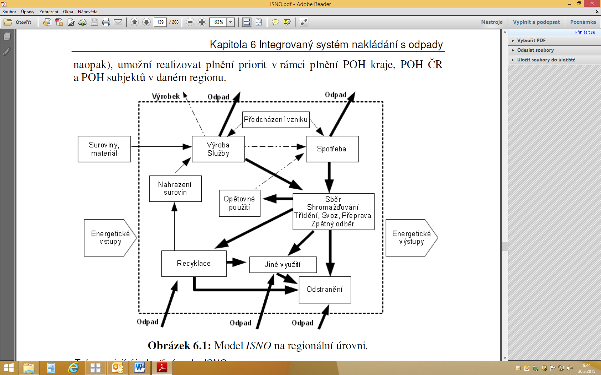
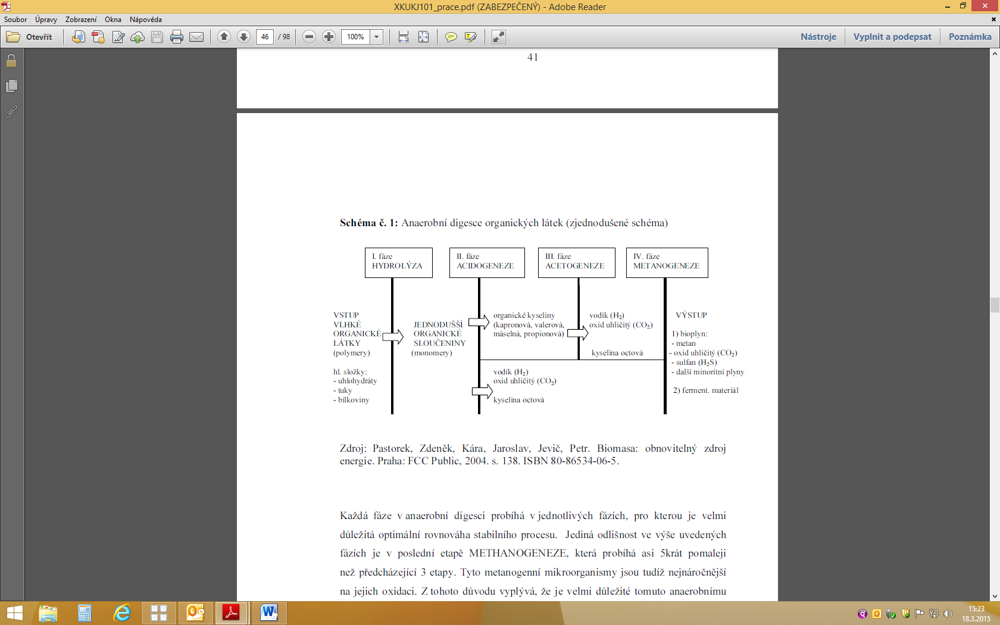
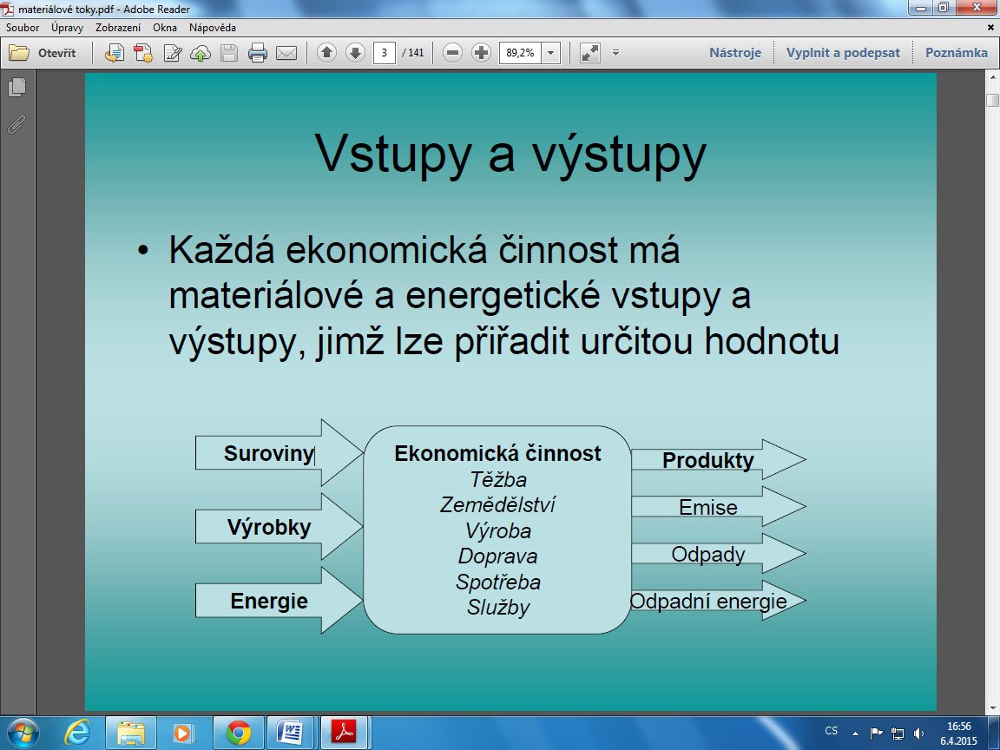

### *1.Definice pojmů v oblasti odpadového hospodářství, trendy odpadového hospodářství v ČR a EU, hierarchie nakládání s odpady, legislativa ČR a EU, nakládání s NO* 

**odpad** – každá movitá věc, které se osoba zbavuje nebo má úmysl nebo
povinnost se jí zbavit

*nebezpečný odpad* - odpad vykazující 1 nebo více nebezpečných vlastností
uvedených

v příloze č. 2 zákona o odpadech 185/2001
(<https://www.zakonyprolidi.cz/cs/2001-185>)

**Seznam nebezpečných vlastností odpadu** *(příloha č. 2 zákona o odpadech)*

| H1   | Výbušnost                                                                                        |
|------|--------------------------------------------------------------------------------------------------|
| H2   | Oxidační schopnost                                                                               |
| H3-A | Vysoká hořlavost                                                                                 |
| H3-B | Hořlavost                                                                                        |
| H4   | Dráždivost                                                                                       |
| H5   | Škodlivost zdraví                                                                                |
| H6   | Toxicita                                                                                         |
| H7   | Karcinogenita                                                                                    |
| H8   | Žíravost                                                                                         |
| H9   | Infekčnost                                                                                       |
| H10  | Teratogenita                                                                                     |
| H11  | Mutagenita                                                                                       |
| H12  | Schopnost uvolňovat vysoce toxické nebo toxické plyny ve styku s vodou, vzduchem nebo kyselinami |
| H13  | Senzibilita                                                                                      |
| H14  | Ekotoxicita                                                                                      |
| H15  | Schopnost uvolňovat nebezpečné látky do životního prostředí při nebo po odstraňování             |

*komunální odpad* - veškerý odpad vznikající na území obce při činnosti
fyzických osob a který je uveden jako komunální odpad v Katalogu odpadů, s
výjimkou odpadů vznikajících u právnických osob nebo fyzická osoba oprávněných
k podnikání (tj. odpad podobný komunál. odpadu)

**původce odpadů**

-   právnická osoba nebo fyzická osoba oprávněná k podnikání, při jejichž
    činnosti vznikají odpady,

-   obec od okamžiku, kdy občané odpad odloží na místě k tomu určeném (obec se
    současně stane vlastníkem tohoto odpadu)

**odpadové hospodářství** - činnost zaměřená na předcházení vzniku odpadů, na
nakládání s odpady a na následnou péči o místa trvalého uložení odpadů a
kontrola těchto činností

**nakládání s odpady** - shromažďování, sběr, výkup, přeprava, doprava,
skladování, úprava, využití a odstranění odpadů

**úprava odpadů** - každá činnost, která vede ke změně chemických, biologických
nebo fyzikálních vlastností odpadů (včetně jejich třídění) za účelem umožnění
nebo usnadnění jejich dopravy, využití, odstraňování nebo za účelem snížení
jejich objemu, případně snížení jejich nebezpečných vlastností

**využití odpadů**

-   činnost, jejímž výsledkem je, že odpad slouží užitečnému účelu tím, že
    nahradí materiály používané ke konkrétnímu účelu nebo že je k tomuto
    konkrétnímu účelu upraven

-   např. využití odpadů způsobem obdobným jako paliva k výrobě energie,
    získání/regenerace rozpouštědel, recyklace/znovuzískání kovů a kovových
    sloučenin a ostatních anorganických materiálů, regenerace kyselin a zásad,
    aplikace do půdy)

*materiálovým využitím odpadů* - způsob využití odpadů jako materiálu k
původnímu nebo jiným účelům – využití odpdů jako druhotných surovin

*energetické využití odpadů*

-   využití odpadu k výrobě energie – elektřiny nebo tepla (obdobným způsobem
    jako paliva)

-   spalování je energetickým využitím pouze tehdy, pokud použitý odpad
    nepotřebuje pro vlastní zapálení podpůrné palivo a vznikající teplo se dále
    využije

**recyklace odpadů** – jakýkoliv způsob využití odpadů, kterým je odpad znovu
zpracován na výrobky a materiály pro původní či jiné účely použití

*odstranění odpadů*

-   činnosti uvedené v příloze 4 zákona (např. skládkování odpadu, hlubinná
    injektáž, ukládání do povrchových nádrží – př. kalové laguny, úprava půdními
    procesy – tj. biologický rozklad odpadů či kalů v půdě, spalování odpadu)

-   takové nakládání s odpady, které vede k trvalému zabránění škodliv.vlivům na
    složky životní prostředí

**skládka**

-   technické zařízení určené k odstraňování odpadů jejich trvalých a řízeným
    uložením na zemi nebo do země

-   zařízení zřízené v souladu se stavebním zákonem

-   provozované na základě rozhodnutí KÚ, kterým byl udělen souhlas
    k provozování zařízení k odstraňování odpadu

-   má 3 na sebe bezprostředně navazující fáze provozu:

1.  fáze: odstraňování odpadů jejich ukládáním na nebo pod úrovní terénu

2.  fáze: využívání odpadů při uzavírání a rekultivaci skládky

3.  fáze: následná péče o skládku po jejím uzavření – min. 30 let

**Odpady vznikají ve všech oblastech lidské činnosti:**

-   odpady z těžby (důlní odvaly, odpady z těžby ropy)

-   odpady z výroby (průmysl, zemědělství, energetika)

-   odpady ze spotřeby (odpady komunální, zdravotnické odpady, odpady z dopravy)

-   odpady vznikající při zpracování odpadů (popílek a škvára ze spalování)

**Rozdělení odpadů**

-   Podle základních oborů lidské činnosti:

-   výrobní (průmyslové, zemědělské, stavební)

-   spotřební (komunální)

-   Podle základních fyzikálních vlastností:

-   plynné

-   kapalné

-   tuhé

-   směsné

-   Podle vlivů na člověka a prostředí:

-   nebezpečné

-   ostatní

**Trendy odpadového hospodářství ČR a EU:**

-   trendy odpadového hospodářství v ČR i EU směřují k šetření primárních zdrojů
    a snižování produkce odpadů – max. možné využívání

-   současný trend nakládání s odpady v ČR celkově odpovídá hierarchii nakládání
    s odpady, ale v oblasti nakládání s komunálními odpady není stavu
    odpovídajícímu této

hierarchii dlouhodobě dosahováno

r. 2009-2012:

-   celková produkce odpadů = stagnující až mírně klesající trend

-   produkce komunálních odpadů = zastaveno (stagnace)

-   podíl využívání odpadů = roste (progrese)

-   podíl odstraněných odpadů skládkováním = klesá (regrese ) =\> stále ale
    skládkování dominuje

-   **celková produkce odpadů v ČR** 30 mil. tun/rok

-   z toho nejvíc stavební a demoliční 55 %

    -   komunální 15 % - tj. cca 5 mil. tun

    -   nebezpečný 4,7%

-   **způsoby nakládání s odpady:** veškerý odpad komunální

-   skládkování 13 % 54 %

-   využívání 79 % 42 %

>   z toho materiálové 75 % 30 %

>   energetické 3,5% 12 %

-   **třídění odpadu** 71 % obyvatel třídí **=\> vytřídí 40 kg/osobu/rok**

>   72% odpadů z obalů je využito

**Hierarchie způsobů nakládání s odpady**

1.  předcházení vzniku odpadů,

2.  příprava k opětovnému použití,

3.  recyklace odpadů,

4.  jiné využití odpadů, například energetické využití,

5.  odstranění odpadů.

**Legislativa ČR:**

-   zákon č. 185/2001 Sb., o odpadech

-   zákon č. 477/2001 Sb., o obalech

-   vyhláška č. 381/2001 Sb., kterou se stanoví Katalog odpadů.....

-   vyhláška č. 382/2001 Sb., o podmínkách použití upravených kalů na zemědělské
    půdě vyhláška č. 383/2001 Sb., o podrobnostech nakládání s odpady

-   vyhláška č. 376/2001 Sb., o hodnocení nebezpečných vlastností odpadů

-   vyhláška č. 294/2005 Sb., o podmínkách ukládání odpadů na skládky a jejich
    využívání na povrchu terénu

-   další vyhlášky: o podrobnostech nakládání s Biologicky rozložitelný odpad ,
    autovraky, elektrozařízeními, Polychlorované bifenyly

**Legislativa EU:**

-   Směrnice č. 2008/98/ES, o odpadech (tzv. rámcová směrnice)

-   Směrnice 1999/31/ES, o skládkách odpadů

-   další: REACH o chemických látkách, nařízení EU stanovující kritéria, kdy
    některé druhy odpadu přestávají být odpadem

**Nakládání s nebezpečnými odpady – NO**

do kategorie nebezpečný se zařadí odpad, který:

1.  vykazuje alespoň jednu z nebezpečných vlastností uvedených v příloze č. 2
    zákona o odpadech

2.  je uveden v Katalogu odpadů jako nebezpečný odpad, nebo

3.  je smíšen nebo znečištěn některým z odpadů uvedených v Katalogu odpadů jako
    nebezpečný

-   s NO může původce nakládat na základě souhlasu příslušného orgánu státní
    správy (shromažďování a přeprava souhlasu nepodléhá)

-   NO se shromažďují dle jednotlivých druhů ve shromažďovacích prostředcích
    (speciální nádoby, kontejnery, obaly, jímky, nádrže) – místo musí být
    označeno identifikačním listem odpadu (kód a název odpadu, zodpovědnou
    osobu, vlastnosti odpadu a bezpečnostní opatření)

### *2.Plány odpadového hospodářství, plány prevence vzniku odpadu* 

**plány odpadového hospodářství**

-   v souladu s principy UR stanoví cíle, zásady a opatření pro nakládání s
    odpady

-   nástroj pro řízení a realizaci dlouhodobé strategie rozvoje odpadové
    hospodářství

-   povinnost zpracovat je uložena zákonem o odpadech

\+ směrnicí o odpadech 2008/98/ES

-   zpracovává se za účelem vytváření podmínek pro předcházení vzniku odpadů,
    nakládání s odpady v souladu s hierarchií nakládání s odpady, dosažení cílů
    stanovených v předpisech odpadového hospodářství

*plány odpadového hospodářství se zpracovává na 3 úrovních:*

**plány odpadového hospodářství ČR** – zpracován na 10 let, tj. na období **2015
– 2024** *(navazuje na předchozí 2003-13)*

-   závazná část je závazným podkladem pro rozhodovací a jiné činnosti
    příslušných

správních úřadů, krajů a obcí v oblasti odpadové hospodářství

-   bude změněn bezprostředně po každé zásadní změně podmínek, na jejichž
    základě byl zpracován *(to platí i pro plány odpadového hospodářství krajů a
    obcí)*

-   závaznou část vyhlašuje vláda **nařízením** – vyšlo ve Sbírce zákonů

-   obsahuje: Program předcházení vzniku odpadů , vyhodnocení stavu odpadové
    hospodářství, závaznou a směrnou část

**plány odpadového hospodářství krajů -** na dobu min. 10 let

-   musí být v souladu se závaznou částí plány odpadového hospodářství ČR

-   kraj jej musí zpracovat a schválit do 18 měsíců od vyhlášení plány
    odpadového hospodářství ČR

-   kraj jej vyhlašuje **obecně závaznou vyhláškou**

**plány odpadového hospodářství obcí** – min. na dobu 5 let

-   zpracovává obec, která produkuje ročně více než 10 t NO nebo 1000 t OO

-   obec zpracuje do 1 roku od vyhlášení plány odpadového hospodářství kraje

*Strategické cíle*

1.  Předcházení vzniku odpadů a snižování měrné produkce odpadů.

2.  Minimalizace nepříznivých účinků vzniku odpadů a nakládání s nimi na lidské
    zdraví a životní prostředí.

3.  Udržitelný rozvoj společnosti a přiblížení se k evropské „recyklační
    společnosti“.

4.  Maximální využívání odpadů jako náhrady primárních zdrojů a přechod na
    oběhové hospodářství.

**Hlavní priority odpadové hospodářství ČR pro období 2015-2024:**

-   Předcházení vzniku odpadů a snižování nebezpečných vlastností odpadů

-   Opětovné použití výrobků s ukončenou životností

-   Kvalitní recyklace a maximální využití odpadů

-   Povinné zavedení tříděného sběru min. pro odpady z: papíru, kovu, plastu,
    skla a biologicky rozložitelného odpadu od r. 2015

-   Energetické využívání odpadů (zejména směsných komunálních odpadů)

-   Zásadní omezení skládkování

-   Optimalizace veškeré činnosti v odpadové hospodářství s ohledem na ochranu
    zdraví lidí a životní prostředí.

-   Zajištění dlouhodobé stability a udržitelnosti odpadové hospodářství
    v regionech i v rámci ČR.

**Zásady pro nakládání s vybranými druhy odpadů:**

*Tabulka 4: Hlovni eile plány odpadového hospodářství CR*

|                                              | Hlavní cil                                                                                                                                                                                                                                                                                                                                                                      |
|----------------------------------------------|---------------------------------------------------------------------------------------------------------------------------------------------------------------------------------------------------------------------------------------------------------------------------------------------------------------------------------------------------------------------------------|
| *Komunální odpad*                            | Do roku 2015 zavést tříděný sběr minimálně pro odpady *z* papíru, plastů, skla a kovů.                                                                                                                                                                                                                                                                                          |
|                                              | Do roku 2020 zvýiit nejméně na 50 % hmotnosti celkovou úroveň přípravy k opětovnému použití a recyklaci alespoň u odpadů z materiálů jako papír, plast, kov, sklo, pocházejících z domácnosti a případné odpady jiného původu, pokud jsou tyto toky odpadů podobné odpadům z domácností.                                                                                        |
| *Směsný komunální odpad*                     | Smésný komunální odpad (po vytřídění materiálově využitelných složek, nebezpečných složek a biologicky rozložitelných odpadů) zejména energeticky využívat v zařízeních ktomu určených v souladu s platnou legislativou.                                                                                                                                                        |
| *Biologicky rozložitelné komunální odpady*   | 5nížit maximální množství biologicky rozložitelných komunálních odpadů (dále jen „BIOLOGICKY ROZLOŽITELNÝ KOMUNÁLNÍ ODPAD") ukládaných na skládky tak, aby podíl této složky činil v roce 2020 nejvíce 35 % hmotnostních z celkového množství BIOLOGICKY ROZLOŽITELNÝ KOMUNÁLNÍ ODPAD vyprodukovaných v roce 1995.                                                              |
| *Stavební a demoliční odpady*                | Zvýiit do roku 2020 nejméně na 70 % hmotnosti míru přípravy k opětovnému použití a recyklaci odpadů a jiných druhů materiálového využiti, včetně zásypů, při nichž jsou jiné materiály nahrazeny odpadem, nikoliv u nebezpečných stavebních a demoličních odpadů s výjimkou v přírodě se vyskytujících materiálů uvedených v Katalogu\* odpadů pod katalogovým číslem 17 05 04. |
| *Nebezpečné odpady*                          | Snižovat měrnou produkci nebezpečných odpadů                                                                                                                                                                                                                                                                                                                                    |
|                                              | Zvyiovat podíl materiálově využitých nebezpečných odpadů                                                                                                                                                                                                                                                                                                                        |
| *Obaly a obalové odpady*                     | Zvýiit celkovou recyklaci obalů na úroveň 70 % do roku 2020                                                                                                                                                                                                                                                                                                                     |
|                                              | Zvýiit celkové využití odpadů z obalů na úroveň 80 % do roku 2020                                                                                                                                                                                                                                                                                                               |
|                                              | Zvýiit recyklaci plastových obalů na úroveň 50 % do roku 2020.                                                                                                                                                                                                                                                                                                                  |
|                                              | Zvýiit recyklaci kovových obalů na úroveň 55 % do roku 2020.                                                                                                                                                                                                                                                                                                                    |
|                                              | Dosáhnout 55 % celkového využití prodejních obalů určených spotřebiteli do roku 2020                                                                                                                                                                                                                                                                                            |
|                                              | Dosáhnout 50 % recyklace prodejních obalů určených spotřebiteli do roku 2020                                                                                                                                                                                                                                                                                                    |
| *Odpadni elektrická a elektronická zařízeni* | Dosahovat vysoké úrovně tříděného sběru odpadních elektrických a elektronických zařízení                                                                                                                                                                                                                                                                                        |
|                                              | Zajistit vysokou míru využití, recyklace a opětovného použití elektroodpadu.                                                                                                                                                                                                                                                                                                    |
| *Odpadni baterie a akumulátory*              | Zvýšit úroveň tříděného sběru odpadních přenosných baterií a akumulátorů.                                                                                                                                                                                                                                                                                                       |
|                                              | Dosahovat vysoké recyklační účinnosti procesů recyklace odpadních baterií a akumulátorů.                                                                                                                                                                                                                                                                                        |
| *Vozidla s ukončenou životnosti*             | Dosahovat vysoké míry využití při zpracování vozidel s ukončenou životnosti (autovraků).                                                                                                                                                                                                                                                                                        |
| *Odpadni pneumatiky*                         | Zvýšit úroveň tříděného sběru odpadních pneumatik.                                                                                                                                                                                                                                                                                                                              |
|                                              | Dosahovat vysoké míry využití při zpracování odpadních pneumatik.                                                                                                                                                                                                                                                                                                               |
| *KalyzČOV*                                   | Podporovat technologie využívání kalů z čistíren komunálních odpadních vod (ČOV).                                                                                                                                                                                                                                                                                               |
| *Odpadni oleje*                              | Zvyšovat materiálové a energetické využití odpadních olejů.                                                                                                                                                                                                                                                                                                                     |
| *Odpady ze zdravotnické a veterinární péče*  | Odděleně shromažďovat odpady ze zdravotnické nebo veterinární péče a odborně s nimi nakládat ve všech typech zdravotnických a veterinárních zařízení.                                                                                                                                                                                                                           |
| *Odpady s obsahem azbestu*                   | Minimalizovat možné negativní účinky při nakládání s odpady s obsahem azbestu na lidské zdraví a životní prostředí.                                                                                                                                                                                                                                                             |
| *Síť zařízení*                               | Vytvořit a udržovat komplexní, přiměřenou a efektivní síť zařízení k nakládání s odpady na území České republiky.                                                                                                                                                                                                                                                               |
| *Přeshraníčni přeprava odpadů*               | Neohrožovat v důsledku přeshraničního pohybu odpadů lidské zdraví a životní prostředí v České republice.                                                                                                                                                                                                                                                                        |
| *Předcházení vzniku odpadu*                  | Koordinovaným a jednotným přístupem vytvořit podmínky k nižší spotřebě prímárních zdrojů a postupnému snižováni produkce odpadů.                                                                                                                                                                                                                                                |

### *3.Oběhové hospodářství, akční plán týkající se odpadového hospodářství* 

Předcházení vzniku odpadů (programy předcházení vzniku odpadů)
==============================================================

-   snížení produkce odpadů = jeden ze závazků, který má ČR jako členská země EU

-   předcházení vzniku odpadů – hlavní priorita v odpadovém hospodářství

-   tento cíl však se nemůže naplnit, pokud se nezaměří na základní princip
    snižování odpadu, a to je prevence vytváření odpadu

**PREVENCE**

-   **vztahuje na všechny druhy odpadu v celém životním cyklu výrobku** *(od
    fáze výrobní, přes fázi spotřební až k zániku výrobku)*

-   spjata s výrobcem i spotřebitelem - oba mají vliv na produkci odpadů i
    předcházení

-   předcházení vzniku odpadu = opatření, přijatá předtím, než se látka,
    materiál nebo výrobek stane odpadem *(omezují množství odpadu - opětovným
    použitím výrobků nebo prodloužením jejich životnosti. Minimalizace vlivu na
    životní prostředí a zdraví + minimalizace obsahu škodlivých látek v
    materiálech a výrobcích)*

-   opětovné využití je také součástí prevence odpadu

-   racionálnější využívání surovin, materiálu a energií s cílem snížit množství
    vytvořených odpadů a ztrát ve výrobě

-   v souvislosti s prevencí se zavádějí opatření **čistší produkce -
    máloodpadové a bezodpadové technologie**

-   důležitá je pro oblast předcházení vzniku odpadů provázanost se Surovinovou
    politikou ČR a její součástí politikou druhotných surovin.

legislativa:

-   **směrnice 2008/1/ES, o integrované prevenci a omezování znečištění**
    *(obecně)*

-   **směrnice č. 98/2008, o odpadech** *(zásadní dokument pro oblast prevence,
    hlavní cíl odpad.politiky = minimalizace nepříznivých účinků vzniku odpadů a
    nakládání s nimi na lidské zdraví a životní prostředí)*

-   hlavní cíle EU byly zapracovány v **plány odpadového hospodářství ČR**
    *(základní strategický cíl = snižování měrné produkce odpadů nezávisle na
    úrovni ekonomického růstu)*

**Státní politika životní prostředí -** zastřešující dokument na národní úrovni
- spatřuje odpovědné nakládání s odpady především v prevenci vzniku a snižování
nebezpečných vlastností odpadu

**Zero Waste - nulový odpad** = nejvyšší možný cíl prevence odpadu

-   v ideálním provedení znamená nevytváření žádného odpadu

-   postupné snižování množství odpadu s ideou úplného vyloučení odpadu

-   cílem je přiblížit se činnosti přírody, jejíž systém funguje na principu
    cyklického toku zdrojů = uzavřený tok surovin s minimálními vstupy a výstupy
    *(v současné výrobě je spotřebováno velké množství surovin, materiálu a
    energie, které je využito jen zčásti, finální výrobky po upotřebení ztrácí
    svou funkci a stávají se odpady, vzniká tak problém nedostatku surovin i
    přebytek odpadu)* -primárních surovin je čím dál tím míň

**Nástroje odpadové hospodářství k předcházení vzniku odpadu**

**Administrativní nástroje**

-   založeny zejména na **zákazech a příkazech**

-   ukotveny v zákonech a právních normách, obecně závazných vyhláškách obcí

o systému shromažďování, sběru, přepravy, třídění, využívání a odstraňování KO

-   vedení evidence odpadů

-   zvyšování odbornosti pracovníků veřejné správy

-   podpora žádoucích aktivit vedoucích k prevenci vzniku odpadů

-   realizační a pilotní projekty

**Ekonomické nástroje**

-   nejvhodnější prostředky environmentální politiky – prioritní

-   zasahují do tržních mechanismů a stimulují subjekty k určitému jednání

-   efektivněji dosahuje stanovených cílů – povzbuzují žádoucí chování, čímž
    vytvářejí větší prostor pro možnou realizaci a hledání nových způsobů řešení

negativní stimulace:

-   daně a poplatky **(**negativní stimulace, cílem je přimět k ekologickému
    chování výrobce i spotřebitele, redistributivní fce – od znečišťovatelů ke
    zlepš. stavu životní prostředí)

pozitivní stimulace:

-   dotace

-   daňová zvýhodnění *(stimul k zavedení ekol.šetrnějších technologií)*

-   podpory, subvence, výhodné půjčky

-   ekologická daň *(cílena na konkrétní výrobky s negativním dopadem na životní
    prostředí)*

-   poplatek za odpad a za ukládání odpadů na skládku

-   zálohy *(zajišťuje zpětný odběr některých výrobků)*

-   pokuty a sankce *(vymáhají administrativní nástroje)*

**Ostatní nástroje**

-   zásadní součástí tohoto typu nástrojů je dobrovolnost

-   dobrovolné dohody

-   ekologické označování výrobků

-   programy SFživotní prostředí, státní a vládní programy *(Programy:
    Ekologicky šetrných výrobků a výrobků s obsahem recyklovaných materiálů,
    EMAS nebo Národní program čistší produkce)*

-   podpora výzkumu a vývoje (projekty zaměřené na rozvoj ochrany životní
    prostředí)

-   zařazení kritérií nakládání s odpady do výběrových řízení a veřejných
    zakázek

-   systém environmentálního vzdělávání, výchovy a osvěty

*Program předcházení vzniku odpadů*

-   je součástí plány odpadového hospodářství

-   jeho vytvoření ukládá členským státům směrnice 2008/98/ES o odpadech

**Hlavní cíl:** koordinovaným a jednotným přístupem vytvořit podmínky k **nižší
spotřebě primárních zdrojů** a postupnému **snižování produkce odpadů**

-   Zavést informační podporu o problematice předcházení vzniku odpadů (i do
    školních osnov, výzkumných programů, osvětových a vzdělávacích aktivit
    v oblasti životní prostředí).

-   Zajistit účinné zapojení státní správy do problematiky předcházení vzniku
    odpadů s cílem postupného snižování množství odpadů při výkonu státní
    správy.

-   Vytvořit podmínky a motivační prvky pro snižování surovinových a
    energetických zdrojů ve výrobních odvětvích a zvyšování využívání druhotných
    surovin (v souladu se Surovinovou politikou ČR a Politikou druhotných
    surovin ČR).

-   Podpořit všemi dostupnými prostředky zavádění nízkoodpadových a inovativních
    technologií šetřící vstupní suroviny a materiály.

-   Podporovat a informovat o dostupných dobrovolných nástrojích (dobrovolné
    dohody, systémy environmentálního řízení, environmentálního značení, čistší
    produkce).

-   Zajistit vhodné legislativní prostředí pro realizaci Program předcházení
    vzniku odpadů v souladu s jednotlivými cíli.

-   Věnovat max. pozornost odpadům z potravin a vytvořit podmínky pro postupné
    snižování těchto odpadů na všech úrovních potravinového cyklu.

-   Vytvořit podmínky ke stabilizaci produkce složek komunálního odpadu,
    nebezpečného odpadu, stavebních odpadů, textilních odpadů a jejich
    následnému snižování.

-   Podporovat využívání servisních a charitativních středisek a organizací za
    účelem prodlužování životnosti a opětovného používání výrobků a materiálů.

-   Zvýšit aktivní úlohu výzkumu, experimentál. vývoje a inovací v oblasti
    podpory Program předcházení vzniku odpadů .

-   Zvýšit účinnost prosazování problematiky předcházení vzniku odpadů
    v aktivitách a činnostech kolektivních systémů a systémů zpětně odebíraných
    výrobků.

-   Podporovat aktivity, jež pomáhají předcházet vzniku odpadů a prodlužovat
    životnost některých výrobků (aktivity charitat. a dobrovolných organizací.
    bazary, secondhandy)

**V Program předcházení vzniku odpadů jsou podrobněji analyzovány a sledovány
následující toky odpadů:**

-   komunální odpad,

-   biologicky rozložitelný odpad,

-   potraviny,

-   výrobky na konci životnosti (obaly, elektro, baterie a akumulátory,
    autovraky)

-   stavební odpady

textil

### *4.Integrované systémy nakládání s odpady (základní pojmy, prvky, cílové skupiny, nástroje, indikátory ISNO).* 

**ISNO**

-   pojetí prosazované EU, UNEP *(Program OSN pro životní prostředí)*

-   současný trend směřuje k integraci poskytovaných služeb jak na regionální
    úrovni, tak na krajské a národní úrovni

-   s odpady by mělo být nakládáno přednostně v místě jejich vzniku = princip
    blízkosti

-   *již v plány odpadového hospodářství 2003-2013 – přílohou Zásady pro
    vytváření jednotné a přiměřené sítě zařízení k nakládání s odpady v ČR –
    jejich součástí je vytvoření ISNO na regionální úrovni a jeho následné
    propojení do celostátní sítě zařízení pro nakládání s odpady*

-   region: např. sdružení/svazek obcí či jedno větší město a jeho bezprostřední
    spádová oblast

*definice ISNO: (v legislativě definice uvedena není)*

-   jednoduchá strategie, která koordinuje sběr, využití a odstranění odpadů v
    celém odpadovém toku, směřující k optimální účinnosti při respektování
    ekonomických a environmentálních požadavků *(dle plány odpadového
    hospodářství)*

-   funkční, environmentálně přijatelný, nákladově efektivní a sociálně
    akceptovatelný systém nakládání s odpady v území, které vyžaduje minimální
    zásahy státu, má minimální nebo žádné negativní vlivy na životní prostředí a
    je schopen zajistit plnění politiky odpadové hospodářství přijaté na daném
    území *(dle projektu ISNO v ČR)*

**Prvky**

-   jednotlivé oddělené procesy nakládání s odpadem včetně výroby a služeb,
    spotřeby a prevence (obdélníky uvnitř čárkované oblasti – tzv. uzly, jež
    jsou navzájem propojené toky odpadů, surovin, výrobků a informací):

1.  **předcházení vzniku, prevence** (tj. opatření přijatá předtím, že se látka,
    materiál nebo výrobek staly odpadem)

2.  **výroba a služby (**tj. navrhování, výroba, distribuce a prodej výrobků,
    poskytování služeb, kde vznikají nechtěné výstupy a produkty, které se
    stanou odpady.

3.  **spotřeba** (tj. užívání výrobků a služeb, při kterém vzniknou odpady)

4.  **sběr odpadu – shromažďování, třídění, svoz a přeprava**

5.  optimalizace sběrných stanovišť

6.  je žádoucí, aby svoz odpadu zajišťovala jedna firma

7.  zpětný odběr výrobků

8.  možnost využití spádového sběrného dvora pro více obcí

9.  **využití odpadu –** příprava k opětovn. použití, materiálové či energetické
    využití

10. **recyklace** – využití výrobků pro tvorbu nových výrobků i nahrazení
    surovin

11. **odstranění odpadu**

*ROC – regionální odpadové centrum – logické seskupení technologií pro nakládání
odpadů na regionální úrovni (třídící linka na separovaný odpad, zpracování
Biologicky rozložitelný odpad , recyklační deponie stavebních a demoličních
odpadů, skládka odpadů*

**Cílové skupiny**

-   **producenti odpadů a obce** (domácnosti jako prvotní producenti odpadu,
    klíčový subjekt – obec, sdružení/svazek obcí

-   **výrobci, prodejci a distributoři** (mohou být zapojeni do zpětného odběru,
    příp.

o něm informují, patří sem i provozovatelé kolektivních systémů)

-   **subjekty zajišťující prevenci vzniku odpadů a další služby** (podniky
    zamezující vzniku odpadů opětovným použitím celých výrobků nebo jejich částí
    – repase výrobků, opravny, bazary, exportéži náhradních dílů…)

-   **subjekty zabývající se nakládání s odpady** (svozové firmy, provozovatelé
    zařízení)

-   **subjekty nepřímo zapojené do nakládání s odpadem** (instituce vykonávající
    kontrolní činnost v odpadové hospodářství – obce, ORP, KÚ, Mživotní
    prostředí, ČIživotní prostředí)

**Nástroje**

**normativní:** legislativa (směrnice EU, zákon o odpadech, obalech, plány
odpadového hospodářství….)

**ekonomické:** poplatky za uložení odpadů

finanční rezerva pro rekultivaci a asanaci skládek

finanční záruka a pojištění

zálohy na vratné obaly

>   pokuty

>   podpory ze SFživotní prostředí, SR, fondů EU

>   daňové úlevy

**informační: -** měl by fungovat webový informační systém pro spolupráci
subjektů v ISNO, informační portál

\- stávající informační systém = ISodpadové hospodářství provozovaný CENIA
(souhrnná data o produkci odpadu)

**organizační a administrativní** – zabezpečení kontroly plnění cílů, zlepšování
logistiky, aktivity k prevenci a omezování vzniku odpadů…

**dobrovolné nástroje:**

-   **regulační** (Místní agenda 21, Národní síť Zdravých měst ČR, Zelená obec,
    Zelená města, Monitoring a targeting)

-   **informační** (metoda LCA, environmentální manažerské účetnictví, env.
    benchmarking, env. reporting, vlastní env. tvrzení)

-   **vzdělávací** (env. vzdělávání, výchova a osvěta

**technologické nástroje:**

-   nejlepší dostupné techniky BAT a BREF dokumenty

**Indikátory** – statistiky, míry nebo parametry pro sledování cílů a změn
v ISNO

-   indikátory plány odpadového hospodářství (např. produkce jednotl. druhů
    odpadů + celková, na obyvatele, podíl využití a odstranění odpadů…)

-   indikátory plány odpadového hospodářství krajů

-   indikátory ISNO na regionální úrovni

### *5.Fyzikální a chemické technologie pro nakládání s odpady, BAT a BREF techniky.* 

**Fyzikální a chemické zpracování odpadů**

*slouží především pro úpravu průmyslových chemických odpadů, zejména
nebezpečných*

Cílem je:

-   umožnění regenerace surovin

-   získání druhotných surovin či energie

-   odstraňování nebo snížení toxicity

-   snížení nebezpečnosti odpadů

-   zmenšení objemu odpadů.

**Fyzikální způsoby zpracování odpadů**

**Separace** (sedimentace, dekantace, rozrážení emulzí, filtrace a flotace) - je
jedním z prvních kroků před dalším zpracováním odpadů

**Adsorpce** (akumulace látky na povrchu jiné látky (vhodné pro organické látky)

**Destilace** (vhodné např. pro rozpouštědla a fenoly ve vodných roztocích)

**Rozpouštědlová extrakce** (např. extrakce fenolů z odpadních vod z rafinerií
ropy)

**Membránová separace (**zahrnuje metody oddělující kontaminant z kapalné fáze:
reverzní osmózu, ultrafiltraci, hyperfiltraci a elektrodialýzu

**Vymrazování (**lze jím oddělit vodu z roztoků - např. pro koncentrování
kyselin a zásad)

**Stripování (**rozpuštěné molekuly jsou transportovány z kapaliny do proudu
plynu nebo páry,

využívá při dekontaminaci podzemní vody)

**Chemické způsoby zpracování odpadů**

-   slouží k detoxikaci tuhých a kapalných chemických odpadů

-   zpravidla je nutné rozpustit je ve vhodných rozpouštědlech, nejvhodnější je
    voda

**Neutralizace kyselých nebo alkalických odpadů** – úprava pH

-   nejběžnější proces chemického zpracování kyselých nebo alkalických odpadů

-   využívá se pro úpravu odpadů, aby se mohly uložit na skládky

**Oxidačně - redukční reakce (**použití např. pro kovonosné odpady)

-   nejběžnější oxidační činidlo je peroxid vodíku, chlornan sodný, ozón

**Hydrolýzní procesy (**např. pro alkoxidy kovů, amidy kovů, karbidy, silany,
hydridy, sulfidy)

**Srážení** (zejména k odstranění toxických kovů z roztoků)

-   rozpuštěné látky se převádějí do nerozpustné formy – kaly

**Elektrolytické procesy**

-   použití pro odstraňování kovů z oplachových vod nebo procesních proudů

-   důvod je jak odstraňování emisí těžkých kovů a odstranění toxických kalů,
    tak možnost získání drahých kovů (např. zlato, kadmium, nikl, měď, zinek)

**Flokulace** (k odstranění čerstvě vzniklých sraženin ze suspenzí

**Dehalogenac**e (nová metoda, uplatňuje se např. na Polychlorované bifenyly)

**Fotolýza (**použití pro odstraňování odpadů obsahující pesticidy,dioxiny a
výbušniny)

**Stabilizace** (přeměna odpadu na nerozpustný produkt nebo jeho zachycení na
vhodný sorbent

-   soubor fyzikálně-chemických a chemických procesů vedoucích k zamezení nebo k
    podstatnému zpomalení vyluhovatelnosti škodlivých látek do prostředí

**Solidifikace** *(zpevňování)*

-   převedení stabilizovaných i původních odpadů do pevné formy s dobrými
    fyzikálními a mechanickými vlastnostmi umožňujícími bezpečný transport do
    místa

-   založena na zpevnění odpadu, který má původně skupenství plynné, kapalné
    nebo pevné *(mezní řešení otázky nakládání s odpady)*

**Solidifikační technologie**

-   **cementace** – odpad se mísí ve vhodném poměru s cementem

>   vhodná pro popílek ze spalovacích procesů a odvodněné kaly z čistíren

-   **bitumenace -** *(zatavení do asfaltu) -* pro fixaci kalů nebo kapalných
    koncentrátů

-   **vitrifikace –** *(zatavení do skla)*

-   **fixace do jiných vhodných materiálů**

**Nejlepší dostupné techniky - BAT – zpracování odpadů**

**BAT** = nejlepší dostupné techniky

**BREF =** referenční dokumenty o nejlepších dostupných technikách BAT

-   EU: definovány ve Směrnici EP a R
    [2010/75/EU](http://eur-lex.europa.eu/LexUriServ/LexUriServ.do?uri=OJ:L:2010:334:0017:0119:CS:PDF),
    o průmyslových emisích

-   ČR: BREF vymezen v zákoně
    č. [76/2002](http://portal.gov.cz/app/zakony/zakonPar.jsp?idBiblio=53139&fulltext=&nr=76~2F2002&part=&name=&rpp=15) Sb.,
    o integrované prevenci a omezování znečištění (IPPC)

-   *Cílem referenčních dokumentů je určit nejlepší dostupné techniky a omezit v
    zemích EU nerovnováhu v úrovni emisí z průmyslových činností*

-   BREF dokumenty jsou zpracovávány pro jednotlivá průmyslová odvětví, odvětví

>   odpadů má 2 dokumenty: zpracování odpadů + spalování odpadů

-   při stanovení nejlepších technik se vychází především z technické úrovně
    zařízení, zejména z pohledu dosahované úrovně emisí do ovzduší, vody a půdy,
    množství produkovaných odpadů, materiálové a energetické náročnosti,
    ekonomických možností provozovatele zařízení při dosažení standardů životní
    prostředí

**BREF o nejlepších dostupných technikách – zpracování odpadů**

-   použité techniky, emise a spotřeby v odvětví zpracování odpadů

-   dokument také stanovuje klíčové otázky životní prostředí pro odvětví
    zpracování odpadů

-   obsahuje stručný technický popis činností a postupů zjištěných v odvětví a
    je doplněn skutečnými emisemi a spotřebami zjištěnými v těchto zařízeních

Konkrétněji dokument popisuje např. přejímku odpadu do zařízení, skladování,
manipulaci, energetické systémy, odběr vzorků, úpravu vedoucí ke snížení emisí
do ovzduší, vody a půdy.

### *6.Trendy nakládání s biologicky rozložitelnými odpady – základní technologie pro využití Biologicky rozložitelný odpad (MBÚ, kompostování, anaerobní technologie), související legislativa.* 

**Biologicky rozložitelný odpad**

-   jakýkoliv odpad schopný aerobního nebo anaerobního rokladu

-   např. odpad ze zahrad a veřejné zeleně, odpad z kuchyní a stravoven, kaly
    z čistíren odpadních vod, odpady ze zemědělství, papír a lepenka

**Biologicky rozložitelný komunální odpad**

-   biologicky rozložitelný odpad obsažený v komunálním odpadu (cca 40%)

*Legislativa:*

ČR

-   zákon č. 185/2001 sb., o odpadech

-   vyhláška č. 341/2008 sb., o podrobnostech nakládání s Biologicky
    rozložitelný odpad

-   nařízení vlády č. 352/2014 Sb., o Plánu odpadového hospodářství ČR pro
    r.2015-2024

EU:

-   směrnice č. 1999/31/ES, o skládkách odpadů *(stanoví cíle pro skládkování
    BIOLOGICKY ROZLOŽITELNÝ KOMUNÁLNÍ ODPAD)*

-   nařízení ES č. 1069/2009, o hygienických pravidlech pro vedlejší produkty
    živočišného původu, které nejsou určeny pro lidskou spotřebu *(pravidla
    v případě zpracování živočišných materiálů)*

**Trendy, cíle a priority v nakládání s Biologicky rozložitelný odpad** =
předcházet vzniku + třídit + využívat

důvody třídění a využívání:

-   třídění, využívání i předcházení vzniku odpadů ukládá zákon

do r. 2020 nutno snížit množství BIOLOGICKY ROZLOŽITELNÝ KOMUNÁLNÍ ODPAD
ukládaného na skládky na 35% *(proti r. 1995)*

-   skládkováním bioodpadu dochází k nežádoucímu anaerobnímu rozkladu a hnití
    organické hmoty =\> tvorba skleníkových plynů a vznik výluhů organických
    látek ohrožujících podzemní vody

-   bioodpad je cenná surovina k dalšímu využití *(živiny a organické látky je
    možno vrátit zpět do přirozeného koloběhu látek = kompost, bioplyn)*

**Základní technologie využití Biologicky rozložitelný odpad**

**MBÚ**

-   mechanicky biologická úprava směsného komunálního odpadu

-   předúprava odpadu - aby se snížil jeho objem a stabilizoval se před uložením
    na skládku (aby se na skládce dále nerozkládal)

-   vytřídění max. množství využitelné složky - vyseparování kovů, lehké frakce
    využitelné jako palivo pomocí sít, magnetických separátorů apod.

-   využívá se převážně v cizině

**KOMprávnická osobaSTOVÁNÍ - AEROBNÍ zpracování – s přístupem vzduchu**

-   biologická metoda využívání Biologicky rozložitelný odpad , kterou se za
    přístupu vzduchu a činností mikroorganismů přeměňuje bioodpad na kompost

*dle velikosti a způsobu kompostování rozeznáváme 3 základní způsoby
kompostování:*

1.  **Domácí kompostování =** předchází vzniku odpadu

-   kompostování na zahradě v různých kompostovacích boxech či kompostérech

1.  **Komunitní kompostování** (provozované skupinou – např. zahr. organizace,
    škola…)

-   systém sběru a shromažďování odpadů z údržby zeleně a zahrad na území obce,
    jejich úprava a následné zpracování a využití kompostu

-   obec může tento systém stanovit obecně závaznou vyhláškou obce jako opatření
    pro předcházení vzniku odpadů

1.  **Komunální kompostování**

-   sběr biodpadu z větší oblasti a větším množství oproti komunitnímu
    kompostování

-   kompostárny provozované většinou již na komerční bázi (např. technické
    služby)

**Indikátory ovlivňující proces kompostování:**

-   **Dostatek kyslíku -** pro zajištění aerobních podmínek

-   **Teplota** – max. aktivita mikroorganismů při teplotě 30-35°C

-   **Vlhkost** – min. obsah vody je 40%

-   **Vhodné pH** – optimální pH 5,5-8,0

-   **Poměr C:N** – vyšší poměr znamená pomalejší rozklad, nižší poměr ztráty
    dusíku (uhlík-dusík)

-   **Velikost částic** – čím menší částice tím větší povrch a rychlejší proces
    fermentace

**Technologie kompostování:**

-   kompostování na volné ploše *(v pásových nebo plošných hromadách)*

-   intenzivní kompostování *(v uzavřeném či polouzavřeném zařízení –
    biofermentory, boxy, žlaby)*

-   kompostování ve vacích *(AgBag kompostování)*

-   vermikompostování *(zpracování bioodpadu pomocí žížal)*

**ANAEROBNÍ zpracování – bez přístupu vzduchu**

-   anaerobní **fermentace (digesce)** je biologický proces rozkladu organické
    hmoty, probíhající bez přístupu vzduchu

-   probíhá samovolně v přírodě (např. v bažinách, na dně jezer) nebo např. na
    skládkách komunálního odpadu

-   řízenou metodou probíhá v **bioplynových stanicích**

**Bioplynové stanice**

-   anaerobní digesce vlhkých organických látek probíhá ve čtyřech fázích –
    metan vzniká až ve fázi poslední

-   pro správnou činnost mikroorganismů musí být zajištěny vhodné životní
    podmínky:

>   optimální pH (6,2 – 7,8)

>   stálá teplota

>   striktně anaerobní prostředí

>   vhodné složení substrátu

*PRODUKTY anaerobní digesce:*

1.  **Bioplyn**

-   hlavní důvod výstavby bioplynových stanic = slouží pro energetické využití

-   produkce bioplynu je závislá na vstupech

-   složení: metan 55-70%

CO2 30-45% *(oxid uhličitý)*

H2S 0,02-0,4% *(sulfan neboli sirovodík)*

-   **Digestát** (hnojivo)

-   stabilní zbytkový materiál - tekutý fugát (odváděn do čistírny odpadních
    vod) + tuhá složka

-   využití jako hnojivo, přídavek do kompostu, inertní pokryv skládkových
    vrstev

**Druhy BIOPLYNOVÉ STANICE:**

*dle zpracovávaných odpadů*

**Zemědělské BIOPLYNOVÉ STANICE -** zpracovávané materiály:

-   živočišné suroviny (např. kejda a hnůj prasat a skotu, drůbeží podstýlka)

-   rostlinné suroviny (např. sláma, senáž, bramborová a řepná nať)

-   cíleně pěstovaná biomasa

**Čistírenské BIOPLYNOVÉ STANICE**

-   zpracovávají pouze kaly z ČOV, žump, septiků + odpadní vodu – jsou nedílnou
    součástí čistíren odpadních vod, slouží pro stabilizaci kalu

**Ostatní BIOPLYNOVÉ STANICE**

-   vstupem mohou být bioodpady

-   pokud BIOPLYNOVÉ STANICE zpracovává vedlejší živočišné produkty, musí splnit
    přísné podmínky stanovené v Nařízení č. 1069/2009 ES (zejména hygienizace)

*Z hlediska reakčních teplot* dělíme na 4 druhy – nejpoužívanější je mezofilní:
30 - 40°C

*Podle obsahu vody ve zpracovaném materiálu a podle technologie*: mokrá
fermentace, suchá fermentace

**Problémy při nakládání s bioodpady:**

-   čistota vstupů *(důležité vytřídit jen bioodpad bez příměsí ostatních složek
    odpadu,*

*ovlivňuje to proces zpracování, kvalitu a způsob použití výsledných produktů)*

-   podíl vstupních surovin (*na kombinaci vstupních surovin a jejich vlhkosti
    záleží biologická rozložitelnost)*

-   kontaminace vstupních surovin (*např. zeleň od komunikací má vysoký obsah
    olova,*

*listy stromů mají vysoký podíl manganu, ve veřejné zeleni psí výkaly –
parazity)*

-   BIOPLYNOVÉ STANICE - vysoké pořizovací náklady na výstavbu, nedůvěra
    v BIOPLYNOVÉ STANICE díky zápachu a tudíž neuskutečnění některých záměrů či
    přerušení některých z nich

### *7.Materiálové toky odpadů. Přístupy ke stanovení kritérií přechodu odpad – výrobek. Posuzování životního cyklu výrobku.* 

**Materiálové toky odpadů**

-   při sledování materiálových toků se na společnost pohlíží jako na živý
    organismus

-   ten ke svému životu čerpá **vstupy** z okolního prostředí (materiály a
    energie), které

se následně přemění na druh energie, který nepotřebuje = **výstupy**, které
vypustí jako odpadní látky zpět do životní prostředí ( odpady, emise do ovzduší,
vody a půdy, jež tvoří zátěž životní prostředí

-   sledováním této zátěže, která je spojená s výrobou a spotřebou, se zabývá
    analýza materiálových toků - ta mapuje toky látek a energií, které vstupují
    do procesu výroby a spotřeby (primární materiály – např. kovy, kámen,
    fosilní paliva) a pak z něj vystupují

-   pomocí analýzy materiálových toků můžeme například vysledovat, jestli je
    hospodářství daného státu schopné v delším období při stejné výrobě a
    spotřebě stále méně zatěžovat životní prostředí, tedy být tzv. udržitelné.

**Přístupy ke stanovení kritérií přechodu odpad – výrobek**

**Odpad přestává být odpadem**, jestliže poté, co byl předmětem některého ze
způsobů využití, splňuje tyto podmínky:

1.  věc se běžně využívá ke konkrétním účelům,

2.  pro věc existuje trh nebo poptávka,

3.  věc splňuje technické požadavky pro konkrétní účely stanovené předpisy nebo
    normami použitelnými na výrobky,

4.  využití věci je v souladu s legisl.a nepovede k nepříznivým dopadům na
    životní prostředí a zdraví

5.  splňuje kritéria předpisů EU, kdy odpad přestává být odpadem (definována pro
    kovový šrot, měděný šrot, skleněné střepy)

**Surovinová politika ČR – Politika druhotných surovin**

-   hlavní cíl: přeměna odpadů na zdroje

-   první dokument ČR, který vytváří strategický rámec pro efektivní využívání
    druhotných surovin – tím by se mělo předcházet vzniku odpadů

**Posuzování životního cyklu výrobku – LCA**

-   metoda posuzování environmentálních aspektů výrobku/služby po celý životní
    cyklus, tj. od získávání surovin nebo tvorby přírodních zdrojů ke konečnému
    odstranění

(těžba/získávání surovin a materiálů – doprava – výroba – užití –
odpad/recyklace)

-   metoda LCA představuje zhodnocení dopadů na životní prostředí související s
    jakoukoliv posuzovanou činností od počátečního dobývání surovin až do chvíle
    odstraňování *(od kolébky do hrobu)*

-   pojetí životního cyklu je charakteristické systematičtějším a komplexnějším
    hodnocením dopadů na životní prostředí

v praxi je tato metoda užitečná, neboť dovoluje např. vybrat mezi alternativními
výrobky takový výrobek, který bude v rámci svého životního cyklu nejméně
poškozovat

### *8.Skládkování odpadů (typy skládek, přijímání odpadů na skládky, technologie ukládání odpadů na skládky, atd.).* 

**skládka**

-   technické zařízení určené k odstraňování odpadů jejich trvalých a řízeným
    uložením na zemi nebo do země

-   zařízení zřízené v souladu se stavebním zákonem

-   provozované na základě rozhodnutí KÚ, kterým byl udělen souhlas
    k provozování zařízení k odstraňování odpadu

-   má 3 na sebe bezprostředně navazující fáze provozu:

>   1. fáze: odstraňování odpadů jejich ukládáním na nebo pod úrovní terénu

>   2. fáze: využívání odpadů při uzavírání a rekultivaci skládky

>   3. fáze: následná péče o skládku po jejím uzavření – min. 30 let

**Typy skládek –** dle technického zabezpečení**:**

**skupina S- odpad inertní – S-OI**

**skupina S- odpad ostatní** – **S-OO**

-   dělí na se podskupiny:

S-OO1 (pro odpady s *nízkým* obsahem organických biologicky rozložitelných látek

S-OO3 (pro odpady *podstatným* obsahem „

*(původně byla i S-OO2 – tato kategorie již zrušena)*

**skupina S-nebezpečný odpad** – **S-NO**

**Přijímání odpadů na skládky**

Odpady lze na skládky jednotlivých skupin přijímat:

-   podle druhu a kategorie odpadů

-   podle jejich skutečných vlastností

-   podle třídy **vyluhovatelnosti** odpadů vodou

-   na základě jejich vzájemné mísitelnosti *(dohromady se nesmí ukládat odpady
    mezi nimiž může dojít k nežádoucím chem. reakcím – např. NE: ke komunálnímu,
    který podléhá biolog. rozkladu, stabilizované, se zvýšeným obsahem kovu,
    kyanidů)*

-   podle **obsahu škodlivin** v sušině

-   a při dodržení dalších podrobností stanovených vyhláškou č. 294/2005 Sb.

-   vlastník odpadu předává s odpadem i **základní popis odpadu** – průvodní
    dokumentace odpadu, obsahuje informace o kvalitě odpadu

-   popílky ze spaloven nebezpečných odpadů jen stabilizované a odděleně

-   uvnitř jedné skládky mohou být zřízeny sektory určené pro oddělené ukládání
    odpadů, srovnatelných svým složením a vlastnostmi

Odpady se na skládky ukládají tak, aby nemohlo dojít k:

-   nežádoucímu úniku škodlivin

-   nežádoucí vzájemné reakci za vzniku škodlivých látek

-   narušení stability, těsnosti a konstrukce skládky

**Seznam odpadů, které je zakázáno ukládat na skládky**

-   odpady podléhající **zpětnému odběru**

-   **kapalný odpad** a odpad, který sedimentací uvolňuje kapalnou fázi

-   **nebezpečné odpady**, které mají některou z následujících nebezpečných
    vlastností: **výbušnost**, vysoká **hořlavost**, **oxidační schopnost**,
    **schopnost uvolňovat vysoce toxické nebo toxické plyny** ve styku s vodou,
    vzduchem nebo kyselinami nebo **infekčnost**

-   odpady, které **prudce reagují při styku s vodou**

-   odpady **chemických a biologických látek vznikajících při výzkumné, vývojové
    nebo výukové činnosti,** jejichž totožnost nebyla zjištěna anebo jsou nové a
    jejichž **účinky** na člověka nebo životní prostředí **nejsou známy**

-   veškerá **léčiva**, návykové látky a přípravky, makovina a prekursory drog

-   biocidy (**pesticidy**)

-   odpady silně **zapáchající**

-   odpady s obsahem plynu **pod tlakem**

-   **radioaktivní** odpady

**Odpady, které lze na skládky ukládat jen za určitých podmínek:**

-   využitelné odpady pouze v souladu s plány odpadového hospodářství *(pouze
    pokud není jejich využití technicky a ekonomicky možné)*

-   **neupravené odpady** *(jen odpady inertní, pro které je úprava technicky
    neproveditelná, a odpady, u nichž nelze ani úpravou snížit jejich objem nebo
    nebezpečné vlastnosti)*

-   pneumatiky pouze jsou-li používány jako technologický materiál pro technické
    zabezpečení a uzavírání skládky v souladu s provozním řádem skládky

-   Biologicky rozložitelný odpad pouze, jedná-li se o biologicky rozložitelné
    složky obsažené v komunálním odpadu BIOLOGICKY ROZLOŽITELNÝ KOMUNÁLNÍ ODPAD
    dle harmonogramu postupného omezování jejich ukládání na skládky

-   odpady perzistentních organických znečišť.látek pouze za podmínek dle
    předpisu EU

**Technologie ukládání odpadů na skládky**

-   pro zhutnění odpadu v tělese skládky se používá nejčastěji čelový kolový
    nakladač – kompaktor (velkou hmotností a tlakem odpad stlačí)

důvod: max.využití kapacity skládky, vytvoření anaerobních podmínek, zvýšení
kapilarity odpadu a tím zvýšení schopnosti vázat vodu, snížení úletu za větru

**skládkování**

-   způsob odstraňování dopadů, při kterém jsou dopady zaváženy plánovitě na
    skládku, hutněny a pravidelně překrývány inertním materiálem

-   jde o nejstarší způsob nakládání s odpady, ale dle nové hierarchie nakládání
    s odpady je skládkování až poslední možností, tedy nejméně žádaná forma
    z těchto důvodů:

-   ztráta zdrojů (půdy a materiálu)

-   emise výluhů vedoucí ke kontaminaci podzemních vod

-   plynné emise jako skleníkové plyny (CO2 a CH4) a těkavé organ.látky (VOC)

**Procesy probíhající ve skládkách:**

-   uvnitř skládky probíhají biologické, chemické a fyzikální procesy, které
    vedou k rozkladu odpadů za vzniku výluhů a plynu = nekontrolovatelný
    biochemický reaktor

-   intenzita rozkladných procesů a jednotlivých fází závisí na koncentraci
    biologicky rozložitelných podílů, vlhkost odpadu, rychlost navážení, stupeň
    zhutnění, hloubka zavážky….

fáze rozkladu biologicky rozložitelných podílů odpadů:

-   **aerobní stádium** (začínají již při svozu odpadů) - organická hmota se
    v přítomnosti vzdušného kyslíku rozkládá aerobními mikroorganismy

-   **anaerobní stádium nemethanogenní** (kyselinotvorná – acidogenní fáze) –
    působením anaerobních mikroorganismů vznikají mastné kyseliny, kyselina
    octová)

-   **anaerobní stadium methanogenní -** dochází ke stabilizovanému stavu, kdy
    je bohatě rozmnožena kultura methanogenních mikroorganismů, produkty
    acidogenní fáze jsou zpracovány na konečné plynné produkty CO2 (oxid
    uhličitý) a CH4 (metan)

**vybavení skládky**

-   těsnící systém oddělující skládku od okolního prostředí *(materiály těsnění
    dna – jíly, geosyntetické materiály, geomembrány..)*

-   drenážní systém a zařízení na odstraňování odvedených škodlivin

-   zařízení na jímání skládkového plynu (S-OO3)

-   zařízení na příjem, hutnění (kompaktor) a úpravu odpadů

-   monitorovací systém – (*sledování výluhových vod, skládkového plynu,
    stability a neporušení těsnění)*

**Emise ze skládek:**

**plynné – skládkový plyn**

-   tvoří ho metan (2/3), oxid uhličitý (1/3) a další stopové prvky

-   negativní vliv: lokální (nebezpečí výbuchu při nahromadění, vliv na porost,
    zápach)

globální (skleníkový efekt, narušení ozonové vrstvy)

-   skládkový plyn lze využít pro energetické účely jako palivo nebo výrobu
    elektřiny

**kapalné - skládkový výluh**

-   může ohrozit **podzemní vody**, horninové prostředí, faunu a flóru v okolí
    skládky

-   skládkový výluh = silně znečištěná odpadní voda, může být znečištěna
    biologicky (choroboplodné bakterie) i chemicky (těžké kovy, dusičnany, ...)

-   vzniká průchodem vod tělesem skládky (voda obsažená v odpadech + dešťová)

-   nejčastěji se výluhy odčerpávají a odvádí z tělesa skládky do ČOV

### *9.Spalování a energetické využití odpadů, BAT a BREF techniky (spalovací proces, základní principy technologií pro spalování a energetické využití odpadů).* 

**Energetické využití odpadů**

-   využití odpadu k výrobě energie obdobným způsobem jako paliva – *vzniká
    elektřina či teplo (nebo oboje současně, pokud je spalovna vybavena
    kogenerační jednotkou)*

-   **spalování** je energetickým využitím pouze tehdy, pokud použitý odpad
    nepotřebuje pro vlastní zapálení podpůrné palivo a vznikající teplo se dále
    využije

-   bez přídavného paliva lze spalovat odpady, jejichž výhřevnost dosahuje
    nejméně 5.000 kJ/kg *(to ovlivňuje obsah hořlavin, popelovin a vody ve
    spalovaných odpadech - pokud se jedná o obtížně spalitelné odpady, u nichž
    se musí používat přídavné palivo – pak už nejde o energetické využívání
    odpadů ale o zařízení k odstraňování odpadů)*

*Cíle spalování odpadů:*

-   zmenšit jejich objem *(původní hmotnost se redukuje na 25 % a objem na 10%)*

-   odstranit jejich nebezpečné vlastnosti tak, že se nebezpečné látky zachytí
    v pevném produktu spalování

-   získat energii obsaženou v odpadech

**Spalování:**

-   vysokoteplotní oxidace spalitelných materiálů obsažených v odpadech

-   *odpady použitelné pro spalování:* tekuté kaly, tuhé i plynné odpady

**Spalovny komunálního odpadu: 3**

-   ZEVO Praha, Malešice *(kapacita 310 t/rok)*

-   SAKO Brno *(224 t/rok)*

-   TERMIZO Liberec *(100 t/rok)*

**Spalovny nebezpečného odpadu: 22**

-   slouží většinou pro spalování průmyslových a zdravotnických odpadů (často
    provozovány přímo průmyslovým podnikem nebo nemocnicí)

-   v Ústeckém kraji např. spalovna v Ústí n.L. v Trmicích

**Spalovací proces:**

-   odpady se zahřívají stykem s horkými spalinami nebo předehřátým vzduchem a
    sáláním ze stěn pece, přitom postupně probíhají následující pochody:

-   **předsoušení odpadu:** zahřátím dojde k odpaření vody z odpadu

-   **odplynění odpadů**: dochází k reakcím mezi kyslíkem a uhlíkatými látkami v
    odpadech, které se začínají odplyňovat a oxidovat, přitom se vyvíjejí
    hořlavé plyny

-   **zapálení odpadů:** prolíná se s 2. fází, vznikají ložiska hoření

-   **spalování plynů:** lože odpadů povrchově prohořívá a dalším přiváděním
    spalovaného

vzduchu vznikají nová ložiska hoření; plyny se vyvíjejí ve větší hloubce,
procházejí vyšší

vrstvou odpadů a nad nimi vyhořívají (teplota 500 – 800°C)

-   **hoření:** hoří plyny i vzniklý polokoks, teplota se zvyšuje až na cca
    1000°C, v loži vzniká

popel a škvára

-   **vyhořívání a odvádění tepla:** plyny i polokoks dále vyhořívají a vzniká
    velké množství tepla, které je nutno odvádět (teplota až 1200°C, musí se
    udržovat pod bodem tání popela vysokým přebytkem vzduchu), z roštu odcházejí
    škvára, popel a nespálené zbytky odpadů

**Produkty spalování odpadů**

*plynné - spaliny:*

vodní pára, oxid uhličitý, dusík, kyslík ve vzduchu

>   \+ v malém množství další látky

*pevné*:

hlavní zbytek: **popel (škvára) nebo struska** (*využití: stavební materiál -
přísada do betonu)*

>   **popílek:** *(pro uložení na skládku je nutná jeho stabilizace)*

>   **+ prach z filtrů**

>   **+ zbytek z čištění spalin (např. chlorid sodný a chlorid vápenatý)** *–*

>   *množství a složení závisí na typu spalovaného odpadu a použité technologie*

>   **+ kaly ze zpracování odpadních vod**

**Druhy technologií:**

základní typy:

**• roštové pece** - vhodné pro spalování tuhých (zejména **komunálních**)
odpadů

• **rotační pece -** vhodné pro průmyslové odpady – pastovité, kapalné a kaly

další: **fluidní pece, etážové pece, muflové pece**

*charakteristické rysy spalovacích technologií:*

-   odpady musí být **převedeny do plynné fáze** před tím, než jsou zapáleny a
    hoří

-   ze zařízení vycházejí **2 typy tuhých odpadních materiálů** – popílek a
    struska

-   tuhé odpady je někdy třeba **upravit** před vstupem do spalovací komory -
    mletím, odvodněním, směšováním či jinou technologií.

**Čištění spalin** – zpravidla třístupňové:

1.  stupeň - pomocí filtrů se odstraní pevné částice (popílek) a částečně kovy

2.  stupeň - ochlazením spalin se odstraní kyselé plyny

3.  stupeň – odstranění organických látek – zejména dioxinů a furanů

**Další způsoby tepelného zpracování odpadů:**

-   **spoluspalování odpadu –** využití odpadů v zařízeních, která nebyla
    původně určena specielně pro zpracování odpadů – např. v cementárnách

-   **pyrolýza a zplyňování** - technologie s omezeným přístupem kyslíku

>   \- procesy, při nichž dochází k tepelné přeměně uhlíkatých materiálů na
>   produkty, jako jsou plyn, dehet, koks a popel

*BAT a BREF techniky – viz. otázka č. 5*

### *10.Materiálové využití odpadů, systémy třídění a sběru vybraných komodit odpadů, zpětný odběr výrobků. Nakládání s obaly.*

**využití odpadů**

-   činnost, jejímž výsledkem je, že odpad slouží užitečnému účelu tím, že
    nahradí materiály používané ke konkrétnímu účelu nebo že je k tomuto
    konkrétnímu účelu upraven

-   na straně vstupů šetří přírodní zdroje (energii a suroviny)

-   na straně výstupů snižuje ekologické zátěže prostředí škodlivinami (využití
    odpad nekončí na skládce)

**Materiálové využití odpadů –** využití odpadů jako druhotných surovin

jedná se např. o tyto způsoby využití:

-   **recyklace odpadů** – jakýkoliv způsob využití odpadů, kterým je odpad
    znovu zpracován na výrobky a materiály pro původní či jiné účely použití

>   \- např. recyklační linky stavebních odpadů, recyklace plastů, kovů,
>   papíru...

-   **regenerace –** např. rozpouštědel, kyselin, olejů

>   \- pomocí zpracovatelských technik se získá materiál s původními vlastnostmi

-   **recyklace/znovuzískávní** kovů a kovových sloučenin a ostatních
    anorganických materiálů

-   **aplikace do půdy** - např. využití čistírenských kalů (po provedení
    hygienizace slouží jako hnojivo v půdě)

**Recyklace papíru** - možno recyklovat 5 -7x

-   slisovaný sběrový papír poslouží k výrobě nového papíru – např. novinový
    papír, sešity, lepenkové krabice, obaly na vajíčka, toaletní papír apod.

**Recyklace skla** – možno recyklovat donekonečna

-   vytříděné sklo se rozdrtí a přidá do výchozí směsi k výrobě nového skla

-   nejčastěji se takto vyrábí lahve na minerálky a pivo a jiné skleněné výrobky

**Recyklace plastů**

-   každý druh plastů se zpracovává jinou technologií, protože má odlišné
    složení a vlastnosti

-   z PET láhví se vyrábějí vlákna používaná jako výplň zimních bund a spacáků
    nebo se přidávají do tzv. zátěžových koberců

-   z fólií (sáčků a tašek) se opět vyrábějí fólie a různé pytle, např. na
    odpady

-   ze směsi plastů zahradní nábytek, zatravňovací dlažba, protihlukové stěny u
    dálnic

**Recyklace kovů**

-   kovové odpady ze sběren druhotných surovin či sběrných dvorů putují do hutí,
    kde se přetaví (potraviny a barvy, které v nich zbyly, shoří při teplotě
    1700 °C)  
    Z plechovek může vzniknout znovu stejný výrobek, nebo třeba různé odlitky,
    tyče …

**Systém třídění a sběru vybraných komodit (druhů) odpadů**

-   obec je povinna zajistit místa pro oddělené soustřeďování složek komunálního
    odpadu, a to minimálně nebezpečných odpadů, papíru, plastů, skla, kovů a
    biologicky rozložitelných odpadů

-   systém shromažďování, třídění a sběru komunálního odpadu svým občanům obec
    stanovuje obecně závaznou vyhlášku – za to může vybírat poplatek

-   sběr vybraných druhů odpadů je prováděn prostřednictvím:

-   sběrných dvorů (většinou pro nebezpečný odpad a odpad objemný, který se
    nevejde do běžných nádob na odpad – některé obce odebírají i stavební odpad)

-   separačních nádob na jednotlivé druhy odpadu *(nemusí být nádoba – je možný
    i pytlový způsob sběru – např. pro BIOLOGICKY ROZLOŽITELNÝ KOMUNÁLNÍ ODPAD
    nebo plasty)*

**Zpětný odběr některých výrobků**

-   zpětný odběr použitých výrobků je stanoven pro výrobky, které mají v sobě
    látky, jenž by nesprávným odstraňováním ohrožovaly životní prostředí a
    zdraví a zároveň z toho důvodu, že se tyto výrobky dají recyklovat a dále
    využívat

-   *povinnost* zajistit zpětný odběr použitých výrobků má ten, *kdo výrobky
    uvádí na trh*

(toto zajistí prostřednictvím prodejce, který je povinen buď použité výrobky
v prodejně odebrat, nebo informovat o způsobu zajištění zpětného odběru)

-   povinnost zpětného odběru se vztahuje na:

-   **oleje** (jiné než surové minerální oleje a surové oleje z živičných
    nerostů)

>   *(ten, kdo prodává nové oleje většinou odebírá i ty použité)*

-   **pneumatiky** *(zpětný odběr moc v praxi nefunguje, proto mnoho pneumatik
    končí na černých skládkách, zpětně odebírají většinou jen velké
    pneuservisy)*

-   **baterie a akumulátory**

-   **výbojky a zářivky**

-   **elektrozařízení pocházející z domácností**

>   (u baterií a akumulátorů, výbojek a zářivek a elektrozařízení je zpětný
>   odběr zajištěn prostřednictvím kolektivních systémů (např. Ekobat,
>   Elektrowin, Asekol, Ekolamp…), které podobně jako EKOKOM u obalů zajišťují
>   za toho, kdy výrobky uvádí na trh plnění povinnosti zpětného odběru)

-   výrobky podléhající zpětnému odběru se odevzdávají *bezplatně na místa
    zpětného odběru* – např. - prodejny prodávající ty druhy výrobků

\- sběrné dvory

\- dále se mohou odkládat do speciálních kontejnerů či nádob na elektrozařízení
či baterie *(umístěné po městě, v prodejnách, školách či veřejných budovách)*

**Nakládání s obaly** –

-   **obalem** je výrobek zhotovený z materiálu jakékoli povahy určený
    k pojmutí, ochraně, manipulaci, dodávce či prezentaci výrobků určených
    spotřebiteli nebo jinému konečnému uživateli (obal prodejní, skupinový,
    přepravní)

-   **podle zákona o obalech č. 477/2001 Sb.** mají ti, co obaly nebo balené
    výrobky uvádějí na trh nebo do oběhu *(dovozci, plniči, distributoři a
    maloobchody)* povinnost zajištění zpětného odběru a využití odpadů z obalů

-   **podle zákona o obcích č. 185/2001 Sb.,** mají obce povinnost třídit
    komunální odpad a využívat jeho využitelné složky, jejichž součástí jsou
    také použité obaly *(papír, plast, sklo, nápojový karton, kov)*

### EKOKOM = autorizovaná obalová společnost ([Systém sběru a recyklace obalových odpadů](https://www.google.cz/url?sa=t&rct=j&q=&esrc=s&source=web&cd=1&cad=rja&uact=8&ved=0ahUKEwiW4YWMpOLTAhUhApoKHb6wDzkQFggnMAA&url=http%3A%2F%2Fwww.ekokom.cz%2F&usg=AFQjCNFFyJnZcM_-_AoOtqtJM7TcNOd6hA&sig2=4wZvuWgEG30KIV5uCS5eUw))

-   fyzicky s obalovým odpadem nenakládá - zajišťuje plnění povinností zpětného
    odběru a využití odpadů z obalů, podílí se zejména na financování nákladů
    s tím spojených

-   ti, co uvádějí obaly na trh, platí EKOKOMu (dle množství obalů)

-   EKOKOM platí obcím na systém sběru, třídění a využití obalového odpadu

-   **zelený bod** – ochranná známka umisťovaná na obalech – znamená, že výrobce
    zaplatil EKOKOMu za recyklaci
