### *1.Globální problémy životního prostředí- (početní růst lidstva, vyčerpávání přírodních zdrojů, ohrožování genofondu a přirozených společenstev, znečištění prostředí, desertifikace, destrukce ozónové vrstvy, nárůst skleníkového efektu a jeho důsledky).* 

**Růst lidské populace:**

**pozitiva:** lepší lékařské péče, delší život, menší úmrtnost

**negativa:** růst populace zejména v chudých zemích (7,3 miliard.), ubývání
potravin, nerovnoměrnost zdrojů a bohatství, přesun populace z venkova do měst,
v městě koncentrace průmyslu a vznik obchodních a politických cente, slumy bez
zázemí na okrajích měst – sociální problémy, přelidnění měst, nedostatečné
městské služby (skládky, znečištěná voda), rozšiřování zastavěné plochy

**Vyčerpání přírodních zdrojů:** lidstvo spotřebovává mnohem více zdrojů než
může, hrozba energetické krize

**nevyčerpatelných:** sluneční, větná a vodní energie, vzduch, krajina

**vyčerpatelných:** půda, nerostné suroviny ( fosilní paliva ), suroviny (
náhrada stavebního kamene za železo ), pitná voda, dřevo

**Ohrožování genofondu a přirozených společenstev**

**rostlinstva:** přirozené biotopy ( lesy, mokřady, bažiny), zemědělství,
meliorace, eroze, mnoho hnojiva pesticidů – eutrofizace vod , kyselé deště,
emise, skleníkový efekt, ničení ozónové vrstvy

**živočichů**: potrava, znečištění vod, mokřadů a tůní, nadměrný lov ryb,
vymírání a obchod rostlinami a živočichy ( CITES – úmluva o ohrožených volně
žijících druzích )

**Znečištění prostředí**

**vzduch:** prach, pevné částice, přízemní ozón, problémy s prašností,oxid
dusíku, kyselé deště,větší UV záření, skleníkový efekt ( zdroje: spalování a
požáry, těžba, metan ze skládek a zvířat, prach z krajin bez - vznik pouští,
požáry)

**voda:** eutrofizace - znečištění vod hnojivy a pesticidy, méně kyslíku – hynou
ryby, v mořích odpady a ropa, radioaktivní odpad

**půda: průmysl, ekologické záteže, skládky (průmyslová hnojiva, pesticidy),**
kontaminanty – polyaromatické uhlovodíky, těžké kovy - olovo, rtuť, kadminum

ropné uhlovodíky se mohou do půdy dostat z protržených podzemních nádrží a
narušeného potrubí

**Desertifikace:** vznik pouští,příroda se nedokáže obnovit( kácení, pasení
dobytka, nadměrný odběr vody do zemědělství)

**Ozonová vrstva**

*ozónová vrstva*: chrání planetu před UV

*ozónová díra:* méně ozonu v ozónové vrstvě, zachytí méně záření z vesmíru (
*Montrealský protokol* – snížit spotřebu látek poškozujících ozonovou vrstvu);
zdrojem jsou **freony:** chladiva, nosiče aerosolů, expanzní plyny,rozpouštědla;
**halony:** hasicí prostředky

**Nárůst skleníkového efektu**

*Skleníkový efekt:* přirozený proces udržující na zemi stálou teplotu

*Skleníkové plyny*: pohlcují tepelné záření (vodní pára - nejúčinnější, oxid
uhličitý, metan, ozón, oxid dusný

*Skleníkový efekt podporuje:* spalování, devastace lesů, zemědělství, hnití na
skládkách

*Důsledky:* tání ledovců, vyšší hladina moří, katastrofy z počasí, delší
vegetační období, desertifikace, změny proudění oceánů (Kjótský protokol –
protokol k snižování emisí skleníkových plynů)

### 2. *Regionální problémy životního prostředí - životní prostředí ČR v podmínkách EU, indikátory hodnocení stavu životního prostředí, sektory a životní prostředí. Aktivity ČR a EU v prioritních oblastech.* 

**Regionální problémy ŽP**

*Moravskoslezský kraj:* těžký průmysl (hutě, ocelárny), černé uhlí, hutě,
ocelárny, spotřeba elektrické energie, ovzduší, prach, smog (i lokální
topeniště) - emise oxid uhelnatý, oxid siřičitý, tuhé znečištění

*Ústecký kraj*: hnědé uhlí, energetický průmysl - uhelné teplárny a elektrárny,
odsíření - bývaly vysoké emise oxidu siřičitého ( ničené lesy Krušných hor)

*Středočeský kraj:* spotřeba elektrické energie, těžba stavebních surovin v ČR
(kámen,štěrk, písek, vápenec), doprava – oxid dusíku, prach a tuhé částice

*Aglomerace Praha a Brno:* doprava, hluk, oxid dusíku, prach a tuhé částice
dusíku

*Nejméně emisí z průmyslu:* Praha, Liberecko, Vysočina, Zlínský a
Královehradecký kraj

*Nejvíce amoniaku:* zemědělské kraje - Jihočeský, Jihomoravský, Vysočina

**ŽP ČR v podmínkách EU**

*Ovzduší - pozitiva:* méně skleníkových plynů, emisí (díky BAT-nejlepším
dostupným technologiím a EU)

*Ovzduší – negativa:* mnoho přízemního ozonu a benzo pyrenu (66% obyvatel), více
prachu PM10 a PM2,5 ( 30% obyvatel, nejvíce lokální topeniště)

*Voda – pozitiva:* menší znečištění povrchové vody a spotřeba vody

*Voda – negativa:* zemědělství (hnojiva, acidifikace eutrofizace vod)

*Příroda + půda + biodiverzita - pozitiva:* více evropsky významných druhů
živočichů a rostlin a evropsky významných typů přírodních stanovišť v ČR a
listnatých lesů; méně hnojiv, více ploch TTP (trvale travní porost), více
rekultivací

*Příroda + půda + biodiverzita – negativa:* zástavba, doprava, zábor ZPF
(zemědělsko půdní fond) – méně orné půdy, fragmentace krajiny, zánik biotopů,
méně retence a infiltrace vody – povodně

*Zpracovatelský průmysl – pozitiva:* průmyslové zóny, regenerace brownfields
(zanedbaná nemovitost, pozemek), nižší emisí v ovzduší, nižší energetická
náročnost průmyslu (využití BAT)

*Zpracovatelský průmysl – negativa:* zábor zemědělské půdy (více staveb na
„zelené louce“)

*Zemědělství – pozitiva:* integrované hospodaření, Díky rostoucí finanční
podpoře se dlouhodobě zvyšuje podíl ekologicky obhospodařované zemědělské půdy i
počet ekofarem. V roce 2013 bylo ekologicky obhospodařováno cca 11,7 % celkové
výměry ZPF. Rozvíjí se i trh s biopotravinami.

*Zemědělství – negativa:* více hnojiv a pesticidy, velkoplošné hospodaření (
brání volnému šíření rostlin a živočichů)

*Doprava – pozitiva:* menší emise a spotřeba automobilů

*Doprava – negativa:* více emisí z pneumatik a PAU (polycyklických aromatických
uhlovodíků), více dopravy, zábor půdy pro silnice, více hluku ve městech

*Odpady – pozitiva:* méně odpadů, více recyklace, více třídění odpadů

*Odpady – negativa:* více komunálního odpadu na skládkách, méně separace BRKO
([Biologicky rozložitelný komunální
odpad](https://cs.wikipedia.org/wiki/Biologicky_rozlo%C5%BEiteln%C3%BD_odpad)),
méně energetického využití odpadů ku skládkám

*Výdaje na ochranu ŽP – pozitiva:* více investic do ŽP V ČR, oproti průměru EU

*Výdaje na ochranu ŽP – negativa:* menší čerpání dotací z největšího zdroje OPŽP
(operační program životní prostředí), méně odváděných poplatků za znečišťování
ŽP

*Další pozitiva:* nižší energetická náročnost hospodářství ČR, nižší spotřeba
domácností, vyšší význam jaderné energie a z obnovitelných zdrojů

**Indikátory ŽP –** ukazatele pro posouzení stavu, trendu a vývoje ŽP (i
mezinárodně)

**Klíčové indikátory:** klima, ovzduší, VH (vodní hospodářství) a jakost vod,
biodiverzita, lesy a krajiny, odpady a mater.toky, zdraví, financování ochrany
ŽP, zemědělství, energetika a průmysl, doprava ( *tato témata jsou součástí
Státní politiky ŽP a také politiky EU)*

**Aktivity EU v prioritních oblastech**

Prioritními oblasti EU: klima (Kjótský + Montrealský protokol), příroda a
biodiverzita, žp a zdraví, udržitelné přírodní zdroje a využívání odpadů

### *3. Ovzduší a životní prostředí- inventarizace zdrojů znečišťování ovzduší, monitorování stavu znečištění ovzduší. Emise (skleníkových plynů, okyselujících látek, prekurzorů ozonu, primárních částic a prekurzorů sekundárních částic) imise, druhy limitů. Rizikové kontaminanty. Ovzduší a klima v evropském kontextu.* 

Ochranu ovzduší řeší **Zákon č.201/2012 Sb. o ochraně ovzduší** *stanoví:* práva
a povinnosti osob a působnost správních úřadů při ochraně ovzduší, podmínky pro
snižování vypouštěných znečišťujících látek, nástroje ke snižování látek
ovlivňujících klimatický systém Země

*nevztahuje se* na vnášení radionuklidů do ŽP → atomový zákon

**Znečišťování, znečištění ovzduší**

*emise* -  látky znečišťující ovzduší (u zdroje největší koncentrace)

*imise* – emise, která se dostala do styku s životním prostředím

*Problém emisí*: dýchání

*Problém imisí:* ekosystémy – ničí lesy (koncentrace SO2 – kyselé deště)

*Podle místa vzniku:*

**primární** – úlet znečištění; **sekundární -** chemické změny

**Inventarizace zdrojů znečišťování**

REZZO - **Registr emisních zdrojů znečištění ovzduší** (70. leta v ČSR) – plná
inventarizace zdrojů znečišťování ovzduší a evidence druhů a množství emisí
znečišťujících látek do ovzduší (ze spalovacích procesů, i technologií s únikem
škodlivých látek)

REZZO dělíme na 4 kategorie: *REZZO 1* – průmyslové - \> 5 MW (spalovny,
teplárny) , *REZZO 2* – komunální - 0,2 - 5 MW ( kotelny, lakovny) , *REZZO 3* –
lokální - \< 0,2 MW (vytápění) , *REZZO 4* – mobilní (auta)

**Monitorování stavu znečištění**

ČHMÚ spravuje na základě pověření MŽP *státní imisní síť (Praha,regionální
pobočky ČHMÚ)* , která zajišťuje sledování kvality ovzduší. Hlavně
*automatizované a manuální stanice*( ozonu, oxidu dusičitého, prachových částic
PM10 a jemných prachových částic PM2,5, benzenu, oxidu uhelnatého a oxidu
siřičitého, těžkých kovů, těkavých organických látek, polyaromatických
uhlovodíků a perzistentních organických látek

*Druhy limitů*

emisní, imisní – v legislativě, depoziční (uložení) – mimo legislativu

**Emisní limit** - maximální znečištění **vypouštěné** do ovzduší, hodnoty
emisních limitů stanoveny prováděcím předpisem, nebo Krajský úřad, který zdroj
povoluje (**SOx, NOx, tuhé znečišťující látky, CO),** plnění emisních limitů se
zjišťuje měřením

**Imisní limit** - maximální znečištění **obsažené** ve venkovním ovzduší.
Hodnoty imisních limitů a povolený počet jejich překročení za kalendářní rok
jsou uvedeny **v příloze č. 1** k *zákonu (imisní limit pro ochranu zdraví lidí
– oxid siřičitý, prachové částice velikosti PM10 a PM2,5, oxid dusičitý, olovo,
oxid uhelnatý, benzen a imisní limit pro ochranu ekosystémů a vegetace – oxid
siřičitý, oxidy dusíku, troposférický ozon)*

**Depoziční limit** -maximální znečištění **usazené po dopadu na jednotku
plochy** zemského povrchu **za jednotku času**, hodnoty nejsou zatím
legislativně stanoveny

**Smogové situace a prahové hodnoty**

Smogová situace - mimořádná úroveň znečištění ovzduší znečišťující látkou
*překročila prahovou hodnotu* uvedenou **v příloze č.6** zákona o ochraně
ovzduší, Vznik i ukončení smogové situace vyhlašuje MŽP ve veřejně přístupném
informačním systému a v médiích

**Informativní prahová hodnota** (Při překročení se jen upozorňuje o horších
rozptylové podmínek):

oxid siřičitý – průměrně 250 ng/m3/hodina

oxid dusičitý - průměrně 200 ng/m3/hodina

prachové částice velikosti PM10 průměrně 100 ng/m3 /den

**Regulační prahová hodnota** (Při překročení největší znečišťovatelé omezí
výrobu, obyvatelé nejezdí auty):

oxid siřičitý – hodinová průměrná koncentrace 500 ng/m3

oxid dusičitý – hodinová průměrná koncentrace 400 ng/m3

prachové částice velikosti PM10 – dvacetičtyřhodinová průměrná koncentrace 150
ng/m3

**Poplatky za znečišťování ovzduší**

Platí provozovatelé zdrojů znečišťování podle množství a druhu vypouštěných
znečišťujících látek *(poplatky platí provozovatelé, kterým vyjde poplatek vyšší
jak 50 000,- Kč).* O výši poplatku rozhoduje KÚ (krajský úřad), výběr a vymáhání
zajišťuje celní úřad – příjmem SFŽP ( státní fond životního prostředí)

*Zpoplatněné látky*: tuhé znečišťující látky, oxid siřičitý, oxidy dusíku,
těkavé organické látky

**Pokuty za porušení zákona**

*Přestupky*: pro fyzické osoby

*Správní delikty právnických a podnikajících fyzických osob:* dtto jako u FO
(pálení škodlivin v ohništi, nemá povolení, spaluje neschválené, nemá technicky
způsobilý spalovací zdroj

*Pokuty řeší*: Přestupky - ORP (obec s rozšířenou působností), správní delikty
buď ORP nebo ČIŽP (ten, kdo se o tom dozví dřív); *Pokuty vybírá a vymáhá:*
celní úřad

*Pokuty příjem:* ORP - připadá do rozpočtu obce, jež jí uložil; ČIŽP - dělí na
poloviny – 1/2 připadá do rozpočtu obce, kde se tak stalo a 1/2 SFŽP.

**Vysvětlivky:**

PM10 – prach 10 ng/m3; PM2,5 – prach 2,5 ng/m3 (pronikají až do plic); NOx –
všeobecně oxidy dusíku; CO – oxid uhelnatý; SOx – všeobecně oxidy síry; SO2 –
oxid siřičitý

### *4. Voda a životní prostředí- ochranná pásma vodních zdrojů, jakost vody v tocích. Spotřeba vody v ČR. Vodní hospodářství a jakost vody v evropském kontextu.* 

Voda na 71 % povrchu Země (slaná 97 %, sladká jen 3 %) - 69 % v
[ledovcích](http://cs.wikipedia.org/wiki/Ledovec), 30 % podzemní, 1 % povrchová
a atmosférická)

*Voda, význam:* biologický - součástí rostlin a živočichů, zdravotní -
hygienické požadavky a potřeby člověka

estetický - součástí životního prostředí, kulturní a rekreační , mikroklimatický
význam (místní)

*Legislativa*: o vodách, vodovodech a kanalizacích, ochraně veřejného zdraví,
povodních, nitrátová směrnice=( předpis Evropské unie (91/676/EHS), vytvořený
pro ochranu vod před znečištěním dusičnany ze zemědělství, zranitelné oblasti
dusičnany, tedy ZOD)

**zákon o vodách** – č. 254/2001 Sb, chránit povrchové a podzemní vody (právní
vztah k vodě a její využívání), podmínky pro hospodárné využívání vodních zdrojů
a zlepšení jakosti vod, podmínky pro snižování nepříznivých účinků povodní a
sucha a zajistit bezpečnost vodních děl v souladu s právem ES, poplatky
v souladu se zásadou „znečišťovatel platí“

**Nakládání s vodami**

*obecné nakládání s povrchovými vodami*

běžný odběr, **usměrňování odtoku za účelem ochrany nemovitostí**

*zvláštní nakládání s povrchovými nebo pozemními vodami*

**povolení vodoprávního úřadu** (vypouštění odpadních vod, odběry vod)

**CHOPAV** - chráněná oblast přirozené akumulace vod (*území velkoplošná, změny
jen pokud neomezí využití)*

území, které svými přírodními podmínky tvoří významnou akumulaci vod, nařízením
vyhlašuje **vláda**, zákaz činnosti ovlivňujících retenci ( zmenšování a
odvodňování lesních pozemků, těžit rašelinu, nerosty,ukládat radioaktivní odpady
)

**Ochranná pásma vodních zdrojů** (*území maloplošná)*

území sloužící k ochraně vydatnosti, jakosti a zdravotní nezávadnosti zdrojů
podzemní nebo povrchových vod, zdroj pitné vody, rozhodnutím vyhlašuje
**vodoprávní úřad**

**ochranná pásma I. stupně -** v bezprostředním okolí (jímacího nebo odběrného
zařízení)

**ochranná pásma II. stupně -** v územích stanovených vodoprávním úřadem
(ochrana jakosti a nezávadnosti)

**Citlivé oblasti:**

povrchová vod v okolí vypouštění komunálních odpadních vod, nebo zdroje pitné
vody vyžadují vyšší míru ochrany, **vláda nařízením** – v celé ČR

*ochranná opatření:* ukazatelé a přísnějších hodnoty

**Zranitelné oblasti:**

území znečištěná dusičnany ze zemědělství, **vláda nařízením** , upravuje
hnojiva, střídá plodiny a eliminuje erozi

**Minimálním zůstatkovým průtokem**

ještě umožňuje obecné nakládání s povrchovými vodami a ekologické funkce vodního
toku, stanovuje **vodoprávní úřad** v povolení k nakládání s vodami - stanoví
místo a četnost měření průtoku

**Odpadní vody.**

kanalizační, nebo zhoršená lidskou činností (změněné fyzikální nebo chemické
vlastnosti

*Druhy:*

**splaškové** (obec) - domácností, škol, úřadů, živnostníci, zdravotnictví -
zapáchající šedá nebo šedohnědá, s organickými a anorganickými látkami

**průmyslové** (výroba) - s organickými (potravinářský průmysl), anorganickými
(skláři) a chemickými (hemie) látkami

**srážkové** (dešťové)

*Vypouštění odpadních vod* do toků a jeho povolování řeší **vodoprávní úřad** -
v zákoně o vodách a nařízení vlády č. 61/2003 Sb., o ukazatelích a hodnotách
přípustného znečištění povrchových vod a odpadních vod

**Závadné látky**

ohrožují jakost povrchových nebo podzemních vod

ten kdo zachází se závadnými látkami nesmí dopustit vniknutí do povrchových nebo
podzemních vod

v příloze zákona o vodách je seznam: **zvlášť nebezpečných látek** (např.
organohalogenové sloučeniny, rtuť, kadmium); **nebezpečných látek** (biocidy –
látka proti organismům, kyanidy, fluoridy, ostatní těžké kovy)

**havarijní plán**

zpracovávají ho uživatelé závadných látek (obsahuje seznam závadných látek,
cesty ohrožení, opatření při havárii, odstraňování následků, zásady bezpečnosti)
- schvaluje **vodoprávní úřad**, předkládá se **správci vodního toku**

**Havárie**

mimořádné závažné ohrožení jakosti povrchových nebo podzemních vod (ropnými
látkami, nebezpečnými a radioaktivími látkami), v CHOPAV (velkoplošná) nebo v
ochranných pásmech vodních zdrojů (maloplošná)

případy technických poruch a závad zachycovacích, skladovacích, dopravních
zařízení

původce havárie je povinen činit bezprostřední opatření k odstraňování příčin a
následků havárie - přitom se řídí havarijním plánem

**Třídy jakosti povrchových vod**

V ČR se jakost vody klasifikuje dle ČSN 757221 – zařazení do 5 tříd čistoty
podle jakosti:

**I. třída** – neznečištěná voda

voda nebyla ovlivněna lidskou činností, ukazatele nepřesahují hodnoty
odpovídající

přirozenému prostředí v tocích

vhodná pro všechna užití, vč. pitné vody, po úpravách mechanického a bakteriol.
čištění

**II. třída** - čistá voda

voda byla minimálně ovlivněna lidskou činností

vhodná pro většinu užití, vč. pitné vody. Po úpravách jako I. třída.

**III. třída** - znečištěná voda

vodu ve zvýšené míře ovlivnila lidská činnost tak, že její využití je částečně
omezeno

před jejím použitím je nutné vodu přečistit pomocí odkalovacích filtrů

**IV. třída** - silně znečištěná voda

vodu značně ovlivnila lidská činnost

její použití je možné jen pro omezené účely a její úprava je velmi finančně
nákladná

**V. třída** - velmi silně znečištěná voda

voda byla ovlivněna lidskou činností natolik, že se nehodí pro žádný účel

její úprava je ekonomicky neřešitelná

**BSK -** biochemická spotřeba kyslíku

hmotnostní koncentrace rozpuštěného kyslíku v roztoku, která byla spotřebována
během biochemické oxidace organických látek za stanovených podmínek

slouží jako je nepřímý ukazatel množství biologicky rozložitelných organ. látek
ve vodě

**BSK5** – parametr kvality vody

množství kyslíku v **mg/l,** které se spotřebuje na biochemický rozklad
organických látek ve vodě za **5 dní při 20° C** ( ve tmě - k vyloučení
fotosyntézy)

určuje míru organického (biologicky odbouratelného) znečištění vod (běžné
znečištění odpadní vody z domácností je 300-400 mg/l, po vyčištění je to 30
mg/l)

**CHSK -** chemická spotřeba kyslíku

množství kyslíku, které se spotřebuje za stanovených podmínek **k oxidaci všech
látek** (nejen těch, které mohou být odbourány biologickou cestou) silným
oxidačním činidlem

pro stanovení míry znečištění vody organickými a oxidovatelnými anorganickými
látkami.

### *5. Půda a životní prostředí - (úrodnost půd, nejvýše přípustné obsahy škodlivin v půdě, eroze (vodní větrná). Fragmentace krajiny. Půda a krajina v evropském kontextu.* 

**Půda**

tvoří nejsvrchnější vrstvu [zemské
kůry](http://cs.wikipedia.org/wiki/Zemsk%C3%A1_k%C5%AFra), je prostoupená
[vodou](http://cs.wikipedia.org/wiki/Voda),
[vzduchem](http://cs.wikipedia.org/wiki/Vzduch) a
[organismy](http://cs.wikipedia.org/wiki/Organismus), vzniká v procesu
[pedogeneze](http://cs.wikipedia.org/wiki/Pedogeneze) pod vlivem vnějších
faktorů a [času](http://cs.wikipedia.org/wiki/%C4%8Cas) a je produktem přeměn
minerálních a organických [látek](http://cs.wikipedia.org/wiki/L%C3%A1tka)

ucelený zákon, který by řešil problematiku půd, neexistuje, je pouze zákon č.
334/1992 Sb., o ochraně zemědělského půdního fondu (ZPF) – ten byl v letošním
roce novelizován *(zpřísněny podmínky odnětí zemědělské půdy)*

**Povinnosti při nakládání s půdou:**

pro ochranu zemědělské půdy je zakázáno:

znečišťovat zemědělskou půdu *(neboť by mohlo dojít k narušení celého potravního
řetězce a znečištění vodních zdrojů)*

ohrožovat zemědělskou půdu erozí

užívat zemědělskou půdu k nezemědělským účelům bez souhlasu s odnětím ze ZPF

poškozovat fyzikální, chemické nebo biologické vlastnosti zemědělské půdy jejím
zhutňováním, zamokřováním, vysoušením, překrýváním nebo narušováním erozí.

**Úrodnost půd**

je velmi důležitou půdní vlastností

je výsledkem vzájemného působení mnoha faktorů – fyzikálních, chemických,
biologických a klimatických

je to schopnost půdy poskytovat rostlinám podmínky pro růst a vývoj

půdní úrodnost je ovlivněna složením a vývojem půdy, klimatickými podmínkami,
zemědělskými zásahy *(zpracování půdy, hnojení, vápnění, používání přípravků na
ochranu rostlin)*, technickými opatřeními
([melioracemi](http://vitejtenazemi.cz/cenia/index.php?p=slovnik&id=200) a
závlahami) a způsobem využití půdy

úrodnost půdy **zlepšuje**:

dostatečné množství živin, zejména
[dusíku](http://cs.wikipedia.org/wiki/Dus%C3%ADk),
[fosforu](http://cs.wikipedia.org/wiki/Fosfor) a
[draslíku](http://cs.wikipedia.org/wiki/Drasl%C3%ADk)

obsah [stopových prvků](http://cs.wikipedia.org/wiki/Stopov%C3%BD_prvek) (např.
[bor](http://cs.wikipedia.org/wiki/Bor_(prvek)),
[chlór](http://cs.wikipedia.org/wiki/Chlor),
[kobalt](http://cs.wikipedia.org/wiki/Kobalt),
[měď](http://cs.wikipedia.org/wiki/M%C4%9B%C4%8F),
[železo](http://cs.wikipedia.org/wiki/%C5%BDelezo),
[mangan](http://cs.wikipedia.org/wiki/Mangan),
[hořčík](http://cs.wikipedia.org/wiki/Ho%C5%99%C4%8D%C3%ADk))

dostatek [humusu](http://cs.wikipedia.org/wiki/Humus) (zlepšuje strukturu půdy a
má schopnost zadržet vláhu)

[pH](http://cs.wikipedia.org/wiki/PH) v rozmezí 6,0 do 6,8

dobrá struktura půdy - provzdušnění

p[ůdní
mikroorganismy](http://cs.wikipedia.org/w/index.php?title=P%C5%AFdn%C3%AD_mikroorganismus&action=edit&redlink=1),
které podporují růst rostlin (např. [symbiotičtí vazači
dusíku](http://cs.wikipedia.org/wiki/Biologick%C3%A1_fixace_dus%C3%ADku))

úrodnost půdy je **zhoršována**:
[erozí](http://vitejtenazemi.cz/cenia/index.php?p=eroze_pudy&site=puda),
[zhutněním](http://vitejtenazemi.cz/cenia/index.php?p=zhutneni_pudy&site=puda),
[kontaminací](http://vitejtenazemi.cz/cenia/index.php?p=kontaminace_pudy&site=puda)
a [dalšími
degradacemi](http://vitejtenazemi.cz/cenia/index.php?p=degradace_pudy&site=puda)

úrodnost půdy přirozeně ovlivňuje i její [výnosnost a
cenu](http://vitejtenazemi.cz/cenia/index.php?p=jakou_ma_puda_hodnotu&site=puda)
a její bonitu, resp. stupeň ochrany [zemědělského půdního
fondu](http://vitejtenazemi.cz/cenia/index.php?p=zabory_pudy&site=puda).

**Odnětí půdy:**

k odnětí půdy ze ZPF pro nezemědělské účely je třeba souhlasu orgánu ochrany ZPF

**dočasné odnětí** – v případech, kdy bude půda po ukončení účelu odnětí
rekultivována podle schváleného plánu rekultivace tak, aby mohla být vrácena do
ZPF

**trvalé odnětí** - spočívá v nevratně změně, která znemožní její zemědělské
využití

za odnětí půdy ze ZPF se platí **odvody** – při trvalé odnětí jednorázově, při
dočasném každoročně, jejich výše vychází ze základní ceny podle BPEJ stanovené
oceňovací vyhláškou a dalších faktorů stanovených zákonem o ZP

**Nejvýše přípustný obsah škodlivin v půdě**

kromě kyselých látek ovlivňujících reakci půdy a její chemismus se do půd
dostávají z různých zdrojů další látky, které na půdu působí škodlivě až
toxicky, zejména pak v potravním řetězci

jejich zdrojem mohou být buď geogenní obsah půdotvorných substrátů nebo různé
emise, kyselé deště, průmyslová a hospodářská hnojiva, prostředky na ochrany
rostlin, odpady (čistírenské kaly a sedimenty říčních toků) ….

**nejvýše přípustný obsah škodlivin v půdě** je stanoven vyhláškou č. 13/1994 o
podrobnostech ochrany ZPF jako:

maximálně přípustné hodnoty obsahu rizikových prvků v půdách podle způsobu
analytického zjišťování *(uvedeny v příloze č. 1 vyhlášky)*

**rizikové prvky** jsou např. arsen, kadmium, chrom, měď, kobalt, rtuť,
beryllium…

hodnoty přípustného znečištění půdy některými škodlivými látkami ohrožujícími
existenci živých organismů *(uveden v příloze č. 2 vyhlášky)*

**škodlivé látky** jsou např.: bor, brom, kyanidy, sulfáty, aromatické
uhlovodíky, chlorované uhlovodíky, pesticidy

**Meliorace**

technické zemědělské úpravy pozemků – opatření k obnovení, udržení nebo zvýšení
úrodnosti půdy

velký dopad na krajinu v rámci melioračních opatření mělo velkoplošné odvodnění
koncem 19. století (z důvodů nejprve protipovodňových, později také pro
rozšíření plochy zemědělské půdy jako důraz na potravinovou soběstačnost) a dále
pak meliorace v 70. a 80. letech 20. století, kdy mnohdy rozumné důvody chyběly

Druhy meliorací:

odvodňovací (k odvodnění zamokřené půdy)

závlahové (pro půdy s nedostatkem vláhy)

půdoochranné (účelem je zabránit větrné a vodné erozi)

lesnické (vysazování melioračních dřevin)

vodohospodářské (zabránění povodním a zlepšení vodních poměrů)

**Změna kultury:**

*změnu nezemědělské půdy na zemědělskou* lze provést na základě rozhodnutí
vydaného v řízení o využití území (dle stavebního zákona)

*změny využití zemědělské půdy:*

**trvalý travní porost** (louka, pastvina) **lze změnit na ornou půdu** jen se
souhlasem orgánu ochrany ZPF – uděluje se na základě posouzení fyzikálních nebo
biologických vlastností zemědělské půdy, rizik ohrožení zemědělské půdy erozí

*orgán ochrany ZPF může uložit změnu kultury* v případě, že dochází k:

eroznímu ohrožení území

zhoršení čistoty a jakosti vody ve vodních tocích

ohrožení zdrojů pitné vody

porušování práv a povinností na úseku ochrany přírody a krajiny

poškozování okolních pozemků nebo příznivých vlastností půdy

ohrožení potravinového řetězce

*vlastník může požádat o úhradu vzniklých nákladů či ztrát – z SFŽP*

**BPEJ – bonitovaná půdně-ekologická jednotka**

pětimístný číselný kód sloužící pro rozlišení [klimatických
podmínek](http://cs.wikipedia.org/w/index.php?title=Klimatick%C3%A9_podm%C3%ADnky&action=edit&redlink=1)
[zemědělsky využívané
půdy](http://cs.wikipedia.org/wiki/Zem%C4%9Bd%C4%9Blsk%C3%BD_p%C5%AFdn%C3%AD_fond)

slouží pro účely oceňování pozemků, určení eroze (využití znalosti hlavní půdní
jednotky), při návrhu nových pozemků v rámci pozemkových úprav

1. číslo – klimatický region (0-9)

2. a 3. číslo – hlavní půdní jednotku (78)

4. číslo – svažitost a expozice ke světovým stranám

5. číslo – skeletovitost a hloubka půdního profilu

**Vliv zásahů do vodního režimu půd:**

Vliv na vodní režim půd má zejména zemědělské hospodaření (zhutňování půdy,
nadměrné odvodnění, negativní vliv závlah, nevhodný vegetační pokryv) a vliv
průmyslu a dopravy (zastavění)

**zhutňování půdy**

proces, ke kterému dochází při intenzivním hospodaření

jde v podstatě o stlačování
[půdy](http://cs.wikipedia.org/wiki/P%C5%AFda_(pedologie)), snižování její
[retenční](http://cs.wikipedia.org/wiki/Retence) schopnosti (schopnost zadržovat
[vodu](http://cs.wikipedia.org/w/index.php?title=P%C5%AFdn%C3%AD_voda&action=edit&redlink=1))
a její [úrodnosti](http://cs.wikipedia.org/wiki/%C3%9Arodnost)

je způsobeno především těžkou technikou (traktory, kombajny)

obranou bývá [orba](http://cs.wikipedia.org/wiki/Orba) a [kypření
půdy](http://cs.wikipedia.org/w/index.php?title=Kyp%C5%99en%C3%AD_p%C5%AFd&action=edit&redlink=1),
naopak [bezorební
hospodaření](http://cs.wikipedia.org/w/index.php?title=Bezorebn%C3%AD_hospoda%C5%99en%C3%AD&action=edit&redlink=1)
ke zhutnění přispívá

**Hlavní nástroje k dosažení cílů Rámcové směrnice pro vodní politiku ES**

**Rámcová směrnice** - Směrnice EP a R 2000/60/EC – platnost od 22.12.2000

stanoví rámec pro činnost ES v oblasti vodní politiky – pro ochranu všech vod
(vč. vnitrozemských povrchových, brakických, pobřežních a podzemních vod)

hlavní cíle:

zabránit dalšímu zhoršování stavu vodních útvarů, chránit zlepšit stav vodních
ekosystémů i stav suchozemských ekosystémů a mokřadů

podpořit trvale udržitelné užívání vod

zvýšená ochrana a zlepšení vodního prostředí - opatřeními pro cílené snižování a
postupné odstranění vypouštění, emisí a úniků prioritních nebezpečných látek

snižování znečištění podzemních vod

zmírnění účinků povodní a období sucha

**Plánování v oblasti vod = hlavní nástroj k dosažení cílů rámcové směrnice**

činnost, kterou zajišťuje stát a implementuje tak požadavky Rámcové směrnice
2000/60/ES k dosažení „*dobrého stavu vod“* v termínech 2015, 2021, 2027

představuje přípravu, implementaci a revizi. Je to 6ti-letý proces, který tvoří
následující hlavní části:

analýza charakteristik oblastí povodí a zhodnoc.vlivů a dopadů lidské činnosti,

stanovení environmentálních cílů,

návrh a realizace programů monitoringu,

návrh a realizace programů opatření.

prostřednictvím tzv. **Plánů povodí** a v nich obsažených programech opatření

**Plány hlavních povodí** ČR (Labe, Morava, Odra) – *schvaluje vláda*

*rámcové* cíle pro hospodaření s vodami, udržitelné užívání

**Plány oblastí povodí** *(schvalují kraje)*

(Horního a Středního Labe, Horní Vltavy, Berounky, Dolní Vltavy, Ohře a Dolního
Labe, Odry, Moravy a Dyje)

obsahují *konkrétní* cíle rozvedením cílů rámcových, např. zvětšování rozsahu
přirozených koryt vodních toků a nákladů na ně

je podkladem pro výkon veřejné správy ve věcech územního plánování, rozhodování
a povolování staveb

Cílem plánování je vymezení a sladění zájmů:

ochrana vod jako složky životního prostředí

ochrana před povodněmi a dalšími škodlivými účinky vod

trvale udržitelné užívání vodních zdrojů

hospodaření s vodou, především pro zásobení pitnou vodou

### *6. Ekologické zemědělství - podíl ekologicky obhospodařované zemědělské půdy. Charakteristiky ekologického zemědělství. Ekologické zemědělství v evropském kontextu.* 

<http://www.mzp.cz/web/edice.nsf/e26dd68a7c931e61c1256fbe0033a4ee/881b04bf9fd9a9b3c1256fc000501538?OpenDocument>

<http://agroekologie.zf.jcu.cz/upload/PK%20dokumenty/PRSZ%20-%20distancni/Literatura/Z_kladn_%20principy%20EZ.pdf>

<http://www.bio-info.cz/zpravy/ekologicke-zemedelstvi-v-cr>

<http://eagri.cz/public/web/mze/zemedelstvi/ekologicke-zemedelstvi/>

<http://eagri.cz/public/web/file/442986/Akcni_plan_CR_pro_rozvoj_EZ_Czech_Action_Plan_for_Development_of_OF.pdf>

Ekologické zemědělství je moderní formou obhospodařování půdy bez používání
chemických vstupů s nepříznivými dopady na životní prostředí, zdraví lidí a
zdraví hospodářských zvířat. Tento zemědělský produkční systém, který umožňuje
produkovat vysoce kvalitní potraviny, je nedílnou součástí agrární politiky ČR.
Kromě produkce biopotravin přispívá ekologické zemědělství;lepším životním
podmínkám chovaných zvířat, k\&nbsp;ochraně životního prostředí a ke zvýšení
biodiverzity prostředí.

Ministerstvo zemědělství je garantem dodržování pravidel pro ekologické
zemědělství, a to jak národní, tak evropské legislativy. MZe dále administruje
státní podporu pro ekologické zemědělce v rámci národních dotací a Programu
rozvoje venkova a má v gesci realizaci strategických dokumentů rozvoje
ekologického zemědělství. Formou finančních podpor se aktivně se podílí na
podpoře marketingu, osvěty a vzdělávání.

Ekologické zemědělství se v ČR rozvíjí tradičně v méně příznivých horských a
podhorských oblastech. Zhruba polovina těchto ploch je dnes obhospodařována
ekologicky.Největší podíl na celkové výměře v EZ (91%) dosáhly plochy trvale
travních porostů (TTP) v roce 2003 a od té doby stagnují okolo 82 až
83%.Největší plochy ekologicky obhospodařované půdy se nacházejí v pohraničních
hornatých okresech Jihočeského, Plzeňského, Moravskoslezského, Karlovarského a
Ústeckého kraje.Dle podílu výměry celkové ekologické půdy na celkové zemědělské
půdě vede s 44 % Karlovarský kraj. Podobně jako v předchozích letech následuje
kraj Liberecký, Moravskoslezský, Zlínský a Ústecký. V produkčních oblastech
zůstává zastoupení EZ od 3 do 5 %.Největší absolutní nárůst ploch v EZ
v posledních letech zaznamenali kraj Plzeňský a Jihočeský, nejrychleji rostla
plocha na Vysočině a ve Středočeském kraji.V počtu ekologických farem vede
dlouhodobě kraj Jihočeský (přes 500 ekofarem).V současné době je ekologickými
zemědělci v ČR obhospodařováno více jak 40 % všech trvalých travních porostů,
téměř 2 % orné půdy, přes 10 % ploch trvalých kultur (15 % sadů, 5 % vinic
a 0,1 % chmelnic). V rámci trvalých kultur dominují sady (86 %), z nichž asi 60
% tvoří sady tzv. intenzivní, tedy produkční a 40 % sady extenzivní. Vinice
přesáhly v letech 2012 až 2014 výměru 1 000 ha, v roce 2015 spadly na 978
hektarů a tvoří 14 % trvalých kultur. Chmelnice stagnují na 10  hektarech.

Účelem zemědělského hospodaření je cílevědomá činnost v krajině sloužící

k uspokojování individuálních i společenských potřeb.

Primárním cílem hospodaření zemědělce v krajině je produkce potravin a dalších

materiálů využitelných pro technické a energetické účely (vlákna pro oblečení,
stavební

materiály, otop aj.). Systémy zemědělského hospodaření jsou převážně dosud
chápány

jako produkční systémy. Kromě produkční funkce plní zemědělství i řadu funkcí

mimoprodukčních. Z hlediska agroekosystému je nejvýznamnější mimoprodukční
funkcí

péče o veřejné statky (půda, voda, vzduch), ale i funkce kulturní, sociální
rekreativní aj.

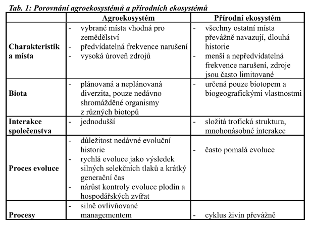

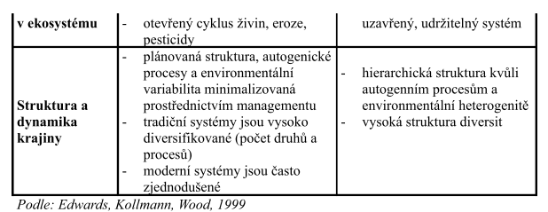

Charakteristika zemědělských produkčních systémů

Na úrovni podniku lze charakterizovat zemědělské produkční systémy podle

různých hledisek.

\- podle zaměření produkce - specializované

\- pěstování rostlin

\- chov zvířat

\- lov a sběr

\- syntetická produkce

\- smíšené

\- podle stupně uspokojení potřeb - samozásobitelské

\- komerční

\- podle kontinuity produkce - permanentní

\- nepermanentní

\- podle vně využité techniky - mechanizované

\- nemechanizované

\- podle množství energomateriálových toků - intenzivní

\- extenzivní

V našich podmínkách se historicky vyvinuly smíšené, komerčně zaměřené,

permanentní, mechanizované systémy s vysokými energomateriálovými vstupy, tedy

intenzivní způsoby hospodaření.

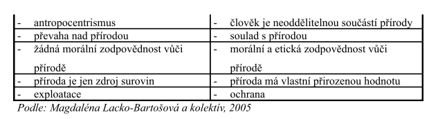

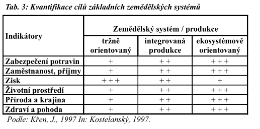

Významnými intenzifikačními faktory jsou koncentrace (zvyšování hustoty

produkčních organismů v čase a prostoru), stupňované využívání ploch (patrové
stáje),

vysoký stupeň mechanizace až automatizace technologických postupů, intenzivní
využití

dodatkových chemických vstupů, energií i informací.

Vnějším projevem intenzivního agroekosystému je vysoký stupeň urbanizace

krajiny (potlačení přirozené vegetace, ostré ohraničení pozemků, množství
zastavěných

ploch ap.). Na úrovni pole je typickým rysem uniformita porostu, velmi nízká

biodiverzita, neschopnost autoregulace, často nízká adaptace k prostředí, trvalé

narušování půdního prostředí a nutnost regulace dalšími materiálovými a
energetickými

vstupy.

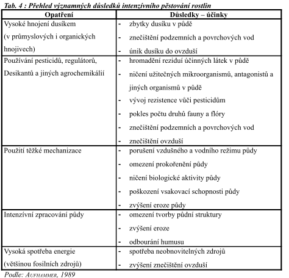

Vysoce intenzivní, mechanizovaný systém se stává zcela závislý na vnějších

vstupech (stroje, paliva, chemikálie, osiva). Vysoké vnější energomateriálové
vstupy silně

snižují energetickou efektivitu systémů. Poměr vložené energie k energii získané
úrodou

je až 3:1 zatímco u neintenzivních systémů 1:20 i více. U vysoce intenzivních

mechanizovaných systémů živočišné produkce je energetická bilance ještě méně

efektivní. Tyto systémy však bývají krátkodobě velmi efektivní z hlediska
produktivity

práce a využití plochy.Naproti tomu extenzivní (low input) systémy hospodaření
mají téměř opačnou

charakteristiku. Jejich hlavním rysem je redukce vnějších vstupů. Extenzivní

agroekosystémy se vyznačují nižšími energetickými a materiálovými toky na
jednotku

plochy a obvykle vyšší diversitou, menší potřebou vnějších zásahů a větší
stabilitou i

autoregulační schopností. Významně přispívají k zachování přírodních zdrojů.
Nižší

vstupy lze kompenzovat kvalitním managementem. Snížení vstupů obvykle přináší

snížení produkční schopnosti agroekosystému. Nižší výnosy však mohou být
realizovány

při nižších nákladech bez významného snížení zisku.

Ve světě převládají na 80 % plochy extenzivní a na 20 % plochy intenzivní

systémy hospodaření.

2.2 Členění agroekosystémů dle intenzity vstupů

Podle objemu energetických a materiálových vstupů a úrovně řízení jejich toků

rozlišujeme v současné době zemědělství do tří základních systémů.

Konvenční zemědělství

Konvenční zemědělství je obecně rozšířený název pro systém hospodaření

převládající v průmyslově vyspělých zemích. Je charakteristický vyšší intenzitou

hospodaření i použitím vyšších energetických a materiálových vstupů za účelem

maximalizace produkce resp. momentálního ekonomického efektu.

Formami konvenčního zemědělství jsou precizní, programové zemědělství,

skleníková, hydroponická produkce aj.

Integrované zemědělství

Integrované zemědělství je přechodný systém mezi konvenčním a ekologickým

zemědělstvím. Agrochemické vstupy používá na základě diagnostických metod
výživného

stavu rostlin a okamžité zásoby živin v půdě. Aplikaci pesticidů omezuje na
případy

překročení prahu škodlivosti jednotlivých škodlivých činitelů. Preferuje
preventivní

opatření (střídání plodin, výběr odrůd), biologické metody regulace a vyváženost
všech

pěstitelských faktorů.Ekologické zemědělství

Ekologické zemědělství vychází ze zásad setrvalého rozvoje a holistického

světového názoru. Je produkčním systémem, který současně usiluje o uchování a
zlepšení

přírodních zdrojů a kvalitu životního prostředí. Ze systémového pojetí vyplývá
snaha o

vyváženost ekonomických, ekologických i sociálních aspektů a vazeb na globální i

lokální úrovni. Zemědělská činnost sama je chápána jako proces přiměřené
exploatace

ekosystému, respektující jeho stabilitu a setrvalost. Ekologické zemědělství je
někdy

nesprávně zaměňováno za extenzivní či low input, ačkoliv s těmito systémy se
pouze

částečně překrývá.

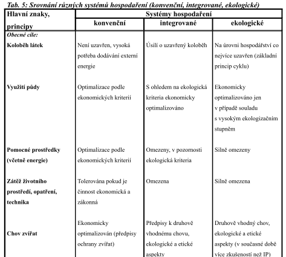

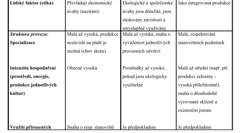

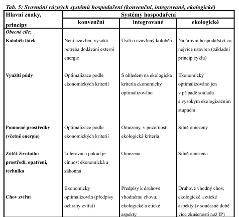

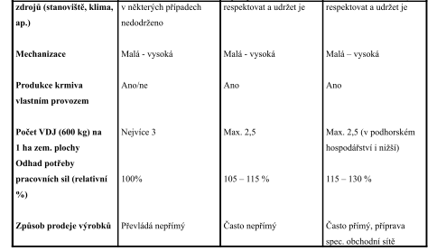

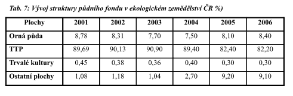

Vývoj ekologického zemědělství v EU a ve světě

V Evropské unii rostl během posledních deseti let rychle počet zemědělců

provozujících ekologické zemědělství i počet spotřebitelů kupujících
bioprodukty.V EU

vytváří ekologické zemědělství v průměru okolo 2 % hodnoty celé zemědělské
produkce.

Odhadovaný podíl bioproduktů na celkovém prodeji potravin rovněž činí okolo 2 %.

Podle OECD byla produkce biopotravin na počátku 21. století odhadována na 26
miliard

USD ročně v celém světě, z toho v Evropě na 11 miliard USD, v USA na 13 miliard
USD,

v Asii na 400 – 450 milionů USD zatímco Oceánie a Jižní Amerika jsou poměrně
malé

trhy pro bioprodukty každá o velikosti okolo 100 milionů USD. Bioprodukce je
obecně

nejrychleji rostoucí sektor v zemědělství s meziročním přírůstkem 15 - 30 %, i
když z

velmi nízké základny.

Stěžejní bariérou rozvoje bioprodukce je vyšší nákladovost. Na úrovni podniku

jsou hlavními důvody pro vyšší náklady obecně nižší výnosy, nižší zatížení půdy

hospodářskými zvířaty, které vedou k vyšším produkčním nákladům, dodatečné
náklady

na pracovní sílu, i nižší stupeň specializace na úrovni podniku a náklady na
inspekci a

certifikaci. Průměrný cenový rozdíl mezi bioprodukcí a konvenční produkcí, který

v konečné podobě mají spotřebitelé zaplatit, je okolo 50 – 60 %. Protože cena,
kterou

dostávají zemědělci, je obvykle pouze menší částí konečné ceny, studie ukázaly,
že

sektory zpracování a maloprodeje dostávají při prodeji biopotravin vyšší podíl.V

distribučním řetězci je důvodem pro vyšší náklady kombinace velkoprodeje,
zpracování a

maloprodeje, vyšší nákupní cena surovin a problémy s trvalými dodávkami, vyšší
náklady

na čištění a separaci v jednotkách, které nejsou určeny pro velkoobchod a
zpracování,

chybějící úspory vznikající růstem velikosti, vyšší dopravní náklady a malý
objem

produkce vedoucí k vysokým jednotkovým distribučním nákladům, více neprodaných

produktů a odpadu a náklady na inspekci a certifikaci. Aby se snížila cena
konečných

produktů, je důležité vytvořit postupy, které mohou snížit náklady, aniž by to
ovlivnilo

správné používání norem pro ekologické zemědělství. V distribučním řetězci se
průběžně objevuje trend přímých dodávek od farmáře ke spotřebiteli. Tento systém
může rovněž

posílit vazbu mezi zemědělci a spotřebiteli, která patří k základním ideám
ekologického

zemědělství. Na většině trhů v Evropě i ve světě je však nejrychleji rostoucím

distribučním kanálem prodej biopotravin přes supermarkety. Pro spotřebitele
nakupující

bioprodukty v supermarketech jsou ohledy na životní prostředí méně významné
oproti

spotřebitelům nakupujícím produkty v obchodech specializovaných na bioprodukci.
Proto

Akční plány navrhují zahájit víceletou informační a podpůrnou kampaň v celé EU,
jejímž

cílem bude informovat spotřebitele, stravovny ve veřejných institucích, školách
a jiné

klíčové činitele v potravinářském řetězci o výhodách ekologického zemědělství,
zvláště o

jeho přínosech pro životní prostředí, zvýšit povědomí spotřebitelů a uznání
bioproduktů,

vytvořit a vést internetovou databázi uvádějící různé soukromé a národní normy
(včetně

mezinárodních norem a národních norem na hlavních exportních trzích) ve srovnání
s

normou EU a zvýšit účinnost loga bioprodukce. Logo EU pro organické produkty
bylo

zavedeno v roce 2000, aby zlepšilo důvěryhodnost bioproduktů u spotřebitelů v EU
i aby

zajistilo lepší identifikaci těchto produktů na trhu, ale toto logo stále není
na

bioproduktech běžně používáno (povinné bude od roku 2009).

Podpora poptávky po bioproduktech může být dále rozvíjena využíváním nových

možností v rámci kapitoly o kvalitě potravin ve vyhlášce o rozvoji venkova,
stejně jako

již dnes existující možnosti pro marketing a zpracování bioproduktů. K dispozici
jsou i

další možnosti, jak vytvořit spojení s typickými produkty nebo venkovskou
turistikou

jako dalšími metodami pro rozvoj trvale udržitelné a ekologické výroby. Vedle

podpůrných aktivit se zavádí kapitola “o kvalitě potravin” jako podnět určený na
podporu

zemědělců, aby se účastnili v programech na zvyšování kvality. Bude jim k
dispozici

dočasná podpora, aby se mohli připojit do programů schválených na úrovni EU a na

národní úrovni a účastnit se jich (včetně ekologického zemědělství, označení
původu

(denominations of origin) a zeměpisného označení, tradičních specifik a
kvalitních vín

produkovaných v určitých regionech). Stejně mohou být subvencovány podpůrné
aktivity

skupin výrobců těchto produktů.

Poskytování snadného přístupu k informacím o metodách ekologického

zemědělství pro zemědělce je důležitou součástí každé politiky směrované na
rozvíjení

ekologického sektoru. Sektor biopotravin a ekologického zemědělství je velmi

dynamický, vykazuje rychlý růst a trvalý rozvoj, jenž je třeba podporovat
účinnou

výměnou informací o dostupnosti nových technologií. Proto jsou školení a výzkum
důležité na všech úrovních, od přijetí výzkumných programů na vysokých školách
nebo

jiných výzkumných institucích, až po školení na farmách pro zajištění vhodného
transferu

informací pro zemědělce. Transfer výsledků výzkumu do zemědělské praxe spolu s
těsnou

spoluprací mezi výzkumem, poradenskými službami již v některých členských
státech

probíhá, ale existuje potřeba zlepšit spolupráci v této oblasti v dalších
členských státech a

mezi samotnými členskými státy.

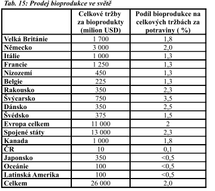

Komise EU přijala v roce 2003 Doporučení o směrnicích pro koexistenci GMO

s konvenčními organismy a ekologickým zemědělstvím. Stanovení specifických
limitů

pro nevyhnutelnou přítomnost GMO je nezbytné. Podobně nebyly dosud stanoveny

obecné limity pro osiva. Řeší se otázka stanovení specifických limitů pro GMO a
pro

osiva používaná v ekologickém zemědělství.

V souvislosti se vzrůstající globalizací ekologického zemědělství se objevuje

potřeba hodnotit stávající režim ekvivalence. Ve světě má stále více zemí zájem
o

ekologické zemědělství a vytvořilo si příslušnou legislativu. Na mezinárodní
scéně

vytvořil světovou směrnici Codex Alimentarius (FAO/WHO). Úkolem pro nejbližší

období je vytvořit systematické srovnání mezi normou EU pro ekologické
zemědělství,

směrnicemi Codex Alimentarius a normami IFOAM, zahájit práce na globální
harmonizaci a rozvoji mnohostranného pojetí ekvivalence na základě směrnic Codex

Alimentarius ve spolupráci s členskými státy, třetími zeměmi a soukromým
sektorem a

posílit uznání norem a kontrolních systémů EU o ekologickém zemědělství ve
třetích

zemích.

3.5 Akční plán rozvoje ekologického zemědělství v ČR

Hlavní cíle Akčního plánu ČR:

\- Posílit postavení ekologického zemědělství v ČR.

\- Zvyšovat pozitivní vliv ekologického zemědělství na přírodu a krajinu.

\- Zajistit životaschopnost ekologických farem.

\- Zvýšit konkurenceschopnost českého zemědělství v EU.

\- Zvyšovat důvěru veřejnosti v ekologické zemědělce.

\- Propagovat životaschopná venkovská hospodářství.

\- Zlepšovat životní podmínky a welfare zvířat chovaných na ekologických
farmách.

\- Zajistit ochranu produktů EZ před kontaminací geneticky modifikovanými
organismy.

\- Rozšiřovat hospodářské aktivity s vyšší přidanou hodnotou.

\- Přispět prostřednictvím ekologické produkce k ochraně zájmů spotřebitelů.

\- Posilovat pozitivní vnímání kvality biopotravin u spotřebitelů.

\- Rozšiřovat trh s biopotravinami, s rostoucím trhem zefektivňovat produkci a

zpracování produktů EZ.

\- Zlepšit odborné poradenství, vzdělávání a výzkum v EZ.

\- Dosáhnout v roce 2010 podíl cca 10 % zemědělské půdy v EZ na celkové výměře

zemědělské půdy.

### *7. Biocidy a životní prostředí - základní pojmy, rezistence, perzistence, ochranná lhůta, etiketa, vlastnosti, formulace, kombinace, kompatibilita, toxicita, registrace. Spotřeba – srovnání ČR a EU.* 

**Biocid**

látka používaná k hubení, tlumení nebo omezování růstu škodlivých organismů ve
všech oblastech lidské činnosti

jsou to jak chemické pesticidy, tak i biologické přípravky používané k ochraně
rostlin.

**Druhy dle uplatnění**

Insekticidy – hubení hmyzu

Herbicidy – hubení plevele

Fungicidy – hubení hub

Nematocidy – hubení háďátek

Baktericidy – ochrana rostlin před bakteriemi

Rodenticidy – hubení hlodavců

Moluskocidy – hubení měkýšů - slimáci

**Podle principu působení**

Kontaktní - aplikovány přímo na povrch škůdce = přímý kontakt

Systémové - absorbovány v rostlinách či jiných organismech a translokovány

jinam *(př. roundup absorbován listy a přesunut do kořenů)*

Perzistentní - působí na škodlivé organismy dlouhodobě. Po aplikaci min. 1
týden.

Selektivní - působí jen proti jistému okruhu škodlivých organismů *(např.
mšicím)*

**VLASTNOSTI**

Jedná se o informace o vlastnostech přípravků na ochranu rostlin a jejich
působení na lidské zdraví a životní prostředí.

**Fyzikální a chemické vlastnosti** – předurčují vliv přípravku na ŽP

rozpustnost ve vodě, výparnost, světelnou a tepelnou stabilitu

lze z nich určit, zda přípravek má tendenci akumulovat se v lidském nebo
živočišném organismu, vypařovat se po aplikaci, udržovat se v půdní struktuře a
prosakovat do spodních vod

**Toxikologie** – vyjadřuje toxicitu daného přípravku k různým druhům živočichů

**Rezidua** – zbytky pesticidů a jejich rozkladných produktů přetrvávající po
aplikaci přípravku v organismu

z informace o reziduích je stanovena lhůta, která musí být dodržena mezi datem
poslední aplikace přípravku a datem sklizně či použití– tzv. **Ochranná lhůta**

**FORMULACE**

konečná (finální) úprava účinné látky na obchodní přípravek do podoby pesticidu

každý přípravek se skládá ze 2 základních částí: účinné látky a nosiče (plnidla)

můžou obsahovat i jiné doplňkové látky – stabilizátory, aditivy atd.

**Typy formulací**

**Kapalné (aplikují se postřikem)**

Rozpustné (kapalné) - vodní koncentrát

Emulgovatelné – Přípravek je rozpuštěn v organickém rozpouštědle. (olej ve vodě)

Dispergovatelné – Obsahují pevnou formu přípravku.

Suspenzní – Koncentrované disperze, obsahují 56-80% účinné látky ve formě
částic.

**Tuhé formulace**

Smáčitelné – Prášky, míchají se s vodou.

Granule – Granulované hnojiva, přímé použití.

Granule dispergované ve vodě – Granule se rozpouštějí ve vodě a následně se
aplikují.

Formulace s řízeným uvolňováním – Řízené uvolňování účinné látky. (Nejlepší)

**KOMBINACE**

pro zvýšení účinnosti proti skupinám škodlivých organismů se uplatňují vzájemné
kombinace, jedná se o použití dvou a výjimečně více přípravků

**KOMPATIBILITA**

V případě, že existují dva či více přípravků, které se dají mísit bez vzniku
negativního vlivu, jsou tyto látky považovány za kompatibilní.

**TOXICITA**

znalost toxicity daného přípravku znamená, jak je daný přípravek jedovatý

toxicitu přípravku je nutné měřit více než jedním způsobem, protože každý typ
přípravku má jiný účinek na lidský organismus

**Akutní toxicita**

znamená, jak je daný přípravek jedovatý v případě jednorázového zasažení

LD50 (dávka) je standardní toxikologický termín, který znamená množství potřebné
k usmrcení 50% testované populace

**Chronická toxicita**

znamená poškození, které se objevuje po opakovaném vystavování se vlivu
přípravku za určitou dobu (příznaky nemusí být evidentní)

**Abnormální chemická citlivost** *(senzibilita)*

někteří lidé mohou být abnormálně citlivý na nějaký přípravek

**REGISTRACE**

zákon  č. 120/2002 Sb., o podmínkách uvádění biocidních přípravků  a účinných
látek na trh

v ČR lze používat chemické přípravky na ochranu rostlin – uvedené v Seznamu
registrovaných přípravků vydávaném Státní rostlinolékařskou správou

**SPOTŘEBA**

ve spotřebě pesticidů v ČR došlo k výraznému poklesu na počátku 90. let, na
poklesu se podílela započatá transformace zemědělství

svůj díl na snižování spotřeb mělo i šíření nových vědeckých poznatků, objevů a
technologií ze zahraničí i snaha začlenění ČR do EU a s tím související nutnost
přiblížení k legislativě EU

dále se snížení spotřeby přispěl i posun ve vývoji nových účinných látek,
přípravků a jejich formulací i rozšíření moderní aplikační techniky přípravků na
ochranu rostlin

### *8. Ekologické zátěže – kritéria klasifikace, vymezení a popis postupů dekontaminace. Havárie a ŽP.* 

**Stará ekologická zátěž** je taková *EZ*, která je *důsledkem lidské činnosti*
a jejímž

*původcem je subjekt, který není znám nebo již neexistuje,*

v krajině působí dlouhodobě

SEZ byly nejčastěji způsobeny státními podniky v době před privatizací (před r.
1990) používáním k ŽP nešetrných, ale ve většině případů povolených technologií
a chemických látek *(kdy se na stav ŽP nedbalo)*

převážně jde o *kontaminaci* půdy, horninového prostředí, podzemních a
povrch.vod, ale i objekty

*SEZ jsou různého charakteru*: např. skládky odpadů, průmyslové a zemědělské
areály, nezabezpečené sklady nebezpečných látek, bývalé vojenské základny, území
postižená těžbou nerostných surovin nebo opuštěná a uzavřená úložiště těžebních
odpadů

*(např. chemičky Spolana Neratovice, Chemopetrol Záluží, Synthesia Pardubice –
v ejjichž okolí byly ukládány kaly do lagun)*

*ČR patří k lokalitám s vysokým výskytem starých ekologických zátěží*

v rámci procesu „velké“ privatizace byl státní majetek převeden novým vlastníkům

i se SEZ *(povinnosti k odstranění SEZ přešly tak na nabyvatele)*

SEZ nebyly zohledněny v ceně státního majetku a tak stát se zavázal na základě
tzv. **ekologické smlouvy**, že uhradí do určité výše náklady na odstranění SEZ
(agendu

zajišťoval FNM, později pak MF)

pro evidenci kontaminovaných míst a ekologických zátěží byla vytvořena databáze
SEKM – Systém evidence kontaminovaných míst, včetně mapové aplikace – provozuje
ji CENIA (nyní evidováno 4 803 kontaminovaných míst)

*KONTAMINANTY-* nejrozšířenější:

anorganické látky: těžké kovy – např. kadmium, chrom, měď, zinek, rtuť, olovo...

kyanidy, radionuklidy...

organické látky: ropné látky

ropné uhlovodíky - NEL

perzistentní organické látky (POPy) – pesticidy (DDT), PCB

*(problém: dlouhodobě setrvávají v prostředí)*

chlorované a aromatické uhlovodíky

jednotlivé kontaminanty mají svoje charakteristické vlastnosti a jejich vliv na
ŽP a zdraví člověka je různý

**Legislativa** – SEZ nemají samostatný zákon

nejblíže - **zákon č. 167/2008 Sb., o předcházení ekologické újmě a o její
nápravě**

definuje povinnosti k předcházení ekologické újmě, případně její nápravě

**ekologická újma** je taková újma, která je měřitelná a má závažné nepříznivé
účinky na vybrané přírodní zdroje, vodu, půdu, rostliny a živočichy

zákon stanovuje podmínky, za nichž vzniká povinným osobám povinnost provádět
*preventivní nebo nápravná opatření*

*principy zákona:* princip prevence, princip znečišťovatel platí, princip
naturální restituce (při nápravě závadného stavu se upřednostňují nápravná
opatření před peněžní náhradou), princip objektivní odpovědnosti

SEZ řešeny též dle:

**horního zákona –** (stará důlní díla, opuštěné lomy, opuštěná díla v podzemí)

*po těžbě a úpravě uranu – prováděl s.p. DIAMO Příbram – hrazeno z MPO*

**vodního zákona -** (nedovolené vypouštění odpadních vod)

nyní garantem za odstraňování SEZ je MŽP – odbor environmentálních rizik a
ekologických škod

financování prostřednictví SFŽP – prioritní osa 4 – odstraňování SEZ

**SANACE ekologických zátěží:**

je proces odstraňování nebezpečných látek ohrožujících dlouhodobě jednotlivé
složky ŽP příp. zdraví (odstranění příčin a následků škod způsobených na ŽP)

celý proces vedoucí k sanaci je nutno provádět v etapách a podle jejich výsledků
rozhodovat o dalším postupu:

**zjištění a průzkum znečištění**

**analýza rizik** (vyhodnocuje škodlivost zátěže, rizika pro jednotlivé složky
ŽP a

zdraví, riziko šíření, navrhuje nápravná opatření - způsob sanace)

ekonomicko – technická studie proveditelnosti

**rozhodnutí o nápravných opatřeních** příslušným orgánem státní správy –
**ČIŽP**

**podrobný průzkum** + volba optimální sanační technologie

**postsanační monitoring**

**Sanace má 3 neoddělitelné součásti**: *(pro úspěšné dokončení sanace je nutno
provést souběžně všechny 3)* **sanace zdroje znečištení**

**sanace nesaturované zóny**

**sanace saturované zóny**

**DEKONTAMINACE – vymezení a postup**

**dekontaminace** – cílem je odstranění škodlivých látek z prostředí (půdy,
vody)

dekontaminačních metod je celá řada – voleny musí být s ohledem na vlastnosti
odstraňovaných látek a vlastností materiálu, z něhož jsou odstraňovány

*procesy: fyzikální, chemické, tepelné, biologické*

*Metody podle místa dekontaminace*

*in situ (přímo v místě)* - spočívají v aplikaci aktivní chemické látky (např.
oxidačního činidla manganistanu draselného) přímo do horninového prostředí a
podzemní vody, kde dochází k reakci s kontaminantem za vzniku neškodných
sloučenin

*nejčastější IN SITU:*

*venting* - odsávání vzduchu z *nesaturované zóny* podtlakem (vytěžený vzduch se
čistí v dekontaminační jednotce) – *zákl. metoda k odstraňování těkavých
organických látek*

*ex situ (mimo místo kontaminace)* – účinnější, rychlejší a lépe řízené

*při sanaci půd a horninového prostředí* se uplatňuje odtěžení kontaminovaných
vrstev a zasypání inertním materiálem, odtěžený materiál může být dále na
povrchu čištěn (např. biodegradací ropných látek)

*při sanaci podzemních vod* se nejčastěji uplatňuje sanační čerpání, při němž se

čerpaná voda různým způsobem čistí na povrchu (např. adsorpcí na aktivních
filtrech)

**stripování** *nejrozšířenější k odstraňování těkavých organických látek
z podzemní vody*

**chemické a fyzikální postupy:**

*nejčastější EX SITU:*

**solidifikace a stabilizace** - metody použitelné pro znečištěné zeminy, kaly
ze skládkovacích lagun, kontaminované odpady z průmyslové výroby

vhodné pro těžké kovy, uhlovodíky (PAU, NEL, ClU, fenoly), pesticidy, atd.

*Solidifikace:* (zpevňování) - přeměna kontaminovaného materiálu do pevné formy
s dobrými fyzikálními a mechanickými vlastnostmi

*Stabilizace:* proces vedoucí k zamezení nebo podstatnému zpomalení
vyluhovatelnosti škodlivých látek do prostředí (přeměna na nerozpustný produkt
nebo zachycení na vhodný sorbent

*další:* adsorpce, vymývání půdy, chemické oxidace, srážení, hloubkové
injektáže, flotace, tepelné ošetření...

**biologické postupy:**

bioreaktory, umělé mokřady (kořenové čistírny) – ex situ

bioaugmentace – cílené vnesení mikroorgaismů pro biodegradaci populantu (nutné
promíchávání) in situ

**inovativní metody šetrné k ŽP:**

**chemická stabilizace** pomocí stabilizačních činidel (vápenec, fosfát,
nanočástice..)

**biosorpce** (aplikace kompostu do půdy)

**fytoremediace (**rostliny schopné růst v kontaminovaném prostředí – snižují
toxicitu)

### *9. Toxikologie – základní pojmy hygienicko- toxikologického hodnocení chemických látek, dávka a její kategorie, interakce škodlivin s organismem. Působení škodlivých látek v organismu. Hodnocení rizik chemických látek.* 

**Toxikologie** = věda zkoumající škodlivý vliv chemických látek na živé
organismy

má interdisciplinární charakter, opírá o celou řadu dalších vědních disciplin,
farmakologii, biologii, genetiku, chemii, biochemii, fyziologii, patofyziologii

**Chemická toxikologie** – zabývá se vlastnostmi jedů, jejich analýzou a
zneškodňováním

**Ekotoxikologie** – zabývá se pohybem jedovatých látek v přírodě a jejich
ekosystémech, obor zabývající se výzkumem imisí, kontaminací, vstupem, výstupem,
distribucí a osudem chemických látek v biosféře, zejména tam, kde je důležitá
kontaminace biologických cyklů (především potravin).

**Základní pojmy hygienicko-toxikologického hodnocení chemických látek**

**TOXICITA**

schopnost chemické látky poškodit organismus člověka nebo zvířat (vyvolat
otravu)

vyjadřuje se jako vztah **dávky** a účinku

**Ekotoxita** – environmentální toxicita – vyjadřuje vztah ke **koncentraci**

**RIZIKO** – je pravděpodobnost, že chemická látka působí škodlivě ve výrobě
nebo spotřebě

**charakteristika rizika** – určení pravděpodobnosti, že v dané populaci dojde
k projevům účinku sledované látky

látky s prahovým účinkem (mírou rizika je index nebezpečnosti. je to poměr
chronické denní dávky a referenční dávky HI \>1 riziko,HI\>4 havarijní situace

látky s bezprahovým účinkem (např. karcinogenní látky, vychází z faktoru
směrnice, vypočte se jako celoživotní pravděpodobnost počtu nádor.omenocnění nad
průměr)

**BEZPEČNOSTNÍ FAKTOR**

poškození organismů nemůže nastat tehdy, jsou-li dodržovány NPK (nejvyšší
přípustné koncentrace) potenciálně škodlivých látek a způsoby jejich aplikace.

**TOXICKÝ ÚČINEK CHEMICKÝCH LÁTEK -** hodnotí se na základě pokusů na zvířatech
(akutní – jednorázová dávka, subakutní – 30 denní expozice, chronické působení –
3 a 6 měsíční, 2roční a doživotní expozice)

**Nejvyšší přípustné koncentrace (NPK) chemických látek :**

Jde o koncentraci, která nemá na člověka ani přímý ani nepřímý vliv, nesnižuje
jeho práceschopnost, neovlivňuje negativně jeho subjektivní pocity ani náladu.
Nemůže ovlivnit jeho zdraví.

**OSUDY JEDŮ V ORGANISMU**

každý jed se v organismu chová jinak: částečně se rozkládají, mění, ukládají
nebo vylučují

**biotransformace** = přeměna chemické struktury látky působením živého
organismu, proces, při němž v organismu metabolizují noxy (škodliviny)

v těle probíhá: oxidace, redukce, štěpení, systéza na nejedovaté sloučeniny

nejvýznamnější detoxikační orgán **játra**: (jedy se zde nejvíce ukládají)

jedy se z těla vylučují: močí, pevnými výkaly, žlučí, slinami, potem, dechem

některé jedy se z organismů vylučují pomalu a mohou při opětovném přísunu malých
dávek způsobit akutní otravy - mluvíme pak o jejich kumulaci (strychnin,
digitalis)

opakované malé dávky mohou vést k chronickým otravám, a v tom také spočívá
nebezpečnost některých látek dostávajících se do potravního řetězce v ŽP

člověk vdechuje výfukové plyny, kouřové plyny, drobné částečky asfaltu ze
silnic, kouří nebo prodlévá v zakouřených místnostech. Kontaktně se dostává do
styku s barvami předmětů, látek a kožešin. Požívá potraviny s konservačními
prostředky a kancerogenními látkami, alkohol, kofein, různé léky, hlavně
barbituráty, sulfonamidy, antineuralgika aj

**ŠKODLIVÉ LÁTKY MOHOU PŮSOBIT**

**Karcinogenně** (fyzikální faktory, chemické sloučeniny a některé viry, kterými
lze u pokusného zvířete bezpečně vyvolat nádorové bujení)

**Kokarcinogenně (**samy o sobě nevyvolávají zhoubné bujení, ale jejich
přítomnost stimuluje vlastní karcinogeny – např. fenoly)

**Teratogenně** (teratogeneze je účinek jedovatých látek na zárodek v těle matky
(tj. během embryonálního vývoje s vyvoláním „malformací“)

**Mutagenně** (chemomutageny – jedy způsobují změny v genetické informaci,
působí dlouhodobě a těžko se stanoví)

*DÁVKA a její kategorie*

**Závislost účinku škodlivosti na dávce**

**Dávka**

množství přijaté látky do organismu, většinou se vyjadřuje v jednotkách
hmotnosti škodliviny vztažené na jednotku tělesné hmotnosti organismu (mg/kg )

dávka, která nevyvolává pozorovatelnou změnu - **neúčinná, podprahová**

nejmenší dávka již způsobující registrovatelný efekt v organismu - **prahová**

**nejvyšší tolerovaná dávka** je taková, která nemá za následek smrt

**ADI -** přijatelná denní dávka (množství, které nepředstavuje riziko pro
zdraví)

**Referenční dávka RfD**

denní dávka (expozice), kterou je možno celoživotně přijímat bez následků na
zdraví

**Dávky mohou být inhibiční, toxické, smrtelné (letální).**

**LD: letální (smrtná) dávka**

**LD10** - nejnižší smrtná dávka

**LD50** - střední smrtná dávka – statisticky vypočtená jednotlivá dávka látky,
která pravděpodobně způsobí za definovanou dobu smrt 50 % zvířat, kterým byla

**LD100**- dávka při níž uhynou všechna pokusná zvířata

*U tekutin se používá označení LC50 (letální koncentrace)*

*Interakce škodlivin s organismem*

**Vstup škodlivin do organismu**

**celková expozice** – zahrnuje všechny expoziční cesty a cesty vstupu pro danou
látku

**expoziční cesta** – souhrn procesů, kterými prochází škodlivina v jednotlivých
složkách ŽP až do organismu

do organismu se látka dostane: inhalace, ingesce (polknutí), resorpce kůží a
sliznicemi

**vstupy**: dýchací ústrojí (dobře rozpustné plyny prostupují sliznicí již
v HCD, méně rozpustné v plicích)

trávicí trakt

kožní vstřebávání (plyny, voda, těžké kovy, org. rozpouštědla, fenol…)

**Distribuce** - přijatá látka rozděluje do krve, tkání a orgánů.

**Biotransformace** - metabolická přeměna látek v organismu.

**Vylučování** - škodlivost přijaté látky organismem je závislá na její
distribuci, biotransforma ci, ale i na schopnosti organismu látku vyloučit ve
formě různých metabolitů. Obecně se jich většina vylučuje močí (ledvinami),
trávicím traktem, plícemi (dechem), potem a mlékem.

**rizikové skupiny** – osoby se zvýšenou expozicí / osoby se zvýšenou citlivostí

dány věkově, zdravotním stavem, rizikovým chováním (kouření, alkohol)

**Toxické kovy v životním prostředí**

*Toxické kovy (jedovaté)* – kovy, které při určitých koncentracích působí
škodlivě na člověka a ostatní biotické složky ekosystémů

průmyslovou činností  se kovy dostávají do  prostředí

emise kovů pocházející z činnosti člověka – 300x vyšší než přirozená

pokud se dostanou do půdy, přetrvávají v ní tisíce let a je obtížné eliminovat
jejich účinky na rostliny a na úrodnost půdy (může se dostat do potravinového
řetězce a negativně působit na zdraví člověka)

do  půdy  přecházejí  kovy  zejména  srážkami,  spadem popílků, z městských
odpadů, hnojivy, komposty a  čistírenskými kaly používanými ke hnojení

symptomy  chronické  otravy  kovy  jsou  většinou  nespecifické a projeví se
teprve až  intoxikace dosáhne určité hranice, poškození organismu pak bývá
nevratné

kovy a další toxické látky v těle člověka spolupůsobí a zvyšují tak negativní
účinek na lidský organismus

**Kovy rizikové pro ŽP**

**OLOVO**: Pb

spalovací motory, těžba a úprava rud, spalování fosilních paliv

**Toxicita:** 90 % přijatého olova se kumuluje v kostech, kde negativně
ovlivňuje krvetvorbu

**ARSEN**: As – patří mezi nejtoxičtější kov

emise z elektráren, průmyslových hnojiv, zpracování rud, zemědělství
(insekticidy), aditiva do skla, ochranné prostředky na dřevo, kouření…

*Toxicita* Sloučeniny - vysoce toxické, schopnost kumulace v organismech – v
játrech a ledvinách, i ve vlasech, nehtech a kůži. Sloučeniny arsenu prostupují
i placentou a poškozují plod. Ve vysokých koncentracích je arsen toxický i pro
rostliny.

*RTUŤ *: Hg

chemická výroba,  výroba fungicidů, herbicidů, katalytické procesy, baterie,
lékařství (teploměry a zubní amalgam), spalování fosilních paliv

**Toxicita** páry rtuti po nadechnutí jsou rychle absorbovány krevním oběhem a
dopraveny do cílového orgánu - mozek, kde se rtuť ukládá, působí na nervový
systém, ledviny, plíce, kůži. Patří mezi embryotoxické a mutagenní látky.

**KADMIUM**:  Cd

těžba zinkových  rud, fosforečná hnojiva, výroba baterií,  pigmentů k
barvení  plastů a  skel,  spalování fosilních paliv,

kontaminace půd odpady spady z energetického, metalurgického a chemického
průmyslu, fosforečná hnojiva, kaly z ČOV

*Toxicita* je jednou z možných příčin vysokého krevního tlaku, poškozuje
ledviny, reprodukční orgány, vyvolává destrukci červených krvinek a způsobuje
rakovinu plic, kademnaté ionty rovněž vyvolávají křehnutí kostí.

nejnebezpečnější je inhalace prachu a dýmů

**CHROM**: Cr

pokovování, činění kůží, gumárenský průmysl.

*Toxicita –* v kovové formě málo toxický, ve formě *šestimocného chromu* silně
toxická látka, karcinogenní (rakovina plic), některé sloučeniny jsou i
mutagenní, poškozují játra a ledviny a způsobují vnitřní krvácení. Je velmi
mobilní, zvlášť v půdních vodách.

### *10. Cizorodé látky v životním prostředí. Kontaminující látky, prioritní kontaminanty (toxické minerální látky, radioaktivní izotopy, mykotoxiny, mikrobiální toxiny halogenované organické sloučeniny), výskyt a pohyb. Cizorodé látky v potravinách.* 

CL v životním prostředí člověka se týkají především faktorů:

Chemických

Biologických (mikroorganismy)

Fyzikálních (radionuklidy)

*CL se dostávají do potravního řetězce: ze znečištěného ŽP, při používání
agrochemie a šlechtitelství, spadem, půdou, vodou, během užité potravinářské
technologie, výroby, bale­ní a transportu potravin.*

**Biotransformace:**

v lidském i živočišném organismu podléhají přijaté látky biotransformacím (mění
se na další metabolity) - biotransformace probíhá v játrech a ledvinách

rychlost a odbourávání chemické látky je ovlivněna její rozpustností v prostředí
a aktivitou specifických enzymů

organismy mnohdy nestačí biotransformačnímy procesy chemickou látku z těla
vyloučit ta se pak v nich hromadí jako REZIDUUM.

**REZIDUA DUSÍKU** – jeden z nejrozšířenějších prvků

může vyvolat celou řadu toxikologických a ekotoxikologických problémů ve vodě,
krmivech a potravinách. Při hnojení dusíkem (průmyslová hnojiva) se do půd
dostává nadměrné množství jeho iontových forem.

*Dusičnany (nitráty*) se do člověka a do zvířat dostávají potravou a vodou. Malé
dávky nejsou toxické. Z hospodářských zvířat jsou na dusičnany méně citlivá
prasata a koně.

*Dusitany* jsou reaktivními metabolity dusičnanů. Dusitany reagují v těle
s hemoglobinem na methemoglobin, který nemá schopnost přenášet kyslík.

*Nitrosoaminy*: Nebezpečná pro zvířata i člověka. Jsou označovány jako
karcinogeny, jejich karcinogenní účinek byl prokázán u zvířat.

*REZIDUA BIOCIDŮ:* hlavně krmiva hospodářských zvířat, a dále mléko, vejce, maso

**REZIDUA VETERINÁRNÍCH LÉČIV a doplňkových látek výživy**

*Antibiotika* – z léčení zvířat ve velkochovech (nedodržení ochranných lhůt),
aplikace jako stimulátorů růstu, z jejich využití jako konzervačních látek

zdravotním rizikem z reziduí antibiotik je rezistence na antibiotika (dostávají
se např . do vemene a jsou vylučovány mlékem)

*Rizika, která rezidua antibiotik přinášejí:*

*přímé akutní a chronické poškození* – ne pro potraviny

*nepřímé toxické účinky (alergie a rezistence*) – hlavní zdravotní riziko
z reziduí antibiotik je rezistence na ATB.

*aditiva* – jako aditiva do potravin mohou být aplikována pouze ATB, která se
nepoužívají v humánní a veterinární medicíně (např. nisin)

*organické katalyzátory – hormony* - dvě kategorie – přirozené hormony nebo
syntetické sloučeniny s hormonálním účinkem - u nás je jejich používání zakázáno

*biotoxiny* je známo 43 druhů intoxikací z rostlin, 12 z hub a 32 z ryb. V ČR je
aktuální scombrotoxismus z tuňáků a makrel

*bakteriální toxiny* - Clostridium botulinum a perfringens, Staphylococus aureus

**Definice v oblasti příjmu škodlivých látek**

**AKUMULACE:** obohacování organismů antropogenními nebo přirozenými
chemikáliemi z prostředí, které vede ke zvýšení koncentrace v tělech nebo jeho
částech vzhledem k příslušnému mediu.

**BIOAKUMULACE:** je používán tehdy, když při příjmu určité látky je prokázáno
spolupůsobení biologických procesů, např. při příjmu závislém na energii.

**OBOHACOVÁNÍ:** mluvíme o něm tehdy, když poměr: KA (koof.akumulace) je větší
než 1.

**KONTAMINACE:** representuje zatížení něčeho cizí látkou

**DEKONTAMINACE:** snižování stupně kontaminace organismu a jeho prostředí

**ELIMINACE:** odstranění škodlivé látky z organismu nebo biotopu

**Kontaminující látky**

Okolnosti, za kterých dochází k primární či sekundární kontaminaci potravního
řetězce člověka organickými a anorganickými škodlivinami, lze shrnout do
následujících bodů:

**Zemědělská produkce:**

Používání pesticidních přípravků

Hnojení (toxické kovy, zvláště Cd)

Imisní zátěž

Použití zálivkové povrchové vody

Napadení mikroorganismy, zejména plísněmi (mykotoxiny)

**Skladování a zpracování**

Posklizňová aplikace pesticidů

Vznik toxických degradačních produktů

Napadení mikroorganismy

**Prioritní kontaminanty:**

toxické minerální látky, (kovy, metaloidy aj. anorganické sloučeniny)

radioaktivní isotopy

mykotoxiny a jiné mikrobiální toxiny

halogenované organické sloučeniny

**Nejdůležitější toxické prvky:**

Olovo

Kadmium

Rtuť

Arzen

**TOXINY MIKROORGANISMŮ**

**MYKOTOXINY**

jedovaté látky vznikající činností hub, zatěžují prostředí zejména potravní
řetězce

**Zdroj:** Plesnivé potraviny •Rezidua v živočišných tkáních a produktech
•Výrobky získané s využitím kulturních plísní •Produkty biotechnologií

skupiny mykotoxinů:

AFLATOXINY (nejznámější Aspergilius flavus, plíseň rozšířena v půdách, roste na

nejrůznějších substrátech – plody podzemnice olejné, rýže, soja, zelenina,

STERIGMATOCYSTIN

OCHRATOXIN

PATULIN ( v jablcích, hroznech, pomerančích a džusech těchto surovin)

**BAKTERIÁLNÍ TOXINY -** BOTULOTOXINY + OSTATNÍ BAKTERIÁLNÍ TOXINY

**TOXICKÉ MINERÁLNÍ LÁTKY** - DUSIČNANY A DUSITANY

**RADIONUKLIDY –** záření alfa, beta, gama

podle nebezpečnosti záření: 4 skupiny (s velmi vysokou radiotoxicitou, vysokou,
střední a malou)

**KOVY – ANORGANICKÉ LÁTKY:**

těžké kovy a mikroelementy mohou v určitých koncentracích působit škodlivě až
toxicky, zejména v potravním řetězci (As, Be, Pb, B, Br, Cd, Cr, Cu…)

*zdroj:* emise, průmyslová hnojiva, odpady, které bez ohledu na kritické obsahy
byly nebo dosud jsou v půdách likvidovány (čistírenské kaly, další odpady z
komunální sféry).

*ORGANICKÉ LÁTKY:*

zdroj - chem. průmysl, doprava, domácnost.

Na rozdíl od *anorganických* škodlivin přenášených vzduchem, kdy jsou uvolňovány
jednotlivé komponenty *ve velkých množstvích*, se jedná o chemické sloučeniny,
které jsou při relativně nižší toxicitě ve významných množstvích přenášeny
vzduchem nebo vodou a těmito medii se dostávají do půd, kde mohou působit až
**extremně toxicky i tehdy, je-li jejich koncentrace velmi nízká** (např. PAU,
PCDD, PCFD)

**PAU - polycyklické aromatické uhlovodíky**

hlavním zástupcem je bezno(a)pyren.

vznikají při *nedokonalém spalování* uhlovodíků, uhlí a dalších fosilních
uhlovodíků (zdroj také doprava – dieslové motory)

PAU jsou ve vzduchu vázány na prach, s nímž se dostávají do půdy

*Perzistentní organochlorové sloučeniny***:** PCB, PCDD, PCDF

**PCB (polychlorované bifenyly)**

nízkomolekulární organ.látky, dříve využívané v průmyslu – nyní zakázané
z ekologických a zdravotních důvodů, jejich rezidua přetrvávají v ekosféře

používali se jako plastifikátory, lubrifikátory a hydraulické kapaliny, přísady
do barev a laků – v kondenzátorech a transformátorech

odolné proti biologickému rozkladu

hromadí se v lidském tuku, ryby - ptáci

**PCDD (Polychlorované benzodifurany) a PCDF (Polychlorované dibenzofurany)**

vedlejší produkty syntetických postupů (PCB) nebo produkty vznikající při
likvidaci těchto nebo jiných chlorovaných aromátů

jejich přirozený vznik je možný při větších lesních požárech

do ovzduší se dostávající také ze spaloven komunálních odpadů jako produkty
spalování chlorovaných organických sloučenin

**Ftaláty**

jsou obsaženy v plastovém zboží, obalech – folie

zdrojem kontaminace jsou čistírenské kaly aplikované na zemědělské plochy

### *11. Zdraví a ŽP. Fyzikální faktory a jejich na zdraví. Vliv elektromagnetického pole, mobilních telefonů, mikrovlnné trouby, hluku a vibrace.* 

**Expozice**

kontakt hodnocené chemické látky, nebo fyzikálního faktoru s hranicemi organismu

*(bez expozice není riziko),* bývá ztotožňována s přijatou dávkou

označujeme ji obvykle jako:

množství látky za jednotku času

množství látky na kg váhy za jednotku času

koncentrace hodnocené látky

**odhad expozice** – snaha směřující ke kvalifikaci a kvantifikaci tohoto
kontaktu

**Pro hodnocení expozice** je nutno získat data o:

velikosti expozice

trvání a frekvenci expozice – akutní, krátkodobá, chronická

velikosti a typu exponované populace

**rizikové skupiny** - osoby se zvýšenou expozicí

\- osoby se zvýšenou citlivostí

jsou dány: věkově (fyziologická specifika, detoxikační mechanismy)

zdravotním stavem – (vrozené dispozice, onemocnění..)

rizikovým chováním (kouření, alkohol, drogy)

cestě vstupu – cesta, kterou látka vstupuje do organismu (inhalace, ingesce,
resorpce kůží a sliznicemi)

**Biomarkery expozice**

chemické látky, jejich metabolity, i další změny v organismu, o kterých je
prokázáno, že souvisí s expozicí sledované látky či faktoru

biomarker = látka používaná jako indikátor biologického stavu (tělní tekutiny,
tkáně i buňky lidského organismu)

**Expoziční faktory:** těles.hmotnost, povrch těla, denní příjem tekutin, denní
inhalační objem

**ELEKTROMAGNETICKÁ POLE - EMP**

jsme jim vystaveni každý den (mobilní telefony, TV, PC, mikrovlné trouby,
bezpečnostní systémy, radary, radiové a tv vysílače…)

EMP jsou běžně přítomna v přírodě, vznikají v zemi solární činností a v
atmosféře blesky a během elektrických bouří, vytvářejí se i biologickými procesy
v organismech zvířat a lidí

jsou částí spektra elektromagnetického záření

některé formy záření (rentgenovy paprsky) mohou být příčinou rakoviny, EMP
nejsou schopna tímto způsobem biologický materiál poškozovat

druhy elektromagnetického záření je možné charakterizovat vlnovou délkou a
kvantem energie: radiové a mikrovlnné záření má **vysokou frekvenci** a
jednotkami jsou proto kilohertz (kHz), megahertz (MHz) a gigahertz (GHz).

vliv na zdraví: kontroverzní, řada nejasností, vznik rakoviny není jednoznačně
prokázán

**Mobilní telefony** (800MHz až 2 GHz)

nízkovýkonnové mikrovlnné přístroje – vysílají a přijímají signály

**Mikrovlné trouby** (frekvence 2,45 GHz)

účinek mikrovln při jejich úniku klesá se vzdáleností od trouby.

**Hluk:** bezprahová noxa, priorita mezi fyzikálními faktory ŽP

akustický signál, jehož působení člověka poškozuje, ruší a obtěžuje,

lékařské i statistické studie dokazují, že hluk má nepříznivý vliv na lidské
zdraví

sluch prvotně slouží člověku především jako varovný systém, organismus kvůli
tomu reaguje na hluk jako na poplašný signál a spouští celou řadu mechanismů

*dopady na zdraví*: akustická nepohoda, ruší spánek, negativně ovlivňuje
soustředění, poruchy sluchu, účinky na kardiovaskulární systém

*poškození sluchu:* při krátkodobém vystavení hluku přesahujícímu 130 dB

při častém a dlouhodobém hluku nad 85 dB (např. velmi hlasitá hudba)

*limity hluku:* denní 70 dB, noční 60 dB

*zdroje hluku:* hlavní je silniční doprava

*prevence před hlukem*: odklonění dopravy, okna, protihluk. stěny, asfalt, sníž.
rychlost

**Kouření**

Kouř z cigaret je neúprosný zejména k tkáním srdce a plic. Za rozvoj srdečních a
cévních onemocnění jsou odpovědné dvě látky – **nikotin a kysličník uhelnatý.**

celkově cigaretový kouř obsahuje až 5 000 chemických látek, z nichž jich mnoho
ohrožuje lidské zdraví.

*Látky toxické* : např. **nikotin**

*Dráždivé látky*: např. formaldehyd, metanol, sirovodík….

*Kouř dýmek a doutníků – alkalický,* riziko karcinomu úst, jazyka, hltanu,
jícnu, nebezpečí poškození plic je menší. Kouř z cigaret je kyselý

Vliv kouření cigaret: chronická bronchitida, rakovina plic, ischemické choroby,
hypertenze, vředové nemoci, negativní v těhotenství a během kojení.

zdravotním problémem je i pasivní kouření, na nekuřáky má pasivní kouření také
účinky: dráždivé, toxické, alergizující.

### *12. Odpady a prostředí (odpady z těžby, průmyslu, zemědělství; komunální odpady a vlivy na biosféru, skládkování, spalování, kompostování, třídění a recyklace, legislativa ČR a EU).* 

**odpady z těžby:**

odpady z těžby uhlí a nerostných surovin většinou patří mezi odpady ostatní

jde např. o výkopovou zeminu (skrývku), hlušinu a kamenivo, uhelný kal apod.

na odpady z hornické činnosti ukládané na výsypky, odvaly a odkaliště lze
nahlížet jako na odpady, ale též jako ložiska nerostů, která se řídí **horním
zákonem**

nebezpečné odpady mohou v této oblasti vznikat provozem a činností těžebních
zařízení a jejich údržby nebo jde o odpady z úpraven obsahující zbytky
flotačních činidel či odpady z těžby ropy

**odpady z průmyslu:**

velkou část odpadů z průmyslové výroby tvoří odpady nebezpečné

nejvíce zátěžové z hlediska množství odpadů a jejich vlivu na ŽP je průmysl:
energetický, chemický, těžební, papírenský, metalurgický, strojírenský a výroba
paliv

u mnohých nebezpečných odpadů se provádí jejich úprava, aby se snížila jejich
nebezpečnost a umožnilo jejich následné využití či bezpečnější odstranění

některé průmyslové odpady jsou cennou surovinou, kterou lze využít přímo nebo po
úpravě v primárním nebo sekundárním recyklačním procesu, nebo jako sekundární
zdroj energie

např. odpady z energetiky (spalování tuhých paliv), kde hlavními tuhými odpady
jsou popel, škvára, popílek a struska – jsou využívány jako certifikované
výrobky s využitím ve stavebnictví

**odpady ze zemědělství**

dříve zemědělství bylo považováno za bezodpadové s uzavřeným koloběhem látek
(*půda-krmivo-zvíře-exkrementy-půda)*

nyní problémy s odpady ze živočišné výroby – mnohdy je již bezstelivová, při níž
vzniká kejda, která způsobuje problémy hygienické a se skladováním (problém
oproti stelivovému ustájení, kdy se slamnatý hnůj dal využít jako cenné hnojivo)

v rostlinné výrobě vznikají i nebezpečné odpady (např. silážní šťávy, průmyslová
hnojiva, pesticidy, odpady z moření osiv a obaly od nich)

perspektivní možností je využívání zemědělských odpadů při kompostování či v
bioplynových stanicích

**Komunální odpady a vliv na biosféru**

odpady samy o sobě jsou pro biosféru rizikové - pokud je však s nimi nakládáno
v souladu s legislativou a dle stanovených podmínek je jejich vliv minimální

problém však způsobuje nesprávné nakládání s odpady – tj. např. pálení odpadů
(znečišťování ovzduší), odkládání na černé skládky (znečišťování půdy a podzemní
i povrchové vody výluhy z odpadů, rozmnožování hmyzu a hlodavců může šířit
infekci, dochází k narušování celého potravního řetězce)

čím více se vzniku komunálního odpadu předchází, třídí a využívá, tím méně
zatěžujeme biosféru a tím více dochází k úspoře přírodních zdrojů

**Basilejská úmluva** (podepsaná r. 1989 v Basileji)

mezinárodní úmluva o kontrole pohybu nebezpečných odpadů přes hranice států a
jejich zneškodňování

cíle: snížit pohyb nebezpečných a ostatních odpadů přes hranice států na minimum

zajistit zneškodňování odpadů v blízkosti jejich zdroje

zajistit přísnou kontrolu a prevenci nelegální přepravy

zákaz vývozu nebezpečných odpadů do zemí, které nedisponují legislativní,
administrativní a technickou kapacitou k jejich řízení a zneškodňování

pomáhat rozvojovým zemím a zemím s transformující se ekonomikou s bezpečným
nakládáním s odpady

ČR : odpad, který vznikl v ČR, se má přednostně využít nebo odstranit v ČR

dovoz odpadů do ČR **k odstranění je zakázán** (s výjimkou odpadů vzniklých
v sousedních státech následkem živel. pohrom nebo při stavu nouze)

možná je přeprava odpadů k jejich dalšímu zpracování a využití (někdy však je
snaha o obcházení a deklarování odpadů jako výrobku)

dohled má MŽP, které uděluje souhlas k přepravě nebo ji zamítá

*skládkování, spalování, kompostování, třídění a recyklace, legislativa ČR a EU
– je v otázkách předmětu odpady*

### *13. Financování – výdaje na ochranu ŽP ČR, výdaje na ochranu ŽP v evropském kontextu.* 

<https://www.czso.cz/csu/czso/2002-06--2000___2005--f___financovani_ochrany_zivotniho_prostredi>

**FINANCOVÁNÍ OCHRANY ŽIVOTNÍHO PROSTŘEDÍ**

**Výdaje na ochranu životního prostředí **– zahrnují výdaje na pořízení
dlouhodobého hmotného majetku na ochranu životního prostředí a neinvestiční
náklady na ochranu životního prostředí. Výdaje na ochranu životního prostředí
zahrnují všechny výdaje, které se vztahují k aktivitám na ochranu životního
prostředí (metody, technologie, procesy, zařízení nebo jejich části), jejichž
hlavním účelem je zachycení, odstranění, monitorování, kontrola, snižování,
prevence nebo eliminace znečišťujících látek a znečištění nebo jakékoliv jiné
poškození životního prostředí, ke kterému dochází při činnosti podniků. Data
jsou získána z ročního statistického výkazu ČSÚ.   
  
**Údaje o dlouhodobém hmotném majetku (DHM)** představují sumu výdajů, které
vykazující jednotky vynaložily na pořízení DHM (koupí nebo vlastní činností),
spolu s celkovou hodnotou DHM získaného formou bezúplatného nabytí, převodem
podle příslušných legislativních předpisů nebo přeřazením z osobního užívání do
podnikání.  
  
**Neinvestiční náklady** zahrnují mzdové náklady, platby nájemného, energie a
ostatní materiál a platby za služby, u kterých je hlavním účelem ochrana
životního prostředí.

**Ekologické akce zahrnují:**

**Ochrana ovzduší a klimatu **zahrnuje např. úpravu technologických
procesů** **z důvoduprevence vzniku znečištění (na ochranu ovzduší, klimatu a
ozónové vrstvy), odstraňování odpadních plynů a odvětrávaného vzduchu,
odstraňování tuhých a plynných emisí, monitorovací zařízení pro sledování
čistoty ovzduší.

**Nakládání s odpadními vodami** zahrnuje např. úpravu technologických procesů z
důvodu prevence vzniku znečištění, výstavbu čistíren odpadních vod, výstavbu
kanalizačních sítí se zajištěným napojením na čistírnu odpadních vod, nakládání
s chladícími vodami, monitorovací zařízení ke sledování jakosti vody.

**Nakládání s odpady** zahrnuje např. úpravu technologických procesů z důvodu
prevence vzniku odpadů, zařízení a vybavení pro sběr, svoz, přepravu, třídění a
úpravu odpadů, výstavba spaloven, recyklačních závodů, řízených skládek,
kompostáren, asanace starých skládek, zařízení pro monitoring odpadů.

**Ochrana krajiny a biodiverzity (druhová rozmanitost) **zahrnuje např. ochranu
a rehabilitaci stanovišť a druhů, ochranu přírodních a polopřírodních typů
krajiny, ochranu a obnovu prvků ekologické stability, revitalizaci hydrologické
sítě, náklady na řešení povinností vyplývajících z § 35 a § 32 zák. 44/1988 Sb.,
o ochraně a využití nerostného bohatství (horní zákon).

**Ochrana a sanace půdy, podzemních a povrchových vod** zahrnuje např. prevenci
depozice znečišťujících látek do půdy vč. následné infiltrace do vod,
předcházení kontaminace a degradace půd chemickými vlivy a její následná sanace,
ochrana půdy před erozí, svahovými pohyby a ostatní degradací způsobenou
fyzikálními jevy, včetně nákladů na řešení problematiky sesuvů, náklady na úkoly
geologických průzkumů s účelem ochrany půdy a podzemní a povrchové vody.

**Omezování hluku a vibrací (kromě ochrany pracovišť)** zahrnuje např. prevenci
vzniku hluku a vibrací úpravou technologie, konstrukce a uplatnění
protihlukových a antivibračních zařízení v silniční, železniční a letecké
dopravě a průmyslu, měřící zařízení.

**Ochrana proti záření** zahrnuje např. protiradonová opatření, geologické práce
spojené s problematikou lokalizací hlubinných úložišť jaderného odpadu, měřící
zařízení, přepravu a nakládání s vysoce radioaktivním odpadem.

**Výzkum a vývoj** zahrnuje výzkum a vývoj zaměřený na ochranu ovzduší, klimatu
a ozónové vrstvy, ochranu vod, nakládání s odpady, ochranu půdy a podzemní vody,
omezování hluku a vibrací, ochranu biodiverzity a krajiny, ochranu před zářením
a ostatní výzkum životního prostředí.

**Ostatní aktivity** na ochranu životního prostředí zahrnují např. pořízení
dlouhodobého hmotného majetku na prevenci před povodněmi, vzdělávání v
problematice ochrany životního prostředí, školení a instruktáže.

<https://www.czso.cz/documents/10180/32782516/28002216m.pdf/274822d5-797c-4348-901e-1c71e97db8ec?version=1.1>

**Metodika**

**Výdaje na ochranu životního prostředí** zahrnují výdaje na pořízení
dlouhodobého hmotného majetku na ochranu životního prostředí a neinvestiční
náklady na ochranu životního prostředí, které se vztahují k aktivitám na ochranu
životního prostředí (technologie, procesy, zařízení nebo jejich části), jejichž
hlavním účelem je zachycení, odstranění, monitorování, kontrola, snižování,
prevence nebo eliminace znečišťujících látek a znečištění nebo jakékoliv jiné
poškození životního prostředí, ke kterému dochází při činnosti podniků.

**Výdaje na pořízení dlouhodobého hmotného majetku (DHM) na ochranu životního
prostředí** zahrnují všechny výdaje na pořízení DHM, které vykazující jednotky
vynaložily na pořízení DHM (koupí nebo vlastní činností), spolu s celkovou
hodnotou DHM získaného formou bezúplatného nabytí, nebo převodu podle
příslušných legislativních předpisů, nebo přeřazením z osobního užívání do
podnikání. Do výdajů na pořízení dlouhodobého hmotného majetku na ochranu
životního prostředí se zahrnují samostatné movité věci a soubory movitých věcí
se samostatným technicko ekonomickým určením s dobou použitelnosti delší než
jeden rok a v ocenění stanoveném účetní jednotkou, povinně však od částky
stanovené zákonem o daních z příjmů pro tento majetek (od roku 2001 je stanovena
částka 40 000 Kč).

**Neinvestiční náklady na ochranu životního prostředí** zahrnují mzdové náklady,
platby nájemného, energie a ostatní materiál a platby za služby, u kterých je
hlavním účelem prevence, snížení, úprava nebo eliminace znečišťujících látek a
znečištění nebo jakákoliv další degradace životního prostředí a jsou výsledkem
provozních aktivit podniku.

**Tržby z prodeje služeb na ochranu ŽP** jsou tržby z prodeje služeb,
poskytovaných za účelem ochrany životního prostředí.

**Tržby z prodeje vedlejších produktů** představují tržby z prodeje vedlejších
produktů, které vznikly při činnostech spojených s ochranou životního prostředí.

**Úspory z využití vedlejších produktů** zahrnují jednak úspory z vlastního
využití vedlejších produktů a dále se jako přínos zahrnují také úspory nákladů,
kterých podnik dosáhl díky opatřením na ochranu životního prostředí v daném
roce.

**Programové zaměření ochrany životního prostředí:**

**Ochrana ovzduší a klimatu** zahrnuje např. úpravu technologických procesů z
důvodu prevence vzniku znečištění (na ochranu ovzduší, klimatu a ozónové
vrstvy), odstraňování odpadních plynů a odvětrávaného vzduchu, odstraňování
tuhých a plynných emisí, monitorovací zařízení pro sledování čistoty ovzduší.

**Nakládání s odpadními vodami** zahrnuje např. úpravu technologických procesů z
důvodu prevence vzniku znečištění, výstavbu čistíren odpadních vod, výstavbu
kanalizačních sítí se zajištěným napojením na čistírnu odpadních vod, nakládání
s chladícími vodami, monitorovací zařízení ke sledování jakosti vody.

**Nakládání s odpady** zahrnuje např. úpravu technologických procesů z důvodu
prevence vzniku odpadů, zařízení a vybavení pro sběr, svoz, přepravu, třídění a
úpravu odpadů, výstavba spaloven, recyklačních závodů, řízených skládek,
kompostáren, asanace starých skládek, zařízení pro monitoring odpadů.

**Ochrana krajiny a biodiverzity (druhová rozmanitost)** zahrnuje např. ochranu
a rehabilitaci stanovišť a druhů, ochranu přírodních a polopřírodních typů
krajiny, ochranu a obnovu prvků ekologické stability, revitalizaci hydrologické
sítě, náklady na řešení povinností vyplývajících z § 35 a § 32 zák. 44/1988 Sb.,
o ochraně a využití nerostného bohatství (horní zákon).

**Ochrana a sanace půdy, podzemních a povrchových vod** zahrnuje např. prevenci
depozice znečišťujících látek do půdy vč. následné infiltrace do vod,
předcházení kontaminace a degradace půd chemickými vlivy a její následná sanace,
ochrana půdy před erozí, svahovými pohyby a ostatní degradací způsobenou
fyzikálními jevy, včetně nákladů na řešení problematiky sesuvů, náklady na úkoly
geologických průzkumů s účelem ochrany půdy a podzemní a povrchové vody.

**Omezování hluku a vibrací (kromě ochrany pracovišť)** zahrnuje např. prevenci
vzniku hluku a vibrací úpravou technologie, konstrukce a uplatnění
protihlukových a antivibračních zařízení v silniční, železniční a letecké
dopravě a průmyslu, měřící zařízení.

**Ochrana proti záření** zahrnuje např. protiradonová opatření, geologické práce
spojené s problematikou lokalizací hlubinných úložišť jaderného odpadu, měřící
zařízení, přepravu a nakládání s vysoce radioaktivním odpadem.

**Výzkum a vývoj** zahrnuje výzkum a vývoj zaměřený na ochranu ovzduší, klimatu
a ozónové vrstvy, ochranu vod, nakládání s odpady, ochranu půdy a podzemní vody,
omezování hluku a vibrací, ochranu biodiverzity a krajiny, ochranu před zářením
a ostatní výzkum životního prostředí.

**Ostatní aktivity** na ochranu životního prostředí zahrnují např. pořízení
dlouhodobého hmotného majetku na prevenci před povodněmi, vzdělávání v
problematice ochrany životního prostředí, školení a instruktáže.

**Výdaje v ČR viz. .**

<http://www.enviweb.cz/download/ea/eko_vystup.pdf>

**VÝTAH Z VLÁDNÍ ZPRÁVY O STAVU ŽP** (plný text zprávy zde, níže jen krátký
výtah str. 6-7) Hlavní sdělení Stav životního prostředí v ČR nebyl v roce 2014
vyhovující. Zastavil se pozitivní trend vývoje předchozích let, a to i přesto,
že klesá negativní vliv národního hospodářství na životní prostředí. Příčinou
aktuálního vývoje stavu životního prostředí je rostoucí význam a vliv spotřeby
domácností. Zásadním problémem životního prostředí ČR v roce 2014 je, shodně
jako v předešlých letech, zhoršená kvalita ovzduší v sídlech, zejména v
Moravskoslezském a Ústeckém kraji. Zásadními faktory ovlivňujícími kvalitu
ovzduší v ČR je zejména vytápění domácností, a to především v malých sídlech, a
doprava. Nejproblematičtější situace je dlouhodobě v aglomeraci
Ostrava/Karviná/Frýdek-Místek, kde je kvalita ovzduší ovlivněna koncentrací
všech vlivů znečištění, kterými jsou značná průmyslová zátěž, lokální vytápění
domácností, doprava, nepříznivé rozptylové podmínky zejména v inverzních
polohách sídel a také dálkový přenos znečištění. I přesto, že v roce 2014 došlo
oproti předchozímu roku ke snížení počtu vyhlášených smogových situací, bylo v
roce 2014 zhruba 25 % populace ČR vystaveno nadlimitním koncentracím pro
suspendované částice frakce PM10. Expozice suspendovaným částicím přispívají k
navýšení celkové úmrtnosti, a mohou být příčinou předčasného úmrtí až u 5,8 tis.
obyvatel za rok. Zároveň, více než 50 % obyvatel ČR žije v oblastech, kde jsou
překračovány nejvyšší přípustné koncentrace karcinogenních polyaromatických
látek vyjádřených benzo(a)pyrenem. Přestože množství vypouštěného znečištění z
bodových zdrojů pokleslo, kvalita povrchových vod se zlepšuje pouze pozvolna, i
v souvislosti s přetrvávajícím značným znečištěním vodních zdrojů ze zemědělské
činnosti. Toto znečištění je ovlivněno velkou rozlohou intenzivně
obhospodařované orné půdy, na kterou je aplikováno v evropském kontextu
nadprůměrné a neklesající množství minerálních hnojiv. Způsob zemědělské
produkce se odráží i na stavu biodiverzity v ČR, který je reprezentován
dlouhodobě klesajícími populacemi všech běžných druhů ptáků a nedostatečným
stavem evropsky významných druhů živočichů, rostlin a přírodních stanovišť.
Dlouhodobý problém přírody a krajiny v ČR představuje také fragmentace krajiny
způsobená zejména dopravou. V souvislosti s klesajícím vlivem národního
hospodářství na životní prostředí klesá energetická a materiálová náročnost
hospodářství ČR. V energetickém mixu pro výrobu elektřiny a tepla se postupně
snižuje význam parních elektráren, které spalují zejména hnědé uhlí, ve prospěch
obnovitelných zdrojů energie a využití jaderné energie. V důsledku těchto trendů
mírně klesají emise skleníkových plynů a emise znečišťujících látek. V dopravě
je možné sledovat snižování emisní i energetické náročnosti. Podíl OZE na
spotřebě energie v dopravě stoupá, využívání alternativních paliv a pohonů je
však nadále zanedbatelné. Dochází k zastavení individualizace osobní dopravy a
naopak k nárůstu významu veřejné dopravy v osobní dopravě, zejména železnice.
Vliv nákladní silniční dopravy na kvalitu ovzduší v dopravně zatížených
lokalitách a městských aglomeracích však zůstává s ohledem na dlouhodobě
rostoucí přepravní výkony významný. V roce 2014 výrazně vzrostly veřejné výdaje
do ochrany životního prostředí, a to zejména ze státního rozpočtu a díky
akceleračním opatřením i z OPŽP. V rámci OPŽP bylo na projekty s vydaným
Rozhodnutím o poskytnutí dotace ke konci roku 2014 rozděleno 92 % a příjemcům
dotace proplaceno 71 % celkové finanční alokace určené pro programové období
2007–2013. V roce 2014 tak byla dočerpána celá alokace roku 2012 a začala se
čerpat alokace roku 2013. Pozitivní účinky zrychleného čerpání prostředků z OPŽP
v roce 2014 se na stavu životního prostředí projeví zejména v následujících
letech. Důležitým nástrojem v oblasti ochrany kvality ovzduší a klimatu byl v
roce 2014 program Nová zelená úsporám. Hlavní zjištění ➜Emise skleníkových plynů
a emise znečišťujících látek do ovzduší (okyselujících látek, prekurzorů
přízemního ozonu, emise primárních částic i prekurzorů sekundárních částic)
klesají, ČR plní aktuálně platné mezinárodní závazky. Ve vývoji emisí se odráží
klesající energetická náročnost hospodářství, snižování podílu fosilních zdrojů
na energetickém mixu a technologický vývoj ve zpracovatelském průmyslu. I přes
pokračující pokles emisí znečišťujících látek se však kvalita ovzduší v
problematických oblastech ČR nezlepšuje. ➜Celkové odběry vody začaly stagnovat,
nepatrně se změnil podíl odebíraných vod ve prospěch povrchových zdrojů. Oproti
předchozímu roku mírně poklesly odběry vody pro vodovody pro veřejnou potřebu,
přestože spotřeba vody v domácnostech, i přes zvyšující se ceny vody, přestala
klesat. Pozitivní vliv na snižování odběrů vody pro veřejnou potřebu mělo
omezování ztrát vody ve vodovodní síti. Zvyšuje se podíl obyvatel připojených k
vodohospodářské infrastruktuře a zlepšuje se čištění odpadních vod. Nadále však
20,1 % obyvatel ČR není připojeno na kanalizaci zakončenou ČOV. Meziroční
snížení množství vypouštěného znečištění z bodových zdrojů potvrdilo dlouhodobý
klesající trend. V roce 2014 se snížilo znečištění především dusičnany a
kadmiem, naopak ke zhoršení došlo v ukazatelích chlorofyl a celkový fosfor. ➜Na
území ČR byla přibližně třetina evropsky významných druhů živočichů a rostlin
hodnocena ve stavu nepříznivém, a více než polovina evropsky významných typů
přírodních stanovišť byla hodnocena ve stavu nedostatečném. Početnost všech
druhů ptáků v ČR, stejně jako v Evropě, dlouhodobě klesá, mezi lety 1982–2014 o
7,6 % v případě populací běžných druhů ptáků, o 18,9 % u lesních druhů ptáků a o
27,5 % u populací ptáků zemědělské krajiny. Vývoj ptačích populací je významným
ukazatelem vývoje životního prostředí a odráží změny ve využívání krajiny a
celkové změny v ekosystémech. ➜Celkem bylo v roce 2014 státem chráněno zhruba 16
% rozlohy ČR, prostřednictvím soustavy Natura 2000 bylo chráněno téměř 14 %
celkové rozlohy ČR. ➜Zdravotní stav lesních porostů, vyjádřený mírou defoliace,
je dlouhodobě neuspokojivý a je výsledkem dlouhodobé imisní zátěže. Po roce 2000
bylo navíc zaznamenáno zhoršení stavu lesních porostů. Druhová skladba lesů v ČR
se cíleně pozvolna mění směrem k přirozenější struktuře lesních porostů s
rostoucím podílem listnáčů, nadále však 72,5 % lesů ČR tvoří jehličnany.
➜Zástavba území v roce 2014 pokračovala, ovšem nižším tempem než v
předcházejících letech. Zastavěné a ostatní plochy zaujímaly 10,7 % území ČR,
zábor orné půdy výstavbou a rozšiřováním ostatních ploch v roce 2014
představoval 2 441 ha. Orná půda tvoří 70,7 % rozlohy zemědělského půdního fondu
ČR. Postupně dochází z pohledu životního prostředí k pozitivnímu nárůstu rozsahu
trvalých travních porostů. ➜Kvalita zemědělské půdy se nezlepšuje, obsahy
rizikových látek (např. PAH, DDT) stále překračují přípustné limity, příčinou je
zejména residuální znečištění z minulosti. Zároveň mírně vzrostla spotřeba
minerálních hnojiv (meziročně o 3,9 %). Naopak spotřeba přípravků na ochranu
rostlin v roce 2014 meziročně poklesla o 9,1 %. Dlouhodobý trend zvyšování
výměry ekologicky obhospodařované zemědělské půdy a počtu ekofarem se v
posledních třech letech zastavil a přešel do stagnace. Jedna čtvrtina zemědělské
půdy je navíc potenciálně ohrožena extrémní vodní erozí. ➜V ČR je evidováno
necelých 10 000 starých ekologických zátěží, resp. kontaminovaných míst
vzniklých v období 1938–1989. I přes množství již realizovaných nápravných
opatření se na území ČR nachází stále velké množství starých ekologických
zátěží, u nichž není znám rozsah rizik pro životní prostředí a lidské zdraví. ➜V
roce 2014 vzrostla průmyslová produkce ČR o 5,0 %. Pozvolna klesá výroba
elektřiny v parních elektrárnách, které spalují zejména hnědé uhlí. V
zahraničním obchodě s elektřinou přetrvává exportní charakter. Bilance vývozu a
dovozu elektřiny do zahraničí činí –16,3 TWh (28,1 TWh vývoz a 11,8 TWh dovoz),
což je 18,9 % z celkového množství elektrické energie vyrobené v ČR. V případě
vytápění domácností v roce 2014 převažovalo centrální zásobování teplem (36,0 %
domácností) a vytápění zemním plynem (34,5 % domácností). V roce 2014 bylo z OZE
vyrobeno 9 170 GWh elektřiny, což je po 6 letech významného rozvoje poprvé mírný
meziroční pokles (o 0,8 %). Příčinou je výrazný pokles výroby elektřiny ve
vodních elektrárnách způsobený extrémně nízkou hladinou vodních toků. ➜V
aglomeracích ČR je zhruba desetina obyvatel vystavena nadměrné hlukové zátěži,
pocházející z převážné části ze silniční dopravy. ➜Celková produkce odpadů
stagnuje, stejně jako produkce komunálních odpadů. V nakládání s odpady výrazně
převažuje materiálové využití odpadů (79,5 % z celkové produkce odpadů),
nejčastějším způsobem odstraňování odpadů je pak skládkování (10,3 %), jehož
podíl na celkové produkci odpadů se však snižuje. V nakládání s komunálními
odpady převažuje skládkování (48,3 %), jeho podíl na celkové produkci
komunálních odpadů ale dlouhodobě klesá. Materiálově se využívá 34,7 %
komunálních odpadů. Produkce obalových odpadů roste, na druhou stranu však
dochází i ke zvyšování míry recyklovaných odpadů z obalů. Zpětný odběr vybraných
výrobků se spíše zvyšuje, nejvíce u přenosných baterií a akumulátorů. Pro
dosažení legislativního cíle pro rok 2016 je však tempo růstu jejich sběru zatím
nedostačující. ➜Výdaje na ochranu životního prostředí z centrálních zdrojů v
roce 2014 výrazně vzrostly o 12,5 mld. Kč, tj. o 48,4 %. Na těchto výdajích se
výraznou měrou podílel i OPŽP, v rámci něhož bylo od počátku programového období
do konce roku 2014 rozděleno mezi projekty s vydaným Rozhodnutím o poskytnutí
dotace 92 % a skutečně čerpáno 71 % celkové alokace prostředků EU. Výrazně se
také zvýšily výdaje v oblasti ochrany ovzduší, zejména v souvislosti s podporou
programů zateplování a úspor energie a s podporou změny technologií vytápění.

**Výdaje evropského rozpočtu**

<http://www.otevrene-dvere.eu/data/clanky/179/files/Rozpo%C4%8Det%20EU%20-%20v%C3%BDdaje%20evropsk%C3%A9ho%20rozpo%C4%8Dtu.pdf>

<http://www.mfcr.cz/cs/zahranicni-sektor/hospodareni-eu/rozpocet-eu/zakladni-informace>

<http://www.businessinfo.cz/cs/clanky/evropska-politika-ochrany-zivotniho-5151.html>

**Evropská politika ochrany životního prostředí**

**Politika životního prostředí EU byla zavedena až v polovině 80. let, k
regulaci ochrany životního prostředí již dříve - v rámci regulace vnitřního
trhu. Hlavními institucemi aktivními v oblasti evropské ochrany životního
prostředí jsou orgány ES, specializované agentury pro ochranu lidských práv i
nezávislé lobbystické skupiny. V rámci Evropské komise hraje hlavní roli
Generální ředitelství pro životní prostředí, kde se připravuje většina
evropských norem týkajících se životního prostředí.**

[Vývoj ochrany životního prostředí v rámci Evropské
unie](http://www.businessinfo.cz/cs/clanky/evropska-politika-ochrany-zivotniho-5151.html#vyv1)

[Principy ochrany životního prostředí v
EU](http://www.businessinfo.cz/cs/clanky/evropska-politika-ochrany-zivotniho-5151.html#pri2)

[Mechanismy ochrany životního prostředí v
EU](http://www.businessinfo.cz/cs/clanky/evropska-politika-ochrany-zivotniho-5151.html#mec)

[Šestý akční program pro životní
prostředí](http://www.businessinfo.cz/cs/clanky/evropska-politika-ochrany-zivotniho-5151.html#ses4)

[Zamezení změny
klimatu](http://www.businessinfo.cz/cs/clanky/evropska-politika-ochrany-zivotniho-5151.html#zam7)

[Evropský systém obchodování s
emisemi](http://www.businessinfo.cz/cs/clanky/evropska-politika-ochrany-zivotniho-5151.html#evro8)

[Klimaticko-energetický
baliček](http://www.businessinfo.cz/cs/clanky/evropska-politika-ochrany-zivotniho-5151.html#klima9)

[Adaptační
opatření](http://www.businessinfo.cz/cs/clanky/evropska-politika-ochrany-zivotniho-5151.html#ada10)

[Mezinárodní role
EU](http://www.businessinfo.cz/cs/clanky/evropska-politika-ochrany-zivotniho-5151.html#mezi11)

Vývoj ochrany životního prostředí v rámci Evropské unie

Politika ochrany životního prostředí prošla od počátku evropské integrace
dynamickým vývojem. Ve smlouvě o založení Evropského hospodářského společenství
nebyla o životním prostředí žádná zmínka a EHS nebyly v této oblasti svěřeny
žádné kompetence ani rozpočtové zdroje. Nepřímou zmínku o ochraně životního
prostředí obsahovala smlouva o Euratomu, ale pouze v souvislosti s ochranou
proti ionizujícímu záření. Jako samostatnou politiku zavedl ochranu životního
prostředí až Jednotný evropský akt v roce 1987. Na evropské úrovni ale došlo k
regulaci ochrany životního prostředí již dříve, a to v rámci regulace vnitřního
trhu. Šlo vlastně o skrytou politiku ochrany životního prostředí, a to v
případech, kdy rozdíly ve standardu životního prostředí představovaly překážku
pro vnitřní trh nebo kdy ES reagovalo na ad hoc vzniklé problémy celoevropských
rozměrů související s životním prostředím. V současné době má Evropská unie na
světové úrovni vedoucí postavení v boji za ochranu životního prostředí, a to
především v boji proti změně klimatu.

Vývoj v oblasti ochrany životního prostředí v rámci EU lze shrnout takto:

1959 – první norma v oblasti životního prostředí ve smlouvě o Euratom týkající
se ochrany pracovníků proti ionizujícímu záření

1972 – mezinárodní konference o životním prostředí ve Stockholmu, která přinesla
množství podnětů k ochraně životního prostředí ve státech EHS i na úrovni EHS
samotného

1973 – vznik sekce Evropské komise na ochranu životního prostředí; přijetí
prvního akčního plánu pro ochranu životního prostředí

1980 – Evropský soudní dvůr potvrdil možnost přijímat evropské závazné normy o
ochraně životního prostředí v rámci regulace vnitřního trhu

1981 – v rámci Evropské komise zřízeno samostatné generální ředitelství pro
životní prostředí

1984 – vznik zvláštního fondu pro ochranu životního prostředí na evropské úrovni

1987 – Jednotný evropský akt vytváří zvláštní politiku ochrany životního
prostředí

1993 – Maastrichtská smlouva zavádí princip ohleduplnosti vůči životnímu
prostředí při přijímání a provádění všech politik ES

1994 – vznik Kohezního fond neboli Fondu soudržnosti, který mj. financuje
projekty na ochranu životního prostředí a poskytuje pomoc zemím, jejichž HDP na
obyvatele je nižší než 90 % průměru EU.

2001 – platí VI. akční plán pro životní prostředí (2001–2010)

**Principy ochrany životního prostředí v EU**

Základními principy ochrany životního prostředí v ES jsou:

princip „platí znečišťovatel" – ekonomické náklady na odstranění znečištění
životního prostředí by neměla hradit celá společnost, ale specifičtí původci
znečištění.

princip udržitelného rozvoje – byl definován jako „rozvoj uspokojující požadavky
současnosti bez toho, aby byla narušena schopnost příštích generací uspokojit
své vlastní potřeby". Tento princip se stává obecným principem ochrany životního
prostředí ve všech členských státech.

princip vysoké úrovně ochrany – při přijímání evropských norem ochrany životního
prostředí by se mělo vycházet z tradic „přísnějších" členských států a
nejnovějších technologií a metod ochrany. Standard ES pak může být „měkčí" než v
„nejpřísnějším" státě EU – jednotlivé státy si ale mohou své starší „přísnější"
normy ponechat. Princip vysoké úrovně ochrany také slouží k „exportu" národní
legislativy o životním prostředí z náročnějších států EU do ostatních členských
států – tím se omezí „nekalá konkurence" států EU s měkčími nároky na ochranu
životního prostředí.

princip prevence – je levnější a účinnější vzniku poškození životního prostředí
zabránit, než řešit poškození, až když nastane.

princip ochrany co nejblíže u zdroje znečistění – škodě na životním prostředí má
být zabráněno co nejblíže původci škody, a ne až na dalších stupních řetězce
znečištění. Ukázkou použití tohoto principu je např. snaha zpracovávat
nebezpečný odpad co nejblíže jeho původci, a ne na vzdálených zpracovatelských
zařízeních.

princip integrované ochrany – při ochraně životního prostředí se musí přihlížet
ke všem možným dopadům, tj. znečištění ovzduší a vody, ochrana živočišných a
rostlinných druhů, ochrana rázu krajiny atd., nelze sledovat jen jeden aspekt
ochrany životního prostředí a opominout ostatní. V širším smyslu princip
integrované ochrany znamená, že se k dopadům na životní prostředí musí přihlížet
i při navrhování a provádění ostatních politik ES. Princip integrované ochrany
je považován za vůbec nejdůležitější princip politiky ochrany životního
prostředí v ES.

princip subsidiarity – je společný pro všechny koordinované politiky ES a týká
se rozdělení pravomocí mezi ES a členské státy. Podle principu subsidiarity by
ES mělo být v oblasti životního prostředí aktivní pouze tehdy, pokud by stejně
účinně nemohly zasáhnout i členské státy samostatně. V principu subsidiarity
mají členské státy jistou záruku proti nekontrolované expanzi pravomocí ES. V
politice životního prostředí je však použití principu subsidiarity omezeno
charakterem problému – problémy životního prostředí jako znečištění ovzduší a
mezinárodních řek, migrace zvířat nerespektují státní hranice, a regulace na
úrovni ES je proto většinou účinnější.

Mechanismy ochrany životního prostředí v EU

Ochrana životního prostředí je v rámci EU regulována závaznými i nezávaznými
mechanismy. Základem závazné regulace ochrany životního prostředí je Smlouva o
EU, podle které musí být ochrana životního prostředí integrována do všech
politik Evropského společenství s důrazem na udržitelný rozvoj. Tato integrace
úvah o životním prostředí do tvorby politik napomáhá předcházet problémům tam,
kde vznikají, aby se nemusela později hledat samostatná řešení každého
jednotlivého důsledku. Smlouva o EU obsahuje zvláštní kapitolu zaměřenou pouze
na ochranu životního prostředí.

Mezi nezávazné mechanismy EU patří zejména dokumenty typu akčního plánu pro
ochranu životního prostředí, které stanovují základní cíle EU pro životní
prostředí a navrhují kroky k dosažení těchto cílů. Akční plány se zpracovávají
se na období několika let, v současnosti probíhá Šestý akční plán na období 2001
až 2010. Evropská Unie také vydává doporučení a stanoviska k ochraně životního
prostředí a koordinuje programy z fondů ES (Kohezní fond či specializované fondy
životního prostředí, např. LIFE, SAVE, ALTENER). Jinou metodou nezávazných norem
je udělování tzv. „ekologické známky" (Eco-label) nebo tzv. „ekologický audit".

Hlavními institucemi aktivními v oblasti evropské ochrany životního prostředí
jsou orgány EU, specializované evropské agentury pro ochranu lidských práv i
nezávislé lobbyistické skupiny. V rámci Evropské komise je hlavní role
přisouzena Generálnímu ředitelství pro životní prostředí, kde se připravuje
většina evropských norem týkajících se životního prostředí. Menší úlohu pak mají
Generální ředitelství pro zemědělství (zemědělská politika má rovněž výrazný
dopad na stav životního prostředí), Generální ředitelství pro energetiku a
dopravu (např. programy SAVE a ALTENER pro omezování emisí oxidu uhličitého a
využívání obnovitelných zdrojů energie) a Generální ředitelství pro rybolov
(ochrana mořské biodiversity a zdrojů ryb). GŘ pro životní prostředí zaměstnává
okolo 500 lidí, z nichž dvě třetiny pracují pro Evropskou komisi nastálo a jedna
třetina jsou odborníci z členských zemí působících v Evropské komisi jen
dočasně.

Významnou institucí v evropské politice na ochranu životního prostředí
je [Evropská agentura pro životní
prostředí](http://www.eea.europa.eu/cs/about-us/who/who-we-are) se sídlem v
Kodani, jejímž úkolem je přinášet kvalitní a nezávislé informace o životním
prostředí. Slouží jako významný zdroj informací pro orgány EU, které se zabývají
vypracováním, přijímáním, prováděním a hodnocením politiky na ochranu životního
prostředí. Zároveň poskytuje důležité informace členským zemím, zástupcům
podnikatelské sféry, akademické obce, nevládních organizací či občanských
společností. V současnosti má agentura EEA 32 členských zemí. Agentura je
pověřena koordinovat [Evropskou informační a pozorovací síť pro životní
prostředí (síť Eionet)](http://eionet.europa.eu/).

Při formulaci evropských standardů ochrany životního prostředí hrají velmi
výraznou roli zájmová sdružení zastupující ekologické aktivisty i průmyslové
výrobce. Mezi nejvýznamnější patří Evropská environmentální kancelář sdružující
především ekologické nestátní organizace, Greenpeace International, Světový fond
divočiny, Climate Network Europe či Birdlife International na straně
ekologických aktivistů a Evropské sdružení automobilového průmyslu (ACEA),
Evropská rada chemického průmyslu (CEFIC) či Evropské sdružení petrochemického
průmyslu (EUROPIA) zastupující průmyslovou lobby.

Šestý akční program pro životní prostředí

Cíle v oblasti životního prostředí pro období 2001 až 2010 jsou stanoveny v 6.
akčním plánu s názvem Životní prostředí 2010: Naše budoucnost, naše volba.
Hlavním cílem je zajištění efektivnější aplikace zákonů o životním prostředí v
členských státech EU (k tomu slouží mimo jiné mezinárodní síť inspekčních orgánů
zemí EU nazvaná IMPEL), dále pak začlenění problematiky životního prostředí do
dalších oblastí hospodářství a podněcování občanů i podniků k intenzivnějšímu
úsilí o lepší životní prostředí. K dosažení těchto cílů slouží soubor
různorodých nástrojů, které se navzájem doplňují. Jde o právní požadavky, tj.
opatření, která ukládají povinnosti a kontrolují jejich plnění, o transfer
technologií, tržní nástroje, výzkum, opatření týkající se odpovědnosti za
životní prostředí, „zelené" veřejné zakázky a dobrovolné režimy a dohody.

Akční plán se zaměřuje zejména na boj proti změně klimatu, na ochranu biologické
rozmanitosti, což představuje ochranu přírodních systému, zabránění půdní eroze
a znečišťování, dále na snižování dopadů znečištění životního prostředí na
zdraví a lepší využívání přírodních zdrojů a odpadové hospodářství.

Zamezení změny klimatu

Na celém světě panuje stále větší shoda v tom, že pokud rychle nezačneme jednat,
hrozí naší planetě nezvratná změna klimatu. Využívání fosilních paliv, tedy
uhlí, zemního plynu a ropných produktů v domácnostech, dopravě i v průmyslu
představuje příliš velkou zátěž pro životní prostředí. Zemská atmosféra není
schopna absorbovat emise oxidu uhličitého z těchto paliv, aniž by nedocházelo ke
zvyšování teploty. První strategii na snížení emisí oxidu uhličitého přijala
Evropská komise v roce 1991. Podpisem Kjótského protokolu k Rámcové úmluvě OSN o
klimatických změnách zavázala EU snížit do roku 2008–2012 emise skleníkových
plynů o 8 % oproti úrovni v roce 1990. K dosažení tohoto cíle přijala Evropská
komise v roce 2000 Evropský program pro změnu klimatu (ECCP), v rámci něhož
spolupracuje s průmyslovými podniky, organizacemi, které působí v oblasti
ochrany životního prostředí, a dalšími zainteresovanými stranami na nalezení
ekonomicky efektivních opatření ke snížení emisí. Společně se tak snaží zabránit
tomu, aby světová teplota vzrostla o více než o 2 °C, což je úroveň, kterou
vědci ve stále větší míře považují za bod, odkud není cesty zpět. K dosažení
tohoto cíle je potřeba udržitelnějším způsobem využívat zdroje energie a přejít
na více forem obnovitelné energie, zachycovat a ukládat oxid uhličitý a
důrazněji bojovat proti odlesňování. Pro získání vědeckých podkladů ke změně
klimatu vznikl Mezivládní panel pro změny klimatu, kterého se účastní vědci a
instituce z celého světa. Jejich výsledky pak slouží jako podklad pro politická
jednání a následná rozhodnutí. Reakce na nastávající i předpokládané změny lze
rozdělit do dvou skupin. První z nich je aktivní snaha o snížení emisí
skleníkových plynů, aby rozsah změn byl ještě snesitelný. Druhou skupinou jsou
pak opatření, která nám umožní určité přizpůsobení se těmto změnám.

Evropský systém obchodování s emisemi

Základním kamenem politiky EU v oblasti změny klimatu je Evropský systém
obchodování s emisemi, jenž byl spuštěn v roce 2005 jako první svého druhu na
světě. Vlády členských zemí EU stanovily limity množství CO2, které mají
elektrárny a energeticky náročné podniky povoleno každoročně vypouštět do
ovzduší. Toto množství představuje téměř polovinu celkových emisí CO2 v EU.
Evropský systém obchodování s emisemi poskytuje finanční stimul ke snížení emisí
vybudováním obchodního režimu založeného na tržním systému. Podniky, které
vypouštějí do ovzduší méně CO2, než stanovuje určený limit, mohou nevyužité
emisní kvóty prodat společnostem, které naopak povolené limity překračují.
Podniky, které překračují povolený emisní limit a nevyřeší situaci nákupem
emisních povolenek, jsou nuceny zaplatit vysoké pokuty. Díky Evropskému systému
obchodování se emisemi lze emise omezovat tehdy, kdy je to nejlevnější, čímž se
snižují celkové náklady na jejich snižování.

Další opatření EU v oblasti změny klimatu jsou zaměřena například na zvýšení
účinnosti paliva u automobilů a zvýšení energetické účinnosti budov (lepší
izolace může snížit náklady na vytápění až o 90 %), na vyšší využívání zdrojů
obnovitelné energie, například větru, slunce, přílivové energie, biomasy a
geotermální energie (teplo z horkých pramenů nebo vulkánů), a na snížení emisí
metanu ze skládek.

V říjnu 2005 byla zahájena druhá fáze Evropského programu pro změnu klimatu,
jejímž cílem je posílení Evropského systému obchodování s emisemi zahrnutím
emisí z leteckého průmyslu a silniční přepravy, rozvoj technologie separace a
ukládání uhlíku a přijetí opatření k financování procesu přizpůsobování se
dopadům klimatických změn.

Klimaticko-energetický baliček

V roce 2008 přijali vrcholní představitelé evropských zemí tzv.
klimaticko-energetický balíček s řadou návrhů na konkrétní opatření a sérií
ambiciózních cílů.

Evropa se zavázala snížit do roku 2020 celkové množství emisí skleníkových plynů
alespoň o 20 % oproti hodnotám z roku 1990 a je odhodlána zvýšit procentní podíl
na tomto snížení až na 30 % za předpokladu, že k podobnému omezení přistoupí i
další průmyslové země. K dosažení plánovaného snížení emisí byly vytyčeny dílčí
cíle – posílení energetické účinnosti o 20 % do roku 2020, navýšení podílu
energie z obnovitelných zdrojů na celkové spotřebě energie v průměru o 20 %
taktéž do roku 2020 a dosažení 10 % podílu biopaliv na celkovém množství paliv v
dopravě opět do roku 2020. Balíček rozšiřuje oblast působnosti Evropského
systému obchodování s povolenkami na všechny významné průmyslové znečišťovatele
a zavádí více dražeb. Pro sektory, které nejsou v systému zahrnuty, např.
stavby, doprava, zemědělství či odpady, byl v oblasti emisí stanoven cíl
dosáhnout do roku 2020 hodnot o 10 % nižších než v roce 2005. Další opatření
podporují technologie separace a následného uložení uhlíku a snížení emisí CO2 z
automobilů a do budoucna zavádějí přísnější normy jakosti paliv.

Adaptační opatření

V červnu 2007 zveřejnila Evropská komise Zelenou knihu k problematice adaptací
na změnu klimatu. Tento dokument se zabývá dopady změny klimatu a implementací
adaptačních opatření do domácích a zahraničních politik na evropské, národní,
regionální a lokální úrovni. Zelená kniha rovněž klade důraz na koordinovanou
výměnu výsledků výzkumu i zkušeností s adaptačními opatřeními v rámci zemí EU i
rozvojových zemí. Na základě konzultací a připomínek členských států a
nezávislých organizacích v EU k Zelené knize představila Evropská komise na
konci roku 2008 Bílou knihu s názvem „Cesta k evropskému programu adaptace na
změnu klimatu", v níž se členské státy shodly, že kromě výrazného omezení
globálních emisí skleníkových plynů je zároveň nutné zavést vhodná a účinná
adaptační opatření na zmírnění negativních dopadů změny klimatu. Adaptace
představuje celosvětově významné téma, které se bude projednávat i během
předsednictví ČR. Evropská Unie podporuje zavádění takových adaptačních
opatření, která berou na zřetel i další aspekty, jako jsou např. ochrana
biologické rozmanitosti a půdy.

Mezinárodní role EU

EU neustále podněcuje mezinárodní jednání o nutných krocích, které musí být
učiněny, dokud ještě není pozdě. To představuje vznik nové, ambiciózní dohody,
která se vypořádá s vážnými důsledky změny klimatu a zároveň pomůže světu najít
způsob, jak do roku 2020 stabilizovat emise skleníkových plynů, a do roku 2050
snížit jejich objem nejméně na polovinu hodnot z roku 1990.   
Cílem je vybudovat a co nejdříve implementovat dlouhodobě udržitelný
nízkouhlíkový energetický systém. Proto je nutné se soustředit na posílení
energetické účinnosti, díky níž se za nulové či možná i negativní náklady
podstatně sníží globální emise, a na urychlení vývoje a rozmístění nových
technologií pro získávání čisté energie. Také je třeba zajistit potřebné
mechanismy financování a uvést je v účinnost. Více než polovina nutných investic
bude určena rozvojovým zemím, a proto EU předpokládá vytvoření moderní sítě
mezinárodních finančních zdrojů, které se budou odvíjet od hladiny emisí
jednotlivých zemí a jejich schopnosti poskytovat prostředky.

V prosinci 2007 přijaly smluvní strany Rámcové úmluvy Organizace spojených
národů (OSN) na Bali na třinácté konferenci o změně klimatu takzvanou „cestovní
mapu", která je průlomovým rozhodnutím. Podařilo se v ní totiž sjednotit názory
všech smluvních stran na budoucí směřování mezinárodní politiky v oblasti
ochrany klimatu. Podle této cestovní mapy by měla světová jednání vyvrcholit na
patnácté konferenci smluvních stran rámcové úmluvy v prosinci 2009 v Kodani, kde
by měla být přijata nová dohoda o nastavení režimu a redukčních závazků po
vypršení prvního kontrolního období Kjótského protokolu v roce 2012. Bude
důležité dosáhnout dohody zejména s USA a dalšími významnými producenty
skleníkových plynů, např. Ruskem, Brazílií, Čínou a Indií o jejich zapojení do
mezinárodního systému ochrany klimatu, ale i s rozvojovými zeměmi, na něž
klimatické změny dopadají nejtvrdším způsobem.

### *14. Prioritní oblasti environmentální politiky EU.*

Jakožto člen EU bude ČR v oblasti ŽP klást důraz na plnění závazků plynoucích ze
schválené environmentální legislativy EU a nadále bude aktivním a důvěryhodným
partnerem při projednávání nových legislativních, nelegislativních a
strategických dokumentů EU na všech úrovních projednávání ve strukturách EU.

**Strategický rámec udržitelného rozvoje ČR – schválen** vládou v lednu 2010

zastřešující dokument, ze kterého by měly všechny politiky vycházet

cíllem dokumentu není ukládat konkrétní opatření nebo nahradit resortní nebo
průřezové strategie, nýbrž podpořit jejich dlouhodobou orientaci a vzájemnou
provázanost

rámec určuje dlouhodobé cíle pro 3 základní oblasti rozvoje moderní společnosti
– ekonomickou, sociální a environmentální v 5 prioritních osách:

• Společnost, člověk a zdraví;

• Ekonomika a inovace;

• Rozvoj území;

• Krajina, ekosystémy a biologická rozmanitost;

• Stabilní a bezpečná společnost.

**Státní politika ŽP ČR na období 2012 – 2020**

vymezuje plán na realizaci efektivní ochrany ŽP do roku 2020

hlavním cílem je zajistit zdravé a kvalitní ŽP občanům v ČR, výrazně přispět k
efektivnímu využívání veškerých zdrojů a minimalizovat negativní dopady lidské
činnosti na ŽP, včetně dopadů přesahujících hranice státu, a přispět tak k
zlepšování kvality života v Evropě i celosvětově

SPŽP je zaměřena na tyto tematické oblasti:

Ochrana a udržitelné využívání zdrojů včetně ochrany přírodních zdrojů,
zajištění ochrany vod a zlepšování jejich stavu, předcházení vzniku odpadů,
zajištění jejich maximálního využití a omezování jejich negativního vlivu na ŽP,
ochranu a udržitelné využívání půdního a horninového prostředí.

Ochrana klimatu a zlepšení kvality ovzduší s cílem snižování emisí skleníkových
plynů a omezování negativních dopadů změny klimatu na území ČR, snížení úrovně
znečištění ovzduší a podpory efektivního a vůči přírodě šetrného využívání
obnovitelných zdrojů energie a energetických úspor.

Ochrana přírody a krajiny spočívající především v ochraně a posílení
ekologických funkcí krajiny, zachování přírodních a krajinných hodnot a zlepšení
kvality prostředí ve městech.

Bezpečné prostředí zahrnující jak předcházení následkům přírodních nebezpečí
(povodně, sucha, svahové nestability, eroze, apod.), tak i předcházení vzniku
antropogenních rizik.

**7. Akční program pro ŽP-** základní koncepční dokument pro oblast ŽP na úrovni
EU

některé z cílů akčního programu do r. 2020:

zastavit úbytek biologické rozmanitosti

zlepšit kvalitu ovzduší, snížit emise skleníkových plynů

snížit hlukové znečistění

snížit spotřebu primárních zdrojů

využívat energii z obnovitelných zdrojů

snižovat dopad výrovy a spotřeby na ŽP

neskládkovat recyklovatelné a kompostovatelné odpady

dosáhnout dobrého stavu všech vod EU (sladkých, braktických a pobřežních)

usilovat o absolutní oddělení hospodářského růstu od zhoršování ŽP

*Politika EU v oblasti ŽP je založena zejména na zásadách - znečišťovatel platí,
předběžné opatrnosti a nápravy znečištění u zdroje*

*Státní politika ŽP ČR – schválená vládou 17.3.2004*

Zatímco předchozí politiky ŽP vycházely z politických a ekonomických změn, které
proběhly v 90. letech a zaměřovaly se na nápravu škod způsobených zejména v 70.
a 80. letech, bere tato aktualizace v úvahu to, že ČR se v roce 2004 stává
členskou zemí EU. V tomto ohledu předkládaný dokument míří především do
budoucnosti, ač zachovává nutnou míru kontinuity s minulými SPŽP.

**Vychází ze Zprávy o ŽP ČR a je členěno na prioritní oblasti:**

Ochrana přírody, krajiny a biologické rozmanitosti

*cíle: zastavení poklesu biodiverzity, péče o vodní a mokřadní ekosystémy,
revitalizace vodních biotopů*

Udržitelné využívání přírodních zdrojů, materiálové toky a nakládání s odpady

*cíle: ochrana vod, přírodních zdrojů, snižování energetické náročnosti a
odpovědné nakládání s odpady*

Životní prostředí a kvalita života

*cíle: snižování zátěže prostředí toxickými látkami, ochrana před hlukem,
environmentálně příznivé využívání krajiny…*

Ochrana klimatického systému Země a omezení dálkového přenosu znečištění ovzduší

*cíle: snižování emisí, omezování přeshraničního přenosu znečištění, ochrana
ozonové vrstvy*

**Státní politika je členěna na sektory:**

Energetika

Těžba nerostných surovin

Průmysl

Obchod

Doprava

Zemědělství a lesní hospodářství

Ochrana a užívání vod

Životní prostředí a zdraví

Regionální rozvoj, obnova venkova a cestovní ruch

**SPŽP bere ohled na úkoly a jejich časové termíny, které vyplývají ze závazku
ČR uvést do praxe požadavky evropského práva. Úkol (v závorce termín splnění):**

Program Natura 2000 – stanovení režimu využívání území, plány managementu
(včetně SEA), stále chybí potřebná legislativa (2004).

Podrobit posuzování vlivů na životní prostředí i krajské, mikroregionální a
lokální koncepce ve vybraných oborech a územní plány dle Směrnice EU 2001/42/ES
a Aarhuské úmluvy (průběžně).

Snížení znečištění vod dusičnany ze zemědělských zdrojů – nutno implementovat
akční program a monitoring (2006).

Recyklace materiálů včetně vozidel s ukončenou životností (autovraky) – nutné
dovybavení sběrných míst, chybí odpovídající demontážní a zpracovatelská centra,
osvěta (2006).

Omezení vstupu nebezpečných látek do povrchových a podzemních vod – nutno
připravit a realizovat akční programy (2009).

Péče o říční ekosystémy (Rámcová směrnice 2000/60/ES o vodní politice) –
monitoring a plánování (návrh opatření), veřejné projednání (SEA) (2009).

Výstavba ČOV pro 2–10 tis. EO, rekonstrukce ČOV nad 10 tis. EO – eliminace emisí
dusíku a fosforu v citlivých oblastech (což je celé území ČR), náklady 80 mld.
Kč (2010).

Polychlorované bifenyly (PCB/PCT) – inventarizace a kontrola zařízení,
dekontaminace a zneškodnění, realizace „Plánu dekontaminace a zneškodnění
inventarizovaných zařízení a PCB v nich obsažených“ (2010).

Biologicky rozložitelný TKO (BRKO) – budování odděleného sběru a kompostování,
postupně snížit množství BRKO ukládaného na skládky na 75, 50 a 35 % referenční
hladiny (rok 1995), (2010).

Péče o říční ekosystémy (Rámcová směrnice 2000/60/ES o vodní politice), dosažení
požadovaného stavu (dle definice v plánech povodí, viz předcházející fáze),
(2015).

Snížit imise v místech překročení limitů pro ochranu ekosystémů: a) dokončit a
realizovat integrovaný program snížení emisí regionálních programů, b) pracovat
místní programy zlepšení kvality ovzduší.

Dosažení 8% podílu elektřiny z obnovitelných zdrojů na hrubé spotřebě elektřiny
ČR (2010).

Některá opatření již byla splněna, jiná částečně, některá přetrvávají nebo se
nedaří plnit. Plnění některých úkolů je dlouhodobou záležitostí a nebylo možno
je splnit ve sledovaném období.

*Obecně lze konstatovat, že hospodářský růst a rychlý nárůst např. automobilové
dopravy, postupný růst produkce komunálního odpadu, přetrvávající energetická a
materiálová náročnost tvorby HDP v období po roce 2000, tedy i v hodnoceném
období, vedly ke zpomalení tempa zlepšování stavu životního prostředí a v řadě
případů i ke stagnaci a zhoršení stavu.*

**Nesplněno**: monitoring nebezpečných látek v hydrosféře, péče o vodní a
mokřadní ekosystémy, revitalizace vodních biotopů, neodstraněny legislativní
překážky pro využití biomasy pro výstavbu, snižování lokálního topeniště na
uhlí, při kterém dochází ke spalování komunálního odpadu, nedostatečné plnění
snižování limitů pro starou hlukovou zátěž z dopravy, nevyužit potencionální
alternativní zdroj energie-skleníkové plyny stále vysoké, nebyla provedena
opatření zákazu dovozu dřeva z tropických lesů, která nejsou pěstována
udržitelným způsobem, podceňování zdravotních rizik z emisí z dopravy
(nezahrnutí externích nákladů škod do cen dopravy), nebyly ustanoveny samostatné
krajské rady a rady obcí pro udržitelný rozvoj území, nepodařilo se začlenit
studium environmentálně orientované akustiky na vybraných VŠ, nepodařilo se
připravit paragrafované znění návrhu nového zákona o životním prostředí,
nepodařilo se připravit návrhy na postupný přechod od placení poplatků za
vypouštění škodlivin do ovzduší k poplatkům za spotřebu paliv, špatná propagace
dobrovolných nástrojů (mnoho podniků, které mají zaveden EMAS nebo jsou držiteli
EŠV-ekolog.šetrný výrobek, tyto své aktivity vůbec nepropaguje)*,* zachovat či
případně rozšiřovat rozsah území s dobrou kvalitou ovzduší a dodržovat imisní
limity a emisní stropy (emisní limity byly překročeny na 35% území ČR).

Celkové zhodnocení neplnění úkolů SPŽP ČR je vyčísleno na 5%, plnění 29%, plněno
průběžně 41% a 25% splněno částečně.
